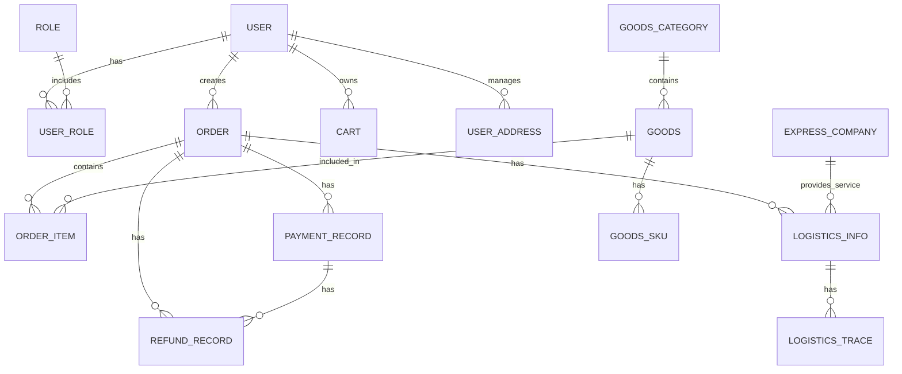

# 核心实体关系图

## 1. 关系图概述

核心实体关系图展示了 MallEcoAPI 系统中主要实体之间的关系，帮助开发人员理解系统的数据模型和业务逻辑。实体关系图是系统设计的重要组成部分，为数据库设计、API 开发和业务逻辑实现提供了基础。

### 1.1 关系图定位

核心实体关系图在系统中扮演着以下角色：

- **数据模型可视化**：将数据库表结构和关系可视化，便于理解
- **业务逻辑映射**：展示实体之间的业务关系，反映业务逻辑
- **开发指导**：为开发人员提供数据操作的指导
- **系统维护**：便于系统的维护和扩展
- **沟通工具**：作为开发团队和业务团队之间的沟通工具

### 1.2 核心价值

- **数据一致性**：确保实体之间的关系正确，保证数据一致性
- **业务完整性**：反映业务逻辑的完整性，确保系统功能的正确实现
- **开发效率**：为开发人员提供清晰的数据模型，提高开发效率
- **系统可维护性**：便于系统的维护和扩展
- **知识传递**：帮助新团队成员快速理解系统结构

## 2. 核心实体

### 2.1 用户实体 (User)

**描述**：用户实体，存储用户的基本信息

**核心字段**：
- `id`：用户 ID
- `username`：用户名
- `password`：密码（加密存储）
- `email`：邮箱
- `mobile`：手机号
- `nickname`：昵称
- `avatar`：头像
- `gender`：性别
- `birthday`：生日
- `createdAt`：创建时间
- `updatedAt`：更新时间

### 2.2 角色实体 (Role)

**描述**：角色实体，存储用户角色信息

**核心字段**：
- `id`：角色 ID
- `name`：角色名称
- `description`：角色描述
- `createdAt`：创建时间
- `updatedAt`：更新时间

### 2.3 用户角色实体 (UserRole)

**描述**：用户角色关联实体，存储用户与角色的多对多关系

**核心字段**：
- `userId`：用户 ID
- `roleId`：角色 ID

### 2.4 商品实体 (Goods)

**描述**：商品实体，存储商品的基本信息

**核心字段**：
- `id`：商品 ID
- `goodsSn`：商品编号
- `name`：商品名称
- `categoryId`：分类 ID
- `brandId`：品牌 ID
- `shopId`：店铺 ID
- `price`：商品价格
- `originalPrice`：商品原价
- `stock`：商品库存
- `sales`：商品销量
- `weight`：商品重量
- `isOnSale`：是否上架
- `isDelete`：是否删除
- `keywords`：搜索关键词
- `brief`：商品简介
- `detail`：商品详情
- `images`：商品图片
- `createdAt`：创建时间
- `updatedAt`：更新时间

### 2.5 商品 SKU 实体 (GoodsSku)

**描述**：商品 SKU 实体，存储商品的规格信息

**核心字段**：
- `id`：SKU ID
- `goodsId`：商品 ID
- `specs`：规格属性
- `price`：SKU 价格
- `originalPrice`：SKU 原价
- `stock`：SKU 库存
- `skuCode`：SKU 编码
- `image`：SKU 图片
- `createdAt`：创建时间
- `updatedAt`：更新时间

### 2.6 商品分类实体 (GoodsCategory)

**描述**：商品分类实体，存储商品分类信息

**核心字段**：
- `id`：分类 ID
- `name`：分类名称
- `parentId`：父分类 ID
- `level`：分类级别
- `image`：分类图片
- `icon`：分类图标
- `sortOrder`：排序顺序
- `isShow`：是否显示
- `createdAt`：创建时间
- `updatedAt`：更新时间

### 2.7 订单实体 (Order)

**描述**：订单实体，存储订单的基本信息

**核心字段**：
- `id`：订单 ID
- `orderSn`：订单编号
- `userId`：用户 ID
- `shopId`：店铺 ID
- `orderStatus`：订单状态
- `shippingStatus`：物流状态
- `payStatus`：支付状态
- `consignee`：收货人
- `mobile`：联系电话
- `address`：收货地址
- `totalAmount`：订单总金额
- `actualAmount`：实际支付金额
- `goodsAmount`：商品总金额
- `shippingAmount`：运费
- `couponAmount`：优惠券金额
- `paymentMethod`：支付方式
- `paymentTime`：支付时间
- `shippingTime`：发货时间
- `confirmTime`：确认收货时间
- `cancelTime`：取消时间
- `cancelReason`：取消原因
- `createdAt`：创建时间
- `updatedAt`：更新时间

### 2.8 订单项实体 (OrderItem)

**描述**：订单项实体，存储订单中的商品信息

**核心字段**：
- `id`：订单项 ID
- `orderId`：订单 ID
- `goodsId`：商品 ID
- `goodsSkuId`：商品 SKU ID
- `goodsName`：商品名称
- `skuSpecs`：SKU 规格
- `price`：商品单价
- `quantity`：商品数量
- `totalPrice`：商品总价
- `goodsImage`：商品图片
- `refundStatus`：退款状态
- `createdAt`：创建时间
- `updatedAt`：更新时间

### 2.9 支付记录实体 (PaymentRecord)

**描述**：支付记录实体，存储支付交易记录

**核心字段**：
- `id`：支付记录 ID
- `orderId`：订单 ID
- `orderSn`：订单编号
- `outTradeNo`：商户订单号
- `transactionId`：支付平台交易号
- `amount`：支付金额
- `currency`：货币类型
- `paymentMethod`：支付方式
- `paymentMethodName`：支付方式名称
- `status`：支付状态
- `callbackData`：回调数据
- `createdAt`：创建时间
- `updatedAt`：更新时间
- `paidAt`：支付时间

### 2.10 退款记录实体 (RefundRecord)

**描述**：退款记录实体，存储退款交易记录

**核心字段**：
- `id`：退款记录 ID
- `paymentId`：支付记录 ID
- `orderId`：订单 ID
- `outRefundNo`：商户退款单号
- `refundId`：支付平台退款单号
- `refundAmount`：退款金额
- `totalAmount`：订单总金额
- `currency`：货币类型
- `refundReason`：退款原因
- `status`：退款状态
- `callbackData`：回调数据
- `createdAt`：创建时间
- `updatedAt`：更新时间
- `refundedAt`：退款成功时间

### 2.11 物流信息实体 (LogisticsInfo)

**描述**：物流信息实体，存储订单的物流信息

**核心字段**：
- `id`：物流信息 ID
- `orderId`：订单 ID
- `expressCompanyId`：快递公司 ID
- `expressCompanyName`：快递公司名称
- `expressCompanyCode`：快递公司代码
- `trackingNumber`：运单号
- `status`：物流状态
- `freight`：运费
- `estimatedDays`：预计送达天数
- `senderName`：发件人姓名
- `senderMobile`：发件人电话
- `senderAddress`：发件人地址
- `receiverName`：收件人姓名
- `receiverMobile`：收件人电话
- `receiverAddress`：收件人地址
- `createdAt`：创建时间
- `updatedAt`：更新时间
- `shippedAt`：发货时间
- `deliveredAt`：送达时间

### 2.12 物流轨迹实体 (LogisticsTrace)

**描述**：物流轨迹实体，存储物流的轨迹信息

**核心字段**：
- `id`：轨迹 ID
- `logisticsId`：物流信息 ID
- `orderId`：订单 ID
- `time`：轨迹时间
- `description`：轨迹描述
- `location`：轨迹地点
- `createdAt`：创建时间

### 2.13 快递公司实体 (ExpressCompany)

**描述**：快递公司实体，存储快递公司信息

**核心字段**：
- `id`：快递公司 ID
- `name`：快递公司名称
- `code`：快递公司代码
- `logo`：快递公司 logo
- `contact`：联系方式
- `url`：官网地址
- `apiUrl`：API 地址
- `apiKey`：API 密钥
- `isEnabled`：是否启用
- `sortOrder`：排序顺序
- `createdAt`：创建时间
- `updatedAt`：更新时间

### 2.14 购物车实体 (Cart)

**描述**：购物车实体，存储用户的购物车商品

**核心字段**：
- `id`：购物车 ID
- `userId`：用户 ID
- `goodsId`：商品 ID
- `goodsSkuId`：商品 SKU ID
- `goodsName`：商品名称
- `skuSpecs`：SKU 规格
- `price`：商品价格
- `quantity`：商品数量
- `goodsImage`：商品图片
- `isSelected`：是否选中
- `createdAt`：创建时间
- `updatedAt`：更新时间

### 2.15 用户地址实体 (UserAddress)

**描述**：用户地址实体，存储用户的收货地址

**核心字段**：
- `id`：地址 ID
- `userId`：用户 ID
- `consignee`：收货人
- `mobile`：联系电话
- `province`：省份
- `city`：城市
- `district`：区县
- `detailAddress`：详细地址
- `postalCode`：邮政编码
- `isDefault`：是否默认地址
- `createdAt`：创建时间
- `updatedAt`：更新时间

## 3. 实体关系图

### 3.1 核心实体关系

### 3.2 关系详细说明

#### 3.2.1 用户与角色

- **关系**：用户与角色是多对多关系
- **描述**：一个用户可以拥有多个角色，一个角色可以被多个用户拥有
- **实现**：通过 `USER_ROLE` 表实现多对多关系

#### 3.2.2 用户与订单

- **关系**：用户与订单是一对多关系
- **描述**：一个用户可以创建多个订单，一个订单只能属于一个用户
- **实现**：`ORDER` 表中的 `userId` 字段外键关联到 `USER` 表的 `id` 字段

#### 3.2.3 用户与购物车

- **关系**：用户与购物车是一对多关系
- **描述**：一个用户可以拥有多个购物车商品，一个购物车商品只能属于一个用户
- **实现**：`CART` 表中的 `userId` 字段外键关联到 `USER` 表的 `id` 字段

#### 3.2.4 用户与地址

- **关系**：用户与地址是一对多关系
- **描述**：一个用户可以拥有多个收货地址，一个收货地址只能属于一个用户
- **实现**：`USER_ADDRESS` 表中的 `userId` 字段外键关联到 `USER` 表的 `id` 字段

#### 3.2.5 订单与订单项

- **关系**：订单与订单项是一对多关系
- **描述**：一个订单可以包含多个订单项，一个订单项只能属于一个订单
- **实现**：`ORDER_ITEM` 表中的 `orderId` 字段外键关联到 `ORDER` 表的 `id` 字段

#### 3.2.6 订单与支付记录

- **关系**：订单与支付记录是一对多关系
- **描述**：一个订单可以有多个支付记录（例如多次支付），一个支付记录只能属于一个订单
- **实现**：`PAYMENT_RECORD` 表中的 `orderId` 字段外键关联到 `ORDER` 表的 `id` 字段

#### 3.2.7 订单与退款记录

- **关系**：订单与退款记录是一对多关系
- **描述**：一个订单可以有多个退款记录，一个退款记录只能属于一个订单
- **实现**：`REFUND_RECORD` 表中的 `orderId` 字段外键关联到 `ORDER` 表的 `id` 字段

#### 3.2.8 订单与物流信息

- **关系**：订单与物流信息是一对一关系
- **描述**：一个订单对应一个物流信息，一个物流信息只能属于一个订单
- **实现**：`LOGISTICS_INFO` 表中的 `orderId` 字段外键关联到 `ORDER` 表的 `id` 字段，并且是唯一的

#### 3.2.9 商品与 SKU

- **关系**：商品与 SKU 是一对多关系
- **描述**：一个商品可以有多个 SKU，一个 SKU 只能属于一个商品
- **实现**：`GOODS_SKU` 表中的 `goodsId` 字段外键关联到 `GOODS` 表的 `id` 字段

#### 3.2.10 商品与订单项

- **关系**：商品与订单项是一对多关系
- **描述**：一个商品可以出现在多个订单项中，一个订单项只能对应一个商品
- **实现**：`ORDER_ITEM` 表中的 `goodsId` 字段外键关联到 `GOODS` 表的 `id` 字段

#### 3.2.11 商品分类与商品

- **关系**：商品分类与商品是一对多关系
- **描述**：一个商品分类可以包含多个商品，一个商品只能属于一个商品分类
- **实现**：`GOODS` 表中的 `categoryId` 字段外键关联到 `GOODS_CATEGORY` 表的 `id` 字段

#### 3.2.12 支付记录与退款记录

- **关系**：支付记录与退款记录是一对多关系
- **描述**：一个支付记录可以有多个退款记录，一个退款记录只能属于一个支付记录
- **实现**：`REFUND_RECORD` 表中的 `paymentId` 字段外键关联到 `PAYMENT_RECORD` 表的 `id` 字段

#### 3.2.13 物流信息与物流轨迹

- **关系**：物流信息与物流轨迹是一对多关系
- **描述**：一个物流信息可以有多个物流轨迹，一个物流轨迹只能属于一个物流信息
- **实现**：`LOGISTICS_TRACE` 表中的 `logisticsId` 字段外键关联到 `LOGISTICS_INFO` 表的 `id` 字段

#### 3.2.14 快递公司与物流信息

- **关系**：快递公司与物流信息是一对多关系
- **描述**：一个快递公司可以提供多个物流服务，一个物流信息只能由一个快递公司提供
- **实现**：`LOGISTICS_INFO` 表中的 `expressCompanyId` 字段外键关联到 `EXPRESS_COMPANY` 表的 `id` 字段

## 4. 关系图解读

### 4.1 业务流程映射

核心实体关系图映射了系统的主要业务流程：

1. **用户流程**：用户注册/登录 → 浏览商品 → 添加购物车 → 创建订单 → 支付 → 确认收货
2. **商品流程**：商品创建 → 商品分类 → 商品上架 → 商品销售 → 库存管理
3. **订单流程**：订单创建 → 订单支付 → 订单发货 → 订单收货 → 订单完成
4. **支付流程**：支付创建 → 支付处理 → 支付回调 → 退款处理
5. **物流流程**：物流创建 → 物流轨迹更新 → 物流状态变更

### 4.2 数据流向

核心实体关系图展示了系统中的数据流向：

1. **用户数据**：用户信息 → 购物车 → 订单 → 支付记录
2. **商品数据**：商品信息 → 购物车 → 订单项 → 订单
3. **订单数据**：订单 → 支付记录 → 物流信息 → 退款记录
4. **支付数据**：支付记录 → 退款记录
5. **物流数据**：物流信息 → 物流轨迹

### 4.3 业务规则体现

核心实体关系图体现了系统的业务规则：

1. **完整性约束**：通过外键约束，确保数据的完整性
2. **业务逻辑**：实体之间的关系反映了业务逻辑的要求
3. **数据一致性**：确保相关数据的一致性，例如订单状态与支付状态的一致性
4. **业务限制**：通过关系限制，确保业务规则的执行，例如一个订单只能属于一个用户

## 5. 关系图应用

### 5.1 数据库设计

核心实体关系图是数据库设计的基础：

1. **表结构设计**：根据实体设计数据库表结构
2. **字段定义**：根据实体属性定义表字段
3. **索引设计**：根据关系和查询需求设计索引
4. **约束设计**：根据关系设计外键约束和其他约束

### 5.2 API 开发

核心实体关系图为 API 开发提供了指导：

1. **API 设计**：根据实体关系设计 API 接口
2. **数据操作**：根据实体关系实现数据的增删改查
3. **关联查询**：根据实体关系实现关联数据的查询
4. **业务逻辑**：根据实体关系实现业务逻辑

### 5.3 业务逻辑实现

核心实体关系图为业务逻辑实现提供了基础：

1. **流程设计**：根据实体关系设计业务流程
2. **状态管理**：根据实体关系管理业务状态
3. **数据验证**：根据实体关系验证数据的合法性
4. **异常处理**：根据实体关系处理异常情况

### 5.4 系统维护与扩展

核心实体关系图便于系统的维护与扩展：

1. **系统理解**：帮助开发人员快速理解系统结构
2. **问题定位**：便于问题的定位和排查
3. **系统扩展**：为系统的扩展提供指导
4. **性能优化**：根据实体关系优化系统性能

## 6. 关系图优化

### 6.1 优化方向

核心实体关系图可以从以下几个方面进行优化：

1. **范式优化**：确保实体关系符合数据库设计范式
2. **性能优化**：考虑查询性能，优化实体关系
3. **业务优化**：根据业务需求，调整实体关系
4. **可扩展性优化**：考虑系统的可扩展性，设计灵活的实体关系

### 6.2 优化建议

1. **索引优化**：为频繁查询的字段和外键字段添加索引
2. **冗余字段**：在适当的情况下添加冗余字段，减少关联查询
3. **分表策略**：对于数据量大的表，考虑分表策略
4. **缓存策略**：使用缓存，减少数据库查询
5. **关系简化**：在不影响业务逻辑的情况下，简化实体关系

### 6.3 注意事项

1. **外键约束**：外键约束确保数据一致性，但可能影响性能
2. **循环依赖**：避免实体之间的循环依赖
3. **过度关联**：避免过度的表关联，影响查询性能
4. **数据冗余**：合理使用数据冗余，平衡性能和一致性
5. **业务变化**：实体关系应随业务变化而调整

## 7. 总结与展望

### 7.1 关系图优势

- **可视化**：将复杂的数据模型可视化，便于理解
- **完整性**：反映了系统数据模型的完整性
- **准确性**：确保实体之间的关系正确，保证数据一致性
- **指导性**：为开发人员提供数据操作的指导
- **可维护性**：便于系统的维护和扩展

### 7.2 改进空间

- **细节完善**：补充更多实体和关系的细节
- **性能优化**：进一步优化实体关系，提高系统性能
- **业务适配**：根据业务需求的变化，调整实体关系
- **文档完善**：完善关系图的文档，提高可读性

### 7.3 未来规划

- **版本 1.1**：补充更多实体和关系，完善数据模型
- **版本 1.2**：优化实体关系，提高系统性能
- **版本 1.3**：根据业务需求的变化，调整实体关系
- **版本 1.4**：集成数据模型与业务流程，提供更完整的系统视图
- **版本 2.0**：重构数据模型，采用更先进的设计理念，支持更多业务场景

## 8. 附录

### 8.1 实体列表

| 实体名称 | 表名 | 描述 |
|----------|------|------|
| 用户 | USER | 存储用户基本信息 |
| 角色 | ROLE | 存储角色信息 |
| 用户角色 | USER_ROLE | 存储用户与角色的关联 |
| 商品 | GOODS | 存储商品基本信息 |
| 商品 SKU | GOODS_SKU | 存储商品 SKU 信息 |
| 商品分类 | GOODS_CATEGORY | 存储商品分类信息 |
| 订单 | ORDER | 存储订单基本信息 |
| 订单项 | ORDER_ITEM | 存储订单中的商品信息 |
| 支付记录 | PAYMENT_RECORD | 存储支付交易记录 |
| 退款记录 | REFUND_RECORD | 存储退款交易记录 |
| 物流信息 | LOGISTICS_INFO | 存储订单的物流信息 |
| 物流轨迹 | LOGISTICS_TRACE | 存储物流的轨迹信息 |
| 快递公司 | EXPRESS_COMPANY | 存储快递公司信息 |
| 购物车 | CART | 存储用户的购物车商品 |
| 用户地址 | USER_ADDRESS | 存储用户的收货地址 |

### 8.2 关系列表

| 关系类型 | 描述 | 实体对 |
|----------|------|--------|
| 多对多 | 用户与角色 | USER - ROLE |
| 一对多 | 用户与订单 | USER - ORDER |
| 一对多 | 用户与购物车 | USER - CART |
| 一对多 | 用户与地址 | USER - USER_ADDRESS |
| 一对多 | 订单与订单项 | ORDER - ORDER_ITEM |
| 一对多 | 订单与支付记录 | ORDER - PAYMENT_RECORD |
| 一对多 | 订单与退款记录 | ORDER - REFUND_RECORD |
| 一对一 | 订单与物流信息 | ORDER - LOGISTICS_INFO |
| 一对多 | 商品与 SKU | GOODS - GOODS_SKU |
| 一对多 | 商品与订单项 | GOODS - ORDER_ITEM |
| 一对多 | 商品分类与商品 | GOODS_CATEGORY - GOODS |
| 一对多 | 支付记录与退款记录 | PAYMENT_RECORD - REFUND_RECORD |
| 一对多 | 物流信息与物流轨迹 | LOGISTICS_INFO - LOGISTICS_TRACE |
| 一对多 | 快递公司与物流信息 | EXPRESS_COMPANY - LOGISTICS_INFO |

### 8.3 参考资源

- **工具**：
  - Mermaid：用于绘制实体关系图
  - MySQL Workbench：用于数据库设计和关系图绘制
  - ERDPlus：在线实体关系图绘制工具

- **文档**：
  - [MySQL 官方文档](https://dev.mysql.com/doc/)
  - [TypeORM 文档](https://typeorm.io/)
  - [数据库设计最佳实践](https://www.oracle.com/database/technologies/best-practices.html)

- **书籍**：
  - 《数据库系统概念》
  - 《SQL 权威指南》
  - 《数据库设计与开发》

---

**文档更新时间**：2026-01-19
**文档版本**：v1.0.0
**作者**：MallEco 开发团队
