# 模块关系图

## 1. 模块关系图概述

模块关系图展示了 MallEcoAPI 系统中各个模块之间的依赖关系和交互方式，帮助开发人员理解系统的整体架构和模块间的协作关系。模块关系图是系统设计的重要组成部分，为系统的开发、维护和扩展提供了基础。

### 1.1 模块关系图定位

模块关系图在系统中扮演着以下角色：

- **架构可视化**：将系统的模块化架构可视化，便于理解
- **依赖关系管理**：展示模块之间的依赖关系，便于依赖管理
- **接口设计**：为模块间的接口设计提供指导
- **系统维护**：便于系统的维护和扩展
- **团队协作**：作为开发团队之间的沟通工具

### 1.2 核心价值

- **架构清晰**：确保模块之间的关系清晰，提高系统的可理解性
- **依赖合理**：避免模块之间的过度依赖，提高系统的可维护性
- **接口明确**：明确模块之间的接口，提高系统的可扩展性
- **开发效率**：为开发团队提供清晰的模块划分，提高开发效率
- **系统稳定性**：减少模块之间的耦合，提高系统的稳定性

## 2. 模块划分

### 2.1 核心模块

#### 2.1.1 认证模块 (AuthModule)

**描述**：负责用户认证和授权，包括用户注册、登录、权限管理等功能

**核心功能**：
- 用户注册
- 用户登录
- JWT 令牌生成和验证
- 权限管理
- 角色管理

**核心组件**：
- `AuthController`：处理认证相关的 HTTP 请求
- `AuthService`：实现认证相关的业务逻辑
- `UserService`：处理用户相关的业务逻辑
- `JwtStrategy`：JWT 认证策略
- `LocalStrategy`：本地认证策略
- `RolesGuard`：角色权限守卫

#### 2.1.2 商品模块 (GoodsModule)

**描述**：负责商品管理，包括商品的创建、查询、更新、删除等功能

**核心功能**：
- 商品管理
- 商品分类管理
- 商品 SKU 管理
- 商品库存管理
- 商品搜索

**核心组件**：
- `GoodsController`：处理商品相关的 HTTP 请求
- `GoodsService`：实现商品相关的业务逻辑
- `GoodsCategoryService`：处理商品分类相关的业务逻辑
- `GoodsSkuService`：处理商品 SKU 相关的业务逻辑

#### 2.1.3 订单模块 (OrderModule)

**描述**：负责订单管理，包括订单的创建、查询、更新、删除等功能

**核心功能**：
- 订单创建
- 订单查询
- 订单状态管理
- 订单支付
- 订单退款

**核心组件**：
- `OrderController`：处理订单相关的 HTTP 请求
- `OrderService`：实现订单相关的业务逻辑
- `OrderItemService`：处理订单项相关的业务逻辑

#### 2.1.4 支付模块 (PaymentModule)

**描述**：负责支付管理，包括支付的创建、处理、回调等功能

**核心功能**：
- 支付创建
- 支付处理
- 支付回调
- 退款处理
- 支付记录管理

**核心组件**：
- `PaymentController`：处理支付相关的 HTTP 请求
- `PaymentService`：实现支付相关的业务逻辑
- `RefundService`：处理退款相关的业务逻辑
- `AlipayService`：处理支付宝支付相关的业务逻辑
- `WechatPayService`：处理微信支付相关的业务逻辑

#### 2.1.5 物流模块 (LogisticsModule)

**描述**：负责物流管理，包括物流信息的创建、查询、更新等功能

**核心功能**：
- 物流信息管理
- 物流轨迹查询
- 物流状态更新
- 运费计算

**核心组件**：
- `LogisticsController`：处理物流相关的 HTTP 请求
- `LogisticsService`：实现物流相关的业务逻辑
- `ExpressCompanyService`：处理快递公司相关的业务逻辑

### 2.2 支撑模块

#### 2.2.1 共享模块 (SharedModule)

**描述**：提供系统共享的功能和组件，包括工具类、常量定义、异常处理等

**核心功能**：
- 工具类提供
- 常量定义
- 异常处理
- 响应格式化

**核心组件**：
- `UtilsService`：提供工具方法
- `HttpExceptionFilter`：HTTP 异常过滤器
- `TransformInterceptor`：响应转换拦截器

#### 2.2.2 配置模块 (ConfigModule)

**描述**：负责系统配置管理，包括数据库配置、缓存配置、消息队列配置等

**核心功能**：
- 配置管理
- 环境变量处理
- 配置验证

**核心组件**：
- `ConfigService`：提供配置服务

#### 2.2.3 数据库模块 (DatabaseModule)

**描述**：负责数据库连接和管理，包括数据库初始化、迁移等功能

**核心功能**：
- 数据库连接
- 数据库迁移
- 实体管理

**核心组件**：
- `TypeOrmModule`：TypeORM 模块集成

#### 2.2.4 缓存模块 (CacheModule)

**描述**：负责系统缓存管理，包括 Redis 连接和缓存操作

**核心功能**：
- 缓存管理
- Redis 连接
- 缓存操作

**核心组件**：
- `CacheService`：提供缓存服务

#### 2.2.5 消息队列模块 (MessageQueueModule)

**描述**：负责消息队列管理，包括 RabbitMQ 连接和消息处理

**核心功能**：
- 消息队列管理
- RabbitMQ 连接
- 消息发布和订阅

**核心组件**：
- `MessageQueueService`：提供消息队列服务

### 2.3 业务功能模块

#### 2.3.1 购物车模块 (CartModule)

**描述**：负责购物车管理，包括商品添加、删除、更新等功能

**核心功能**：
- 购物车管理
- 商品添加到购物车
- 购物车商品更新
- 购物车商品删除

**核心组件**：
- `CartController`：处理购物车相关的 HTTP 请求
- `CartService`：实现购物车相关的业务逻辑

#### 2.3.2 用户模块 (UserModule)

**描述**：负责用户管理，包括用户信息的创建、查询、更新、删除等功能

**核心功能**：
- 用户信息管理
- 用户地址管理
- 用户收藏管理
- 用户足迹管理

**核心组件**：
- `UserController`：处理用户相关的 HTTP 请求
- `UserService`：实现用户相关的业务逻辑
- `UserAddressService`：处理用户地址相关的业务逻辑

#### 2.3.3 评论模块 (CommentModule)

**描述**：负责商品评论管理，包括评论的创建、查询、删除等功能

**核心功能**：
- 评论管理
- 评论创建
- 评论查询
- 评论删除

**核心组件**：
- `CommentController`：处理评论相关的 HTTP 请求
- `CommentService`：实现评论相关的业务逻辑

#### 2.3.4 优惠券模块 (CouponModule)

**描述**：负责优惠券管理，包括优惠券的创建、查询、使用等功能

**核心功能**：
- 优惠券管理
- 优惠券创建
- 优惠券查询
- 优惠券使用

**核心组件**：
- `CouponController`：处理优惠券相关的 HTTP 请求
- `CouponService`：实现优惠券相关的业务逻辑

#### 2.3.5 通知模块 (NotificationModule)

**描述**：负责系统通知管理，包括通知的创建、查询、发送等功能

**核心功能**：
- 通知管理
- 通知创建
- 通知查询
- 通知发送

**核心组件**：
- `NotificationController`：处理通知相关的 HTTP 请求
- `NotificationService`：实现通知相关的业务逻辑

## 3. 模块关系图

### 3.1 核心模块关系

```mermaid
graph TD
    subgraph 核心模块
        AuthModule
        GoodsModule
        OrderModule
        PaymentModule
        LogisticsModule
    end

    subgraph 支撑模块
        SharedModule
        ConfigModule
        DatabaseModule
        CacheModule
        MessageQueueModule
    end

    subgraph 业务功能模块
        CartModule
        UserModule
        CommentModule
        CouponModule
        NotificationModule
    end

    AuthModule --> SharedModule
    AuthModule --> DatabaseModule
    AuthModule --> ConfigModule

    GoodsModule --> SharedModule
    GoodsModule --> DatabaseModule
    GoodsModule --> CacheModule
    GoodsModule --> ConfigModule

    OrderModule --> SharedModule
    OrderModule --> DatabaseModule
    OrderModule --> MessageQueueModule
    OrderModule --> ConfigModule
    OrderModule --> AuthModule
    OrderModule --> GoodsModule
    OrderModule --> PaymentModule
    OrderModule --> LogisticsModule

    PaymentModule --> SharedModule
    PaymentModule --> DatabaseModule
    PaymentModule --> MessageQueueModule
    PaymentModule --> ConfigModule
    PaymentModule --> OrderModule

    LogisticsModule --> SharedModule
    LogisticsModule --> DatabaseModule
    LogisticsModule --> MessageQueueModule
    LogisticsModule --> ConfigModule
    LogisticsModule --> OrderModule

    CartModule --> SharedModule
    CartModule --> DatabaseModule
    CartModule --> ConfigModule
    CartModule --> AuthModule
    CartModule --> GoodsModule

    UserModule --> SharedModule
    UserModule --> DatabaseModule
    UserModule --> ConfigModule
    UserModule --> AuthModule

    CommentModule --> SharedModule
    CommentModule --> DatabaseModule
    CommentModule --> ConfigModule
    CommentModule --> AuthModule
    CommentModule --> GoodsModule

    CouponModule --> SharedModule
    CouponModule --> DatabaseModule
    CouponModule --> ConfigModule
    CouponModule --> AuthModule

    NotificationModule --> SharedModule
    NotificationModule --> DatabaseModule
    NotificationModule --> MessageQueueModule
    NotificationModule --> ConfigModule
    NotificationModule --> AuthModule

    DatabaseModule --> ConfigModule
    CacheModule --> ConfigModule
    MessageQueueModule --> ConfigModule
```

### 3.2 关系详细说明

#### 3.2.1 认证模块依赖

- **依赖模块**：
  - `SharedModule`：使用共享的工具类和异常处理
  - `DatabaseModule`：使用数据库存储用户和权限信息
  - `ConfigModule`：使用配置信息，如 JWT 密钥

- **被依赖模块**：
  - `OrderModule`：使用认证服务验证用户身份
  - `CartModule`：使用认证服务验证用户身份
  - `UserModule`：使用认证服务验证用户身份
  - `CommentModule`：使用认证服务验证用户身份
  - `CouponModule`：使用认证服务验证用户身份
  - `NotificationModule`：使用认证服务验证用户身份

#### 3.2.2 商品模块依赖

- **依赖模块**：
  - `SharedModule`：使用共享的工具类和异常处理
  - `DatabaseModule`：使用数据库存储商品信息
  - `CacheModule`：使用缓存存储商品分类和热门商品
  - `ConfigModule`：使用配置信息，如图片存储路径

- **被依赖模块**：
  - `OrderModule`：使用商品服务查询商品信息
  - `CartModule`：使用商品服务查询商品信息
  - `CommentModule`：使用商品服务查询商品信息

#### 3.2.3 订单模块依赖

- **依赖模块**：
  - `SharedModule`：使用共享的工具类和异常处理
  - `DatabaseModule`：使用数据库存储订单信息
  - `MessageQueueModule`：使用消息队列处理订单状态更新
  - `ConfigModule`：使用配置信息，如订单超时时间
  - `AuthModule`：使用认证服务验证用户身份
  - `GoodsModule`：使用商品服务查询商品信息和更新库存
  - `PaymentModule`：使用支付服务处理订单支付
  - `LogisticsModule`：使用物流服务处理订单物流

- **被依赖模块**：
  - `PaymentModule`：使用订单服务更新订单支付状态
  - `LogisticsModule`：使用订单服务更新订单物流状态

#### 3.2.4 支付模块依赖

- **依赖模块**：
  - `SharedModule`：使用共享的工具类和异常处理
  - `DatabaseModule`：使用数据库存储支付记录
  - `MessageQueueModule`：使用消息队列处理支付回调
  - `ConfigModule`：使用配置信息，如支付密钥
  - `OrderModule`：使用订单服务更新订单支付状态

- **被依赖模块**：
  - `OrderModule`：使用支付服务处理订单支付

#### 3.2.5 物流模块依赖

- **依赖模块**：
  - `SharedModule`：使用共享的工具类和异常处理
  - `DatabaseModule`：使用数据库存储物流信息
  - `MessageQueueModule`：使用消息队列处理物流状态更新
  - `ConfigModule`：使用配置信息，如物流 API 密钥
  - `OrderModule`：使用订单服务更新订单物流状态

- **被依赖模块**：
  - `OrderModule`：使用物流服务处理订单物流

#### 3.2.6 购物车模块依赖

- **依赖模块**：
  - `SharedModule`：使用共享的工具类和异常处理
  - `DatabaseModule`：使用数据库存储购物车信息
  - `ConfigModule`：使用配置信息，如购物车商品上限
  - `AuthModule`：使用认证服务验证用户身份
  - `GoodsModule`：使用商品服务查询商品信息

- **被依赖模块**：
  - 无

#### 3.2.7 用户模块依赖

- **依赖模块**：
  - `SharedModule`：使用共享的工具类和异常处理
  - `DatabaseModule`：使用数据库存储用户信息
  - `ConfigModule`：使用配置信息，如用户头像存储路径
  - `AuthModule`：使用认证服务验证用户身份

- **被依赖模块**：
  - 无

#### 3.2.8 评论模块依赖

- **依赖模块**：
  - `SharedModule`：使用共享的工具类和异常处理
  - `DatabaseModule`：使用数据库存储评论信息
  - `ConfigModule`：使用配置信息，如评论字数限制
  - `AuthModule`：使用认证服务验证用户身份
  - `GoodsModule`：使用商品服务查询商品信息

- **被依赖模块**：
  - 无

#### 3.2.9 优惠券模块依赖

- **依赖模块**：
  - `SharedModule`：使用共享的工具类和异常处理
  - `DatabaseModule`：使用数据库存储优惠券信息
  - `ConfigModule`：使用配置信息，如优惠券使用规则
  - `AuthModule`：使用认证服务验证用户身份

- **被依赖模块**：
  - 无

#### 3.2.10 通知模块依赖

- **依赖模块**：
  - `SharedModule`：使用共享的工具类和异常处理
  - `DatabaseModule`：使用数据库存储通知信息
  - `MessageQueueModule`：使用消息队列发送通知
  - `ConfigModule`：使用配置信息，如通知发送频率
  - `AuthModule`：使用认证服务验证用户身份

- **被依赖模块**：
  - 无

#### 3.2.11 支撑模块依赖

- **`DatabaseModule`**：
  - 依赖 `ConfigModule`：使用配置信息，如数据库连接信息

- **`CacheModule`**：
  - 依赖 `ConfigModule`：使用配置信息，如 Redis 连接信息

- **`MessageQueueModule`**：
  - 依赖 `ConfigModule`：使用配置信息，如 RabbitMQ 连接信息

## 4. 模块关系图解读

### 4.1 架构设计原则

模块关系图体现了以下架构设计原则：

1. **高内聚低耦合**：每个模块职责单一，模块之间的耦合度低
2. **依赖倒置**：高层模块依赖低层模块的抽象，而不是具体实现
3. **接口隔离**：模块之间通过明确的接口进行通信
4. **单一职责**：每个模块只负责一个特定的功能域
5. **开闭原则**：模块对扩展开放，对修改关闭

### 4.2 依赖关系分析

#### 4.2.1 核心依赖路径

1. **用户认证路径**：`AuthModule` → `UserModule` → `DatabaseModule`
2. **商品浏览路径**：`GoodsModule` → `CacheModule` → `DatabaseModule`
3. **订单创建路径**：`OrderModule` → `AuthModule` → `GoodsModule` → `DatabaseModule`
4. **支付处理路径**：`OrderModule` → `PaymentModule` → `MessageQueueModule` → `DatabaseModule`
5. **物流处理路径**：`OrderModule` → `LogisticsModule` → `MessageQueueModule` → `DatabaseModule`

#### 4.2.2 依赖层次

1. **底层模块**：`ConfigModule`、`DatabaseModule`、`CacheModule`、`MessageQueueModule`
2. **共享模块**：`SharedModule`
3. **核心业务模块**：`AuthModule`、`GoodsModule`
4. **复合业务模块**：`OrderModule`、`PaymentModule`、`LogisticsModule`
5. **辅助业务模块**：`CartModule`、`UserModule`、`CommentModule`、`CouponModule`、`NotificationModule`

### 4.3 模块间通信

模块之间的通信方式包括：

1. **直接调用**：通过模块间的服务接口直接调用
2. **消息队列**：通过消息队列进行异步通信
3. **数据库**：通过数据库进行数据共享
4. **缓存**：通过缓存进行数据共享

## 5. 模块关系图应用

### 5.1 架构设计

模块关系图是架构设计的基础：

1. **模块划分**：根据业务功能和技术特点进行模块划分
2. **依赖管理**：设计合理的模块依赖关系，避免循环依赖
3. **接口设计**：设计清晰的模块间接口，提高系统的可扩展性
4. **架构评审**：通过模块关系图进行架构评审，确保架构设计的合理性

### 5.2 开发指导

模块关系图为开发提供了指导：

1. **任务分配**：根据模块划分分配开发任务
2. **代码组织**：根据模块划分组织代码结构
3. **依赖管理**：管理模块之间的依赖关系，避免过度依赖
4. **测试策略**：根据模块关系设计测试策略，确保测试覆盖率

### 5.3 系统维护

模块关系图便于系统的维护：

1. **问题定位**：根据模块关系快速定位问题
2. **影响分析**：分析修改对其他模块的影响
3. **性能优化**：根据模块关系识别性能瓶颈
4. **系统扩展**：根据模块关系进行系统扩展

### 5.4 团队协作

模块关系图促进团队协作：

1. **分工明确**：明确各团队的职责范围
2. **接口约定**：明确模块间的接口约定
3. **进度协调**：协调各团队的开发进度
4. **知识共享**：共享系统架构知识，提高团队整体水平

## 6. 模块关系图优化

### 6.1 优化方向

模块关系图可以从以下几个方面进行优化：

1. **依赖简化**：减少模块之间的依赖关系，提高系统的可维护性
2. **接口标准化**：标准化模块之间的接口，提高系统的可扩展性
3. **职责清晰**：明确模块的职责，避免职责交叉
4. **性能优化**：优化模块间的通信方式，提高系统性能

### 6.2 优化建议

1. **引入事件总线**：使用事件总线替代直接调用，减少模块间的耦合
2. **接口抽象**：对模块间的接口进行抽象，提高系统的可扩展性
3. **依赖注入优化**：使用依赖注入框架优化依赖管理
4. **异步通信**：对于非实时操作，使用消息队列进行异步通信
5. **模块拆分**：对于过大的模块，进行适当的拆分，提高系统的可维护性

### 6.3 注意事项

1. **循环依赖**：避免模块之间的循环依赖
2. **过度依赖**：避免模块之间的过度依赖
3. **接口不稳定**：确保模块间的接口稳定，避免频繁变更
4. **职责不清**：确保模块的职责清晰，避免职责交叉
5. **性能瓶颈**：注意模块间通信的性能瓶颈，避免同步调用过多

## 7. 总结与展望

### 7.1 模块关系图优势

- **架构清晰**：模块划分合理，关系清晰
- **依赖合理**：模块之间的依赖关系合理，没有循环依赖
- **接口明确**：模块之间的接口明确，便于扩展
- **可维护性高**：模块之间的耦合度低，提高系统的可维护性
- **可扩展性强**：模块设计合理，便于系统的扩展

### 7.2 改进空间

- **依赖优化**：进一步优化模块之间的依赖关系，减少耦合
- **接口标准化**：进一步标准化模块之间的接口，提高系统的可扩展性
- **模块拆分**：对于某些较大的模块，考虑进一步拆分
- **异步通信**：增加模块间的异步通信，提高系统性能

### 7.3 未来规划

- **版本 1.1**：优化模块依赖关系，减少耦合
- **版本 1.2**：标准化模块间的接口，提高系统的可扩展性
- **版本 1.3**：引入事件总线，进一步减少模块间的耦合
- **版本 1.4**：优化模块间的通信方式，提高系统性能
- **版本 2.0**：重构模块架构，采用更先进的微服务架构，提高系统的可扩展性和可维护性

## 8. 附录

### 8.1 模块列表

| 模块名称 | 描述 | 类型 |
|----------|------|------|
| 认证模块 (AuthModule) | 负责用户认证和授权 | 核心模块 |
| 商品模块 (GoodsModule) | 负责商品管理 | 核心模块 |
| 订单模块 (OrderModule) | 负责订单管理 | 核心模块 |
| 支付模块 (PaymentModule) | 负责支付管理 | 核心模块 |
| 物流模块 (LogisticsModule) | 负责物流管理 | 核心模块 |
| 共享模块 (SharedModule) | 提供系统共享的功能和组件 | 支撑模块 |
| 配置模块 (ConfigModule) | 负责系统配置管理 | 支撑模块 |
| 数据库模块 (DatabaseModule) | 负责数据库连接和管理 | 支撑模块 |
| 缓存模块 (CacheModule) | 负责系统缓存管理 | 支撑模块 |
| 消息队列模块 (MessageQueueModule) | 负责消息队列管理 | 支撑模块 |
| 购物车模块 (CartModule) | 负责购物车管理 | 业务功能模块 |
| 用户模块 (UserModule) | 负责用户管理 | 业务功能模块 |
| 评论模块 (CommentModule) | 负责商品评论管理 | 业务功能模块 |
| 优惠券模块 (CouponModule) | 负责优惠券管理 | 业务功能模块 |
| 通知模块 (NotificationModule) | 负责系统通知管理 | 业务功能模块 |

### 8.2 依赖关系列表

| 模块 | 依赖模块 | 被依赖模块 |
|------|----------|------------|
| 认证模块 (AuthModule) | SharedModule, DatabaseModule, ConfigModule | OrderModule, CartModule, UserModule, CommentModule, CouponModule, NotificationModule |
| 商品模块 (GoodsModule) | SharedModule, DatabaseModule, CacheModule, ConfigModule | OrderModule, CartModule, CommentModule |
| 订单模块 (OrderModule) | SharedModule, DatabaseModule, MessageQueueModule, ConfigModule, AuthModule, GoodsModule, PaymentModule, LogisticsModule | PaymentModule, LogisticsModule |
| 支付模块 (PaymentModule) | SharedModule, DatabaseModule, MessageQueueModule, ConfigModule, OrderModule | OrderModule |
| 物流模块 (LogisticsModule) | SharedModule, DatabaseModule, MessageQueueModule, ConfigModule, OrderModule | OrderModule |
| 购物车模块 (CartModule) | SharedModule, DatabaseModule, ConfigModule, AuthModule, GoodsModule | 无 |
| 用户模块 (UserModule) | SharedModule, DatabaseModule, ConfigModule, AuthModule | 无 |
| 评论模块 (CommentModule) | SharedModule, DatabaseModule, ConfigModule, AuthModule, GoodsModule | 无 |
| 优惠券模块 (CouponModule) | SharedModule, DatabaseModule, ConfigModule, AuthModule | 无 |
| 通知模块 (NotificationModule) | SharedModule, DatabaseModule, MessageQueueModule, ConfigModule, AuthModule | 无 |
| 共享模块 (SharedModule) | 无 | 所有模块 |
| 配置模块 (ConfigModule) | 无 | 所有模块 |
| 数据库模块 (DatabaseModule) | ConfigModule | 所有业务模块 |
| 缓存模块 (CacheModule) | ConfigModule | GoodsModule |
| 消息队列模块 (MessageQueueModule) | ConfigModule | OrderModule, PaymentModule, LogisticsModule, NotificationModule |

### 8.3 参考资源

- **工具**：
  - Mermaid：用于绘制模块关系图
  - NestJS CLI：用于创建和管理模块

- **文档**：
  - [NestJS 官方文档](https://docs.nestjs.com/)
  - [NestJS 模块文档](https://docs.nestjs.com/modules)
  - [架构设计最佳实践](https://martinfowler.com/archPatterns/)

- **书籍**：
  - 《架构整洁之道》
  - 《领域驱动设计》
  - 《企业应用架构模式》

---

**文档更新时间**：2026-01-19
**文档版本**：v1.0.0
**作者**：MallEco 开发团队
