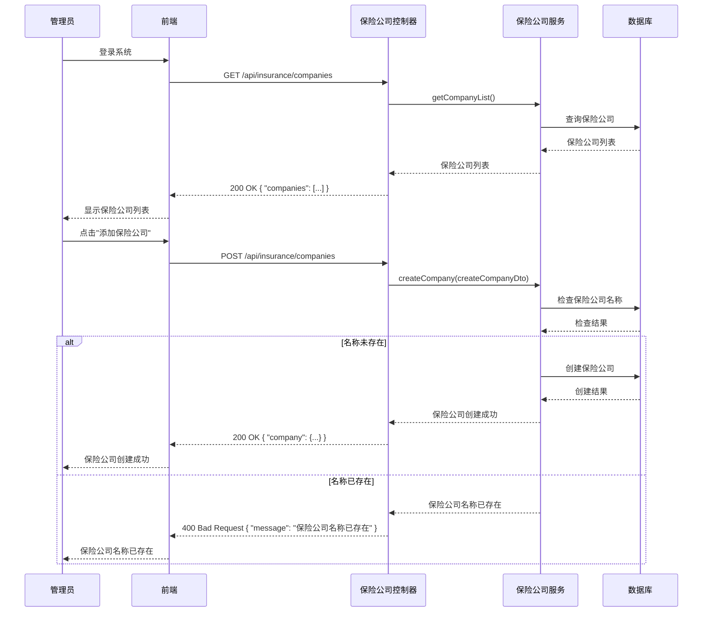
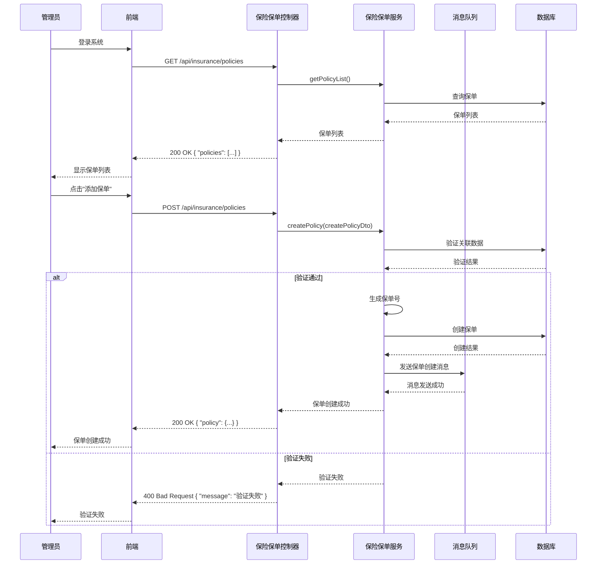
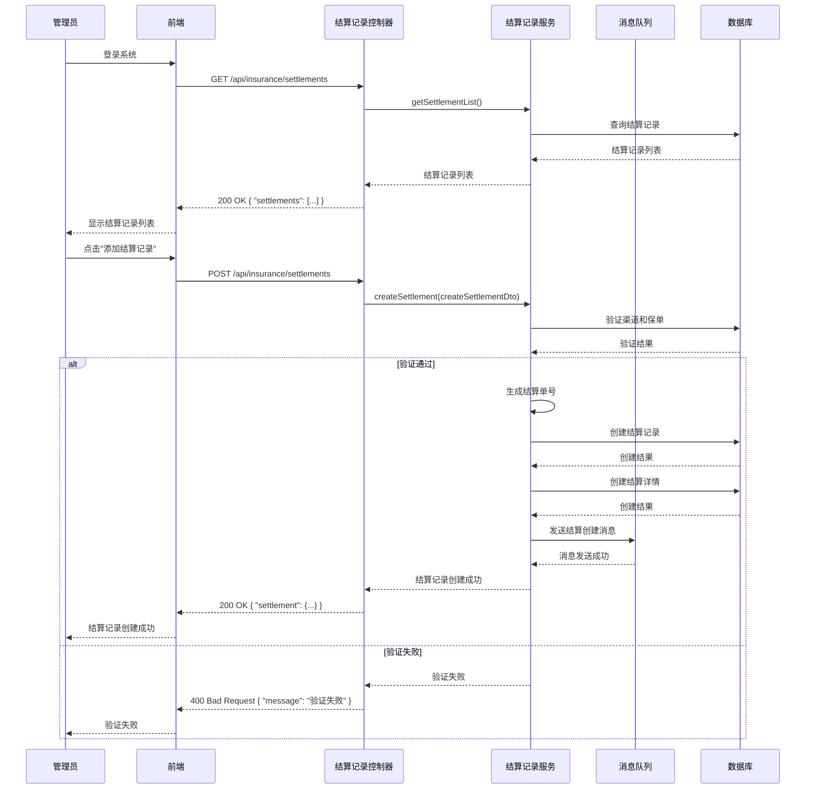

# 保险管理功能

## 1. 功能概述

保险管理功能是 MallEcoAPI 系统中的重要功能之一，负责处理保险相关的业务逻辑，包括保险公司管理、保险产品管理、保险保单管理、保险结算管理等。本文档详细描述了 MallEcoAPI 系统中的保险管理功能，包括功能定位、核心价值、技术实现等内容。

### 1.1 功能定位

保险管理功能在 MallEcoAPI 系统中扮演着以下角色：

- **核心业务功能**：保险管理是系统的核心业务功能之一，提供了完整的保险业务处理能力
- **数据管理中心**：保险管理功能管理着保险公司、保险产品、保险保单等重要数据
- **业务流程集成**：保险管理功能集成了保险销售、保单管理、结算等多个业务流程
- **外部系统对接**：保险管理功能可以与外部保险系统进行对接，实现数据同步和业务协同

### 1.2 核心价值

- **业务完整性**：提供完整的保险业务处理功能，满足保险业务的各种需求
- **数据准确性**：确保保险数据的准确性和一致性，避免数据错误
- **业务效率**：提高保险业务的处理效率，减少人工操作
- **风险管理**：通过保险产品和保单的管理，帮助企业进行风险管理
- **系统集成**：实现与其他系统的集成，提高系统的整体效率

## 2. 功能模块

### 2.1 核心功能

#### 2.1.1 保险公司管理

**描述**：管理保险公司信息，包括添加、编辑、删除、查询保险公司

**流程**：
1. 管理员登录系统后台
2. 进入保险公司管理页面
3. 点击"添加保险公司"按钮
4. 填写保险公司信息
5. 点击"保存"按钮
6. 系统验证信息
7. 系统保存保险公司信息
8. 系统返回保存结果

**技术实现**：
- **前端**：React 组件，处理管理员交互，发送 API 请求
- **后端**：`InsuranceCompanyController` 类，处理保险公司管理的请求
- **服务**：`InsuranceCompanyService` 类，实现保险公司管理的业务逻辑
- **实体**：`InsuranceCompany` 类，定义保险公司的数据结构

**API 接口**：
- `POST /api/insurance/companies` - 添加保险公司
- `GET /api/insurance/companies` - 获取保险公司列表

#### 2.1.2 保险理赔管理

**描述**：管理保险理赔信息，包括添加、编辑、删除、查询理赔记录，以及理赔状态管理

**流程**：
1. 管理员登录系统后台
2. 进入理赔管理页面
3. 点击"添加理赔记录"按钮
4. 填写理赔信息，包括保单号、理赔金额、理赔原因等
5. 点击"保存"按钮
6. 系统验证信息
7. 系统保存理赔记录
8. 系统返回保存结果
9. 理赔处理人员处理理赔
10. 理赔审核人员审核理赔

**技术实现**：
- **前端**：React 组件，处理管理员交互，发送 API 请求
- **后端**：`ClaimRecordController` 类，处理理赔管理的请求
- **服务**：`ClaimRecordService` 类，实现理赔管理的业务逻辑
- **实体**：`ClaimRecord` 类，定义理赔记录的数据结构

**API 接口**：
- `POST /api/insurance/claim-records` - 添加理赔记录
- `GET /api/insurance/claim-records` - 获取理赔记录列表
- `PATCH /api/insurance/claim-records/{id}/process` - 处理理赔
- `PATCH /api/insurance/claim-records/{id}/audit` - 审核理赔

#### 2.1.3 保险续保管理

**描述**：管理保险续保信息，包括添加、编辑、删除、查询续保记录，以及续保状态管理

**流程**：
1. 管理员登录系统后台
2. 进入续保管理页面
3. 点击"添加续保记录"按钮
4. 填写续保信息，包括保单号、续保金额、续保期限等
5. 点击"保存"按钮
6. 系统验证信息
7. 系统保存续保记录
8. 系统返回保存结果
9. 续保处理人员处理续保
10. 续保审核人员审核续保

**技术实现**：
- **前端**：React 组件，处理管理员交互，发送 API 请求
- **后端**：`RenewalRecordController` 类，处理续保管理的请求
- **服务**：`RenewalRecordService` 类，实现续保管理的业务逻辑
- **实体**：`RenewalRecord` 类，定义续保记录的数据结构

**API 接口**：
- `POST /api/insurance/renewal-records` - 添加续保记录
- `GET /api/insurance/renewal-records` - 获取续保记录列表
- `PATCH /api/insurance/renewal-records/{id}/process` - 处理续保
- `PATCH /api/insurance/renewal-records/{id}/audit` - 审核续保记录
- `GET /api/insurance/renewal-records/statistics/expiring-policies` - 获取即将到期的保单

#### 2.1.4 外部系统集成

**描述**：实现与外部系统的集成，包括数据同步、业务协同等功能

**流程**：
1. 管理员登录系统后台
2. 进入外部系统集成页面
3. 配置外部系统连接信息
4. 点击"同步数据"按钮
5. 系统与外部系统建立连接
6. 系统同步数据
7. 系统返回同步结果

**技术实现**：
- **前端**：React 组件，处理管理员交互，发送 API 请求
- **后端**：`ExternalIntegrationController` 类，处理外部系统集成的请求
- **服务**：`ExternalIntegrationService` 类，实现外部系统集成的业务逻辑

**API 接口**：
- `POST /api/insurance/external-integration/sync-policy` - 同步保单到外部系统
- `POST /api/insurance/external-integration/sync-claim` - 同步理赔到外部系统
- `POST /api/insurance/external-integration/sync-renewal` - 同步续保到外部系统
- `GET /api/insurance/external-integration/query-claim-status` - 查询外部系统理赔状态
- `PUT /api/insurance/external-integration/config` - 更新外部系统配置
- `GET /api/insurance/companies/{id}` - 获取保险公司详情
- `PUT /api/insurance/companies/{id}` - 更新保险公司
- `DELETE /api/insurance/companies/{id}` - 删除保险公司

**请求参数**：
```json
{
  "name": "中国平安保险",
  "code": "PINGAN",
  "contact": "95511",
  "address": "深圳市福田区",
  "url": "https://www.pingan.com",
  "logo": "https://example.com/pingan.png",
  "isEnabled": true
}
```

**响应参数**：
```json
{
  "code": 200,
  "message": "success",
  "data": {
    "id": 1,
    "name": "中国平安保险",
    "code": "PINGAN",
    "contact": "95511",
    "address": "深圳市福田区",
    "url": "https://www.pingan.com",
    "logo": "https://example.com/pingan.png",
    "isEnabled": true
  }
}
```

#### 2.1.2 保险产品类型管理

**描述**：管理保险产品类型信息，包括添加、编辑、删除、查询保险产品类型

**流程**：
1. 管理员登录系统后台
2. 进入保险产品类型管理页面
3. 点击"添加保险产品类型"按钮
4. 填写保险产品类型信息
5. 点击"保存"按钮
6. 系统验证信息
7. 系统保存保险产品类型信息
8. 系统返回保存结果

**技术实现**：
- **前端**：React 组件，处理管理员交互，发送 API 请求
- **后端**：`InsuranceProductTypeController` 类，处理保险产品类型管理的请求
- **服务**：`InsuranceProductTypeService` 类，实现保险产品类型管理的业务逻辑
- **实体**：`InsuranceProductType` 类，定义保险产品类型的数据结构

**API 接口**：
- `POST /api/insurance/product-types` - 添加保险产品类型
- `GET /api/insurance/product-types` - 获取保险产品类型列表
- `GET /api/insurance/product-types/{id}` - 获取保险产品类型详情
- `PUT /api/insurance/product-types/{id}` - 更新保险产品类型
- `DELETE /api/insurance/product-types/{id}` - 删除保险产品类型

**请求参数**：
```json
{
  "name": "人身险",
  "code": "PERSONAL",
  "description": "以人的生命和身体为保险标的的保险"
}
```

**响应参数**：
```json
{
  "code": 200,
  "message": "success",
  "data": {
    "id": 1,
    "name": "人身险",
    "code": "PERSONAL",
    "description": "以人的生命和身体为保险标的的保险"
  }
}
```

#### 2.1.3 保险产品管理

**描述**：管理保险产品信息，包括添加、编辑、删除、查询保险产品

**流程**：
1. 管理员登录系统后台
2. 进入保险产品管理页面
3. 点击"添加保险产品"按钮
4. 填写保险产品信息
5. 点击"保存"按钮
6. 系统验证信息
7. 系统保存保险产品信息
8. 系统返回保存结果

**技术实现**：
- **前端**：React 组件，处理管理员交互，发送 API 请求
- **后端**：`InsuranceProductController` 类，处理保险产品管理的请求
- **服务**：`InsuranceProductService` 类，实现保险产品管理的业务逻辑
- **实体**：`InsuranceProduct` 类，定义保险产品的数据结构

**API 接口**：
- `POST /api/insurance/products` - 添加保险产品
- `GET /api/insurance/products` - 获取保险产品列表
- `GET /api/insurance/products/{id}` - 获取保险产品详情
- `PUT /api/insurance/products/{id}` - 更新保险产品
- `DELETE /api/insurance/products/{id}` - 删除保险产品

**请求参数**：
```json
{
  "name": "平安福重疾险",
  "code": "PA_FU",
  "insuranceProductTypeId": 1,
  "insuranceCompanyId": 1,
  "description": "平安福重疾险是一款综合性重疾保险产品",
  "premiumRate": "0.01",
  "insuredAmountMin": 100000,
  "insuredAmountMax": 10000000,
  "termMin": 1,
  "termMax": 30,
  "isEnabled": true
}
```

**响应参数**：
```json
{
  "code": 200,
  "message": "success",
  "data": {
    "id": 1,
    "name": "平安福重疾险",
    "code": "PA_FU",
    "insuranceProductTypeId": 1,
    "insuranceCompanyId": 1,
    "description": "平安福重疾险是一款综合性重疾保险产品",
    "premiumRate": "0.01",
    "insuredAmountMin": 100000,
    "insuredAmountMax": 10000000,
    "termMin": 1,
    "termMax": 30,
    "isEnabled": true
  }
}
```

#### 2.1.4 渠道管理

**描述**：管理保险销售渠道信息，包括添加、编辑、删除、查询渠道

**流程**：
1. 管理员登录系统后台
2. 进入渠道管理页面
3. 点击"添加渠道"按钮
4. 填写渠道信息
5. 点击"保存"按钮
6. 系统验证信息
7. 系统保存渠道信息
8. 系统返回保存结果

**技术实现**：
- **前端**：React 组件，处理管理员交互，发送 API 请求
- **后端**：`ChannelController` 类，处理渠道管理的请求
- **服务**：`ChannelService` 类，实现渠道管理的业务逻辑
- **实体**：`Channel` 类，定义渠道的数据结构

**API 接口**：
- `POST /api/insurance/channels` - 添加渠道
- `GET /api/insurance/channels` - 获取渠道列表
- `GET /api/insurance/channels/{id}` - 获取渠道详情
- `PUT /api/insurance/channels/{id}` - 更新渠道
- `DELETE /api/insurance/channels/{id}` - 删除渠道

**请求参数**：
```json
{
  "name": "线下门店",
  "code": "OFFLINE",
  "contact": "张三",
  "phone": "13800138000",
  "address": "北京市朝阳区",
  "commissionRate": "0.1",
  "isEnabled": true
}
```

**响应参数**：
```json
{
  "code": 200,
  "message": "success",
  "data": {
    "id": 1,
    "name": "线下门店",
    "code": "OFFLINE",
    "contact": "张三",
    "phone": "13800138000",
    "address": "北京市朝阳区",
    "commissionRate": "0.1",
    "isEnabled": true
  }
}
```

#### 2.1.5 投保人管理

**描述**：管理投保人信息，包括添加、编辑、删除、查询投保人

**流程**：
1. 管理员登录系统后台
2. 进入投保人管理页面
3. 点击"添加投保人"按钮
4. 填写投保人信息
5. 点击"保存"按钮
6. 系统验证信息
7. 系统保存投保人信息
8. 系统返回保存结果

**技术实现**：
- **前端**：React 组件，处理管理员交互，发送 API 请求
- **后端**：`PolicyHolderController` 类，处理投保人管理的请求
- **服务**：`PolicyHolderService` 类，实现投保人管理的业务逻辑
- **实体**：`PolicyHolder` 类，定义投保人的数据结构

**API 接口**：
- `POST /api/insurance/policy-holders` - 添加投保人
- `GET /api/insurance/policy-holders` - 获取投保人列表
- `GET /api/insurance/policy-holders/{id}` - 获取投保人详情
- `PUT /api/insurance/policy-holders/{id}` - 更新投保人
- `DELETE /api/insurance/policy-holders/{id}` - 删除投保人

**请求参数**：
```json
{
  "name": "张三",
  "idNumber": "110101199001011234",
  "gender": "male",
  "birthday": "1990-01-01",
  "phone": "13800138000",
  "email": "zhangsan@example.com",
  "address": "北京市朝阳区"
}
```

**响应参数**：
```json
{
  "code": 200,
  "message": "success",
  "data": {
    "id": 1,
    "name": "张三",
    "idNumber": "110101199001011234",
    "gender": "male",
    "birthday": "1990-01-01",
    "phone": "13800138000",
    "email": "zhangsan@example.com",
    "address": "北京市朝阳区"
  }
}
```

#### 2.1.6 保险保单管理

**描述**：管理保险保单信息，包括添加、编辑、删除、查询保单，以及保单状态管理

**流程**：
1. 管理员登录系统后台
2. 进入保单管理页面
3. 点击"添加保单"按钮
4. 填写保单信息
5. 点击"保存"按钮
6. 系统验证信息
7. 系统保存保单信息
8. 系统返回保存结果

**技术实现**：
- **前端**：React 组件，处理管理员交互，发送 API 请求
- **后端**：`InsurancePolicyController` 类，处理保单管理的请求
- **服务**：`InsurancePolicyService` 类，实现保单管理的业务逻辑
- **实体**：`InsurancePolicy` 类，定义保单的数据结构

**API 接口**：
- `POST /api/insurance/policies` - 添加保单
- `GET /api/insurance/policies` - 获取保单列表
- `GET /api/insurance/policies/{id}` - 获取保单详情
- `PUT /api/insurance/policies/{id}` - 更新保单
- `DELETE /api/insurance/policies/{id}` - 删除保单
- `POST /api/insurance/policies/import` - 导入保单

**请求参数**：
```json
{
  "insuranceProductId": 1,
  "insuranceCompanyId": 1,
  "policyHolderId": 1,
  "channelId": 1,
  "premium": 10000,
  "insuredAmount": 1000000,
  "startDate": "2026-01-01",
  "endDate": "2027-01-01",
  "remark": "无"
}
```

**响应参数**：
```json
{
  "code": 200,
  "message": "success",
  "data": {
    "id": 1,
    "policyNumber": "POL202601010001",
    "insuranceProductId": 1,
    "insuranceCompanyId": 1,
    "policyHolderId": 1,
    "channelId": 1,
    "premium": 10000,
    "insuredAmount": 1000000,
    "startDate": "2026-01-01",
    "endDate": "2027-01-01",
    "status": "active",
    "remark": "无"
  }
}
```

#### 2.1.7 保险结算管理

**描述**：管理保险结算信息，包括添加、编辑、删除、查询结算记录

**流程**：
1. 管理员登录系统后台
2. 进入结算管理页面
3. 点击"添加结算记录"按钮
4. 填写结算信息
5. 点击"保存"按钮
6. 系统验证信息
7. 系统保存结算信息
8. 系统返回保存结果

**技术实现**：
- **前端**：React 组件，处理管理员交互，发送 API 请求
- **后端**：`SettlementRecordController` 类，处理结算管理的请求
- **服务**：`SettlementRecordService` 类，实现结算管理的业务逻辑
- **实体**：`SettlementRecord` 和 `SettlementDetail` 类，定义结算的数据结构

**API 接口**：
- `POST /api/insurance/settlements` - 添加结算记录
- `GET /api/insurance/settlements` - 获取结算记录列表
- `GET /api/insurance/settlements/{id}` - 获取结算记录详情
- `PUT /api/insurance/settlements/{id}` - 更新结算记录
- `DELETE /api/insurance/settlements/{id}` - 删除结算记录

**请求参数**：
```json
{
  "settlementDate": "2026-01-31",
  "channelId": 1,
  "totalAmount": 10000,
  "commissionAmount": 1000,
  "status": "pending",
  "details": [
    {
      "insurancePolicyId": 1,
      "premium": 10000,
      "commissionRate": 0.1,
      "commissionAmount": 1000
    }
  ],
  "remark": "无"
}
```

**响应参数**：
```json
{
  "code": 200,
  "message": "success",
  "data": {
    "id": 1,
    "settlementNumber": "SET202601310001",
    "settlementDate": "2026-01-31",
    "channelId": 1,
    "totalAmount": 10000,
    "commissionAmount": 1000,
    "status": "pending",
    "remark": "无",
    "details": [
      {
        "id": 1,
        "settlementRecordId": 1,
        "insurancePolicyId": 1,
        "premium": 10000,
        "commissionRate": 0.1,
        "commissionAmount": 1000
      }
    ]
  }
}
```

#### 2.1.8 保险统计分析

**描述**：提供保险业务的统计分析功能，包括销售统计、保单统计、结算统计等

**流程**：
1. 管理员登录系统后台
2. 进入统计分析页面
3. 选择统计维度和时间范围
4. 点击"查询"按钮
5. 系统生成统计数据
6. 系统显示统计结果

**技术实现**：
- **前端**：React 组件，处理管理员交互，发送 API 请求
- **后端**：`InsuranceStatisticsController` 和 `InsuranceChartController` 类，处理统计分析的请求
- **服务**：`InsuranceStatisticsService` 类，实现统计分析的业务逻辑

**API 接口**：
- `GET /api/insurance/statistics/sales` - 获取销售统计
- `GET /api/insurance/statistics/policies` - 获取保单统计
- `GET /api/insurance/statistics/settlements` - 获取结算统计
- `GET /api/insurance/charts/sales` - 获取销售图表数据
- `GET /api/insurance/charts/policies` - 获取保单图表数据
- `GET /api/insurance/charts/settlements` - 获取结算图表数据

**响应参数**：
```json
{
  "code": 200,
  "message": "success",
  "data": {
    "totalPremium": 100000,
    "totalInsuredAmount": 10000000,
    "policyCount": 10,
    "channelStats": [
      {
        "channelId": 1,
        "channelName": "线下门店",
        "premium": 60000,
        "policyCount": 6
      },
      {
        "channelId": 2,
        "channelName": "线上平台",
        "premium": 40000,
        "policyCount": 4
      }
    ]
  }
}
```

## 3. 技术实现

### 3.1 核心组件

#### 3.1.1 保险公司服务 (InsuranceCompanyService)

**描述**：实现保险公司管理的业务逻辑，包括添加、编辑、删除、查询保险公司

**核心方法**：
- `createCompany()`：创建保险公司
- `getCompanyList()`：获取保险公司列表
- `getCompanyById()`：获取保险公司详情
- `updateCompany()`：更新保险公司
- `deleteCompany()`：删除保险公司
- `updateCompanyStatus()`：更新保险公司状态

**代码示例**：
```typescript
@Injectable()
export class InsuranceCompanyService {
  constructor(
    @InjectRepository(InsuranceCompany) private readonly companyRepository: Repository<InsuranceCompany>,
  ) {}

  async createCompany(createCompanyDto: CreateInsuranceCompanyDto): Promise<InsuranceCompany> {
    // 检查保险公司名称是否已存在
    const existingCompany = await this.companyRepository.findOne({
      where: { name: createCompanyDto.name },
    });
    if (existingCompany) {
      throw new BadRequestException('保险公司名称已存在');
    }

    // 创建保险公司
    const company = this.companyRepository.create(createCompanyDto);
    await this.companyRepository.save(company);

    return company;
  }

  async getCompanyList(query: any): Promise<{ companies: InsuranceCompany[]; total: number }> {
    const { page = 1, pageSize = 10, ...searchParams } = query;

    const queryBuilder = this.companyRepository.createQueryBuilder('company');

    // 添加搜索条件
    if (searchParams.name) {
      queryBuilder.andWhere('company.name LIKE :name', {
        name: `%${searchParams.name}%`,
      });
    }

    if (searchParams.code) {
      queryBuilder.andWhere('company.code LIKE :code', {
        code: `%${searchParams.code}%`,
      });
    }

    if (searchParams.isEnabled !== undefined) {
      queryBuilder.andWhere('company.isEnabled = :isEnabled', {
        isEnabled: searchParams.isEnabled,
      });
    }

    // 计算总数
    const total = await queryBuilder.getCount();

    // 分页查询
    const companies = await queryBuilder
      .skip((page - 1) * pageSize)
      .take(pageSize)
      .getMany();

    return { companies, total };
  }

  // 其他方法实现...
}
```

#### 3.1.2 保险产品服务 (InsuranceProductService)

**描述**：实现保险产品管理的业务逻辑，包括添加、编辑、删除、查询保险产品

**核心方法**：
- `createProduct()`：创建保险产品
- `getProductList()`：获取保险产品列表
- `getProductById()`：获取保险产品详情
- `updateProduct()`：更新保险产品
- `deleteProduct()`：删除保险产品
- `updateProductStatus()`：更新保险产品状态

**代码示例**：
```typescript
@Injectable()
export class InsuranceProductService {
  constructor(
    @InjectRepository(InsuranceProduct) private readonly productRepository: Repository<InsuranceProduct>,
    @InjectRepository(InsuranceProductType) private readonly productTypeRepository: Repository<InsuranceProductType>,
    @InjectRepository(InsuranceCompany) private readonly companyRepository: Repository<InsuranceCompany>,
  ) {}

  async createProduct(createProductDto: CreateInsuranceProductDto): Promise<InsuranceProduct> {
    // 检查保险产品类型是否存在
    const productType = await this.productTypeRepository.findOne({
      where: { id: createProductDto.insuranceProductTypeId },
    });
    if (!productType) {
      throw new BadRequestException('保险产品类型不存在');
    }

    // 检查保险公司是否存在
    const company = await this.companyRepository.findOne({
      where: { id: createProductDto.insuranceCompanyId },
    });
    if (!company) {
      throw new BadRequestException('保险公司不存在');
    }

    // 检查保险产品代码是否已存在
    const existingProduct = await this.productRepository.findOne({
      where: { code: createProductDto.code },
    });
    if (existingProduct) {
      throw new BadRequestException('保险产品代码已存在');
    }

    // 创建保险产品
    const product = this.productRepository.create(createProductDto);
    await this.productRepository.save(product);

    return product;
  }

  async getProductList(query: any): Promise<{ products: InsuranceProduct[]; total: number }> {
    const { page = 1, pageSize = 10, ...searchParams } = query;

    const queryBuilder = this.productRepository.createQueryBuilder('product');

    // 添加搜索条件
    if (searchParams.name) {
      queryBuilder.andWhere('product.name LIKE :name', {
        name: `%${searchParams.name}%`,
      });
    }

    if (searchParams.code) {
      queryBuilder.andWhere('product.code LIKE :code', {
        code: `%${searchParams.code}%`,
      });
    }

    if (searchParams.insuranceProductTypeId) {
      queryBuilder.andWhere('product.insuranceProductTypeId = :insuranceProductTypeId', {
        insuranceProductTypeId: searchParams.insuranceProductTypeId,
      });
    }

    if (searchParams.insuranceCompanyId) {
      queryBuilder.andWhere('product.insuranceCompanyId = :insuranceCompanyId', {
        insuranceCompanyId: searchParams.insuranceCompanyId,
      });
    }

    if (searchParams.isEnabled !== undefined) {
      queryBuilder.andWhere('product.isEnabled = :isEnabled', {
        isEnabled: searchParams.isEnabled,
      });
    }

    // 计算总数
    const total = await queryBuilder.getCount();

    // 分页查询
    const products = await queryBuilder
      .skip((page - 1) * pageSize)
      .take(pageSize)
      .leftJoinAndSelect('product.insuranceProductType', 'insuranceProductType')
      .leftJoinAndSelect('product.insuranceCompany', 'insuranceCompany')
      .getMany();

    return { products, total };
  }

  // 其他方法实现...
}
```

#### 3.1.3 保险保单服务 (InsurancePolicyService)

**描述**：实现保险保单管理的业务逻辑，包括添加、编辑、删除、查询保单

**核心方法**：
- `createPolicy()`：创建保单
- `getPolicyList()`：获取保单列表
- `getPolicyById()`：获取保单详情
- `updatePolicy()`：更新保单
- `deletePolicy()`：删除保单
- `updatePolicyStatus()`：更新保单状态
- `importPolicies()`：导入保单

**代码示例**：
```typescript
@Injectable()
export class InsurancePolicyService {
  constructor(
    @InjectRepository(InsurancePolicy) private readonly policyRepository: Repository<InsurancePolicy>,
    @InjectRepository(InsuranceProduct) private readonly productRepository: Repository<InsuranceProduct>,
    @InjectRepository(InsuranceCompany) private readonly companyRepository: Repository<InsuranceCompany>,
    @InjectRepository(PolicyHolder) private readonly holderRepository: Repository<PolicyHolder>,
    @InjectRepository(Channel) private readonly channelRepository: Repository<Channel>,
    private readonly messageQueueService: MessageQueueService,
  ) {}

  async createPolicy(createPolicyDto: CreateInsurancePolicyDto): Promise<InsurancePolicy> {
    // 验证关联数据存在
    const product = await this.productRepository.findOne({
      where: { id: createPolicyDto.insuranceProductId },
    });
    if (!product) {
      throw new BadRequestException('保险产品不存在');
    }

    const company = await this.companyRepository.findOne({
      where: { id: createPolicyDto.insuranceCompanyId },
    });
    if (!company) {
      throw new BadRequestException('保险公司不存在');
    }

    const holder = await this.holderRepository.findOne({
      where: { id: createPolicyDto.policyHolderId },
    });
    if (!holder) {
      throw new BadRequestException('投保人不存在');
    }

    const channel = await this.channelRepository.findOne({
      where: { id: createPolicyDto.channelId },
    });
    if (!channel) {
      throw new BadRequestException('渠道不存在');
    }

    // 生成保单号
    const policyNumber = this.generatePolicyNumber();

    // 创建保单
    const policy = this.policyRepository.create({
      ...createPolicyDto,
      policyNumber,
      status: 'active',
    });

    await this.policyRepository.save(policy);

    // 发送保单创建消息
    await this.messageQueueService.sendInsurancePolicyCreatedMessage({
      policyId: policy.id,
      policyNumber: policy.policyNumber,
      policyHolderId: policy.policyHolderId,
    });

    return policy;
  }

  async getPolicyList(query: any): Promise<{ policies: InsurancePolicy[]; total: number }> {
    const { page = 1, pageSize = 10, ...searchParams } = query;

    const queryBuilder = this.policyRepository.createQueryBuilder('policy');

    // 添加搜索条件
    if (searchParams.policyNumber) {
      queryBuilder.andWhere('policy.policyNumber LIKE :policyNumber', {
        policyNumber: `%${searchParams.policyNumber}%`,
      });
    }

    if (searchParams.status) {
      queryBuilder.andWhere('policy.status = :status', {
        status: searchParams.status,
      });
    }

    if (searchParams.insuranceProductId) {
      queryBuilder.andWhere('policy.insuranceProductId = :insuranceProductId', {
        insuranceProductId: searchParams.insuranceProductId,
      });
    }

    if (searchParams.insuranceCompanyId) {
      queryBuilder.andWhere('policy.insuranceCompanyId = :insuranceCompanyId', {
        insuranceCompanyId: searchParams.insuranceCompanyId,
      });
    }

    if (searchParams.policyHolderId) {
      queryBuilder.andWhere('policy.policyHolderId = :policyHolderId', {
        policyHolderId: searchParams.policyHolderId,
      });
    }

    if (searchParams.channelId) {
      queryBuilder.andWhere('policy.channelId = :channelId', {
        channelId: searchParams.channelId,
      });
    }

    // 计算总数
    const total = await queryBuilder.getCount();

    // 分页查询
    const policies = await queryBuilder
      .skip((page - 1) * pageSize)
      .take(pageSize)
      .leftJoinAndSelect('policy.insuranceProduct', 'insuranceProduct')
      .leftJoinAndSelect('policy.insuranceCompany', 'insuranceCompany')
      .leftJoinAndSelect('policy.policyHolder', 'policyHolder')
      .leftJoinAndSelect('policy.channel', 'channel')
      .getMany();

    return { policies, total };
  }

  // 其他方法实现...

  private generatePolicyNumber(): string {
    const timestamp = Date.now().toString().slice(-8);
    const random = Math.floor(Math.random() * 10000).toString().padStart(4, '0');
    return `POL${timestamp}${random}`;
  }
}
```

#### 3.1.4 保险结算服务 (SettlementRecordService)

**描述**：实现保险结算管理的业务逻辑，包括添加、编辑、删除、查询结算记录

**核心方法**：
- `createSettlement()`：创建结算记录
- `getSettlementList()`：获取结算记录列表
- `getSettlementById()`：获取结算记录详情
- `updateSettlement()`：更新结算记录
- `deleteSettlement()`：删除结算记录
- `updateSettlementStatus()`：更新结算状态

**代码示例**：
```typescript
@Injectable()
export class SettlementRecordService {
  constructor(
    @InjectRepository(SettlementRecord) private readonly settlementRepository: Repository<SettlementRecord>,
    @InjectRepository(SettlementDetail) private readonly settlementDetailRepository: Repository<SettlementDetail>,
    @InjectRepository(Channel) private readonly channelRepository: Repository<Channel>,
    @InjectRepository(InsurancePolicy) private readonly policyRepository: Repository<InsurancePolicy>,
    private readonly messageQueueService: MessageQueueService,
  ) {}

  async createSettlement(createSettlementDto: CreateSettlementRecordDto): Promise<SettlementRecord> {
    // 验证渠道是否存在
    const channel = await this.channelRepository.findOne({
      where: { id: createSettlementDto.channelId },
    });
    if (!channel) {
      throw new BadRequestException('渠道不存在');
    }

    // 验证保单是否存在
    for (const detail of createSettlementDto.details) {
      const policy = await this.policyRepository.findOne({
        where: { id: detail.insurancePolicyId },
      });
      if (!policy) {
        throw new BadRequestException(`保单 ${detail.insurancePolicyId} 不存在`);
      }

      // 验证保单是否已结算
      const existingDetail = await this.settlementDetailRepository.findOne({
        where: { insurancePolicyId: detail.insurancePolicyId },
      });
      if (existingDetail) {
        throw new BadRequestException(`保单 ${detail.insurancePolicyId} 已结算`);
      }
    }

    // 生成结算单号
    const settlementNumber = this.generateSettlementNumber();

    // 创建结算记录
    const settlement = this.settlementRepository.create({
      settlementNumber,
      settlementDate: createSettlementDto.settlementDate,
      channelId: createSettlementDto.channelId,
      totalAmount: createSettlementDto.totalAmount,
      commissionAmount: createSettlementDto.commissionAmount,
      status: createSettlementDto.status,
      remark: createSettlementDto.remark,
    });
    await this.settlementRepository.save(settlement);

    // 创建结算详情
    for (const detail of createSettlementDto.details) {
      const settlementDetail = this.settlementDetailRepository.create({
        settlementRecordId: settlement.id,
        insurancePolicyId: detail.insurancePolicyId,
        premium: detail.premium,
        commissionRate: detail.commissionRate,
        commissionAmount: detail.commissionAmount,
      });
      await this.settlementDetailRepository.save(settlementDetail);
    }

    // 发送结算创建消息
    await this.messageQueueService.sendSettlementCreatedMessage({
      settlementId: settlement.id,
      settlementNumber: settlement.settlementNumber,
      channelId: settlement.channelId,
    });

    return settlement;
  }

  async getSettlementList(query: any): Promise<{ settlements: SettlementRecord[]; total: number }> {
    const { page = 1, pageSize = 10, ...searchParams } = query;

    const queryBuilder = this.settlementRepository.createQueryBuilder('settlement');

    // 添加搜索条件
    if (searchParams.settlementNumber) {
      queryBuilder.andWhere('settlement.settlementNumber LIKE :settlementNumber', {
        settlementNumber: `%${searchParams.settlementNumber}%`,
      });
    }

    if (searchParams.channelId) {
      queryBuilder.andWhere('settlement.channelId = :channelId', {
        channelId: searchParams.channelId,
      });
    }

    if (searchParams.status) {
      queryBuilder.andWhere('settlement.status = :status', {
        status: searchParams.status,
      });
    }

    if (searchParams.settlementDate) {
      queryBuilder.andWhere('settlement.settlementDate = :settlementDate', {
        settlementDate: searchParams.settlementDate,
      });
    }

    // 计算总数
    const total = await queryBuilder.getCount();

    // 分页查询
    const settlements = await queryBuilder
      .skip((page - 1) * pageSize)
      .take(pageSize)
      .leftJoinAndSelect('settlement.channel', 'channel')
      .getMany();

    // 获取每个结算记录的详情
    for (const settlement of settlements) {
      const details = await this.settlementDetailRepository.find({
        where: { settlementRecordId: settlement.id },
        leftJoinAndSelect: {
          insurancePolicy: 'settlementDetail.insurancePolicy',
        },
      });
      settlement.details = details;
    }

    return { settlements, total };
  }

  // 其他方法实现...

  private generateSettlementNumber(): string {
    const timestamp = Date.now().toString().slice(-8);
    const random = Math.floor(Math.random() * 10000).toString().padStart(4, '0');
    return `SET${timestamp}${random}`;
  }
}
```

#### 3.1.5 保险统计服务 (InsuranceStatisticsService)

**描述**：实现保险统计分析的业务逻辑，包括销售统计、保单统计、结算统计等

**核心方法**：
- `getSalesStatistics()`：获取销售统计
- `getPolicyStatistics()`：获取保单统计
- `getSettlementStatistics()`：获取结算统计
- `getSalesChartData()`：获取销售图表数据
- `getPolicyChartData()`：获取保单图表数据
- `getSettlementChartData()`：获取结算图表数据

**代码示例**：
```typescript
@Injectable()
export class InsuranceStatisticsService {
  constructor(
    @InjectRepository(InsurancePolicy) private readonly policyRepository: Repository<InsurancePolicy>,
    @InjectRepository(SettlementRecord) private readonly settlementRepository: Repository<SettlementRecord>,
    @InjectRepository(Channel) private readonly channelRepository: Repository<Channel>,
  ) {}

  async getSalesStatistics(query: any): Promise<any> {
    const { startDate, endDate } = query;

    const queryBuilder = this.policyRepository.createQueryBuilder('policy');

    // 添加时间范围条件
    if (startDate) {
      queryBuilder.andWhere('policy.createdAt >= :startDate', {
        startDate: new Date(startDate),
      });
    }

    if (endDate) {
      queryBuilder.andWhere('policy.createdAt <= :endDate', {
        endDate: new Date(endDate),
      });
    }

    // 查询总保费和总保额
    const result = await queryBuilder
      .select('SUM(policy.premium) as totalPremium')
      .addSelect('SUM(policy.insuredAmount) as totalInsuredAmount')
      .addSelect('COUNT(policy.id) as policyCount')
      .getRawOne();

    // 查询渠道统计
    const channelStats = await this.policyRepository
      .createQueryBuilder('policy')
      .select('policy.channelId as channelId')
      .addSelect('MAX(channel.name) as channelName')
      .addSelect('SUM(policy.premium) as premium')
      .addSelect('COUNT(policy.id) as policyCount')
      .leftJoin('policy.channel', 'channel')
      .where(queryBuilder.getWhere(), queryBuilder.getParameters())
      .groupBy('policy.channelId')
      .getRawMany();

    return {
      totalPremium: result.totalPremium || 0,
      totalInsuredAmount: result.totalInsuredAmount || 0,
      policyCount: result.policyCount || 0,
      channelStats,
    };
  }

  async getSalesChartData(query: any): Promise<any> {
    const { startDate, endDate, interval = 'day' } = query;

    // 根据时间间隔生成日期格式
    let dateFormat: string;
    switch (interval) {
      case 'day':
        dateFormat = '%Y-%m-%d';
        break;
      case 'month':
        dateFormat = '%Y-%m';
        break;
      case 'year':
        dateFormat = '%Y';
        break;
      default:
        dateFormat = '%Y-%m-%d';
    }

    // 查询销售趋势
    const salesTrend = await this.policyRepository
      .createQueryBuilder('policy')
      .select(`DATE_FORMAT(policy.createdAt, '${dateFormat}') as date`)
      .addSelect('SUM(policy.premium) as premium')
      .addSelect('COUNT(policy.id) as policyCount')
      .where('policy.createdAt >= :startDate', { startDate: new Date(startDate) })
      .andWhere('policy.createdAt <= :endDate', { endDate: new Date(endDate) })
      .groupBy('date')
      .orderBy('date')
      .getRawMany();

    return {
      labels: salesTrend.map(item => item.date),
      datasets: [
        {
          label: '保费',
          data: salesTrend.map(item => item.premium),
          borderColor: 'rgb(75, 192, 192)',
          backgroundColor: 'rgba(75, 192, 192, 0.5)',
        },
        {
          label: '保单数',
          data: salesTrend.map(item => item.policyCount),
          borderColor: 'rgb(54, 162, 235)',
          backgroundColor: 'rgba(54, 162, 235, 0.5)',
        },
      ],
    };
  }

  // 其他方法实现...
}
```

### 3.2 技术栈

| 技术 | 版本 | 用途 |
|------|------|------|
| NestJS | 9.0.0 | 后端框架 |
| TypeScript | 4.9.0 | 开发语言 |
| TypeORM | 0.3.0 | ORM 框架 |
| MySQL | 8.0.0 | 数据库 |
| Redis | 7.0.0 | 缓存 |
| RabbitMQ | 3.10.0 | 消息队列 |
| React | 18.0.0 | 前端框架 |
| Ant Design | 5.0.0 | 前端 UI 库 |

## 4. 业务流程

### 4.1 保险产品管理流程



### 4.2 保险保单创建流程



### 4.3 保险结算流程



## 5. 技术实现要点

### 5.1 性能优化

1. **缓存策略**：使用 Redis 缓存保险公司、保险产品等频繁访问的数据
2. **批量操作**：对批量导入保单等操作使用批量处理，提高处理效率
3. **索引优化**：为保单号、结算单号等关键字段添加索引，提高查询速度
4. **异步处理**：使用消息队列处理保单创建、结算等操作，提高系统响应速度

### 5.2 可靠性保障

1. **事务管理**：使用事务管理确保数据操作的原子性
2. **异常处理**：完善异常处理机制，确保系统的稳定性
3. **数据验证**：使用 DTO 验证确保数据的合法性
4. **日志记录**：详细记录系统操作日志，便于问题定位

### 5.3 安全性考虑

1. **权限控制**：实现基于角色的权限控制，确保数据安全
2. **数据加密**：对敏感数据进行加密存储
3. **防注入攻击**：使用参数化查询防止 SQL 注入攻击
4. **API 限流**：实现 API 限流，防止恶意请求

## 6. 功能使用指南

### 6.1 前端使用

1. **保险公司管理**：
   - 登录系统后台，进入"保险管理" -> "保险公司管理"页面
   - 点击"添加保险公司"按钮，填写保险公司信息
   - 点击"保存"按钮，系统创建保险公司
   - 可以在列表页面查看、编辑、删除保险公司

2. **保险产品管理**：
   - 登录系统后台，进入"保险管理" -> "保险产品管理"页面
   - 点击"添加保险产品"按钮，填写保险产品信息
   - 点击"保存"按钮，系统创建保险产品
   - 可以在列表页面查看、编辑、删除保险产品

3. **保险保单管理**：
   - 登录系统后台，进入"保险管理" -> "保险保单管理"页面
   - 点击"添加保险保单"按钮，填写保险保单信息
   - 点击"保存"按钮，系统创建保险保单
   - 可以在列表页面查看、编辑、删除保险保单
   - 可以点击"导入保单"按钮，批量导入保单

4. **保险结算管理**：
   - 登录系统后台，进入"保险管理" -> "保险结算管理"页面
   - 点击"添加结算记录"按钮，填写结算记录信息
   - 点击"保存"按钮，系统创建结算记录
   - 可以在列表页面查看、编辑、删除结算记录

5. **保险统计分析**：
   - 登录系统后台，进入"保险管理" -> "保险统计分析"页面
   - 选择统计维度和时间范围
   - 点击"查询"按钮，系统生成统计数据
   - 可以查看销售统计、保单统计、结算统计等数据

### 6.2 后端调用

1. **创建保险公司**：
   ```typescript
   const result = await insuranceCompanyService.createCompany({
     name: '中国平安保险',
     code: 'PINGAN',
     contact: '95511',
     address: '深圳市福田区',
     url: 'https://www.pingan.com',
     logo: 'https://example.com/pingan.png',
     isEnabled: true,
   });
   ```

2. **创建保险产品**：
   ```typescript
   const result = await insuranceProductService.createProduct({
     name: '平安福重疾险',
     code: 'PA_FU',
     insuranceProductTypeId: 1,
     insuranceCompanyId: 1,
     description: '平安福重疾险是一款综合性重疾保险产品',
     premiumRate: '0.01',
     insuredAmountMin: 100000,
     insuredAmountMax: 10000000,
     termMin: 1,
     termMax: 30,
     isEnabled: true,
   });
   ```

3. **创建保险保单**：
   ```typescript
   const result = await insurancePolicyService.createPolicy({
     insuranceProductId: 1,
     insuranceCompanyId: 1,
     policyHolderId: 1,
     channelId: 1,
     premium: 10000,
     insuredAmount: 1000000,
     startDate: '2026-01-01',
     endDate: '2027-01-01',
     remark: '无',
   });
   ```

4. **创建结算记录**：
   ```typescript
   const result = await settlementRecordService.createSettlement({
     settlementDate: '2026-01-31',
     channelId: 1,
     totalAmount: 10000,
     commissionAmount: 1000,
     status: 'pending',
     details: [
       {
         insurancePolicyId: 1,
         premium: 10000,
         commissionRate: 0.1,
         commissionAmount: 1000,
       },
     ],
     remark: '无',
   });
   ```

5. **获取销售统计**：
   ```typescript
   const result = await insuranceStatisticsService.getSalesStatistics({
     startDate: '2026-01-01',
     endDate: '2026-01-31',
   });
   ```

## 7. 总结与展望

### 7.1 功能优势

- **功能完整**：提供了完整的保险业务处理功能，包括保险公司管理、保险产品管理、保险保单管理、保险结算管理等
- **结构清晰**：功能模块结构清晰，代码组织合理
- **技术先进**：使用了 NestJS、TypeScript 等先进技术
- **可扩展性强**：模块化设计，便于扩展和维护
- **性能优异**：采用了多种性能优化措施

### 7.2 改进空间

- **功能扩展**：增加更多的保险业务功能，如理赔管理、续保管理等
- **系统集成**：加强与外部系统的集成，提高系统的整体效率
- **用户体验**：优化前端界面，提高用户体验
- **数据分析**：增加更多的数据分析功能，为业务决策提供支持

### 7.3 未来规划

- **版本 1.1**：增加理赔管理、续保管理等功能
- **版本 1.2**：加强与外部保险系统的集成
- **版本 1.3**：优化前端界面，提高用户体验
- **版本 1.4**：增加更多的数据分析功能
- **版本 2.0**：重构保险管理功能，采用更先进的技术架构，支持更多的保险业务场景

## 8. 附录

### 8.1 相关接口

| 接口路径 | 方法 | 描述 |
|----------|------|------|
| `/api/insurance/companies` | POST | 创建保险公司 |
| `/api/insurance/companies` | GET | 获取保险公司列表 |
| `/api/insurance/companies/{id}` | GET | 获取保险公司详情 |
| `/api/insurance/companies/{id}` | PUT | 更新保险公司 |
| `/api/insurance/companies/{id}` | DELETE | 删除保险公司 |
| `/api/insurance/product-types` | POST | 创建保险产品类型 |
| `/api/insurance/product-types` | GET | 获取保险产品类型列表 |
| `/api/insurance/product-types/{id}` | GET | 获取保险产品类型详情 |
| `/api/insurance/product-types/{id}` | PUT | 更新保险产品类型 |
| `/api/insurance/product-types/{id}` | DELETE | 删除保险产品类型 |
| `/api/insurance/products` | POST | 创建保险产品 |
| `/api/insurance/products` | GET | 获取保险产品列表 |
| `/api/insurance/products/{id}` | GET | 获取保险产品详情 |
| `/api/insurance/products/{id}` | PUT | 更新保险产品 |
| `/api/insurance/products/{id}` | DELETE | 删除保险产品 |
| `/api/insurance/channels` | POST | 创建渠道 |
| `/api/insurance/channels` | GET | 获取渠道列表 |
| `/api/insurance/channels/{id}` | GET | 获取渠道详情 |
| `/api/insurance/channels/{id}` | PUT | 更新渠道 |
| `/api/insurance/channels/{id}` | DELETE | 删除渠道 |
| `/api/insurance/policy-holders` | POST | 创建投保人 |
| `/api/insurance/policy-holders` | GET | 获取投保人列表 |
| `/api/insurance/policy-holders/{id}` | GET | 获取投保人详情 |
| `/api/insurance/policy-holders/{id}` | PUT | 更新投保人 |
| `/api/insurance/policy-holders/{id}` | DELETE | 删除投保人 |
| `/api/insurance/policies` | POST | 创建保单 |
| `/api/insurance/policies` | GET | 获取保单列表 |
| `/api/insurance/policies/{id}` | GET | 获取保单详情 |
| `/api/insurance/policies/{id}` | PUT | 更新保单 |
| `/api/insurance/policies/{id}` | DELETE | 删除保单 |
| `/api/insurance/policies/import` | POST | 导入保单 |
| `/api/insurance/settlements` | POST | 创建结算记录 |
| `/api/insurance/settlements` | GET | 获取结算记录列表 |
| `/api/insurance/settlements/{id}` | GET | 获取结算记录详情 |
| `/api/insurance/settlements/{id}` | PUT | 更新结算记录 |
| `/api/insurance/settlements/{id}` | DELETE | 删除结算记录 |
| `/api/insurance/statistics/sales` | GET | 获取销售统计 |
| `/api/insurance/statistics/policies` | GET | 获取保单统计 |
| `/api/insurance/statistics/settlements` | GET | 获取结算统计 |
| `/api/insurance/charts/sales` | GET | 获取销售图表数据 |
| `/api/insurance/charts/policies` | GET | 获取保单图表数据 |
| `/api/insurance/charts/settlements` | GET | 获取结算图表数据 |

### 8.2 相关组件

| 组件名称 | 描述 | 模块 |
|----------|------|------|
| `InsuranceCompanyController` | 处理保险公司相关的 HTTP 请求 | 保险模块 |
| `InsuranceCompanyService` | 实现保险公司相关的业务逻辑 | 保险模块 |
| `InsuranceProductController` | 处理保险产品相关的 HTTP 请求 | 保险模块 |
| `InsuranceProductService` | 实现保险产品相关的业务逻辑 | 保险模块 |
| `InsurancePolicyController` | 处理保险保单相关的 HTTP 请求 | 保险模块 |
| `InsurancePolicyService` | 实现保险保单相关的业务逻辑 | 保险模块 |
| `SettlementRecordController` | 处理保险结算相关的 HTTP 请求 | 保险模块 |
| `SettlementRecordService` | 实现保险结算相关的业务逻辑 | 保险模块 |
| `InsuranceStatisticsController` | 处理保险统计相关的 HTTP 请求 | 保险模块 |
| `InsuranceStatisticsService` | 实现保险统计相关的业务逻辑 | 保险模块 |

### 8.3 参考资源

- **工具**：
  - Postman：用于测试保险相关接口
  - Redis Desktop Manager：用于管理 Redis 缓存

- **文档**：
  - [NestJS 官方文档](https://docs.nestjs.com/)
  - [TypeORM 文档](https://typeorm.io/)
  - [MySQL 官方文档](https://dev.mysql.com/doc/)

- **书籍**：
  - 《保险学原理》
  - 《保险公司经营管理》
  - 《保险法》

---

**文档更新时间**：2026-01-19
**文档版本**：v1.0.0
**作者**：MallEco 开发团队
