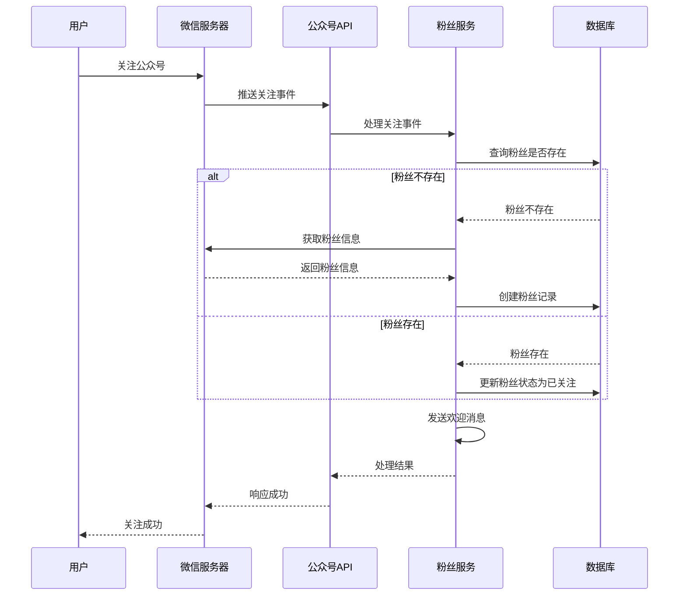
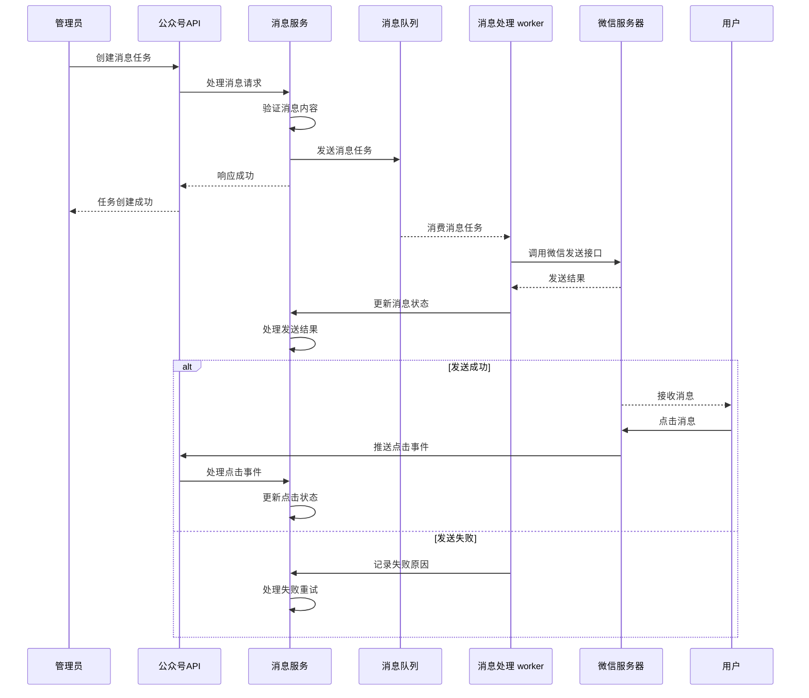
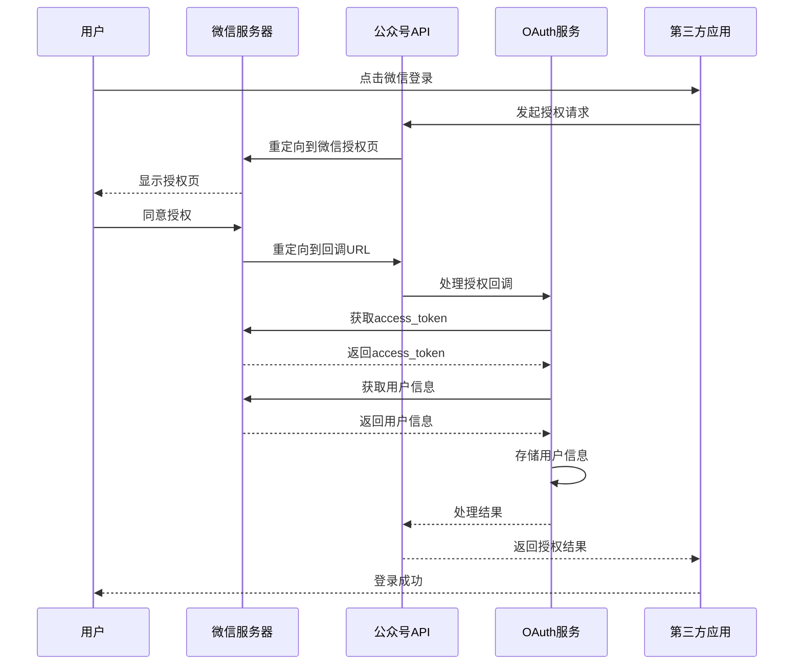

# 公众号管理功能

## 1. 功能概述

公众号管理功能是 MallEcoAPI 系统中的重要功能模块，负责处理微信公众号相关的所有业务逻辑，包括公众号配置、粉丝管理、消息管理、素材管理、H5 网页管理、OAuth 授权管理等。本功能模块通过与微信公众号平台的深度集成，为系统提供了完整的微信生态能力，实现了用户触达、消息通知、品牌推广等多种业务场景。

### 1.1 核心功能

- **公众号配置管理**：管理公众号基本配置、API 密钥等
- **粉丝管理**：管理公众号粉丝信息、关注状态、互动记录等
- **消息管理**：管理订阅消息、模板消息、关键词回复等
- **素材管理**：管理图文、图片、视频、语音等公众号素材
- **H5 网页管理**：管理公众号相关的 H5 网页和模板
- **自定义菜单管理**：配置公众号自定义菜单和关键词
- **OAuth 授权管理**：管理第三方应用授权、令牌和用户信息
- **微信卡券管理**：管理微信卡券的创建、发放和核销

### 1.2 技术架构

- **后端框架**：NestJS
- **数据库**：MySQL
- **缓存**：Redis
- **消息队列**：RabbitMQ
- **微信 API**：微信公众号开发接口
- **前端框架**：Vue 3 + TypeScript

## 2. 功能详情

### 2.1 公众号配置管理

**功能描述**：管理公众号的基本配置信息，包括 AppID、AppSecret、Token、AES Key 等，是整个公众号功能的基础。

**核心实现**：

1. **配置存储**：
   - 基本配置存储在环境变量中
   - 详细配置存储在数据库中
   - 使用 Redis 缓存 access_token 等临时凭证

2. **API 接口**：
   - `GET /api/wechat/config` - 获取公众号配置
   - `POST /api/wechat/config` - 更新公众号配置
   - `GET /api/wechat/overview` - 获取公众号概览信息
   - `GET /api/wechat/stats` - 获取公众号统计数据

3. **配置验证**：
   - 验证 AppID 和 AppSecret 的有效性
   - 验证 Token 和 AES Key 的格式
   - 测试与微信服务器的连接

### 2.2 粉丝管理

**功能描述**：管理公众号粉丝信息，包括粉丝列表、关注状态、互动记录等，是公众号运营的核心数据。

**核心实现**：

1. **粉丝数据结构**：
   - 基本信息：openid、unionid、昵称、头像、性别、地区等
   - 状态信息：关注状态、关注时间、取消关注时间等
   - 互动信息：消息记录、点击记录、参与活动等
   - 标签信息：用户标签、分组信息等

2. **API 接口**：
   - `GET /api/wechat/fans` - 获取粉丝列表
   - `GET /api/wechat/fans/{id}` - 获取粉丝详情
   - `POST /api/wechat/fans` - 创建粉丝记录
   - `PATCH /api/wechat/fans/{id}` - 更新粉丝信息
   - `DELETE /api/wechat/fans/{id}` - 删除粉丝记录

3. **粉丝互动**：
   - 自动回复：关键词自动回复、默认回复
   - 消息推送：模板消息、订阅消息推送
   - 粉丝分组：根据标签进行分组管理

### 2.3 消息管理

**功能描述**：管理公众号消息，包括订阅消息、模板消息、关键词回复等，实现与用户的及时沟通。

**核心实现**：

1. **订阅消息**：
   - 订阅记录管理：创建、查询、更新订阅状态
   - 消息发送：根据订阅记录发送消息
   - 发送状态：跟踪消息发送状态和点击情况

2. **模板消息**：
   - 模板管理：同步、创建、更新、删除模板
   - 消息发送：根据模板发送消息
   - 发送统计：统计消息发送量和点击率

3. **API 接口**：
   - `POST /api/wechat/subscribe` - 创建订阅记录
   - `GET /api/wechat/subscribe` - 获取订阅记录列表
   - `GET /api/wechat/subscribe/{id}` - 获取订阅记录详情

### 2.4 素材管理

**功能描述**：管理公众号素材，包括图文、图片、视频、语音等，为消息发送和菜单设置提供内容支持。

**核心实现**：

1. **素材类型**：
   - 图文素材：文章标题、内容、封面、摘要等
   - 图片素材：图片文件、URL、描述等
   - 视频素材：视频文件、标题、描述等
   - 语音素材：语音文件、时长、格式等

2. **API 接口**：
   - 素材上传、下载、删除接口
   - 素材列表查询接口
   - 素材详情查询接口

3. **素材存储**：
   - 本地存储：存储素材元数据
   - 云存储：存储素材文件（图片、视频、语音）
   - 微信存储：同步到微信服务器

### 2.5 H5 网页管理

**功能描述**：管理公众号相关的 H5 网页和模板，实现活动页面、推广页面等功能。

**核心实现**：

1. **H5 页面管理**：
   - 页面创建：标题、内容、样式、脚本等
   - 页面编辑：可视化编辑、代码编辑
   - 页面发布：生成访问链接、二维码

2. **H5 模板管理**：
   - 模板创建：通用模板、活动模板等
   - 模板编辑：修改模板内容和样式
   - 模板使用：基于模板创建页面

3. **API 接口**：
   - `GET /api/wechat/h5-pages` - 获取 H5 页面列表
   - `POST /api/wechat/h5-pages` - 创建 H5 页面
   - `PUT /api/wechat/h5-pages/{id}` - 更新 H5 页面
   - `DELETE /api/wechat/h5-pages/{id}` - 删除 H5 页面

### 2.6 自定义菜单管理

**功能描述**：配置公众号自定义菜单和关键词，实现菜单点击和关键词回复功能。

**核心实现**：

1. **菜单配置**：
   - 菜单结构：一级菜单、二级菜单
   - 菜单类型：点击、跳转 URL、小程序等
   - 菜单发布：同步到微信服务器

2. **关键词管理**：
   - 关键词设置：关键词、回复类型、回复内容
   - 关键词匹配：精确匹配、模糊匹配
   - 关键词优先级：设置关键词优先级

3. **API 接口**：
   - 菜单创建、查询、删除接口
   - 关键词设置、查询、删除接口

### 2.7 OAuth 授权管理

**功能描述**：管理公众号第三方授权应用、令牌和用户信息，实现微信登录、授权等功能。

**核心实现**：

1. **授权应用管理**：
   - 应用创建：应用名称、AppID、AppSecret 等
   - 应用配置：授权回调 URL、权限范围等
   - 应用状态：启用、禁用

2. **授权令牌管理**：
   - 令牌生成：生成 access_token、refresh_token
   - 令牌刷新：使用 refresh_token 刷新 access_token
   - 令牌验证：验证令牌的有效性

3. **授权用户管理**：
   - 用户信息：获取用户基本信息、详细信息
   - 授权记录：记录用户授权历史
   - 授权状态：管理用户授权状态

4. **API 接口**：
   - `GET /api/wechat/oauth-app` - 获取授权应用列表
   - OAuth 授权回调接口
   - 令牌管理接口

### 2.8 微信卡券管理

**功能描述**：管理微信卡券的创建、发放和核销，实现优惠券、会员卡等功能。

**核心实现**：

1. **卡券创建**：
   - 卡券类型：优惠券、会员卡、团购券等
   - 卡券信息：名称、面额、有效期、使用条件等
   - 卡券样式：颜色、 logo、背景等

2. **卡券发放**：
   - 发放方式：二维码、链接、接口发放
   - 发放数量：控制卡券发放数量
   - 发放记录：记录卡券发放历史

3. **卡券核销**：
   - 核销方式：二维码核销、手动核销
   - 核销记录：记录卡券核销历史
   - 核销状态：管理卡券核销状态

4. **API 接口**：
   - `GET /api/wechat/coupons` - 获取卡券列表
   - `POST /api/wechat/coupons` - 创建卡券
   - 卡券发放、核销接口

## 3. 技术实现

### 3.1 后端实现

**模块结构**：

```typescript
// src/modules/wechat/wechat.module.ts
@Module({
  imports: [
    TypeOrmModule.forFeature([
      WechatFans,
      WechatSubscribe,
      WechatMaterialArticle,
    ]),
    HttpModule,
  ],
  controllers: [
    WechatController,
    WechatH5Controller,
    WechatSubscribeController,
    WechatFansController,
    WechatCouponController,
    WechatOauthAppController,
  ],
  providers: [
    WechatService,
    WechatTemplateService,
    WechatH5Service,
    WechatSubscribeService,
    WechatFansService,
    WechatCouponService,
    WechatOauthService,
  ],
})
export class WechatModule {}
```

**核心服务**：

```typescript
// src/modules/wechat/services/wechat.service.ts
@Injectable()
export class WechatService {
  constructor(
    private readonly configService: ConfigService,
    private readonly cacheService: AdvancedCacheService,
  ) {}

  async getConfig() {
    return {
      appId: process.env.WECHAT_APP_ID || '',
      appSecret: process.env.WECHAT_APP_SECRET || '',
      token: process.env.WECHAT_TOKEN || '',
      aesKey: process.env.WECHAT_AES_KEY || '',
      accessToken: await this.getAccessToken(),
      expiresIn: 7200,
    };
  }

  async getAccessToken() {
    const cacheKey = 'wechat:access_token';
    return await this.cacheService.readThrough(
      cacheKey,
      async () => {
        // 调用微信 API 获取 access_token
        return 'access_token';
      },
      7000,
    );
  }
}
```

### 3.2 前端实现

**页面结构**：

```
// MallEcoUI/manager/views/wechat/
├── h5-pages.vue         # H5页面管理
├── h5-template.vue      # H5模板管理
├── material-article.vue # 素材文章管理
├── material-image.vue   # 素材图片管理
├── material-video.vue   # 素材视频管理
├── material-voice.vue   # 素材语音管理
├── menu-config.vue      # 菜单配置
├── menu-keywords.vue    # 菜单关键词
├── oauth-app.vue        # OAuth应用管理
├── oauth-token.vue      # OAuth令牌管理
├── oauth-user.vue       # OAuth用户管理
├── subscribe.vue        # 订阅消息管理
└── template.vue         # 模板管理
```

**前端组件**：

- 粉丝管理组件：展示粉丝列表、详情、互动记录
- 消息管理组件：管理订阅消息、模板消息
- 素材管理组件：上传、预览、管理各种素材
- H5 编辑组件：可视化编辑 H5 页面
- 菜单配置组件：配置公众号自定义菜单

### 3.3 微信 API 集成

**核心接口**：

- **基础接口**：获取 access_token、JS-SDK 签名等
- **粉丝接口**：获取粉丝列表、粉丝信息等
- **消息接口**：发送模板消息、订阅消息等
- **素材接口**：上传、获取素材等
- **菜单接口**：创建、查询、删除菜单等
- **OAuth 接口**：授权、获取用户信息等
- **卡券接口**：创建、发放、核销卡券等

**接口调用**：

- 使用 HttpModule 发起 HTTP 请求
- 实现接口调用重试机制
- 记录接口调用日志
- 处理接口调用错误

## 4. 业务流程

### 4.1 粉丝关注流程



### 4.2 消息发送流程



### 4.3 OAuth 授权流程



## 5. 性能优化

### 5.1 缓存策略

- **access_token 缓存**：使用 Redis 缓存 access_token，减少微信 API 调用
- **粉丝信息缓存**：缓存频繁访问的粉丝信息
- **素材缓存**：缓存素材列表和详情
- **JS-SDK 签名缓存**：缓存 JS-SDK 签名，减少重复计算

### 5.2 异步处理

- **消息发送**：使用消息队列异步发送消息，提高响应速度
- **素材上传**：使用异步上传，避免阻塞主线程
- **数据同步**：使用异步任务同步微信数据

### 5.3 批量操作

- **批量获取粉丝**：使用批量接口获取粉丝列表
- **批量发送消息**：使用批量接口发送消息
- **批量上传素材**：支持批量上传素材

### 5.4 索引优化

- **粉丝表索引**：为 openid、unionid、关注状态等字段添加索引
- **消息表索引**：为消息状态、发送时间等字段添加索引
- **素材表索引**：为素材类型、创建时间等字段添加索引

## 6. 安全性

### 6.1 数据安全

- **敏感数据加密**：加密存储 AppSecret、AES Key 等敏感数据
- **HTTPS 传输**：使用 HTTPS 协议传输数据
- **数据访问控制**：实现基于角色的权限控制

### 6.2 接口安全

- **接口签名验证**：验证微信接口调用的签名
- **IP 白名单**：配置微信服务器 IP 白名单
- **接口限流**：实现 API 接口限流，防止恶意请求
- **错误处理**：合理处理接口调用错误，避免信息泄露

### 6.3 授权安全

- **授权范围控制**：严格控制 OAuth 授权范围
- **令牌管理**：安全管理 access_token、refresh_token
- **授权回调验证**：验证授权回调的有效性

## 7. 集成与扩展

### 7.1 与其他模块集成

- **用户模块**：实现微信登录、绑定微信账号
- **订单模块**：发送订单状态变更通知
- **商品模块**：推送商品促销信息
- **活动模块**：推送活动通知、参与活动
- **支付模块**：实现微信支付

### 7.2 外部系统集成

- **微信公众号平台**：与微信公众号平台完整集成
- **微信支付平台**：与微信支付平台集成
- **微信卡券平台**：与微信卡券平台集成
- **第三方 CRM 系统**：与第三方 CRM 系统集成

### 7.3 功能扩展

- **小程序管理**：增加小程序管理功能
- **企业微信**：增加企业微信集成
- **抖音、微博**：增加其他社交媒体平台集成
- **智能客服**：增加智能客服功能
- **数据分析**：增加更丰富的数据分析功能

## 8. 总结

公众号管理功能是 MallEcoAPI 系统中与微信生态集成的重要模块，通过实现与微信公众号平台的深度集成，为系统提供了完整的微信营销和用户运营能力。该功能模块不仅满足了基本的公众号管理需求，还通过扩展实现了更多的业务场景，如微信登录、消息通知、活动推广等。

### 8.1 核心优势

- **功能完整**：提供了完整的公众号管理功能
- **技术先进**：使用了 NestJS、Vue 3 等先进技术
- **架构合理**：模块化设计，便于扩展和维护
- **前端完善**：提供了完整的前端管理界面
- **性能优异**：实现了多种性能优化措施
- **安全可靠**：完善的安全机制

### 8.2 应用场景

- **用户触达**：通过公众号消息触达用户
- **消息通知**：订单、活动等消息的及时通知
- **品牌推广**：通过公众号进行品牌推广
- **活动运营**：发布活动、收集用户参与
- **用户互动**：增强用户与平台的互动性
- **数据收集**：收集用户行为数据，为运营决策提供支持

### 8.3 未来展望

公众号管理功能将继续演进，增加更多的功能和集成，如小程序管理、企业微信集成、智能客服等，为系统提供更全面的微信生态能力。同时，通过不断优化性能和用户体验，提高系统的可靠性和易用性，为企业的微信营销和用户运营提供更强大的支持。

---

**文档更新时间**：2026-01-19
**文档版本**：v1.0.0
**作者**：MallEco 开发团队
