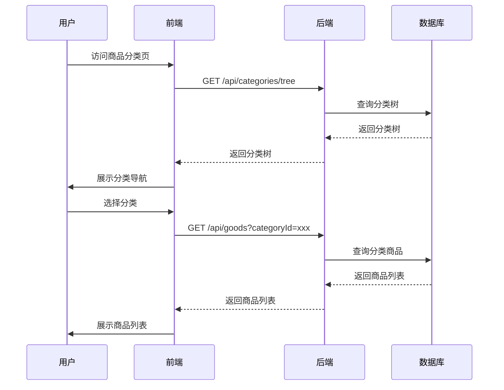
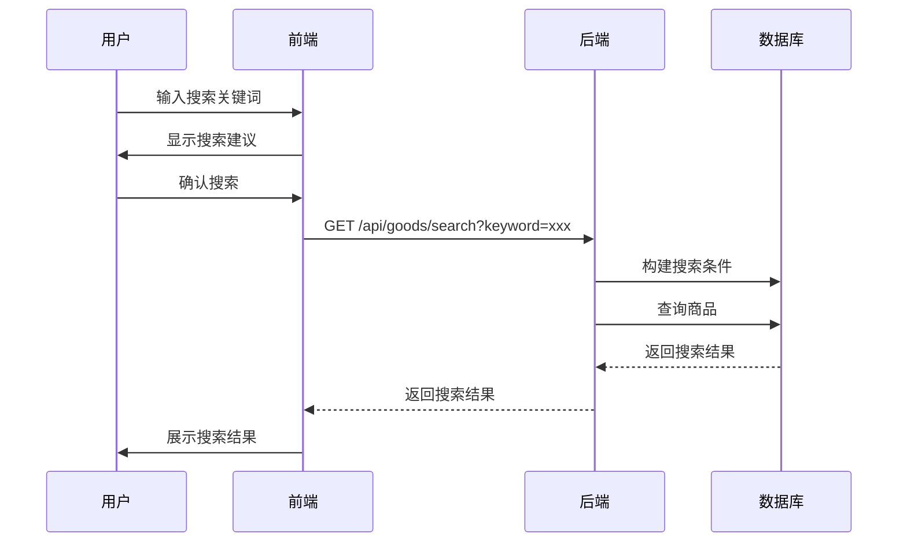
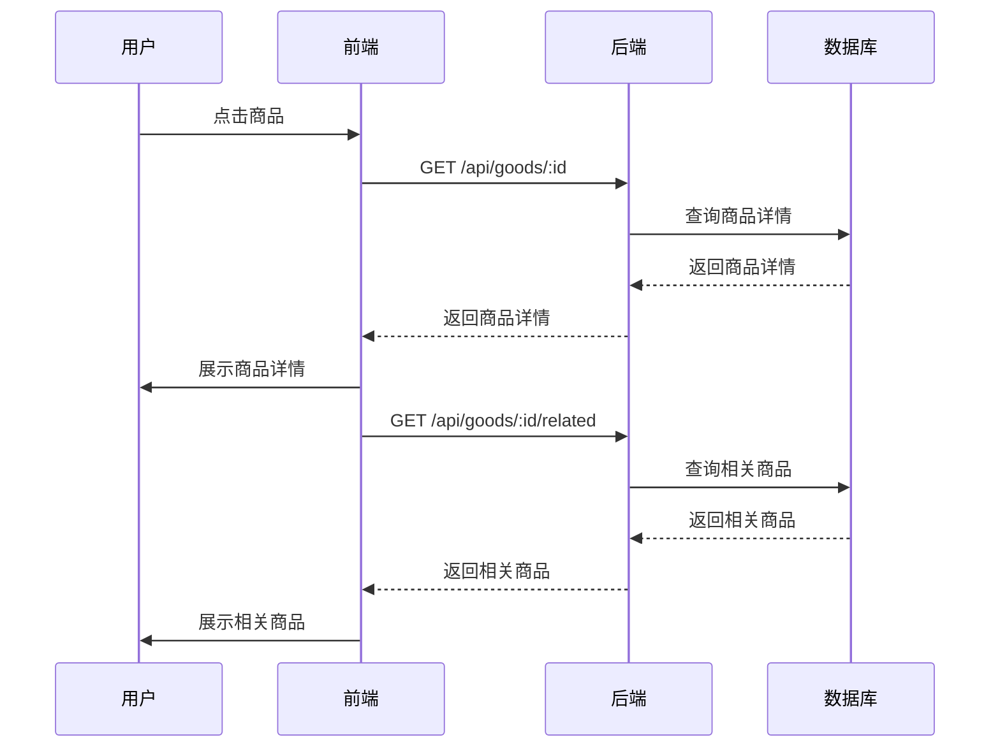
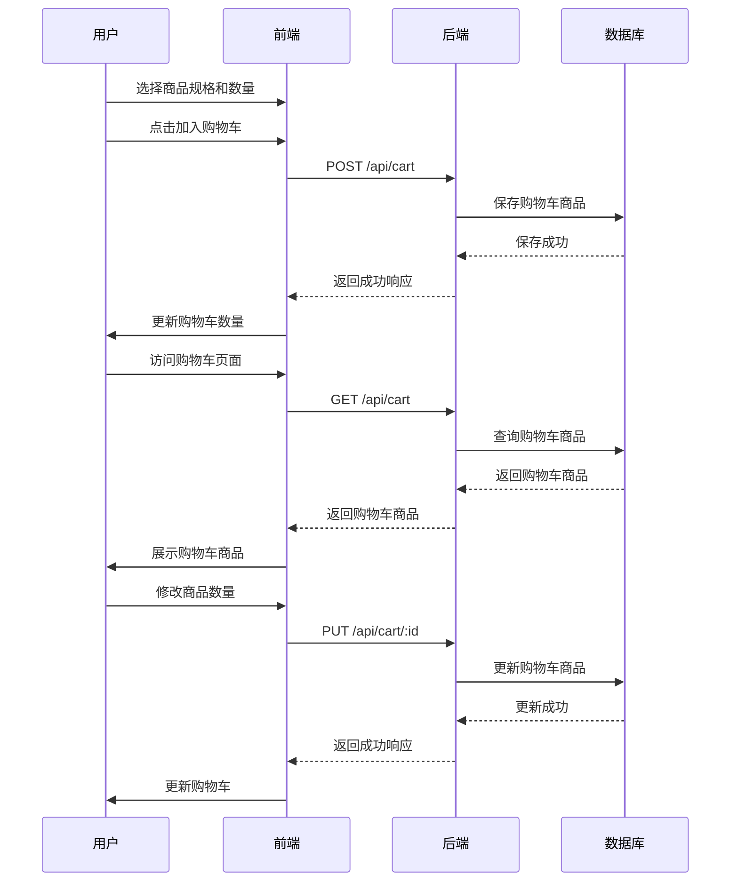
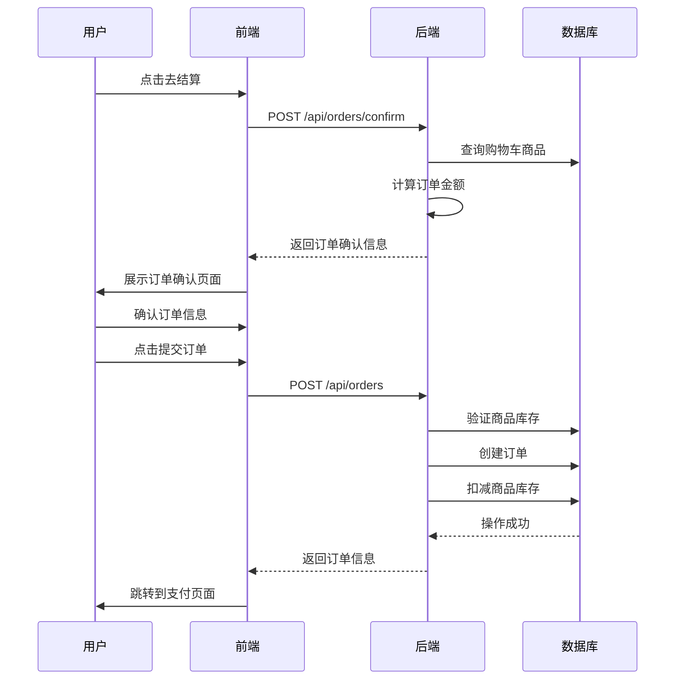
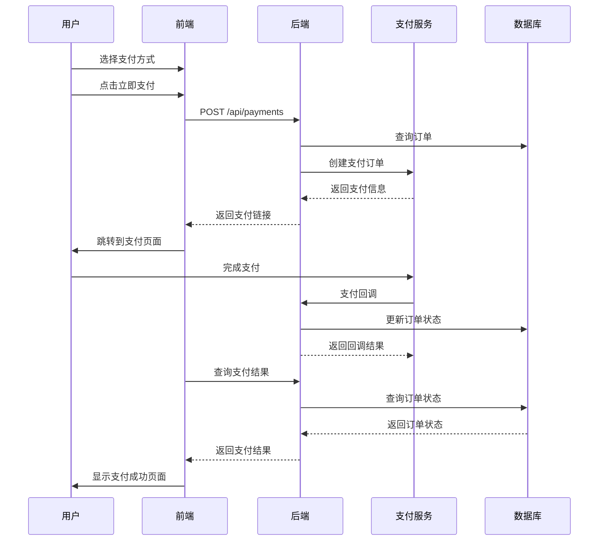

# 商品浏览与购买功能文档

## 1. 功能概述

商品浏览与购买功能是电商系统的核心功能，允许用户浏览商品、搜索商品、查看商品详情并完成购买。该功能连接了商品模块、订单模块和支付模块，是用户与系统交互的主要入口。

### 1.1 功能定位

商品浏览与购买功能在系统中扮演着以下角色：

- **商品发现**：帮助用户发现感兴趣的商品
- **信息获取**：提供商品的详细信息，帮助用户做出购买决策
- **购买流程**：引导用户完成从选择商品到支付的完整购买流程
- **用户体验**：提供流畅、便捷的购物体验
- **业务转化**：将浏览用户转化为购买用户

### 1.2 核心价值

- **用户体验**：提供直观、便捷的商品浏览和购买流程
- **转化率**：通过优化购买流程，提高商品的转化率
- **数据驱动**：通过用户行为数据，优化商品推荐和展示
- **业务增长**：为系统带来持续的业务增长
- **竞争优势**：提供差异化的购物体验，增强系统的竞争优势

## 2. 功能模块

### 2.1 商品分类浏览

**功能描述**：用户通过商品分类浏览商品

**核心流程**：

1. **分类展示**
   - 前端获取商品分类树
   - 前端展示分类导航
   - 用户选择分类

2. **商品列表**
   - 前端请求分类商品列表
   - 后端查询分类商品
   - 前端展示商品列表
   - 用户浏览商品

**流程图**：

### 2.2 商品搜索

**功能描述**：用户通过关键词搜索商品

**核心流程**：

1. **搜索输入**
   - 用户在搜索框输入关键词
   - 前端显示搜索建议
   - 用户确认搜索

2. **搜索结果**
   - 前端请求搜索结果
   - 后端构建搜索条件
   - 后端查询商品
   - 前端展示搜索结果
   - 用户浏览搜索结果

**流程图**：

### 2.3 商品详情

**功能描述**：用户查看商品的详细信息

**核心流程**：

1. **详情请求**
   - 用户点击商品
   - 前端请求商品详情
   - 后端查询商品详情
   - 前端展示商品详情

2. **相关信息**
   - 前端请求相关商品
   - 前端请求商品评价
   - 前端展示相关信息

**流程图**：

### 2.4 购物车管理

**功能描述**：用户将商品加入购物车并管理购物车商品

**核心流程**：

1. **添加商品**
   - 用户在商品详情页选择规格和数量
   - 用户点击“加入购物车”
   - 前端请求添加购物车
   - 后端保存购物车商品
   - 前端更新购物车数量

2. **购物车管理**
   - 用户访问购物车页面
   - 前端请求购物车商品
   - 后端查询购物车商品
   - 前端展示购物车商品
   - 用户修改商品数量或删除商品
   - 前端更新购物车
   - 后端更新购物车商品

**流程图**：

### 2.5 订单创建

**功能描述**：用户从购物车或直接购买创建订单

**核心流程**：

1. **订单确认**
   - 用户点击“去结算”或“立即购买”
   - 前端请求订单确认信息
   - 后端计算订单金额和运费
   - 前端展示订单确认页面
   - 用户确认订单信息

2. **订单提交**
   - 用户点击“提交订单”
   - 前端请求创建订单
   - 后端验证商品库存
   - 后端创建订单
   - 后端扣减商品库存
   - 前端跳转到支付页面

**流程图**：

### 2.6 订单支付

**功能描述**：用户支付订单

**核心流程**：

1. **支付选择**
   - 前端展示支付方式
   - 用户选择支付方式
   - 用户点击“立即支付”

2. **支付处理**
   - 前端请求创建支付订单
   - 后端调用支付服务
   - 后端返回支付链接或参数
   - 前端跳转到支付页面或显示支付二维码
   - 用户完成支付

3. **支付回调**
   - 支付平台通知支付结果
   - 后端处理支付回调
   - 后端更新订单状态
   - 前端显示支付结果

**流程图**：

## 3. 技术实现

### 3.1 前端实现

**核心技术**：

- **框架**：React / Vue / Angular
- **状态管理**：Redux / Vuex / NgRx
- **UI 库**：Ant Design / Element UI / Material UI
- **HTTP 客户端**：Axios
- **路由**：React Router / Vue Router / Angular Router

**关键组件**：

1. **分类导航组件**
   - 展示商品分类树
   - 处理分类选择
   - 支持多级分类

2. **商品列表组件**
   - 展示商品列表
   - 支持分页和排序
   - 支持筛选

3. **商品详情组件**
   - 展示商品详细信息
   - 处理商品规格选择
   - 展示商品图片和视频

4. **购物车组件**
   - 展示购物车商品
   - 处理商品数量修改
   - 处理商品删除

5. **订单确认组件**
   - 展示订单信息
   - 处理地址选择
   - 处理支付方式选择

6. **支付组件**
   - 展示支付方式
   - 处理支付请求
   - 显示支付结果

### 3.2 后端实现

**核心技术**：

- **框架**：NestJS
- **语言**：TypeScript
- **数据库**：MySQL
- **缓存**：Redis
- **消息队列**：RabbitMQ

**关键服务**：

1. **商品服务**
   - 提供商品列表和详情查询
   - 处理商品搜索
   - 管理商品库存

2. **购物车服务**
   - 管理用户购物车
   - 处理购物车商品的添加、修改和删除

3. **订单服务**
   - 创建订单
   - 管理订单状态
   - 处理订单操作

4. **支付服务**
   - 处理支付请求
   - 管理支付状态
   - 处理支付回调

5. **推荐服务**
   - 提供商品推荐
   - 基于用户行为和商品属性

### 3.3 数据库设计

**核心表**：

1. **商品表 (goods)**
   - 存储商品基本信息
   - 包含商品名称、价格、库存等字段

2. **商品 SKU 表 (goods_sku)**
   - 存储商品 SKU 信息
   - 包含 SKU 价格、库存、规格等字段

3. **商品分类表 (goods_category)**
   - 存储商品分类信息
   - 包含分类名称、父分类 ID 等字段

4. **购物车表 (cart)**
   - 存储用户购物车商品
   - 包含用户 ID、商品 ID、数量等字段

5. **订单表 (order)**
   - 存储订单信息
   - 包含订单编号、用户 ID、总金额等字段

6. **订单项表 (order_item)**
   - 存储订单项信息
   - 包含订单 ID、商品 ID、数量、价格等字段

7. **支付记录表 (payment_record)**
   - 存储支付记录
   - 包含订单 ID、支付方式、金额等字段

### 3.4 API 设计

**核心 API**：

1. **商品分类 API**
   - `GET /api/categories/tree`：获取分类树
   - `GET /api/categories/:id`：获取分类详情

2. **商品 API**
   - `GET /api/goods`：获取商品列表
   - `GET /api/goods/:id`：获取商品详情
   - `GET /api/goods/search`：搜索商品
   - `GET /api/goods/:id/related`：获取相关商品

3. **购物车 API**
   - `GET /api/cart`：获取购物车商品
   - `POST /api/cart`：添加购物车商品
   - `PUT /api/cart/:id`：修改购物车商品
   - `DELETE /api/cart/:id`：删除购物车商品

4. **订单 API**
   - `POST /api/orders/confirm`：订单确认
   - `POST /api/orders`：创建订单
   - `GET /api/orders/:id`：获取订单详情
   - `POST /api/orders/:id/pay`：支付订单

5. **支付 API**
   - `POST /api/payments`：创建支付订单
   - `GET /api/payments/:id`：获取支付详情

## 4. 用户体验设计

### 4.1 视觉设计

**核心原则**：

- **简洁明了**：界面简洁，重点突出商品信息
- **视觉层次**：通过视觉层次，引导用户关注重要信息
- **一致性**：保持界面风格的一致性
- **响应式**：适配不同屏幕尺寸
- **品牌识别**：体现系统的品牌特色

**设计元素**：

1. **颜色方案**
   - 主色调：体现系统的品牌特色
   - 辅助色：用于强调和交互
   - 中性色：用于背景和文本

2. **排版**
   - 字体：选择清晰、易读的字体
   - 字号：建立清晰的字号层次
   - 行高：确保文本的可读性

3. **图像**
   - 商品图片：高清、多角度展示
   - 图标：简洁、直观的图标
   - 视频：产品展示视频

4. **布局**
   - 网格布局：整齐、有序的商品展示
   - 留白：适当的留白，提高界面的呼吸感
   - 响应式布局：适配不同设备

### 4.2 交互设计

**核心原则**：

- **直观易用**：交互流程直观，易于理解
- **反馈及时**：提供及时的操作反馈
- **减少摩擦**：减少用户操作的摩擦
- **个性化**：根据用户行为，提供个性化的交互体验
- **可访问性**：确保所有用户都能使用该功能

**交互元素**：

1. **导航**
   - 分类导航：清晰、层次分明
   - 面包屑导航：帮助用户了解当前位置
   - 搜索导航：快速查找商品

2. **商品展示**
   - 列表视图：展示更多商品
   - 网格视图：展示商品图片
   - 排序和筛选：快速找到感兴趣的商品

3. **商品详情**
   - 图片轮播：多角度查看商品
   - 规格选择：直观的规格选择
   - 数量调整：便捷的数量调整

4. **购物车**
   - 快速添加：一键添加商品
   - 批量操作：批量修改或删除商品
   - 价格计算：实时更新价格

5. **订单流程**
   - 步骤导航：清晰的流程指引
   - 表单验证：实时的表单验证
   - 错误提示：友好的错误提示

6. **支付流程**
   - 支付方式选择：直观的支付方式展示
   - 支付状态：清晰的支付状态反馈
   - 支付结果：明确的支付结果提示

### 4.3 性能优化

**核心原则**：

- **快速响应**：减少页面加载时间
- **流畅交互**：确保交互的流畅性
- **稳定可靠**：确保功能的稳定运行
- **资源优化**：优化资源的使用

**优化策略**：

1. **前端优化**
   - 图片懒加载：减少首屏加载时间
   - 资源压缩：压缩 CSS、JS 和图片
   - 缓存策略：合理使用浏览器缓存
   - 代码分割：按需加载代码

2. **后端优化**
   - 数据库索引：优化数据库查询
   - 缓存：使用 Redis 缓存热点数据
   - 异步处理：使用消息队列处理异步任务
   - 负载均衡：分散请求压力

3. **网络优化**
   - CDN：使用 CDN 加速静态资源
   - HTTP/2：使用 HTTP/2 协议
   - 域名分片：优化资源加载
   - 压缩传输：使用 Gzip 压缩传输数据

## 5. 数据统计与分析

### 5.1 关键指标

**核心指标**：

1. **浏览指标**
   - 页面浏览量（PV）
   - 独立访客数（UV）
   - 平均停留时间
   - 跳出率

2. **转化指标**
   - 商品详情页访问率
   - 加入购物车率
   - 下单率
   - 支付成功率
   - 转化率（从浏览到购买）

3. **销售指标**
   - 销售额
   - 订单数
   - 客单价
   - 商品销量
   - 复购率

4. **用户指标**
   - 新用户数
   - 老用户数
   - 用户活跃度
   - 用户留存率

### 5.2 数据分析

**分析维度**：

1. **商品分析**
   - 热门商品：销量最高的商品
   - 转化率最高的商品
   - 浏览量最高的商品
   - 商品类别分析

2. **用户行为分析**
   - 用户浏览路径
   - 搜索关键词分析
   - 购买决策因素
   - 用户偏好分析

3. **购买流程分析**
   - 购物车放弃率
   - 支付失败率
   - 订单取消率
   - 购买流程中的流失节点

4. **时间分析**
   - 销售时段分析
   - 销售日分析
   - 销售周分析
   - 销售月分析

### 5.3 数据驱动优化

**优化策略**：

1. **商品推荐优化**
   - 基于用户浏览历史推荐商品
   - 基于用户购买历史推荐商品
   - 基于商品相似度推荐商品
   - 基于热门商品推荐商品

2. **搜索优化**
   - 优化搜索算法
   - 提供搜索建议
   - 搜索结果排序优化
   - 搜索错误处理

3. **购买流程优化**
   - 简化购买流程
   - 减少表单填写
   - 优化支付流程
   - 提供多种支付方式

4. **页面优化**
   - A/B 测试不同页面设计
   - 优化页面布局
   - 优化商品展示方式
   - 优化页面加载速度

## 6. 功能扩展

### 6.1 商品推荐系统

**功能描述**：基于用户行为和商品属性，推荐个性化商品

**核心功能**：

1. **个性化推荐**
   - 基于用户浏览历史推荐
   - 基于用户购买历史推荐
   - 基于用户收藏推荐

2. **场景推荐**
   - 首页推荐
   - 商品详情页推荐
   - 购物车推荐
   - 订单确认页推荐

3. **算法优化**
   - 协同过滤算法
   - 内容推荐算法
   - 混合推荐算法

### 6.2 商品评价系统

**功能描述**：用户对商品进行评价和查看评价

**核心功能**：

1. **评价提交**
   - 星级评价
   - 文字评价
   - 图片评价
   - 视频评价

2. **评价展示**
   - 商品详情页评价展示
   - 评价列表页
   - 评价筛选和排序

3. **评价管理**
   - 评价审核
   - 评价回复
   - 评价统计

### 6.3 商品问答系统

**功能描述**：用户对商品进行提问和回答

**核心功能**：

1. **问题提交**
   - 用户提交问题
   - 问题审核

2. **问题回答**
   - 商家回答
   - 用户回答
   - 回答采纳

3. **问答展示**
   - 商品详情页问答展示
   - 问答列表页
   - 问答筛选和排序

### 6.4 商品收藏与关注

**功能描述**：用户收藏和关注商品

**核心功能**：

1. **商品收藏**
   - 添加收藏
   - 取消收藏
   - 收藏列表

2. **商品关注**
   - 关注商品
   - 取消关注
   - 关注列表
   - 商品价格变动通知

### 6.5 购物车优化

**功能描述**：优化购物车功能，提高用户体验

**核心功能**：

1. **购物车同步**
   - 多设备购物车同步
   - 登录状态购物车同步

2. **购物车营销**
   - 购物车商品优惠
   - 购物车商品推荐
   - 购物车过期提醒

3. **购物车管理**
   - 购物车商品分组
   - 购物车商品批量操作
   - 购物车商品库存提醒

## 7. 常见问题与解决方案

### 7.1 商品浏览问题

**问题**：商品列表加载缓慢

**可能原因**：
- 商品数据量大
- 图片加载缓慢
- 网络连接问题
- 服务器响应缓慢

**解决方案**：
- 实现商品列表分页
- 图片懒加载
- 优化图片大小和格式
- 服务器缓存商品列表
- 使用 CDN 加速图片

**问题**：商品搜索结果不准确

**可能原因**：
- 搜索算法不完善
- 商品关键词不匹配
- 搜索索引未更新
- 搜索参数错误

**解决方案**：
- 优化搜索算法
- 完善商品关键词
- 定期更新搜索索引
- 验证搜索参数

### 7.2 商品购买问题

**问题**：商品库存不足

**可能原因**：
- 库存数据不准确
- 并发购买导致超卖
- 库存更新不及时

**解决方案**：
- 实现库存锁定机制
- 使用数据库事务确保库存操作的原子性
- 定期同步库存数据
- 前端显示实时库存

**问题**：订单创建失败

**可能原因**：
- 商品库存不足
- 用户信息不完整
- 支付方式错误
- 服务器错误

**解决方案**：
- 验证商品库存
- 完善用户信息
- 提供多种支付方式
- 错误处理和日志记录

**问题**：支付失败

**可能原因**：
- 网络连接问题
- 支付平台返回错误
- 支付参数错误
- 订单状态不正确

**解决方案**：
- 检查网络连接
- 查看支付平台返回的错误信息
- 验证支付参数
- 检查订单状态

### 7.3 用户体验问题

**问题**：购买流程复杂

**可能原因**：
- 步骤过多
- 表单填写繁琐
- 页面跳转频繁
- 支付方式单一

**解决方案**：
- 简化购买流程
- 减少表单填写
- 使用单页应用
- 提供多种支付方式

**问题**：页面加载缓慢

**可能原因**：
- 图片过大
- 资源过多
- 代码未优化
- 服务器响应缓慢

**解决方案**：
- 优化图片大小和格式
- 减少资源数量
- 压缩代码
- 服务器缓存
- 使用 CDN

## 8. 功能测试

### 8.1 测试策略

**核心策略**：

1. **功能测试**
   - 测试每个功能模块的正常功能
   - 测试边界情况
   - 测试错误处理

2. **性能测试**
   - 页面加载时间测试
   - 响应时间测试
   - 并发测试
   - 压力测试

3. **兼容性测试**
   - 浏览器兼容性测试
   - 设备兼容性测试
   - 操作系统兼容性测试

4. **安全测试**
   - 输入验证测试
   - SQL 注入测试
   - XSS 测试
   - CSRF 测试

### 8.2 测试用例

**核心用例**：

1. **商品分类浏览测试**
   - 测试分类树加载
   - 测试分类商品列表加载
   - 测试分类筛选

2. **商品搜索测试**
   - 测试关键词搜索
   - 测试搜索结果准确性
   - 测试搜索建议

3. **商品详情测试**
   - 测试商品详情加载
   - 测试规格选择
   - 测试相关商品推荐

4. **购物车测试**
   - 测试添加商品到购物车
   - 测试修改购物车商品数量
   - 测试删除购物车商品
   - 测试购物车商品结算

5. **订单创建测试**
   - 测试订单确认
   - 测试订单提交
   - 测试库存扣减

6. **订单支付测试**
   - 测试支付方式选择
   - 测试支付流程
   - 测试支付回调
   - 测试支付结果显示

### 8.3 测试工具

**推荐工具**：

1. **功能测试**
   - Selenium：自动化测试
   - Cypress：端到端测试
   - Jest：单元测试

2. **性能测试**
   - Lighthouse：页面性能测试
   - WebPageTest：网站性能测试
   - JMeter：负载测试

3. **兼容性测试**
   - BrowserStack：跨浏览器测试
   - Sauce Labs：跨平台测试

4. **安全测试**
   - OWASP ZAP：安全测试
   - Burp Suite：安全测试

## 9. 总结与展望

### 9.1 功能优势

- **用户体验**：提供流畅、便捷的商品浏览和购买流程
- **技术架构**：采用现代化的技术架构，确保系统的稳定性和可扩展性
- **数据驱动**：通过用户行为数据，优化商品推荐和展示
- **业务价值**：为系统带来持续的业务增长
- **竞争优势**：提供差异化的购物体验，增强系统的竞争优势

### 9.2 改进空间

- **个性化推荐**：进一步优化商品推荐算法，提高推荐的准确性
- **搜索体验**：优化搜索功能，提高搜索结果的相关性
- **购买流程**：进一步简化购买流程，提高转化率
- **移动体验**：优化移动设备的购物体验
- **社交购物**：引入社交元素，增强购物的趣味性

### 9.3 未来规划

- **版本 1.1**：增强商品推荐系统，提高个性化推荐效果
- **版本 1.2**：优化搜索功能，提高搜索结果的相关性
- **版本 1.3**：引入商品评价和问答系统，增强用户互动
- **版本 1.4**：优化移动设备的购物体验，提高移动端转化率
- **版本 1.5**：引入社交购物功能，增强用户粘性
- **版本 2.0**：重构商品浏览与购买功能，采用更先进的技术和架构，提供更优质的购物体验

## 10. 附录

### 10.1 核心 API 列表

| API 路径 | 方法 | 功能描述 | 认证要求 |
|----------|------|----------|----------|
| `/api/categories/tree` | GET | 获取分类树 | 否 |
| `/api/goods` | GET | 获取商品列表 | 否 |
| `/api/goods/:id` | GET | 获取商品详情 | 否 |
| `/api/goods/search` | GET | 搜索商品 | 否 |
| `/api/goods/:id/related` | GET | 获取相关商品 | 否 |
| `/api/cart` | GET | 获取购物车商品 | 是 |
| `/api/cart` | POST | 添加购物车商品 | 是 |
| `/api/cart/:id` | PUT | 修改购物车商品 | 是 |
| `/api/cart/:id` | DELETE | 删除购物车商品 | 是 |
| `/api/orders/confirm` | POST | 订单确认 | 是 |
| `/api/orders` | POST | 创建订单 | 是 |
| `/api/orders/:id` | GET | 获取订单详情 | 是 |
| `/api/payments` | POST | 创建支付订单 | 是 |

### 10.2 技术栈

| 分类 | 技术 | 版本 | 用途 |
|------|------|------|------|
| 前端框架 | React | ^18.0.0 | 前端界面构建 |
| 状态管理 | Redux | ^4.2.0 | 前端状态管理 |
| UI 库 | Ant Design | ^5.0.0 | 前端组件库 |
| HTTP 客户端 | Axios | ^1.7.0 | 前端 API 调用 |
| 后端框架 | NestJS | ^11.0.0 | 后端服务构建 |
| 数据库 | MySQL | ^8.0.0 | 数据存储 |
| 缓存 | Redis | ^7.0.0 | 数据缓存 |
| 消息队列 | RabbitMQ | ^3.10.0 | 异步任务处理 |
| ORM | TypeORM | ^0.3.0 | 数据库操作 |
| 认证 | JWT | ^9.0.0 | 用户认证 |

### 10.3 参考资源

- **官方文档**：
  - [NestJS 文档](https://docs.nestjs.com/)
  - [React 文档](https://react.dev/)
  - [MySQL 文档](https://dev.mysql.com/doc/)
  - [Redis 文档](https://redis.io/documentation)

- **技术博客**：
  - 电商系统商品浏览与购买功能优化
  - 商品推荐系统设计与实现
  - 购物车功能的技术实现
  - 电商系统性能优化策略

- **书籍**：
  - 《电商系统架构设计与实践》
  - 《React 实战》
  - 《NestJS 实战》
  - 《高性能 MySQL》

---

**文档更新时间**：2026-01-19
**文档版本**：v1.0.0
**作者**：MallEco 开发团队
