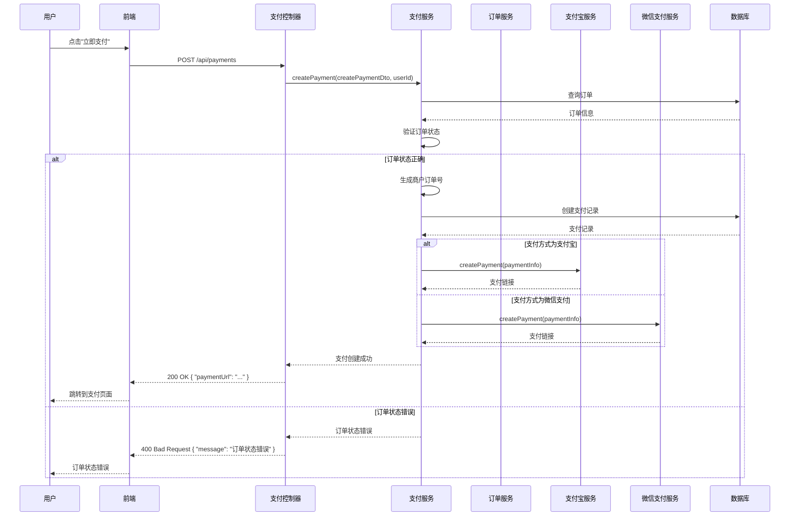
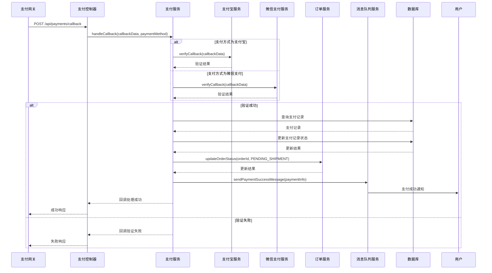
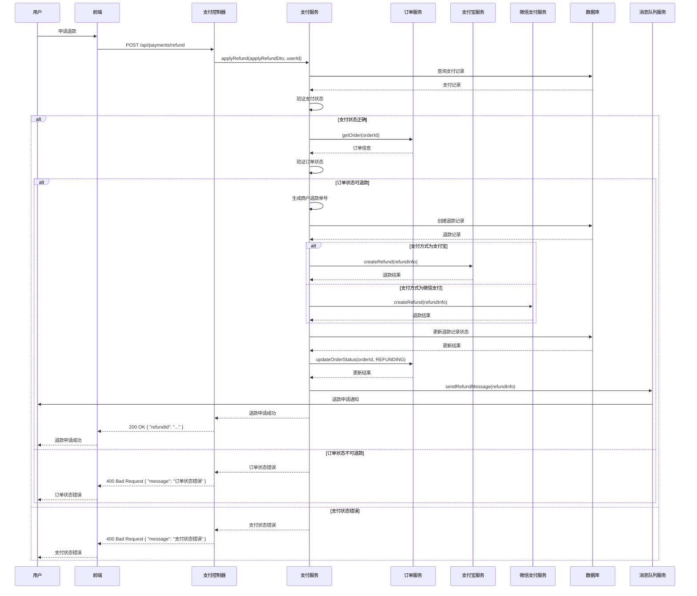

# 支付管理功能

## 1. 功能概述

支付管理功能是电商系统中的核心功能之一，负责处理用户的支付请求、与支付网关的交互、支付结果的处理等。本文档详细描述了 MallEcoAPI 系统中的支付管理功能，包括功能定位、核心价值、技术实现等内容。

### 1.1 功能定位

支付管理功能在电商系统中扮演着以下角色：

- **核心业务流程**：支付管理是电商系统的核心业务流程之一，连接了用户、订单、支付网关等多个系统模块
- **交易安全保障**：确保支付交易的安全性和可靠性
- **用户体验关键**：支付流程的顺畅与否直接影响用户的购物体验
- **资金流转中心**：支付管理是系统中资金流转的中心，涉及订单支付、退款等多个环节

### 1.2 核心价值

- **交易安全**：确保支付交易的安全性，防止交易欺诈
- **支付便捷性**：提供多种支付方式，方便用户选择
- **交易可靠性**：确保支付交易的可靠性，防止交易丢失
- **资金管理**：提供支付交易的记录和管理，方便财务对账
- **系统集成**：实现与多个支付网关的集成，支持多种支付方式

## 2. 功能模块

### 2.1 核心功能

#### 2.1.1 创建支付

**描述**：用户选择支付方式后，系统创建支付记录并生成支付链接

**流程**：
1. 用户在订单页面选择支付方式
2. 点击"立即支付"按钮
3. 前端发送请求到后端
4. 后端验证订单状态
5. 后端创建支付记录
6. 后端调用支付网关 API 生成支付链接
7. 后端返回支付链接
8. 前端跳转到支付页面

**技术实现**：
- **前端**：React 组件，处理用户交互，发送 API 请求
- **后端**：`PaymentController.createPayment()` 方法，处理创建支付的请求
- **服务**：`PaymentService.createPayment()` 方法，实现创建支付的业务逻辑
- **验证**：验证订单状态是否为待付款

**API 接口**：
- `POST /api/payments` - 创建支付

**请求参数**：
```json
{
  "orderId": "1",
  "paymentMethod": "alipay",
  "returnUrl": "https://example.com/pay-return",
  "notifyUrl": "https://example.com/pay-notify"
}
```

**响应参数**：
```json
{
  "code": 200,
  "message": "success",
  "data": {
    "paymentId": "1",
    "orderId": "1",
    "paymentMethod": "alipay",
    "amount": "100.00",
    "paymentUrl": "https://openapi.alipay.com/gateway.do?..."
  }
}
```

#### 2.1.2 处理支付回调

**描述**：支付网关支付完成后，向系统发送回调通知，系统处理回调通知并更新支付状态

**流程**：
1. 用户在支付网关完成支付
2. 支付网关向系统发送回调通知
3. 后端验证回调通知的签名
4. 后端更新支付记录状态
5. 后端更新订单状态
6. 后端返回回调结果

**技术实现**：
- **前端**：无需前端参与，由支付网关直接调用后端接口
- **后端**：`PaymentController.handleCallback()` 方法，处理支付回调
- **服务**：`PaymentService.handleCallback()` 方法，实现处理支付回调的业务逻辑
- **验证**：验证回调通知的签名，确保回调的真实性

**API 接口**：
- `POST /api/payments/callback` - 处理支付回调

**请求参数**：
```json
{
  "out_trade_no": "20260119000001",
  "trade_no": "202601192200123456789012",
  "trade_status": "TRADE_SUCCESS",
  "total_amount": "100.00",
  "sign": "..."
}
```

**响应参数**：
```json
{
  "code": "SUCCESS",
  "message": "成功"
}
```

#### 2.1.3 查询支付状态

**描述**：系统查询支付的状态，用于前端显示支付结果或后端处理超时支付

**流程**：
1. 前端发送请求到后端查询支付状态
2. 后端查询支付记录
3. 后端返回支付状态
4. 前端显示支付结果

**技术实现**：
- **前端**：React 组件，发送 API 请求，显示支付状态
- **后端**：`PaymentController.getPaymentStatus()` 方法，处理查询支付状态的请求
- **服务**：`PaymentService.getPaymentStatus()` 方法，实现查询支付状态的业务逻辑

**API 接口**：
- `GET /api/payments/{paymentId}/status` - 查询支付状态

**响应参数**：
```json
{
  "code": 200,
  "message": "success",
  "data": {
    "paymentId": "1",
    "orderId": "1",
    "status": "paid",
    "amount": "100.00",
    "paymentMethod": "alipay",
    "paidAt": "2026-01-19T12:00:00Z"
  }
}
```

#### 2.1.4 申请退款

**描述**：用户申请退款，系统处理退款请求并与支付网关交互

**流程**：
1. 用户在订单页面申请退款
2. 前端发送请求到后端
3. 后端验证订单状态
4. 后端创建退款记录
5. 后端调用支付网关 API 发起退款
6. 后端返回退款申请结果

**技术实现**：
- **前端**：React 组件，处理用户交互，发送 API 请求
- **后端**：`PaymentController.applyRefund()` 方法，处理申请退款的请求
- **服务**：`PaymentService.applyRefund()` 方法，实现申请退款的业务逻辑
- **验证**：验证订单状态是否可以退款

**API 接口**：
- `POST /api/payments/refund` - 申请退款

**请求参数**：
```json
{
  "paymentId": "1",
  "refundAmount": "100.00",
  "refundReason": "商品质量问题"
}
```

**响应参数**：
```json
{
  "code": 200,
  "message": "success",
  "data": {
    "refundId": "1",
    "paymentId": "1",
    "orderId": "1",
    "refundAmount": "100.00",
    "status": "refunding"
  }
}
```

#### 2.1.5 处理退款回调

**描述**：支付网关退款完成后，向系统发送回调通知，系统处理回调通知并更新退款状态

**流程**：
1. 支付网关处理退款请求
2. 支付网关向系统发送退款回调通知
3. 后端验证回调通知的签名
4. 后端更新退款记录状态
5. 后端更新订单状态
6. 后端返回回调结果

**技术实现**：
- **前端**：无需前端参与，由支付网关直接调用后端接口
- **后端**：`PaymentController.handleRefundCallback()` 方法，处理退款回调
- **服务**：`PaymentService.handleRefundCallback()` 方法，实现处理退款回调的业务逻辑
- **验证**：验证回调通知的签名，确保回调的真实性

**API 接口**：
- `POST /api/payments/refund/callback` - 处理退款回调

**请求参数**：
```json
{
  "out_refund_no": "20260119000001",
  "refund_id": "202601192200123456789012",
  "refund_status": "REFUND_SUCCESS",
  "refund_amount": "100.00",
  "sign": "..."
}
```

**响应参数**：
```json
{
  "code": "SUCCESS",
  "message": "成功"
}
```

#### 2.1.6 查询退款状态

**描述**：系统查询退款的状态，用于前端显示退款结果或后端处理退款超时

**流程**：
1. 前端发送请求到后端查询退款状态
2. 后端查询退款记录
3. 后端返回退款状态
4. 前端显示退款结果

**技术实现**：
- **前端**：React 组件，发送 API 请求，显示退款状态
- **后端**：`PaymentController.getRefundStatus()` 方法，处理查询退款状态的请求
- **服务**：`PaymentService.getRefundStatus()` 方法，实现查询退款状态的业务逻辑

**API 接口**：
- `GET /api/payments/refund/{refundId}/status` - 查询退款状态

**响应参数**：
```json
{
  "code": 200,
  "message": "success",
  "data": {
    "refundId": "1",
    "paymentId": "1",
    "orderId": "1",
    "refundAmount": "100.00",
    "status": "refunded",
    "refundedAt": "2026-01-19T14:00:00Z"
  }
}
```

### 2.2 辅助功能

#### 2.2.1 支付方式管理

**描述**：管理系统支持的支付方式，如支付宝、微信支付等

**流程**：
1. 管理员登录后台管理系统
2. 进入支付方式管理页面
3. 添加、编辑或删除支付方式
4. 后端保存支付方式配置

**技术实现**：
- **前端**：React 组件，处理管理员交互，发送 API 请求
- **后端**：`PaymentMethodController` 类，处理支付方式管理的请求
- **服务**：`PaymentMethodService` 类，实现支付方式管理的业务逻辑

#### 2.2.2 支付记录查询

**描述**：查询用户的支付记录，用于订单管理和财务对账

**流程**：
1. 用户或管理员登录系统
2. 进入支付记录查询页面
3. 输入查询条件，如订单号、支付时间等
4. 后端查询支付记录
5. 前端显示支付记录列表

**技术实现**：
- **前端**：React 组件，处理用户交互，发送 API 请求
- **后端**：`PaymentController.getPaymentList()` 方法，处理查询支付记录的请求
- **服务**：`PaymentService.getPaymentList()` 方法，实现查询支付记录的业务逻辑

#### 2.2.3 退款记录查询

**描述**：查询用户的退款记录，用于订单管理和财务对账

**流程**：
1. 用户或管理员登录系统
2. 进入退款记录查询页面
3. 输入查询条件，如订单号、退款时间等
4. 后端查询退款记录
5. 前端显示退款记录列表

**技术实现**：
- **前端**：React 组件，处理用户交互，发送 API 请求
- **后端**：`PaymentController.getRefundList()` 方法，处理查询退款记录的请求
- **服务**：`PaymentService.getRefundList()` 方法，实现查询退款记录的业务逻辑

## 3. 技术实现

### 3.1 核心组件

#### 3.1.1 支付控制器 (PaymentController)

**描述**：处理支付相关的 HTTP 请求，包括创建支付、处理支付回调、申请退款等

**核心方法**：
- `createPayment()`：创建支付
- `handleCallback()`：处理支付回调
- `getPaymentStatus()`：查询支付状态
- `applyRefund()`：申请退款
- `handleRefundCallback()`：处理退款回调
- `getRefundStatus()`：查询退款状态
- `getPaymentList()`：查询支付记录
- `getRefundList()`：查询退款记录

**代码示例**：
```typescript
@Controller('payments')
export class PaymentController {
  constructor(private readonly paymentService: PaymentService) {}

  @Post()
  async createPayment(@Body() createPaymentDto: CreatePaymentDto, @User() user: User) {
    return this.paymentService.createPayment(createPaymentDto, user.id);
  }

  @Post('callback')
  async handleCallback(@Body() callbackData: any, @Query('paymentMethod') paymentMethod: string) {
    return this.paymentService.handleCallback(callbackData, paymentMethod);
  }

  @Get(':paymentId/status')
  async getPaymentStatus(@Param('paymentId') paymentId: number) {
    return this.paymentService.getPaymentStatus(paymentId);
  }

  @Post('refund')
  async applyRefund(@Body() applyRefundDto: ApplyRefundDto, @User() user: User) {
    return this.paymentService.applyRefund(applyRefundDto, user.id);
  }

  @Post('refund/callback')
  async handleRefundCallback(@Body() callbackData: any, @Query('paymentMethod') paymentMethod: string) {
    return this.paymentService.handleRefundCallback(callbackData, paymentMethod);
  }

  @Get('refund/:refundId/status')
  async getRefundStatus(@Param('refundId') refundId: number) {
    return this.paymentService.getRefundStatus(refundId);
  }

  @Get()
  async getPaymentList(@Query() query: PaymentQueryDto, @User() user: User) {
    return this.paymentService.getPaymentList(query, user.id);
  }

  @Get('refund')
  async getRefundList(@Query() query: RefundQueryDto, @User() user: User) {
    return this.paymentService.getRefundList(query, user.id);
  }
}
```

#### 3.1.2 支付服务 (PaymentService)

**描述**：实现支付相关的业务逻辑，包括创建支付、处理支付回调、申请退款等

**核心方法**：
- `createPayment()`：创建支付
- `handleCallback()`：处理支付回调
- `getPaymentStatus()`：查询支付状态
- `applyRefund()`：申请退款
- `handleRefundCallback()`：处理退款回调
- `getRefundStatus()`：查询退款状态
- `getPaymentList()`：查询支付记录
- `getRefundList()`：查询退款记录

**代码示例**：
```typescript
@Injectable()
export class PaymentService {
  constructor(
    @InjectRepository(PaymentRecord) private readonly paymentRepository: Repository<PaymentRecord>,
    @InjectRepository(RefundRecord) private readonly refundRepository: Repository<RefundRecord>,
    @InjectRepository(Order) private readonly orderRepository: Repository<Order>,
    private readonly orderService: OrderService,
    private readonly alipayService: AlipayService,
    private readonly wechatPayService: WechatPayService,
    private readonly messageQueueService: MessageQueueService,
  ) {}

  async createPayment(createPaymentDto: CreatePaymentDto, userId: number) {
    // 查询订单
    const order = await this.orderRepository.findOne({
      where: { id: createPaymentDto.orderId, userId },
    });
    if (!order) {
      throw new BadRequestException('订单不存在');
    }

    // 验证订单状态
    if (order.orderStatus !== OrderStatus.PENDING_PAYMENT) {
      throw new BadRequestException('订单状态错误');
    }

    // 生成商户订单号
    const outTradeNo = `PAY${Date.now()}${Math.floor(Math.random() * 10000)}`;

    // 创建支付记录
    const payment = this.paymentRepository.create({
      orderId: order.id,
      orderSn: order.orderSn,
      outTradeNo,
      amount: order.actualAmount,
      currency: 'CNY',
      paymentMethod: createPaymentDto.paymentMethod,
      paymentMethodName: this.getPaymentMethodName(createPaymentDto.paymentMethod),
      status: PaymentStatus.PENDING,
      returnUrl: createPaymentDto.returnUrl,
      notifyUrl: createPaymentDto.notifyUrl,
    });
    await this.paymentRepository.save(payment);

    // 根据支付方式生成支付链接
    let paymentUrl: string;
    if (createPaymentDto.paymentMethod === 'alipay') {
      paymentUrl = await this.alipayService.createPayment({
        outTradeNo,
        totalAmount: order.actualAmount.toString(),
        subject: `订单 ${order.orderSn}`,
        returnUrl: createPaymentDto.returnUrl,
        notifyUrl: createPaymentDto.notifyUrl,
      });
    } else if (createPaymentDto.paymentMethod === 'wechat') {
      paymentUrl = await this.wechatPayService.createPayment({
        outTradeNo,
        totalFee: Math.round(order.actualAmount * 100), // 微信支付单位为分
        body: `订单 ${order.orderSn}`,
        notifyUrl: createPaymentDto.notifyUrl,
      });
    } else {
      throw new BadRequestException('不支持的支付方式');
    }

    return {
      paymentId: payment.id,
      orderId: payment.orderId,
      paymentMethod: payment.paymentMethod,
      amount: payment.amount,
      paymentUrl,
    };
  }

  async handleCallback(callbackData: any, paymentMethod: string) {
    let payment: PaymentRecord;
    let isSuccess = false;

    try {
      // 验证回调数据
      if (paymentMethod === 'alipay') {
        isSuccess = await this.alipayService.verifyCallback(callbackData);
        if (isSuccess) {
          const outTradeNo = callbackData.out_trade_no;
          payment = await this.paymentRepository.findOne({
            where: { outTradeNo },
          });
          if (payment) {
            payment.transactionId = callbackData.trade_no;
            payment.status = PaymentStatus.PAID;
            payment.paidAt = new Date();
            payment.callbackData = JSON.stringify(callbackData);
            await this.paymentRepository.save(payment);
          }
        }
      } else if (paymentMethod === 'wechat') {
        isSuccess = await this.wechatPayService.verifyCallback(callbackData);
        if (isSuccess) {
          const outTradeNo = callbackData.out_trade_no;
          payment = await this.paymentRepository.findOne({
            where: { outTradeNo },
          });
          if (payment) {
            payment.transactionId = callbackData.transaction_id;
            payment.status = PaymentStatus.PAID;
            payment.paidAt = new Date();
            payment.callbackData = JSON.stringify(callbackData);
            await this.paymentRepository.save(payment);
          }
        }
      }

      // 处理支付成功逻辑
      if (isSuccess && payment) {
        // 更新订单状态
        await this.orderService.updateOrderStatus(payment.orderId, OrderStatus.PENDING_SHIPMENT);
        // 发送支付成功消息
        await this.messageQueueService.sendPaymentSuccessMessage({
          orderId: payment.orderId,
          paymentId: payment.id,
        });
      }

      // 返回回调结果
      if (paymentMethod === 'alipay') {
        return isSuccess ? { code: 'SUCCESS', message: '成功' } : { code: 'FAIL', message: '失败' };
      } else if (paymentMethod === 'wechat') {
        return isSuccess ? '<xml><return_code><![CDATA[SUCCESS]]></return_code><return_msg><![CDATA[OK]]></return_msg></xml>' : '<xml><return_code><![CDATA[FAIL]]></return_code><return_msg><![CDATA[FAIL]]></return_msg></xml>';
      }
    } catch (error) {
      console.error('支付回调处理失败:', error);
      if (paymentMethod === 'alipay') {
        return { code: 'FAIL', message: '失败' };
      } else if (paymentMethod === 'wechat') {
        return '<xml><return_code><![CDATA[FAIL]]></return_code><return_msg><![CDATA[FAIL]]></return_msg></xml>';
      }
    }
  }

  // 其他方法实现...

  private getPaymentMethodName(paymentMethod: string): string {
    const methodMap = {
      alipay: '支付宝',
      wechat: '微信支付',
    };
    return methodMap[paymentMethod] || paymentMethod;
  }
}
```

#### 3.1.3 支付记录实体 (PaymentRecord)

**描述**：支付记录实体，存储支付交易的详细信息

**核心字段**：
- `id`：支付记录 ID
- `orderId`：订单 ID
- `orderSn`：订单编号
- `outTradeNo`：商户订单号
- `transactionId`：支付平台交易号
- `amount`：支付金额
- `currency`：货币类型
- `paymentMethod`：支付方式
- `paymentMethodName`：支付方式名称
- `status`：支付状态
- `returnUrl`：返回地址
- `notifyUrl`：通知地址
- `callbackData`：回调数据
- `createdAt`：创建时间
- `updatedAt`：更新时间
- `paidAt`：支付时间

**代码示例**：
```typescript
@Entity('payment_record')
export class PaymentRecord {
  @PrimaryGeneratedColumn()
  id: number;

  @Column()
  orderId: number;

  @Column()
  orderSn: string;

  @Column()
  outTradeNo: string;

  @Column({ nullable: true })
  transactionId: string;

  @Column({ type: 'decimal', precision: 10, scale: 2 })
  amount: number;

  @Column()
  currency: string;

  @Column()
  paymentMethod: string;

  @Column()
  paymentMethodName: string;

  @Column()
  status: string;

  @Column({ nullable: true })
  returnUrl: string;

  @Column({ nullable: true })
  notifyUrl: string;

  @Column({ type: 'text', nullable: true })
  callbackData: string;

  @CreateDateColumn()
  createdAt: Date;

  @UpdateDateColumn()
  updatedAt: Date;

  @Column({ nullable: true })
  paidAt: Date;

  // 关联关系
  @ManyToOne(() => Order, order => order.payments)
  order: Order;

  @OneToMany(() => RefundRecord, refund => refund.payment)
  refunds: RefundRecord[];
}
```

#### 3.1.4 退款记录实体 (RefundRecord)

**描述**：退款记录实体，存储退款交易的详细信息

**核心字段**：
- `id`：退款记录 ID
- `paymentId`：支付记录 ID
- `orderId`：订单 ID
- `outRefundNo`：商户退款单号
- `refundId`：支付平台退款单号
- `refundAmount`：退款金额
- `totalAmount`：订单总金额
- `currency`：货币类型
- `refundReason`：退款原因
- `status`：退款状态
- `callbackData`：回调数据
- `createdAt`：创建时间
- `updatedAt`：更新时间
- `refundedAt`：退款成功时间

**代码示例**：
```typescript
@Entity('refund_record')
export class RefundRecord {
  @PrimaryGeneratedColumn()
  id: number;

  @Column()
  paymentId: number;

  @Column()
  orderId: number;

  @Column()
  outRefundNo: string;

  @Column({ nullable: true })
  refundId: string;

  @Column({ type: 'decimal', precision: 10, scale: 2 })
  refundAmount: number;

  @Column({ type: 'decimal', precision: 10, scale: 2 })
  totalAmount: number;

  @Column()
  currency: string;

  @Column()
  refundReason: string;

  @Column()
  status: string;

  @Column({ type: 'text', nullable: true })
  callbackData: string;

  @CreateDateColumn()
  createdAt: Date;

  @UpdateDateColumn()
  updatedAt: Date;

  @Column({ nullable: true })
  refundedAt: Date;

  // 关联关系
  @ManyToOne(() => PaymentRecord, payment => payment.refunds)
  payment: PaymentRecord;

  @ManyToOne(() => Order, order => order.refunds)
  order: Order;
}
```

### 3.2 技术栈

| 技术 | 版本 | 用途 |
|------|------|------|
| NestJS | 9.0.0 | 后端框架 |
| TypeScript | 4.9.0 | 开发语言 |
| TypeORM | 0.3.0 | ORM 框架 |
| MySQL | 8.0.0 | 数据库 |
| Redis | 7.0.0 | 缓存 |
| Alipay SDK | 4.0.0 | 支付宝支付集成 |
| WeChat Pay SDK | 3.0.0 | 微信支付集成 |
| RabbitMQ | 3.10.0 | 消息队列 |

### 3.3 数据结构

#### 3.3.1 支付 DTO

**CreatePaymentDto**：
```typescript
export class CreatePaymentDto {
  @IsNotEmpty()
  orderId: number;

  @IsNotEmpty()
  paymentMethod: string;

  @IsOptional()
  returnUrl?: string;

  @IsOptional()
  notifyUrl?: string;
}
```

**ApplyRefundDto**：
```typescript
export class ApplyRefundDto {
  @IsNotEmpty()
  paymentId: number;

  @IsNotEmpty()
  @Min(0.01)
  refundAmount: number;

  @IsNotEmpty()
  refundReason: string;
}
```

**PaymentQueryDto**：
```typescript
export class PaymentQueryDto {
  @IsOptional()
  orderSn?: string;

  @IsOptional()
  paymentMethod?: string;

  @IsOptional()
  status?: string;

  @IsOptional()
  startDate?: string;

  @IsOptional()
  endDate?: string;

  @IsOptional()
  @Min(1)
  page?: number;

  @IsOptional()
  @Min(1)
  @Max(100)
  pageSize?: number;
}
```

**RefundQueryDto**：
```typescript
export class RefundQueryDto {
  @IsOptional()
  orderSn?: string;

  @IsOptional()
  paymentMethod?: string;

  @IsOptional()
  status?: string;

  @IsOptional()
  startDate?: string;

  @IsOptional()
  endDate?: string;

  @IsOptional()
  @Min(1)
  page?: number;

  @IsOptional()
  @Min(1)
  @Max(100)
  pageSize?: number;
}
```

#### 3.3.2 支付响应结构

**创建支付响应**：
```typescript
export class CreatePaymentResponse {
  code: number;
  message: string;
  data: {
    paymentId: number;
    orderId: number;
    paymentMethod: string;
    amount: number;
    paymentUrl: string;
  };
}
```

**支付状态响应**：
```typescript
export class PaymentStatusResponse {
  code: number;
  message: string;
  data: {
    paymentId: number;
    orderId: number;
    status: string;
    amount: number;
    paymentMethod: string;
    paidAt?: string;
  };
}
```

**申请退款响应**：
```typescript
export class ApplyRefundResponse {
  code: number;
  message: string;
  data: {
    refundId: number;
    paymentId: number;
    orderId: number;
    refundAmount: number;
    status: string;
  };
}
```

**退款状态响应**：
```typescript
export class RefundStatusResponse {
  code: number;
  message: string;
  data: {
    refundId: number;
    paymentId: number;
    orderId: number;
    refundAmount: number;
    status: string;
    refundedAt?: string;
  };
}
```

## 4. 业务流程

### 4.1 支付创建流程



### 4.2 支付回调处理流程



### 4.3 退款处理流程



## 5. 技术实现要点

### 5.1 安全性考虑

1. **签名验证**：对支付网关的回调通知进行签名验证，确保回调的真实性
2. **数据加密**：对敏感支付数据进行加密存储，如支付凭证等
3. **防重放攻击**：使用唯一的商户订单号和时间戳，防止重放攻击
4. **权限控制**：对支付相关的 API 接口进行权限控制，确保只有授权用户才能访问
5. **日志记录**：详细记录支付交易的日志，便于审计和问题定位

### 5.2 可靠性保障

1. **事务管理**：使用事务管理，确保支付记录和订单状态更新的原子性
2. **消息队列**：使用消息队列处理支付结果通知，提高系统的可靠性
3. **重试机制**：对支付网关的调用实现重试机制，处理网络异常等情况
4. **幂等性设计**：设计幂等性接口，防止重复处理支付回调
5. **超时处理**：实现支付超时处理机制，处理用户未及时支付的情况

### 5.3 性能优化

1. **缓存策略**：使用缓存存储支付相关的配置信息，减少数据库查询
2. **异步处理**：使用异步处理支付回调和通知，提高系统的响应速度
3. **批量操作**：批量处理支付记录的查询和统计，提高系统性能
4. **数据库索引**：为支付记录和退款记录的关键字段添加索引，提高查询速度

## 6. 功能使用指南

### 6.1 前端使用

1. **创建支付**：
   - 在订单页面，选择支付方式，点击"立即支付"按钮
   - 前端发送 POST 请求到 `/api/payments` 接口
   - 后端返回支付链接，前端跳转到支付页面

2. **查询支付状态**：
   - 在支付完成后，前端可以发送 GET 请求到 `/api/payments/{paymentId}/status` 接口查询支付状态
   - 后端返回支付状态，前端显示支付结果

3. **申请退款**：
   - 在订单页面，点击"申请退款"按钮
   - 前端发送 POST 请求到 `/api/payments/refund` 接口
   - 后端返回退款申请结果，前端显示退款状态

4. **查询退款状态**：
   - 在退款申请后，前端可以发送 GET 请求到 `/api/payments/refund/{refundId}/status` 接口查询退款状态
   - 后端返回退款状态，前端显示退款结果

### 6.2 后端调用

1. **创建支付**：
   ```typescript
   const result = await paymentService.createPayment({
     orderId: 1,
     paymentMethod: 'alipay',
     returnUrl: 'https://example.com/pay-return',
     notifyUrl: 'https://example.com/pay-notify',
   }, userId);
   ```

2. **处理支付回调**：
   ```typescript
   const result = await paymentService.handleCallback(callbackData, 'alipay');
   ```

3. **申请退款**：
   ```typescript
   const result = await paymentService.applyRefund({
     paymentId: 1,
     refundAmount: 100.00,
     refundReason: '商品质量问题',
   }, userId);
   ```

4. **处理退款回调**：
   ```typescript
   const result = await paymentService.handleRefundCallback(callbackData, 'alipay');
   ```

5. **查询支付记录**：
   ```typescript
   const result = await paymentService.getPaymentList({
     orderSn: '20260119000001',
     page: 1,
     pageSize: 10,
   }, userId);
   ```

## 7. 总结与展望

### 7.1 功能优势

- **安全性高**：实现了支付交易的安全验证和加密存储
- **可靠性强**：使用事务管理和消息队列，确保支付交易的可靠性
- **集成性好**：集成了支付宝和微信支付等多种支付方式
- **用户体验佳**：提供流畅的支付流程，支持多种支付方式
- **可扩展性强**：模块化设计，便于添加新的支付方式

### 7.2 改进空间

- **支付方式扩展**：支持更多支付方式，如银联、PayPal 等
- **支付体验优化**：优化支付流程，减少用户操作步骤
- **风控系统**：添加支付风控系统，防止交易欺诈
- **国际化支持**：支持国际化支付，如外币支付、跨境支付等

### 7.3 未来规划

- **版本 1.1**：添加更多支付方式，如银联、PayPal 等
- **版本 1.2**：优化支付流程，减少用户操作步骤
- **版本 1.3**：添加支付风控系统，防止交易欺诈
- **版本 1.4**：支持国际化支付，如外币支付、跨境支付等
- **版本 2.0**：重构支付系统，采用更先进的技术架构，支持更多业务场景

## 8. 附录

### 8.1 相关接口

| 接口路径 | 方法 | 描述 |
|----------|------|------|
| `/api/payments` | POST | 创建支付 |
| `/api/payments/callback` | POST | 处理支付回调 |
| `/api/payments/{paymentId}/status` | GET | 查询支付状态 |
| `/api/payments/refund` | POST | 申请退款 |
| `/api/payments/refund/callback` | POST | 处理退款回调 |
| `/api/payments/refund/{refundId}/status` | GET | 查询退款状态 |
| `/api/payments` | GET | 查询支付记录 |
| `/api/payments/refund` | GET | 查询退款记录 |

### 8.2 相关组件

| 组件名称 | 描述 | 模块 |
|----------|------|------|
| `PaymentController` | 处理支付相关的 HTTP 请求 | 支付模块 |
| `PaymentService` | 实现支付相关的业务逻辑 | 支付模块 |
| `AlipayService` | 处理支付宝支付相关的业务逻辑 | 支付模块 |
| `WechatPayService` | 处理微信支付相关的业务逻辑 | 支付模块 |
| `PaymentRecord` | 支付记录实体 | 支付模块 |
| `RefundRecord` | 退款记录实体 | 支付模块 |
| `OrderService` | 处理订单相关的业务逻辑 | 订单模块 |
| `MessageQueueService` | 提供消息队列服务 | 消息队列模块 |

### 8.3 参考资源

- **工具**：
  - Postman：用于测试支付相关接口
  - Alipay 开放平台：用于支付宝支付集成
  - 微信支付商户平台：用于微信支付集成

- **文档**：
  - [NestJS 官方文档](https://docs.nestjs.com/)
  - [TypeORM 文档](https://typeorm.io/)
  - [支付宝开放平台文档](https://opendocs.alipay.com/open/)
  - [微信支付开发文档](https://pay.weixin.qq.com/wiki/doc/api/)

- **书籍**：
  - 《电商系统架构设计与实践》
  - 《支付系统设计与实践》
  - 《NestJS 实战》

---

**文档更新时间**：2026-01-19
**文档版本**：v1.0.0
**作者**：MallEco 开发团队
