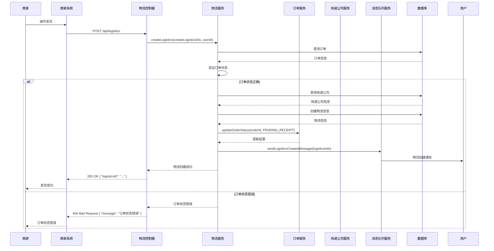
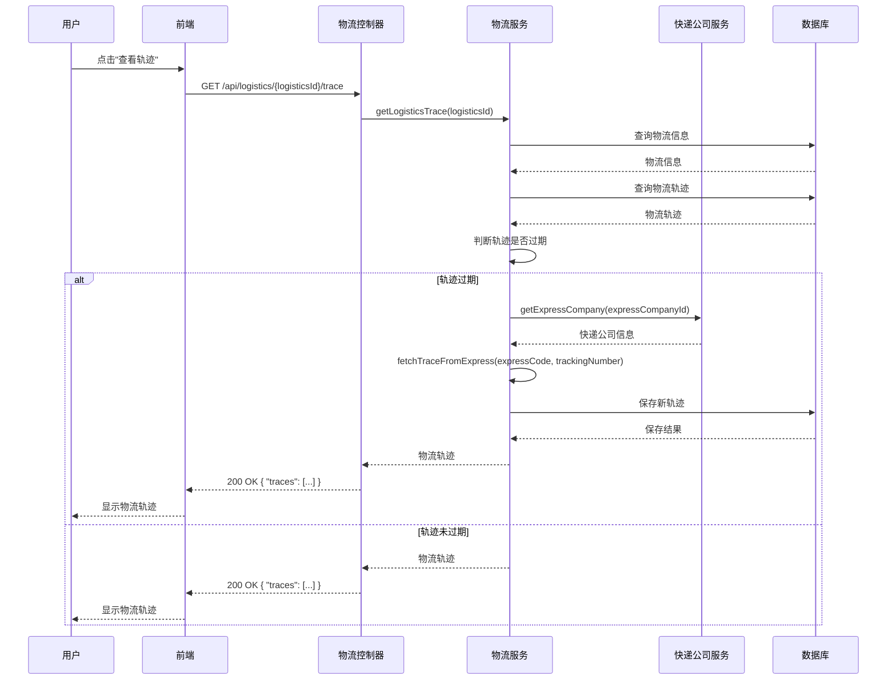
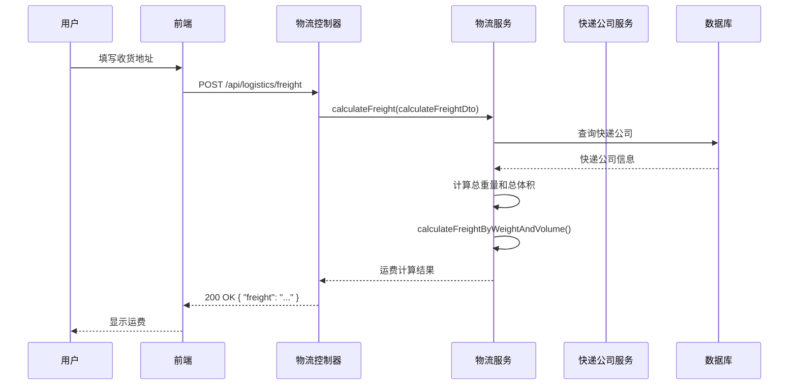
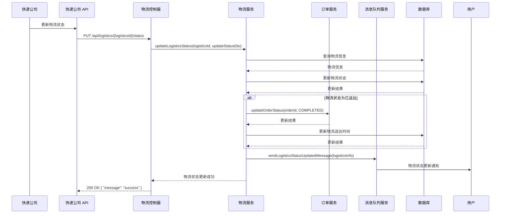

# 物流管理功能

## 1. 功能概述

物流管理功能是电商系统中的重要功能之一，负责处理订单的物流信息、与快递公司的交互、物流轨迹的跟踪等。本文档详细描述了 MallEcoAPI 系统中的物流管理功能，包括功能定位、核心价值、技术实现等内容。

### 1.1 功能定位

物流管理功能在电商系统中扮演着以下角色：

- **核心业务流程**：物流管理是电商系统的核心业务流程之一，连接了订单、用户、快递公司等多个系统模块
- **用户体验关键**：物流管理的顺畅与否直接影响用户的购物体验，用户期望能够实时跟踪物流状态
- **业务逻辑集成**：物流管理集成了多个业务逻辑，如运费计算、物流轨迹跟踪、状态更新等
- **数据流转中心**：物流管理是系统中数据流转的重要环节，涉及订单、物流信息、快递公司等多个数据实体

### 1.2 核心价值

- **物流可视化**：提供实时的物流跟踪信息，让用户能够可视化物流状态
- **配送效率**：优化物流配送流程，提高配送效率
- **成本控制**：通过运费计算和物流路径优化，控制物流成本
- **服务质量**：提高物流服务质量，增强用户满意度
- **系统集成**：实现与多个快递公司的集成，支持多种物流方式

## 2. 功能模块

### 2.1 核心功能

#### 2.1.1 创建物流信息

**描述**：商家发货后，系统创建物流信息并生成运单号

**流程**：
1. 商家在订单管理页面操作发货
2. 选择快递公司和填写运单号
3. 点击"确认发货"按钮
4. 前端发送请求到后端
5. 后端验证订单状态
6. 后端创建物流信息
7. 后端更新订单状态为待收货
8. 后端返回物流信息
9. 前端显示发货成功

**技术实现**：
- **前端**：React 组件，处理商家交互，发送 API 请求
- **后端**：`LogisticsController.createLogistics()` 方法，处理创建物流信息的请求
- **服务**：`LogisticsService.createLogistics()` 方法，实现创建物流信息的业务逻辑
- **验证**：验证订单状态是否为待发货

**API 接口**：
- `POST /api/logistics` - 创建物流信息

**请求参数**：
```json
{
  "orderId": "1",
  "expressCompanyId": "1",
  "trackingNumber": "SF1234567890",
  "freight": "10.00",
  "senderName": "商家名称",
  "senderMobile": "13800138000",
  "senderAddress": "北京市朝阳区"
}
```

**响应参数**：
```json
{
  "code": 200,
  "message": "success",
  "data": {
    "logisticsId": "1",
    "orderId": "1",
    "expressCompanyId": "1",
    "expressCompanyName": "顺丰速运",
    "trackingNumber": "SF1234567890",
    "status": "1",
    "freight": "10.00"
  }
}
```

#### 2.1.2 更新物流信息

**描述**：商家可以更新物流信息，如修改运单号、快递公司等

**流程**：
1. 商家在订单管理页面找到已发货的订单
2. 点击"修改物流信息"按钮
3. 修改快递公司或运单号
4. 点击"确认修改"按钮
5. 前端发送请求到后端
6. 后端验证物流状态
7. 后端更新物流信息
8. 后端返回更新结果
9. 前端显示修改成功

**技术实现**：
- **前端**：React 组件，处理商家交互，发送 API 请求
- **后端**：`LogisticsController.updateLogistics()` 方法，处理更新物流信息的请求
- **服务**：`LogisticsService.updateLogistics()` 方法，实现更新物流信息的业务逻辑
- **验证**：验证物流状态是否允许修改

**API 接口**：
- `PUT /api/logistics/{logisticsId}` - 更新物流信息

**请求参数**：
```json
{
  "expressCompanyId": "2",
  "trackingNumber": "YT9876543210",
  "freight": "8.00"
}
```

**响应参数**：
```json
{
  "code": 200,
  "message": "success",
  "data": {
    "logisticsId": "1",
    "orderId": "1",
    "expressCompanyId": "2",
    "expressCompanyName": "圆通速递",
    "trackingNumber": "YT9876543210",
    "status": "1",
    "freight": "8.00"
  }
}
```

#### 2.1.3 获取物流信息

**描述**：用户可以获取订单的物流信息，包括物流公司、运单号、物流状态等

**流程**：
1. 用户在订单详情页面点击"查看物流"
2. 前端发送请求到后端
3. 后端查询物流信息
4. 后端返回物流信息
5. 前端显示物流信息

**技术实现**：
- **前端**：React 组件，处理用户交互，发送 API 请求
- **后端**：`LogisticsController.getLogistics()` 方法，处理获取物流信息的请求
- **服务**：`LogisticsService.getLogistics()` 方法，实现获取物流信息的业务逻辑

**API 接口**：
- `GET /api/logistics/{logisticsId}` - 获取物流信息

**响应参数**：
```json
{
  "code": 200,
  "message": "success",
  "data": {
    "logisticsId": "1",
    "orderId": "1",
    "expressCompanyId": "1",
    "expressCompanyName": "顺丰速运",
    "expressCompanyCode": "SF",
    "trackingNumber": "SF1234567890",
    "status": "2",
    "statusText": "在途中",
    "freight": "10.00",
    "estimatedDays": "2",
    "senderName": "商家名称",
    "senderMobile": "13800138000",
    "senderAddress": "北京市朝阳区",
    "receiverName": "张三",
    "receiverMobile": "13900139000",
    "receiverAddress": "上海市浦东新区",
    "createdAt": "2026-01-19T10:00:00Z",
    "updatedAt": "2026-01-19T12:00:00Z",
    "shippedAt": "2026-01-19T10:00:00Z"
  }
}
```

#### 2.1.4 获取物流轨迹

**描述**：用户可以获取物流的详细轨迹信息，包括每个节点的时间、地点、描述等

**流程**：
1. 用户在物流信息页面点击"查看轨迹"
2. 前端发送请求到后端
3. 后端查询物流轨迹
4. 后端返回物流轨迹
5. 前端显示物流轨迹

**技术实现**：
- **前端**：React 组件，处理用户交互，发送 API 请求
- **后端**：`LogisticsController.getLogisticsTrace()` 方法，处理获取物流轨迹的请求
- **服务**：`LogisticsService.getLogisticsTrace()` 方法，实现获取物流轨迹的业务逻辑

**API 接口**：
- `GET /api/logistics/{logisticsId}/trace` - 获取物流轨迹

**响应参数**：
```json
{
  "code": 200,
  "message": "success",
  "data": [
    {
      "time": "2026-01-19T10:00:00Z",
      "location": "北京市朝阳区",
      "description": "快递已揽收"
    },
    {
      "time": "2026-01-19T12:00:00Z",
      "location": "北京市顺义区",
      "description": "快递已发出"
    },
    {
      "time": "2026-01-19T18:00:00Z",
      "location": "上海市虹桥机场",
      "description": "快递已到达"
    }
  ]
}
```

#### 2.1.5 计算运费

**描述**：用户在下单前可以计算运费，根据收货地址和商品重量/体积计算

**流程**：
1. 用户在购物车页面填写收货地址
2. 前端发送请求到后端
3. 后端获取商品信息
4. 后端计算运费
5. 后端返回运费
6. 前端显示运费

**技术实现**：
- **前端**：React 组件，处理用户交互，发送 API 请求
- **后端**：`LogisticsController.calculateFreight()` 方法，处理计算运费的请求
- **服务**：`LogisticsService.calculateFreight()` 方法，实现计算运费的业务逻辑

**API 接口**：
- `POST /api/logistics/freight` - 计算运费

**请求参数**：
```json
{
  "expressCompanyId": "1",
  "fromAddress": "北京市朝阳区",
  "toAddress": "上海市浦东新区",
  "goodsList": [
    {
      "id": "1",
      "weight": "0.5",
      "volume": "0.01"
    },
    {
      "id": "2",
      "weight": "1.0",
      "volume": "0.02"
    }
  ]
}
```

**响应参数**：
```json
{
  "code": 200,
  "message": "success",
  "data": {
    "expressCompanyId": "1",
    "expressCompanyName": "顺丰速运",
    "freight": "15.00",
    "estimatedDays": "2"
  }
}
```

#### 2.1.6 更新物流状态

**描述**：系统通过定时任务或快递公司回调更新物流状态

**流程**：
1. 快递公司更新物流状态
2. 快递公司通过 API 回调或系统定时同步
3. 后端接收物流状态更新
4. 后端更新物流信息
5. 后端更新订单状态
6. 后端通知用户

**技术实现**：
- **前端**：无需前端参与，由系统自动处理
- **后端**：`LogisticsController.updateLogisticsStatus()` 方法，处理更新物流状态的请求
- **服务**：`LogisticsService.updateLogisticsStatus()` 方法，实现更新物流状态的业务逻辑

**API 接口**：
- `PUT /api/logistics/{logisticsId}/status` - 更新物流状态

**请求参数**：
```json
{
  "status": "3",
  "statusText": "派送中"
}
```

**响应参数**：
```json
{
  "code": 200,
  "message": "success",
  "data": {
    "logisticsId": "1",
    "orderId": "1",
    "status": "3",
    "statusText": "派送中"
  }
}
```

### 2.2 辅助功能

#### 2.2.1 快递公司管理

**描述**：管理系统支持的快递公司，包括添加、编辑、删除快递公司信息

**流程**：
1. 管理员登录后台管理系统
2. 进入快递公司管理页面
3. 添加、编辑或删除快递公司
4. 后端保存快递公司信息

**技术实现**：
- **前端**：React 组件，处理管理员交互，发送 API 请求
- **后端**：`ExpressCompanyController` 类，处理快递公司管理的请求
- **服务**：`ExpressCompanyService` 类，实现快递公司管理的业务逻辑

#### 2.2.2 物流记录查询

**描述**：查询系统中的物流记录，用于订单管理和物流分析

**流程**：
1. 管理员登录后台管理系统
2. 进入物流记录查询页面
3. 输入查询条件，如订单号、运单号等
4. 后端查询物流记录
5. 前端显示物流记录列表

**技术实现**：
- **前端**：React 组件，处理管理员交互，发送 API 请求
- **后端**：`LogisticsController.getLogisticsList()` 方法，处理查询物流记录的请求
- **服务**：`LogisticsService.getLogisticsList()` 方法，实现查询物流记录的业务逻辑

#### 2.2.3 物流统计分析

**描述**：统计分析系统中的物流数据，如配送时效、快递公司 performance 等

**流程**：
1. 管理员登录后台管理系统
2. 进入物流统计分析页面
3. 选择统计维度和时间范围
4. 后端统计分析物流数据
5. 前端显示统计分析结果

**技术实现**：
- **前端**：React 组件，处理管理员交互，发送 API 请求
- **后端**：`LogisticsController.getLogisticsStatistics()` 方法，处理统计分析物流数据的请求
- **服务**：`LogisticsService.getLogisticsStatistics()` 方法，实现统计分析物流数据的业务逻辑

## 3. 技术实现

### 3.1 核心组件

#### 3.1.1 物流控制器 (LogisticsController)

**描述**：处理物流相关的 HTTP 请求，包括创建物流信息、获取物流轨迹、计算运费等

**核心方法**：
- `createLogistics()`：创建物流信息
- `updateLogistics()`：更新物流信息
- `getLogistics()`：获取物流信息
- `getLogisticsTrace()`：获取物流轨迹
- `calculateFreight()`：计算运费
- `updateLogisticsStatus()`：更新物流状态
- `getLogisticsList()`：查询物流记录
- `getLogisticsStatistics()`：统计分析物流数据

**代码示例**：
```typescript
@Controller('logistics')
export class LogisticsController {
  constructor(private readonly logisticsService: LogisticsService) {}

  @Post()
  async createLogistics(@Body() createLogisticsDto: CreateLogisticsDto, @User() user: User) {
    return this.logisticsService.createLogistics(createLogisticsDto, user.id);
  }

  @Put(':logisticsId')
  async updateLogistics(@Param('logisticsId') logisticsId: number, @Body() updateLogisticsDto: UpdateLogisticsDto, @User() user: User) {
    return this.logisticsService.updateLogistics(logisticsId, updateLogisticsDto, user.id);
  }

  @Get(':logisticsId')
  async getLogistics(@Param('logisticsId') logisticsId: number) {
    return this.logisticsService.getLogistics(logisticsId);
  }

  @Get(':logisticsId/trace')
  async getLogisticsTrace(@Param('logisticsId') logisticsId: number) {
    return this.logisticsService.getLogisticsTrace(logisticsId);
  }

  @Post('freight')
  async calculateFreight(@Body() calculateFreightDto: CalculateFreightDto) {
    return this.logisticsService.calculateFreight(calculateFreightDto);
  }

  @Put(':logisticsId/status')
  async updateLogisticsStatus(@Param('logisticsId') logisticsId: number, @Body() updateStatusDto: UpdateStatusDto) {
    return this.logisticsService.updateLogisticsStatus(logisticsId, updateStatusDto);
  }

  @Get()
  async getLogisticsList(@Query() query: LogisticsQueryDto, @User() user: User) {
    return this.logisticsService.getLogisticsList(query, user.id);
  }

  @Get('statistics')
  async getLogisticsStatistics(@Query() query: StatisticsQueryDto, @User() user: User) {
    return this.logisticsService.getLogisticsStatistics(query, user.id);
  }
}
```

#### 3.1.2 物流服务 (LogisticsService)

**描述**：实现物流相关的业务逻辑，包括创建物流信息、获取物流轨迹、计算运费等

**核心方法**：
- `createLogistics()`：创建物流信息
- `updateLogistics()`：更新物流信息
- `getLogistics()`：获取物流信息
- `getLogisticsTrace()`：获取物流轨迹
- `calculateFreight()`：计算运费
- `updateLogisticsStatus()`：更新物流状态
- `getLogisticsList()`：查询物流记录
- `getLogisticsStatistics()`：统计分析物流数据
- `syncLogisticsStatus()`：同步物流状态

**代码示例**：
```typescript
@Injectable()
export class LogisticsService {
  constructor(
    @InjectRepository(LogisticsInfo) private readonly logisticsRepository: Repository<LogisticsInfo>,
    @InjectRepository(LogisticsTrace) private readonly logisticsTraceRepository: Repository<LogisticsTrace>,
    @InjectRepository(ExpressCompany) private readonly expressCompanyRepository: Repository<ExpressCompany>,
    @InjectRepository(Order) private readonly orderRepository: Repository<Order>,
    private readonly orderService: OrderService,
    private readonly messageQueueService: MessageQueueService,
  ) {}

  async createLogistics(createLogisticsDto: CreateLogisticsDto, userId: number) {
    // 查询订单
    const order = await this.orderRepository.findOne({
      where: { id: createLogisticsDto.orderId },
    });
    if (!order) {
      throw new BadRequestException('订单不存在');
    }

    // 验证订单状态
    if (order.orderStatus !== OrderStatus.PENDING_SHIPMENT) {
      throw new BadRequestException('订单状态错误');
    }

    // 查询快递公司
    const expressCompany = await this.expressCompanyRepository.findOne({
      where: { id: createLogisticsDto.expressCompanyId },
    });
    if (!expressCompany) {
      throw new BadRequestException('快递公司不存在');
    }

    // 创建物流信息
    const logistics = this.logisticsRepository.create({
      orderId: createLogisticsDto.orderId,
      expressCompanyId: createLogisticsDto.expressCompanyId,
      expressCompanyName: expressCompany.name,
      expressCompanyCode: expressCompany.code,
      trackingNumber: createLogisticsDto.trackingNumber,
      status: LogisticsStatus.SHIPPED,
      statusText: '已发货',
      freight: createLogisticsDto.freight,
      estimatedDays: expressCompany.estimatedDays,
      senderName: createLogisticsDto.senderName,
      senderMobile: createLogisticsDto.senderMobile,
      senderAddress: createLogisticsDto.senderAddress,
      receiverName: order.consignee,
      receiverMobile: order.mobile,
      receiverAddress: order.address,
      shippedAt: new Date(),
    });
    await this.logisticsRepository.save(logistics);

    // 更新订单状态
    await this.orderService.updateOrderStatus(createLogisticsDto.orderId, OrderStatus.PENDING_RECEIPT);

    // 发送物流创建消息
    await this.messageQueueService.sendLogisticsCreatedMessage({
      orderId: logistics.orderId,
      logisticsId: logistics.id,
      trackingNumber: logistics.trackingNumber,
      expressCompanyName: logistics.expressCompanyName,
    });

    return {
      logisticsId: logistics.id,
      orderId: logistics.orderId,
      expressCompanyId: logistics.expressCompanyId,
      expressCompanyName: logistics.expressCompanyName,
      trackingNumber: logistics.trackingNumber,
      status: logistics.status,
      freight: logistics.freight,
    };
  }

  async getLogisticsTrace(logisticsId: number) {
    // 查询物流信息
    const logistics = await this.logisticsRepository.findOne({
      where: { id: logisticsId },
    });
    if (!logistics) {
      throw new BadRequestException('物流信息不存在');
    }

    // 查询物流轨迹
    const traces = await this.logisticsTraceRepository.find({
      where: { logisticsId },
      order: { time: 'DESC' },
    });

    // 如果没有轨迹或轨迹较旧，从快递公司 API 获取
    if (traces.length === 0 || this.isTraceOutdated(traces[0].time)) {
      // 调用快递公司 API 获取轨迹
      const expressCompany = await this.expressCompanyRepository.findOne({
        where: { id: logistics.expressCompanyId },
      });
      if (expressCompany) {
        try {
          const newTraces = await this.fetchTraceFromExpress(expressCompany.code, logistics.trackingNumber);
          // 保存新轨迹
          for (const trace of newTraces) {
            const logisticsTrace = this.logisticsTraceRepository.create({
              logisticsId,
              orderId: logistics.orderId,
              time: trace.time,
              location: trace.location,
              description: trace.description,
            });
            await this.logisticsTraceRepository.save(logisticsTrace);
          }
          return newTraces;
        } catch (error) {
          console.error('获取物流轨迹失败:', error);
        }
      }
    }

    // 格式化轨迹数据
    return traces.map(trace => ({
      time: trace.time,
      location: trace.location,
      description: trace.description,
    }));
  }

  async calculateFreight(calculateFreightDto: CalculateFreightDto) {
    // 查询快递公司
    const expressCompany = await this.expressCompanyRepository.findOne({
      where: { id: calculateFreightDto.expressCompanyId },
    });
    if (!expressCompany) {
      throw new BadRequestException('快递公司不存在');
    }

    // 计算总重量和总体积
    let totalWeight = 0;
    let totalVolume = 0;
    for (const goods of calculateFreightDto.goodsList) {
      totalWeight += goods.weight;
      totalVolume += goods.volume;
    }

    // 计算运费
    const freight = this.calculateFreightByWeightAndVolume(
      expressCompany, 
      totalWeight, 
      totalVolume,
      calculateFreightDto.fromAddress,
      calculateFreightDto.toAddress
    );

    return {
      expressCompanyId: expressCompany.id,
      expressCompanyName: expressCompany.name,
      freight,
      estimatedDays: expressCompany.estimatedDays,
    };
  }

  // 其他方法实现...

  private isTraceOutdated(lastTraceTime: Date): boolean {
    const now = new Date();
    const hoursDiff = (now.getTime() - lastTraceTime.getTime()) / (1000 * 60 * 60);
    return hoursDiff > 6; // 6小时以上视为过期
  }

  private async fetchTraceFromExpress(expressCode: string, trackingNumber: string): Promise<any[]> {
    // 调用快递公司 API 获取轨迹
    // 这里是示例实现，实际需要根据不同快递公司的 API 进行实现
    return [
      {
        time: new Date(),
        location: '北京市朝阳区',
        description: '快递已揽收',
      },
      {
        time: new Date(Date.now() - 3600000),
        location: '北京市顺义区',
        description: '快递已发出',
      },
    ];
  }

  private calculateFreightByWeightAndVolume(expressCompany: ExpressCompany, weight: number, volume: number, fromAddress: string, toAddress: string): number {
    // 根据重量和体积计算运费
    // 这里是示例实现，实际需要根据快递公司的运费规则进行计算
    const baseFreight = 10;
    const weightFee = Math.max(0, weight - 1) * 5;
    const volumeFee = Math.max(0, volume - 0.01) * 1000;
    return baseFreight + weightFee + volumeFee;
  }
}
```

#### 3.1.3 物流信息实体 (LogisticsInfo)

**描述**：物流信息实体，存储物流的基本信息

**核心字段**：
- `id`：物流信息 ID
- `orderId`：订单 ID
- `expressCompanyId`：快递公司 ID
- `expressCompanyName`：快递公司名称
- `expressCompanyCode`：快递公司代码
- `trackingNumber`：运单号
- `status`：物流状态
- `statusText`：物流状态文本
- `freight`：运费
- `estimatedDays`：预计送达天数
- `senderName`：发件人姓名
- `senderMobile`：发件人电话
- `senderAddress`：发件人地址
- `receiverName`：收件人姓名
- `receiverMobile`：收件人电话
- `receiverAddress`：收件人地址
- `createdAt`：创建时间
- `updatedAt`：更新时间
- `shippedAt`：发货时间
- `deliveredAt`：送达时间

**代码示例**：
```typescript
@Entity('logistics_info')
export class LogisticsInfo {
  @PrimaryGeneratedColumn()
  id: number;

  @Column()
  orderId: number;

  @Column()
  expressCompanyId: number;

  @Column()
  expressCompanyName: string;

  @Column()
  expressCompanyCode: string;

  @Column()
  trackingNumber: string;

  @Column()
  status: string;

  @Column()
  statusText: string;

  @Column({ type: 'decimal', precision: 10, scale: 2 })
  freight: number;

  @Column({ nullable: true })
  estimatedDays: number;

  @Column()
  senderName: string;

  @Column()
  senderMobile: string;

  @Column()
  senderAddress: string;

  @Column()
  receiverName: string;

  @Column()
  receiverMobile: string;

  @Column()
  receiverAddress: string;

  @CreateDateColumn()
  createdAt: Date;

  @UpdateDateColumn()
  updatedAt: Date;

  @Column({ nullable: true })
  shippedAt: Date;

  @Column({ nullable: true })
  deliveredAt: Date;

  // 关联关系
  @ManyToOne(() => Order, order => order.logisticsInfo)
  order: Order;

  @ManyToOne(() => ExpressCompany, expressCompany => expressCompany.logisticsInfos)
  expressCompany: ExpressCompany;

  @OneToMany(() => LogisticsTrace, logisticsTrace => logisticsTrace.logistics)
  traces: LogisticsTrace[];
}
```

#### 3.1.4 物流轨迹实体 (LogisticsTrace)

**描述**：物流轨迹实体，存储物流的轨迹信息

**核心字段**：
- `id`：轨迹 ID
- `logisticsId`：物流信息 ID
- `orderId`：订单 ID
- `time`：轨迹时间
- `location`：轨迹地点
- `description`：轨迹描述
- `createdAt`：创建时间

**代码示例**：
```typescript
@Entity('logistics_trace')
export class LogisticsTrace {
  @PrimaryGeneratedColumn()
  id: number;

  @Column()
  logisticsId: number;

  @Column()
  orderId: number;

  @Column()
  time: Date;

  @Column()
  location: string;

  @Column()
  description: string;

  @CreateDateColumn()
  createdAt: Date;

  // 关联关系
  @ManyToOne(() => LogisticsInfo, logisticsInfo => logisticsInfo.traces)
  logistics: LogisticsInfo;

  @ManyToOne(() => Order)
  order: Order;
}
```

#### 3.1.5 快递公司实体 (ExpressCompany)

**描述**：快递公司实体，存储快递公司的信息

**核心字段**：
- `id`：快递公司 ID
- `name`：快递公司名称
- `code`：快递公司代码
- `logo`：快递公司 logo
- `contact`：联系方式
- `url`：官网地址
- `apiUrl`：API 地址
- `apiKey`：API 密钥
- `estimatedDays`：预计送达天数
- `isEnabled`：是否启用
- `sortOrder`：排序顺序
- `createdAt`：创建时间
- `updatedAt`：更新时间

**代码示例**：
```typescript
@Entity('express_company')
export class ExpressCompany {
  @PrimaryGeneratedColumn()
  id: number;

  @Column()
  name: string;

  @Column()
  code: string;

  @Column({ nullable: true })
  logo: string;

  @Column({ nullable: true })
  contact: string;

  @Column({ nullable: true })
  url: string;

  @Column({ nullable: true })
  apiUrl: string;

  @Column({ nullable: true })
  apiKey: string;

  @Column({ nullable: true })
  estimatedDays: number;

  @Column({ default: true })
  isEnabled: boolean;

  @Column({ default: 0 })
  sortOrder: number;

  @CreateDateColumn()
  createdAt: Date;

  @UpdateDateColumn()
  updatedAt: Date;

  // 关联关系
  @OneToMany(() => LogisticsInfo, logisticsInfo => logisticsInfo.expressCompany)
  logisticsInfos: LogisticsInfo[];
}
```

### 3.2 技术栈

| 技术 | 版本 | 用途 |
|------|------|------|
| NestJS | 9.0.0 | 后端框架 |
| TypeScript | 4.9.0 | 开发语言 |
| TypeORM | 0.3.0 | ORM 框架 |
| MySQL | 8.0.0 | 数据库 |
| Redis | 7.0.0 | 缓存 |
| RabbitMQ | 3.10.0 | 消息队列 |
| React | 18.0.0 | 前端框架 |
| Ant Design | 5.0.0 | 前端 UI 库 |

### 3.3 数据结构

#### 3.3.1 物流 DTO

**CreateLogisticsDto**：
```typescript
export class CreateLogisticsDto {
  @IsNotEmpty()
  orderId: number;

  @IsNotEmpty()
  expressCompanyId: number;

  @IsNotEmpty()
  trackingNumber: string;

  @IsNotEmpty()
  @Min(0)
  freight: number;

  @IsNotEmpty()
  senderName: string;

  @IsNotEmpty()
  senderMobile: string;

  @IsNotEmpty()
  senderAddress: string;
}
```

**UpdateLogisticsDto**：
```typescript
export class UpdateLogisticsDto {
  @IsOptional()
  expressCompanyId?: number;

  @IsOptional()
  trackingNumber?: string;

  @IsOptional()
  @Min(0)
  freight?: number;
}
```

**CalculateFreightDto**：
```typescript
export class CalculateFreightDto {
  @IsNotEmpty()
  expressCompanyId: number;

  @IsNotEmpty()
  fromAddress: string;

  @IsNotEmpty()
  toAddress: string;

  @IsNotEmpty()
  goodsList: {
    id: string;
    weight: number;
    volume: number;
  }[];
}
```

**UpdateStatusDto**：
```typescript
export class UpdateStatusDto {
  @IsNotEmpty()
  status: string;

  @IsNotEmpty()
  statusText: string;
}
```

**LogisticsQueryDto**：
```typescript
export class LogisticsQueryDto {
  @IsOptional()
  orderSn?: string;

  @IsOptional()
  expressCompanyId?: number;

  @IsOptional()
  trackingNumber?: string;

  @IsOptional()
  status?: string;

  @IsOptional()
  startDate?: string;

  @IsOptional()
  endDate?: string;

  @IsOptional()
  @Min(1)
  page?: number;

  @IsOptional()
  @Min(1)
  @Max(100)
  pageSize?: number;
}
```

#### 3.3.2 物流响应结构

**创建物流信息响应**：
```typescript
export class CreateLogisticsResponse {
  code: number;
  message: string;
  data: {
    logisticsId: number;
    orderId: number;
    expressCompanyId: number;
    expressCompanyName: string;
    trackingNumber: string;
    status: string;
    freight: number;
  };
}
```

**获取物流信息响应**：
```typescript
export class GetLogisticsResponse {
  code: number;
  message: string;
  data: {
    logisticsId: number;
    orderId: number;
    expressCompanyId: number;
    expressCompanyName: string;
    expressCompanyCode: string;
    trackingNumber: string;
    status: string;
    statusText: string;
    freight: number;
    estimatedDays: number;
    senderName: string;
    senderMobile: string;
    senderAddress: string;
    receiverName: string;
    receiverMobile: string;
    receiverAddress: string;
    createdAt: string;
    updatedAt: string;
    shippedAt: string;
  };
}
```

**获取物流轨迹响应**：
```typescript
export class GetLogisticsTraceResponse {
  code: number;
  message: string;
  data: {
    time: string;
    location: string;
    description: string;
  }[];
}
```

**计算运费响应**：
```typescript
export class CalculateFreightResponse {
  code: number;
  message: string;
  data: {
    expressCompanyId: number;
    expressCompanyName: string;
    freight: number;
    estimatedDays: number;
  };
}
```

## 4. 业务流程

### 4.1 物流创建流程



### 4.2 物流轨迹查询流程



### 4.3 运费计算流程



### 4.4 物流状态更新流程



## 5. 技术实现要点

### 5.1 性能优化

1. **缓存策略**：使用 Redis 缓存物流轨迹数据，减少对快递公司 API 的调用
2. **批量处理**：批量处理物流状态同步，提高处理效率
3. **异步处理**：使用消息队列处理物流状态更新和用户通知，提高系统性能
4. **数据库索引**：为物流信息和轨迹的关键字段添加索引，提高查询速度

### 5.2 可靠性保障

1. **事务管理**：使用事务管理，确保物流信息和订单状态更新的原子性
2. **异常处理**：完善异常处理机制，确保物流流程在异常情况下的正确性
3. **重试机制**：对快递公司 API 的调用实现重试机制，处理网络异常等情况
4. **数据验证**：对物流相关的数据进行验证，确保数据的合法性

### 5.3 安全性考虑

1. **API 认证**：对物流相关的 API 接口进行认证，确保只有授权用户才能访问
2. **数据加密**：对快递公司 API 密钥等敏感信息进行加密存储
3. **防重放攻击**：使用唯一标识符和时间戳，防止重放攻击
4. **日志记录**：详细记录物流操作的日志，便于审计和问题定位

## 6. 功能使用指南

### 6.1 前端使用

1. **创建物流信息**：
   - 商家在订单管理页面，点击"发货"按钮
   - 填写快递公司和运单号，点击"确认发货"
   - 前端发送 POST 请求到 `/api/logistics` 接口
   - 后端返回物流信息，前端显示发货成功

2. **查看物流信息**：
   - 用户在订单详情页面，点击"查看物流"
   - 前端发送 GET 请求到 `/api/logistics/{logisticsId}` 接口
   - 后端返回物流信息，前端显示物流信息

3. **查看物流轨迹**：
   - 用户在物流信息页面，点击"查看轨迹"
   - 前端发送 GET 请求到 `/api/logistics/{logisticsId}/trace` 接口
   - 后端返回物流轨迹，前端显示物流轨迹

4. **计算运费**：
   - 用户在购物车页面，填写收货地址
   - 前端发送 POST 请求到 `/api/logistics/freight` 接口
   - 后端返回运费，前端显示运费

### 6.2 后端调用

1. **创建物流信息**：
   ```typescript
   const result = await logisticsService.createLogistics({
     orderId: 1,
     expressCompanyId: 1,
     trackingNumber: 'SF1234567890',
     freight: 10.00,
     senderName: '商家名称',
     senderMobile: '13800138000',
     senderAddress: '北京市朝阳区',
   }, userId);
   ```

2. **获取物流信息**：
   ```typescript
   const result = await logisticsService.getLogistics(logisticsId);
   ```

3. **获取物流轨迹**：
   ```typescript
   const result = await logisticsService.getLogisticsTrace(logisticsId);
   ```

4. **计算运费**：
   ```typescript
   const result = await logisticsService.calculateFreight({
     expressCompanyId: 1,
     fromAddress: '北京市朝阳区',
     toAddress: '上海市浦东新区',
     goodsList: [
       {
         id: '1',
         weight: 0.5,
         volume: 0.01,
       },
     ],
   });
   ```

5. **更新物流状态**：
   ```typescript
   const result = await logisticsService.updateLogisticsStatus(logisticsId, {
     status: '3',
     statusText: '派送中',
   });
   ```

## 7. 总结与展望

### 7.1 功能优势

- **物流可视化**：提供实时的物流跟踪信息，让用户能够可视化物流状态
- **配送效率**：优化物流配送流程，提高配送效率
- **成本控制**：通过运费计算和物流路径优化，控制物流成本
- **服务质量**：提高物流服务质量，增强用户满意度
- **系统集成**：实现与多个快递公司的集成，支持多种物流方式

### 7.2 改进空间

- **物流轨迹实时性**：进一步提高物流轨迹的实时性，减少同步延迟
- **运费计算优化**：优化运费计算算法，提高运费计算的准确性
- **快递公司集成**：集成更多快递公司，提供更多物流选择
- **智能路径规划**：添加智能路径规划功能，优化物流配送路线

### 7.3 未来规划

- **版本 1.1**：集成更多快递公司，提供更多物流选择
- **版本 1.2**：优化运费计算算法，提高运费计算的准确性
- **版本 1.3**：添加智能路径规划功能，优化物流配送路线
- **版本 1.4**：实现物流轨迹的实时更新，减少同步延迟
- **版本 2.0**：重构物流系统，采用更先进的技术架构，支持更多业务场景

## 8. 附录

### 8.1 相关接口

| 接口路径 | 方法 | 描述 |
|----------|------|------|
| `/api/logistics` | POST | 创建物流信息 |
| `/api/logistics/{logisticsId}` | PUT | 更新物流信息 |
| `/api/logistics/{logisticsId}` | GET | 获取物流信息 |
| `/api/logistics/{logisticsId}/trace` | GET | 获取物流轨迹 |
| `/api/logistics/freight` | POST | 计算运费 |
| `/api/logistics/{logisticsId}/status` | PUT | 更新物流状态 |
| `/api/logistics` | GET | 查询物流记录 |
| `/api/logistics/statistics` | GET | 统计分析物流数据 |

### 8.2 相关组件

| 组件名称 | 描述 | 模块 |
|----------|------|------|
| `LogisticsController` | 处理物流相关的 HTTP 请求 | 物流模块 |
| `LogisticsService` | 实现物流相关的业务逻辑 | 物流模块 |
| `ExpressCompanyService` | 处理快递公司相关的业务逻辑 | 物流模块 |
| `LogisticsInfo` | 物流信息实体 | 物流模块 |
| `LogisticsTrace` | 物流轨迹实体 | 物流模块 |
| `ExpressCompany` | 快递公司实体 | 物流模块 |
| `OrderService` | 处理订单相关的业务逻辑 | 订单模块 |
| `MessageQueueService` | 提供消息队列服务 | 消息队列模块 |

### 8.3 参考资源

- **工具**：
  - Postman：用于测试物流相关接口
  - Redis Desktop Manager：用于管理 Redis 缓存

- **文档**：
  - [NestJS 官方文档](https://docs.nestjs.com/)
  - [TypeORM 文档](https://typeorm.io/)
  - [MySQL 官方文档](https://dev.mysql.com/doc/)
  - [快递公司 API 文档](https://www.example.com/api-docs)

- **书籍**：
  - 《电商系统架构设计与实践》
  - 《分布式系统设计原理与实践》
  - 《高并发系统设计与实践》

---

**文档更新时间**：2026-01-19
**文档版本**：v1.0.0
**作者**：MallEco 开发团队
