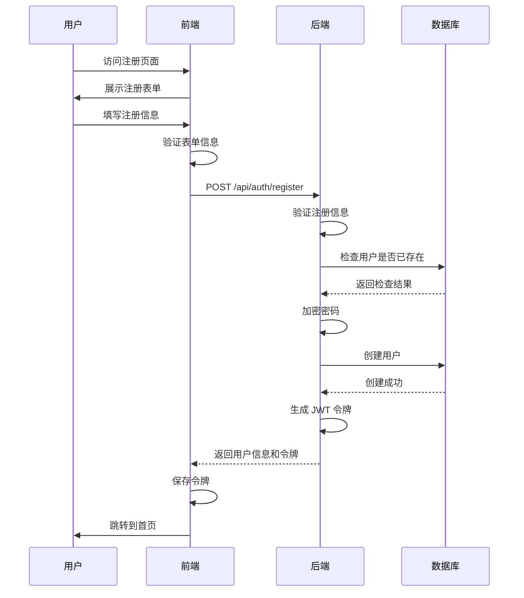
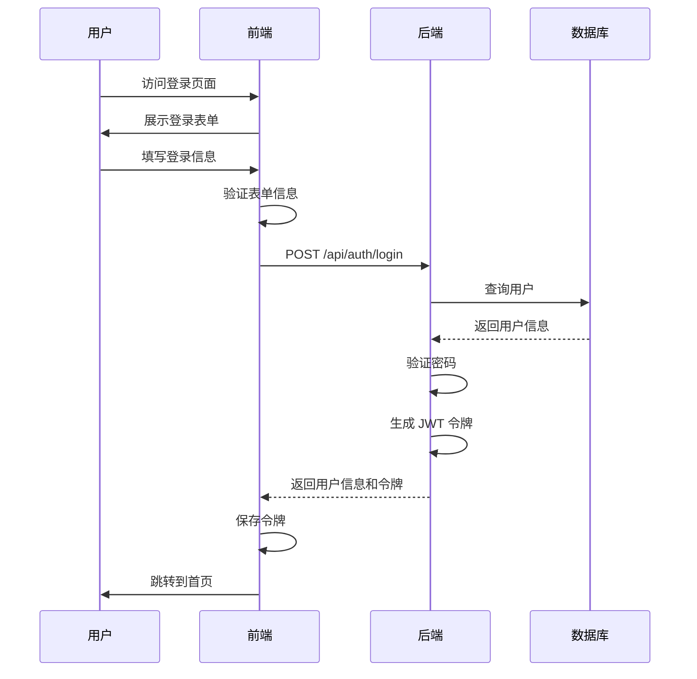
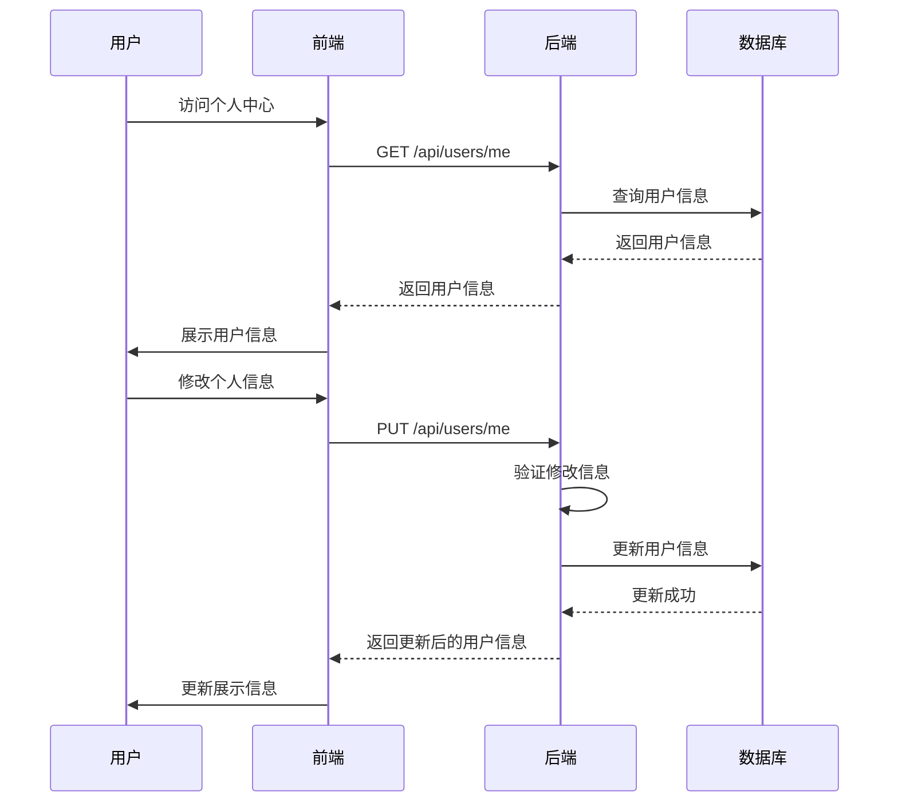
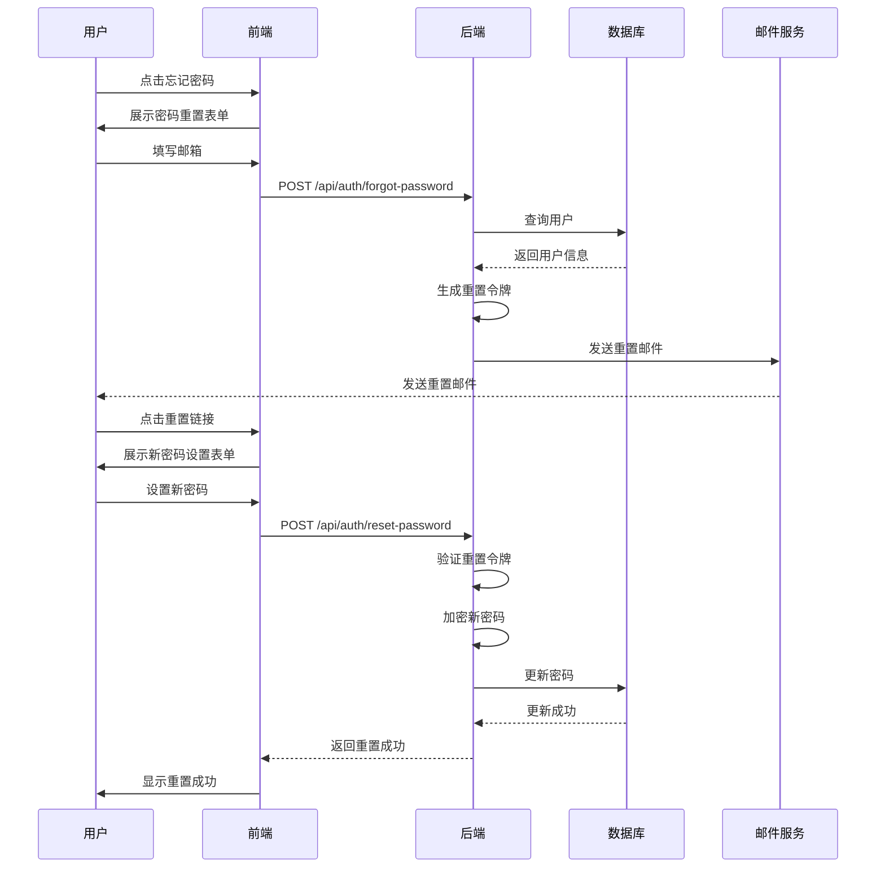
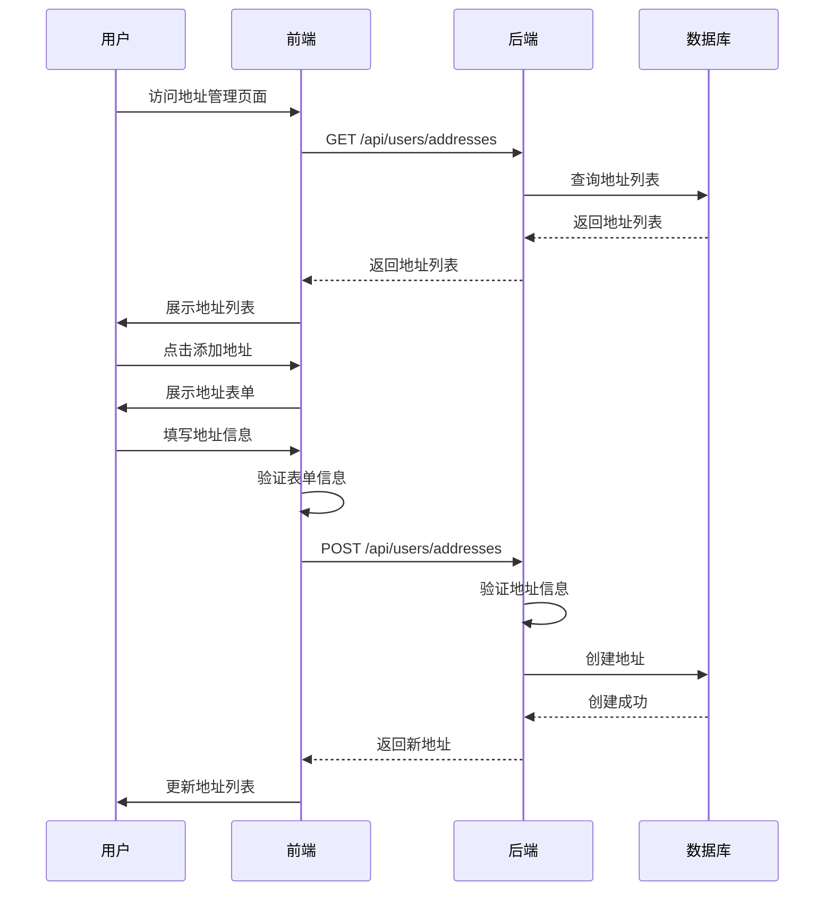
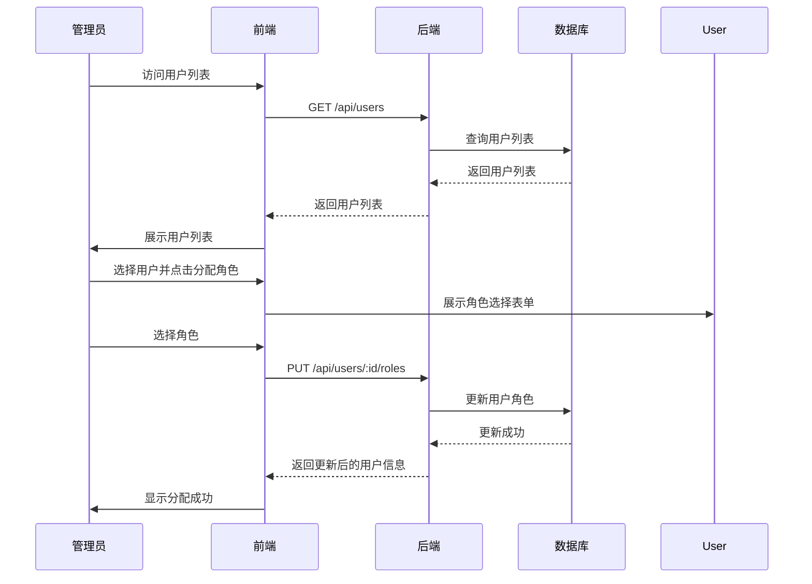

# 用户管理功能文档

## 1. 功能概述

用户管理功能是电商系统的基础功能，负责用户的注册、登录、个人信息管理等。该功能连接了认证模块、用户模块和其他业务模块，是用户与系统交互的基础。

### 1.1 功能定位

用户管理功能在系统中扮演着以下角色：

- **用户认证**：验证用户身份，确保系统安全
- **个人信息管理**：维护用户的个人信息
- **权限控制**：基于用户角色的访问控制
- **用户体验**：提供便捷的用户管理功能
- **数据收集**：收集用户数据，为业务决策提供支持

### 1.2 核心价值

- **用户体验**：提供便捷、安全的用户管理功能
- **系统安全**：确保只有授权用户才能访问系统
- **数据完整性**：保证用户数据的完整和准确
- **业务支持**：为系统的其他功能提供用户基础
- **竞争优势**：提供差异化的用户体验，增强系统的竞争优势

## 2. 功能模块

### 2.1 用户注册

**功能描述**：新用户注册系统

**核心流程**：

1. **注册表单**
   - 前端展示注册表单
   - 用户填写注册信息（用户名、密码、邮箱、手机等）
   - 前端验证表单信息

2. **注册处理**
   - 前端提交注册信息
   - 后端验证注册信息
   - 后端检查用户是否已存在
   - 后端加密密码
   - 后端创建用户
   - 后端生成 JWT 令牌
   - 前端保存令牌并跳转到首页

**流程图**：

### 2.2 用户登录

**功能描述**：用户登录系统

**核心流程**：

1. **登录表单**
   - 前端展示登录表单
   - 用户填写登录信息（用户名/邮箱/手机、密码）
   - 前端验证表单信息

2. **登录处理**
   - 前端提交登录信息
   - 后端验证登录信息
   - 后端检查用户是否存在
   - 后端验证密码
   - 后端生成 JWT 令牌
   - 前端保存令牌并跳转到首页

**流程图**：

### 2.3 个人信息管理

**功能描述**：用户管理个人信息

**核心流程**：

1. **信息展示**
   - 用户访问个人中心
   - 前端请求用户信息
   - 后端查询用户信息
   - 前端展示用户信息

2. **信息修改**
   - 用户修改个人信息
   - 前端提交修改信息
   - 后端验证修改信息
   - 后端更新用户信息
   - 前端更新展示信息

**流程图**：

### 2.4 密码管理

**功能描述**：用户管理密码

**核心流程**：

1. **密码修改**
   - 用户访问密码修改页面
   - 前端展示密码修改表单
   - 用户填写旧密码和新密码
   - 前端验证表单信息
   - 前端提交密码修改请求
   - 后端验证旧密码
   - 后端加密新密码
   - 后端更新密码
   - 前端显示修改成功

2. **密码重置**
   - 用户点击忘记密码
   - 前端展示密码重置表单
   - 用户填写邮箱或手机
   - 前端提交密码重置请求
   - 后端验证用户存在
   - 后端发送密码重置邮件或短信
   - 用户点击重置链接
   - 前端展示新密码设置表单
   - 用户设置新密码
   - 前端提交新密码
   - 后端加密新密码
   - 后端更新密码
   - 前端显示重置成功

**流程图**：

### 2.5 地址管理

**功能描述**：用户管理收货地址

**核心流程**：

1. **地址列表**
   - 用户访问地址管理页面
   - 前端请求地址列表
   - 后端查询地址列表
   - 前端展示地址列表

2. **地址添加**
   - 用户点击添加地址
   - 前端展示地址表单
   - 用户填写地址信息
   - 前端验证表单信息
   - 前端提交地址信息
   - 后端验证地址信息
   - 后端创建地址
   - 前端更新地址列表

3. **地址修改**
   - 用户点击修改地址
   - 前端展示地址修改表单
   - 用户修改地址信息
   - 前端验证表单信息
   - 前端提交修改信息
   - 后端验证修改信息
   - 后端更新地址
   - 前端更新地址列表

4. **地址删除**
   - 用户点击删除地址
   - 前端确认删除
   - 前端提交删除请求
   - 后端删除地址
   - 前端更新地址列表

**流程图**：

### 2.6 用户角色管理

**功能描述**：管理员管理用户角色

**核心流程**：

1. **角色列表**
   - 管理员访问角色管理页面
   - 前端请求角色列表
   - 后端查询角色列表
   - 前端展示角色列表

2. **角色创建**
   - 管理员点击创建角色
   - 前端展示角色表单
   - 管理员填写角色信息
   - 前端提交角色信息
   - 后端验证角色信息
   - 后端创建角色
   - 前端更新角色列表

3. **角色分配**
   - 管理员访问用户列表
   - 管理员选择用户
   - 管理员点击分配角色
   - 前端展示角色选择表单
   - 管理员选择角色
   - 前端提交角色分配
   - 后端更新用户角色
   - 前端显示分配成功

**流程图**：

## 3. 技术实现

### 3.1 前端实现

**核心技术**：

- **框架**：React / Vue / Angular
- **状态管理**：Redux / Vuex / NgRx
- **UI 库**：Ant Design / Element UI / Material UI
- **HTTP 客户端**：Axios
- **路由**：React Router / Vue Router / Angular Router

**关键组件**：

1. **注册组件**
   - 注册表单
   - 表单验证
   - 注册提交

2. **登录组件**
   - 登录表单
   - 表单验证
   - 登录提交

3. **个人信息组件**
   - 个人信息展示
   - 信息修改表单
   - 信息更新

4. **密码管理组件**
   - 密码修改表单
   - 密码重置表单
   - 密码更新

5. **地址管理组件**
   - 地址列表
   - 地址添加表单
   - 地址修改表单
   - 地址删除

6. **角色管理组件**
   - 角色列表
   - 角色创建表单
   - 角色分配表单

### 3.2 后端实现

**核心技术**：

- **框架**：NestJS
- **语言**：TypeScript
- **数据库**：MySQL
- **缓存**：Redis
- **认证**：JWT

**关键服务**：

1. **认证服务**
   - 用户注册
   - 用户登录
   - 密码重置
   - JWT 令牌生成和验证

2. **用户服务**
   - 用户信息管理
   - 用户地址管理
   - 用户角色管理

3. **角色服务**
   - 角色创建和管理
   - 权限分配

### 3.3 数据库设计

**核心表**：

1. **用户表 (user)**
   - 存储用户基本信息
   - 包含用户名、密码、邮箱、手机等字段

2. **用户地址表 (user_address)**
   - 存储用户收货地址
   - 包含用户 ID、收货人、联系电话、地址等字段

3. **角色表 (role)**
   - 存储角色信息
   - 包含角色名称、描述等字段

4. **用户角色表 (user_role)**
   - 存储用户与角色的关联
   - 包含用户 ID、角色 ID 等字段

5. **权限表 (permission)**
   - 存储权限信息
   - 包含权限名称、描述等字段

6. **角色权限表 (role_permission)**
   - 存储角色与权限的关联
   - 包含角色 ID、权限 ID 等字段

### 3.4 API 设计

**核心 API**：

1. **认证 API**
   - `POST /api/auth/register`：用户注册
   - `POST /api/auth/login`：用户登录
   - `POST /api/auth/forgot-password`：忘记密码
   - `POST /api/auth/reset-password`：重置密码
   - `POST /api/auth/refresh`：刷新令牌
   - `POST /api/auth/logout`：用户登出

2. **用户 API**
   - `GET /api/users/me`：获取当前用户信息
   - `PUT /api/users/me`：更新当前用户信息
   - `GET /api/users/addresses`：获取用户地址列表
   - `POST /api/users/addresses`：添加用户地址
   - `PUT /api/users/addresses/:id`：更新用户地址
   - `DELETE /api/users/addresses/:id`：删除用户地址

3. **管理员 API**
   - `GET /api/users`：获取用户列表
   - `GET /api/users/:id`：获取用户详情
   - `PUT /api/users/:id`：更新用户信息
   - `DELETE /api/users/:id`：删除用户
   - `PUT /api/users/:id/roles`：分配用户角色
   - `GET /api/roles`：获取角色列表
   - `POST /api/roles`：创建角色
   - `PUT /api/roles/:id`：更新角色
   - `DELETE /api/roles/:id`：删除角色

## 4. 用户体验设计

### 4.1 视觉设计

**核心原则**：

- **简洁明了**：界面简洁，重点突出功能
- **视觉层次**：通过视觉层次，引导用户关注重要信息
- **一致性**：保持界面风格的一致性
- **响应式**：适配不同屏幕尺寸
- **品牌识别**：体现系统的品牌特色

**设计元素**：

1. **颜色方案**
   - 主色调：体现系统的品牌特色
   - 辅助色：用于强调和交互
   - 中性色：用于背景和文本

2. **排版**
   - 字体：选择清晰、易读的字体
   - 字号：建立清晰的字号层次
   - 行高：确保文本的可读性

3. **布局**
   - 表单布局：清晰、有序的表单布局
   - 信息展示：直观的信息展示方式
   - 导航：清晰的导航结构

4. **交互元素**
   - 按钮：清晰、可点击的按钮
   - 输入框：易于使用的输入框
   - 反馈：及时、明确的操作反馈

### 4.2 交互设计

**核心原则**：

- **直观易用**：交互流程直观，易于理解
- **反馈及时**：提供及时的操作反馈
- **减少摩擦**：减少用户操作的摩擦
- **个性化**：根据用户行为，提供个性化的交互体验
- **可访问性**：确保所有用户都能使用该功能

**交互元素**：

1. **注册/登录**
   - 表单验证：实时的表单验证
   - 错误提示：友好的错误提示
   - 记住密码：便捷的记住密码功能
   - 第三方登录：支持第三方登录

2. **个人信息管理**
   - 信息展示：清晰的信息展示
   - 编辑模式：便捷的编辑模式
   - 保存反馈：明确的保存成功反馈

3. **密码管理**
   - 密码强度检测：实时的密码强度检测
   - 密码可见性：密码可见性切换
   - 重置流程：清晰的密码重置流程

4. **地址管理**
   - 地址列表：清晰的地址列表
   - 地址操作：便捷的地址添加、修改、删除操作
   - 默认地址：明确的默认地址设置

### 4.3 性能优化

**核心原则**：

- **快速响应**：减少页面加载时间
- **流畅交互**：确保交互的流畅性
- **稳定可靠**：确保功能的稳定运行
- **资源优化**：优化资源的使用

**优化策略**：

1. **前端优化**
   - 资源压缩：压缩 CSS、JS 和图片
   - 缓存策略：合理使用浏览器缓存
   - 代码分割：按需加载代码
   - 懒加载：延迟加载非关键资源

2. **后端优化**
   - 数据库索引：优化数据库查询
   - 缓存：使用 Redis 缓存热点数据
   - 异步处理：使用消息队列处理异步任务
   - 负载均衡：分散请求压力

3. **网络优化**
   - CDN：使用 CDN 加速静态资源
   - HTTP/2：使用 HTTP/2 协议
   - 压缩传输：使用 Gzip 压缩传输数据

## 5. 数据统计与分析

### 5.1 关键指标

**核心指标**：

1. **用户指标**
   - 注册用户数
   - 活跃用户数
   - 用户留存率
   - 用户增长率
   - 用户活跃度

2. **认证指标**
   - 登录次数
   - 登录成功率
   - 登录失败率
   - 平均登录时间

3. **行为指标**
   - 个人信息修改次数
   - 地址管理操作次数
   - 密码修改次数
   - 密码重置次数

4. **转化指标**
   - 注册转化率
   - 登录转化率
   - 个人信息完善率

### 5.2 数据分析

**分析维度**：

1. **用户画像分析**
   - 用户 demographics（年龄、性别、地区等）
   - 用户行为特征
   - 用户偏好

2. **注册分析**
   - 注册渠道分析
   - 注册时间分析
   - 注册转化率分析
   - 注册失败原因分析

3. **登录分析**
   - 登录时段分析
   - 登录设备分析
   - 登录地点分析
   - 登录失败原因分析

4. **个人信息分析**
   - 信息完善率
   - 信息修改频率
   - 地址管理行为

### 5.3 数据驱动优化

**优化策略**：

1. **注册流程优化**
   - 简化注册表单
   - 提供多种注册方式
   - 优化注册验证
   - 减少注册步骤

2. **登录流程优化**
   - 提供多种登录方式
   - 优化登录验证
   - 实现记住登录状态
   - 提供快捷登录

3. **个人信息管理优化**
   - 优化信息展示
   - 简化信息修改流程
   - 提供批量操作
   - 个性化信息推荐

4. **安全优化**
   - 加强密码强度要求
   - 实现多因素认证
   - 优化账户安全提醒
   - 加强异常登录检测

## 6. 功能扩展

### 6.1 第三方登录

**功能描述**：支持用户通过第三方平台登录系统

**核心功能**：

1. **第三方平台集成**
   - 微信登录
   - 支付宝登录
   - Google 登录
   - Facebook 登录

2. **登录流程**
   - 用户选择第三方登录
   - 前端重定向到第三方登录页面
   - 用户在第三方平台登录
   - 第三方平台回调系统
   - 后端验证第三方登录信息
   - 后端创建或更新用户
   - 后端生成 JWT 令牌
   - 前端保存令牌并跳转到首页

### 6.2 多因素认证

**功能描述**：支持多因素认证，提高账户安全性

**核心功能**：

1. **认证方式**
   - 手机验证码
   - 邮箱验证码
   - 认证器应用（如 Google Authenticator）

2. **认证流程**
   - 用户启用多因素认证
   - 后端验证用户身份
   - 后端生成认证密钥
   - 用户扫描二维码或输入密钥
   - 后端验证认证码
   - 后端保存多因素认证设置
   - 用户登录时，除了密码外，还需要输入认证码

### 6.3 账户安全

**功能描述**：提供账户安全管理功能

**核心功能**：

1. **安全设置**
   - 登录设备管理
   - 登录历史查看
   - 异常登录提醒
   - 账户锁定与解锁

2. **隐私设置**
   - 个人信息可见性设置
   - 数据使用偏好设置
   - 通知设置

### 6.4 用户分级

**功能描述**：根据用户行为和消费金额，对用户进行分级

**核心功能**：

1. **用户等级**
   - 普通会员
   - 银卡会员
   - 金卡会员
   - 钻石会员

2. **等级权益**
   - 专属折扣
   - 生日礼包
   - 优先客服
   - 专属活动

3. **等级升级**
   - 基于消费金额升级
   - 基于消费次数升级
   - 基于会员时长升级

## 7. 常见问题与解决方案

### 7.1 注册问题

**问题**：用户注册失败

**可能原因**：
- 用户名已存在
- 邮箱已被注册
- 手机已被注册
- 密码强度不够
- 网络连接问题

**解决方案**：
- 检查用户名、邮箱、手机是否已被注册
- 提高密码强度
- 检查网络连接
- 提供友好的错误提示

**问题**：注册后无法登录

**可能原因**：
- 用户名或密码错误
- 账户被锁定
- 网络连接问题

**解决方案**：
- 检查用户名和密码
- 联系客服解锁账户
- 检查网络连接

### 7.2 登录问题

**问题**：用户登录失败

**可能原因**：
- 用户名或密码错误
- 账户被锁定
- 网络连接问题
- 令牌过期

**解决方案**：
- 检查用户名和密码
- 联系客服解锁账户
- 检查网络连接
- 重新登录获取新令牌

**问题**：登录后自动退出

**可能原因**：
- 令牌过期
- 账户在其他设备登录
- 浏览器清除了缓存

**解决方案**：
- 重新登录获取新令牌
- 检查账户是否被盗
- 启用记住登录状态

### 7.3 个人信息问题

**问题**：个人信息修改失败

**可能原因**：
- 信息格式错误
- 网络连接问题
- 服务器错误

**解决方案**：
- 检查信息格式
- 检查网络连接
- 联系客服

**问题**：地址管理操作失败

**可能原因**：
- 地址格式错误
- 网络连接问题
- 服务器错误

**解决方案**：
- 检查地址格式
- 检查网络连接
- 联系客服

### 7.4 安全问题

**问题**：账户被盗

**可能原因**：
- 密码过于简单
- 钓鱼网站
- 公共网络不安全

**解决方案**：
- 立即修改密码
- 启用多因素认证
- 联系客服冻结账户
- 检查账户活动

**问题**：密码忘记

**解决方案**：
- 使用密码重置功能
- 联系客服重置密码

## 8. 功能测试

### 8.1 测试策略

**核心策略**：

1. **功能测试**
   - 测试每个功能模块的正常功能
   - 测试边界情况
   - 测试错误处理

2. **性能测试**
   - 页面加载时间测试
   - 响应时间测试
   - 并发测试
   - 压力测试

3. **兼容性测试**
   - 浏览器兼容性测试
   - 设备兼容性测试
   - 操作系统兼容性测试

4. **安全测试**
   - 输入验证测试
   - SQL 注入测试
   - XSS 测试
   - CSRF 测试
   - 密码安全性测试

### 8.2 测试用例

**核心用例**：

1. **注册测试**
   - 测试正常注册
   - 测试用户名已存在
   - 测试邮箱已被注册
   - 测试密码强度不够
   - 测试表单验证

2. **登录测试**
   - 测试正常登录
   - 测试用户名错误
   - 测试密码错误
   - 测试账户被锁定
   - 测试记住密码

3. **个人信息测试**
   - 测试获取个人信息
   - 测试修改个人信息
   - 测试信息格式错误

4. **密码管理测试**
   - 测试修改密码
   - 测试忘记密码
   - 测试密码重置
   - 测试密码强度检测

5. **地址管理测试**
   - 测试获取地址列表
   - 测试添加地址
   - 测试修改地址
   - 测试删除地址
   - 测试设置默认地址

6. **角色管理测试**
   - 测试获取角色列表
   - 测试创建角色
   - 测试分配角色
   - 测试角色权限

### 8.3 测试工具

**推荐工具**：

1. **功能测试**
   - Selenium：自动化测试
   - Cypress：端到端测试
   - Jest：单元测试

2. **性能测试**
   - Lighthouse：页面性能测试
   - WebPageTest：网站性能测试
   - JMeter：负载测试

3. **兼容性测试**
   - BrowserStack：跨浏览器测试
   - Sauce Labs：跨平台测试

4. **安全测试**
   - OWASP ZAP：安全测试
   - Burp Suite：安全测试
   - Nmap：网络安全测试

## 9. 总结与展望

### 9.1 功能优势

- **用户体验**：提供便捷、安全的用户管理功能
- **技术架构**：采用现代化的技术架构，确保系统的稳定性和可扩展性
- **安全可靠**：实现了完善的用户认证和授权机制
- **数据驱动**：通过用户行为数据，优化用户体验
- **业务价值**：为系统的其他功能提供用户基础

### 9.2 改进空间

- **个性化**：进一步优化个性化用户体验
- **安全性**：加强账户安全措施，提高系统安全性
- **便捷性**：简化用户操作流程，提高用户体验
- **多平台**：优化多平台用户体验
- **社交化**：引入社交元素，增强用户粘性

### 9.3 未来规划

- **版本 1.1**：增强第三方登录支持，添加更多第三方平台
- **版本 1.2**：实现多因素认证，提高账户安全性
- **版本 1.3**：优化用户分级系统，提供更多等级权益
- **版本 1.4**：增强账户安全管理，添加登录设备管理和异常登录提醒
- **版本 1.5**：引入社交元素，增强用户互动
- **版本 2.0**：重构用户管理功能，采用更先进的技术和架构，提供更优质的用户体验

## 10. 附录

### 10.1 核心 API 列表

| API 路径 | 方法 | 功能描述 | 认证要求 |
|----------|------|----------|----------|
| `/api/auth/register` | POST | 用户注册 | 否 |
| `/api/auth/login` | POST | 用户登录 | 否 |
| `/api/auth/forgot-password` | POST | 忘记密码 | 否 |
| `/api/auth/reset-password` | POST | 重置密码 | 否 |
| `/api/auth/refresh` | POST | 刷新令牌 | 是 |
| `/api/auth/logout` | POST | 用户登出 | 是 |
| `/api/users/me` | GET | 获取当前用户信息 | 是 |
| `/api/users/me` | PUT | 更新当前用户信息 | 是 |
| `/api/users/addresses` | GET | 获取用户地址列表 | 是 |
| `/api/users/addresses` | POST | 添加用户地址 | 是 |
| `/api/users/addresses/:id` | PUT | 更新用户地址 | 是 |
| `/api/users/addresses/:id` | DELETE | 删除用户地址 | 是 |
| `/api/users` | GET | 获取用户列表 | 是（管理员） |
| `/api/users/:id` | GET | 获取用户详情 | 是（管理员） |
| `/api/users/:id` | PUT | 更新用户信息 | 是（管理员） |
| `/api/users/:id` | DELETE | 删除用户 | 是（管理员） |
| `/api/roles` | GET | 获取角色列表 | 是（管理员） |
| `/api/roles` | POST | 创建角色 | 是（管理员） |
| `/api/roles/:id` | PUT | 更新角色 | 是（管理员） |
| `/api/roles/:id` | DELETE | 删除角色 | 是（管理员） |

### 10.2 技术栈

| 分类 | 技术 | 版本 | 用途 |
|------|------|------|------|
| 前端框架 | React | ^18.0.0 | 前端界面构建 |
| 状态管理 | Redux | ^4.2.0 | 前端状态管理 |
| UI 库 | Ant Design | ^5.0.0 | 前端组件库 |
| HTTP 客户端 | Axios | ^1.7.0 | 前端 API 调用 |
| 后端框架 | NestJS | ^11.0.0 | 后端服务构建 |
| 数据库 | MySQL | ^8.0.0 | 数据存储 |
| 缓存 | Redis | ^7.0.0 | 数据缓存 |
| 认证 | JWT | ^9.0.0 | 用户认证 |
| ORM | TypeORM | ^0.3.0 | 数据库操作 |

### 10.3 参考资源

- **官方文档**：
  - [NestJS 文档](https://docs.nestjs.com/)
  - [React 文档](https://react.dev/)
  - [MySQL 文档](https://dev.mysql.com/doc/)
  - [Redis 文档](https://redis.io/documentation)
  - [JWT 文档](https://jwt.io/introduction)

- **技术博客**：
  - 用户认证系统设计与实现
  - 密码安全最佳实践
  - 多因素认证实现
  - 用户体验优化策略

- **书籍**：
  - 《现代前端开发实战》
  - 《NestJS 实战》
  - 《Web 应用安全权威指南》
  - 《用户体验设计》

---

**文档更新时间**：2026-01-19
**文档版本**：v1.0.0
**作者**：MallEco 开发团队
