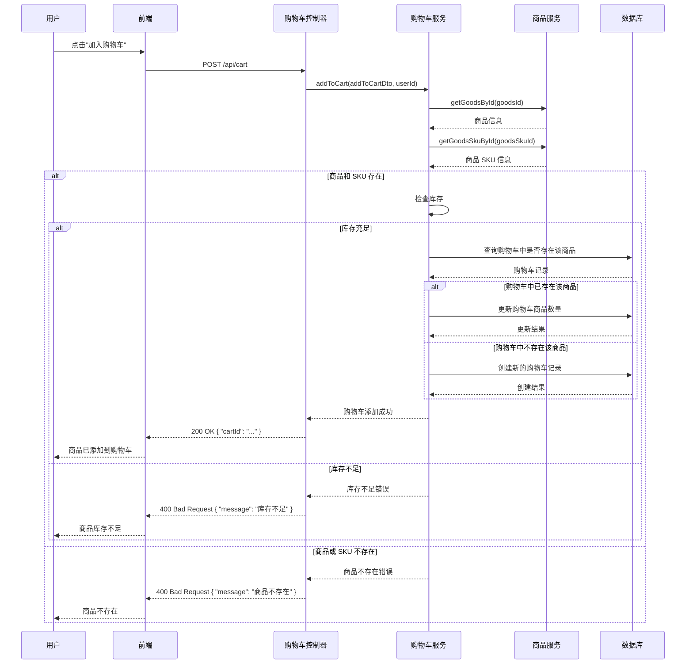
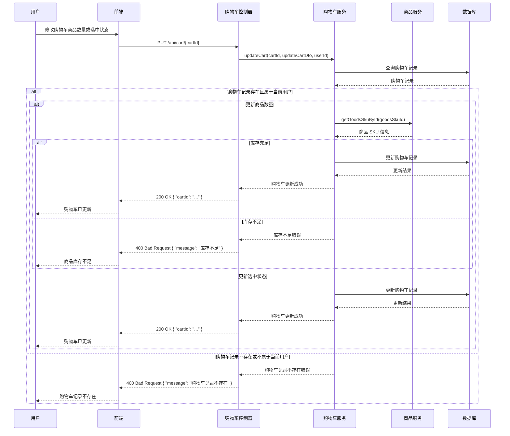
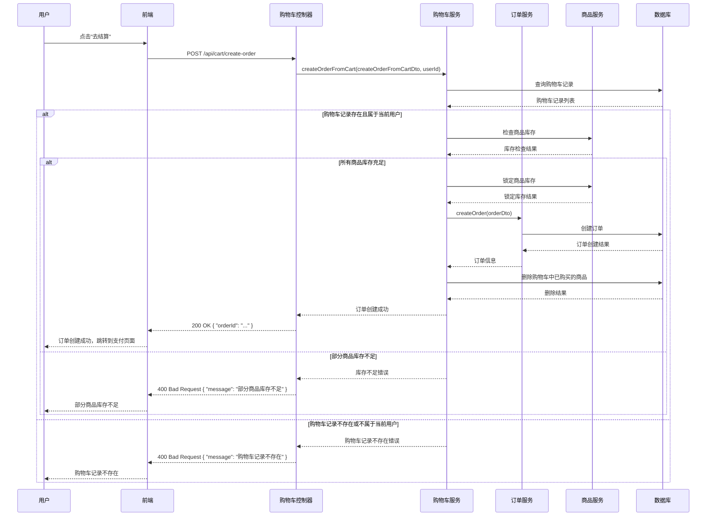

# 购物车管理功能

## 1. 功能概述

购物车管理功能是电商系统中的重要功能之一，允许用户将商品添加到购物车、管理购物车中的商品数量、删除购物车中的商品，以及从购物车创建订单。本文档详细描述了 MallEcoAPI 系统中的购物车管理功能，包括功能定位、核心价值、技术实现等内容。

### 1.1 功能定位

购物车管理功能在电商系统中扮演着以下角色：

- **用户体验关键**：购物车是用户购物过程中的重要环节，提供了便捷的商品管理方式
- **购买决策支持**：用户可以在购物车中比较不同商品，做出购买决策
- **订单创建基础**：购物车是创建订单的基础，用户可以从购物车中选择商品创建订单
- **促销活动载体**：购物车可以作为促销活动的载体，如满减、折扣等

### 1.2 核心价值

- **用户便利性**：提供便捷的商品管理方式，提高用户购物体验
- **购买转化率提升**：通过购物车功能，减少用户购买过程中的摩擦，提高购买转化率
- **促销活动支持**：支持各种促销活动，如满减、折扣等
- **库存管理**：在购物车中显示商品库存，避免用户购买无库存商品
- **价格透明**：在购物车中显示商品价格和总价，提高价格透明度

## 2. 功能模块

### 2.1 核心功能

#### 2.1.1 添加商品到购物车

**描述**：用户将商品添加到购物车，支持选择商品 SKU 和数量

**流程**：
1. 用户浏览商品详情页
2. 选择商品 SKU 和数量
3. 点击"加入购物车"按钮
4. 前端发送请求到后端
5. 后端验证商品库存
6. 后端检查购物车中是否已存在该商品
7. 后端更新或创建购物车记录
8. 后端返回添加结果
9. 前端更新购物车数量提示

**技术实现**：
- **前端**：React 组件，处理用户交互，发送 API 请求
- **后端**：`CartController.addToCart()` 方法，处理添加商品到购物车的请求
- **服务**：`CartService.addToCart()` 方法，实现添加商品到购物车的业务逻辑
- **验证**：验证商品是否存在、库存是否充足

**API 接口**：
- `POST /api/cart` - 添加商品到购物车

**请求参数**：
```json
{
  "goodsId": "1",
  "goodsSkuId": "1",
  "quantity": "2"
}
```

**响应参数**：
```json
{
  "code": 200,
  "message": "success",
  "data": {
    "cartId": "1",
    "goodsId": "1",
    "goodsSkuId": "1",
    "quantity": "2",
    "goodsName": "商品名称",
    "price": "99.99",
    "goodsImage": "https://example.com/image.jpg"
  }
}
```

#### 2.1.2 更新购物车商品

**描述**：用户更新购物车中商品的数量或选中状态

**流程**：
1. 用户进入购物车页面
2. 修改商品数量或选中状态
3. 前端发送请求到后端
4. 后端验证商品库存
5. 后端更新购物车记录
6. 后端返回更新结果
7. 前端更新购物车页面

**技术实现**：
- **前端**：React 组件，处理用户交互，发送 API 请求
- **后端**：`CartController.updateCart()` 方法，处理更新购物车商品的请求
- **服务**：`CartService.updateCart()` 方法，实现更新购物车商品的业务逻辑
- **验证**：验证商品库存是否充足

**API 接口**：
- `PUT /api/cart/{cartId}` - 更新购物车商品

**请求参数**：
```json
{
  "quantity": "3",
  "isSelected": "true"
}
```

**响应参数**：
```json
{
  "code": 200,
  "message": "success",
  "data": {
    "cartId": "1",
    "goodsId": "1",
    "goodsSkuId": "1",
    "quantity": "3",
    "isSelected": "true",
    "goodsName": "商品名称",
    "price": "99.99",
    "goodsImage": "https://example.com/image.jpg"
  }
}
```

#### 2.1.3 删除购物车商品

**描述**：用户删除购物车中的商品

**流程**：
1. 用户进入购物车页面
2. 点击商品旁边的"删除"按钮
3. 前端发送请求到后端
4. 后端删除购物车记录
5. 后端返回删除结果
6. 前端更新购物车页面

**技术实现**：
- **前端**：React 组件，处理用户交互，发送 API 请求
- **后端**：`CartController.deleteCart()` 方法，处理删除购物车商品的请求
- **服务**：`CartService.deleteCart()` 方法，实现删除购物车商品的业务逻辑

**API 接口**：
- `DELETE /api/cart/{cartId}` - 删除购物车商品

**响应参数**：
```json
{
  "code": 200,
  "message": "success",
  "data": null
}
```

#### 2.1.4 获取购物车列表

**描述**：用户获取购物车中的商品列表

**流程**：
1. 用户进入购物车页面
2. 前端发送请求到后端
3. 后端查询用户的购物车记录
4. 后端获取商品信息和库存
5. 后端返回购物车列表
6. 前端显示购物车页面

**技术实现**：
- **前端**：React 组件，发送 API 请求，显示购物车商品
- **后端**：`CartController.getCartList()` 方法，处理获取购物车列表的请求
- **服务**：`CartService.getCartList()` 方法，实现获取购物车列表的业务逻辑
- **关联查询**：关联查询商品信息和库存

**API 接口**：
- `GET /api/cart` - 获取购物车列表

**响应参数**：
```json
{
  "code": 200,
  "message": "success",
  "data": [
    {
      "cartId": "1",
      "goodsId": "1",
      "goodsSkuId": "1",
      "quantity": "2",
      "isSelected": "true",
      "goodsName": "商品名称",
      "skuSpecs": "颜色:红色;尺寸:M",
      "price": "99.99",
      "stock": "100",
      "goodsImage": "https://example.com/image.jpg"
    },
    {
      "cartId": "2",
      "goodsId": "2",
      "goodsSkuId": "2",
      "quantity": "1",
      "isSelected": "false",
      "goodsName": "商品名称2",
      "skuSpecs": "颜色:蓝色;尺寸:L",
      "price": "199.99",
      "stock": "50",
      "goodsImage": "https://example.com/image2.jpg"
    }
  ],
  "totalPrice": "399.97",
  "selectedCount": "1"
}
```

#### 2.1.5 清空购物车

**描述**：用户清空购物车中的所有商品

**流程**：
1. 用户进入购物车页面
2. 点击"清空购物车"按钮
3. 前端发送请求到后端
4. 后端删除用户的所有购物车记录
5. 后端返回清空结果
6. 前端更新购物车页面

**技术实现**：
- **前端**：React 组件，处理用户交互，发送 API 请求
- **后端**：`CartController.clearCart()` 方法，处理清空购物车的请求
- **服务**：`CartService.clearCart()` 方法，实现清空购物车的业务逻辑

**API 接口**：
- `DELETE /api/cart` - 清空购物车

**响应参数**：
```json
{
  "code": 200,
  "message": "success",
  "data": null
}
```

#### 2.1.6 选择购物车商品

**描述**：用户选择或取消选择购物车中的商品

**流程**：
1. 用户进入购物车页面
2. 点击商品旁边的复选框
3. 前端发送请求到后端
4. 后端更新购物车记录的选中状态
5. 后端返回更新结果
6. 前端更新购物车页面和总价

**技术实现**：
- **前端**：React 组件，处理用户交互，发送 API 请求
- **后端**：`CartController.selectCart()` 方法，处理选择购物车商品的请求
- **服务**：`CartService.selectCart()` 方法，实现选择购物车商品的业务逻辑

**API 接口**：
- `PUT /api/cart/select` - 选择购物车商品

**请求参数**：
```json
{
  "cartIds": ["1", "2"],
  "isSelected": "true"
}
```

**响应参数**：
```json
{
  "code": 200,
  "message": "success",
  "data": {
    "selectedCount": "2",
    "totalPrice": "299.98"
  }
}
```

#### 2.1.7 从购物车创建订单

**描述**：用户从购物车中选择商品创建订单

**流程**：
1. 用户进入购物车页面
2. 选择要购买的商品
3. 点击"去结算"按钮
4. 前端发送请求到后端
5. 后端验证商品库存
6. 后端锁定商品库存
7. 后端创建订单
8. 后端清空购物车中已购买的商品
9. 后端返回订单信息
10. 前端跳转到订单支付页面

**技术实现**：
- **前端**：React 组件，处理用户交互，发送 API 请求
- **后端**：`CartController.createOrderFromCart()` 方法，处理从购物车创建订单的请求
- **服务**：`CartService.createOrderFromCart()` 方法，实现从购物车创建订单的业务逻辑
- **事务管理**：使用事务管理，确保库存锁定和订单创建的原子性

**API 接口**：
- `POST /api/cart/create-order` - 从购物车创建订单

**请求参数**：
```json
{
  "cartIds": ["1", "2"],
  "addressId": "1",
  "paymentMethod": "alipay",
  "couponId": "1",
  "remark": "请尽快发货"
}
```

**响应参数**：
```json
{
  "code": 200,
  "message": "success",
  "data": {
    "orderId": "1",
    "orderSn": "20260119000001",
    "totalAmount": "299.98",
    "actualAmount": "279.98",
    "paymentUrl": "https://example.com/pay"
  }
}
```

### 2.2 辅助功能

#### 2.2.1 购物车商品库存检查

**描述**：定期检查购物车中的商品库存，当商品库存不足时，提示用户

**流程**：
1. 用户进入购物车页面
2. 前端发送请求到后端获取购物车列表
3. 后端检查购物车中商品的库存
4. 后端返回购物车列表和库存状态
5. 前端显示购物车页面，并提示库存不足的商品

**技术实现**：
- **前端**：React 组件，发送 API 请求，显示库存状态
- **后端**：`CartService.checkCartStock()` 方法，实现购物车商品库存检查的业务逻辑

#### 2.2.2 购物车商品价格更新

**描述**：定期更新购物车中的商品价格，确保价格的准确性

**流程**：
1. 用户进入购物车页面
2. 前端发送请求到后端获取购物车列表
3. 后端更新购物车中商品的价格
4. 后端返回购物车列表和更新后的价格
5. 前端显示购物车页面，并更新商品价格

**技术实现**：
- **前端**：React 组件，发送 API 请求，显示更新后的价格
- **后端**：`CartService.updateCartPrices()` 方法，实现购物车商品价格更新的业务逻辑

## 3. 技术实现

### 3.1 核心组件

#### 3.1.1 购物车控制器 (CartController)

**描述**：处理购物车相关的 HTTP 请求，包括添加商品到购物车、更新购物车商品、删除购物车商品等

**核心方法**：
- `addToCart()`：添加商品到购物车
- `updateCart()`：更新购物车商品
- `deleteCart()`：删除购物车商品
- `getCartList()`：获取购物车列表
- `clearCart()`：清空购物车
- `selectCart()`：选择购物车商品
- `createOrderFromCart()`：从购物车创建订单

**代码示例**：
```typescript
@Controller('cart')
export class CartController {
  constructor(private readonly cartService: CartService) {}

  @Post()
  async addToCart(@Body() addToCartDto: AddToCartDto, @User() user: User) {
    return this.cartService.addToCart(addToCartDto, user.id);
  }

  @Put(':cartId')
  async updateCart(@Param('cartId') cartId: number, @Body() updateCartDto: UpdateCartDto, @User() user: User) {
    return this.cartService.updateCart(cartId, updateCartDto, user.id);
  }

  @Delete(':cartId')
  async deleteCart(@Param('cartId') cartId: number, @User() user: User) {
    return this.cartService.deleteCart(cartId, user.id);
  }

  @Get()
  async getCartList(@User() user: User) {
    return this.cartService.getCartList(user.id);
  }

  @Delete()
  async clearCart(@User() user: User) {
    return this.cartService.clearCart(user.id);
  }

  @Put('select')
  async selectCart(@Body() selectCartDto: SelectCartDto, @User() user: User) {
    return this.cartService.selectCart(selectCartDto, user.id);
  }

  @Post('create-order')
  async createOrderFromCart(@Body() createOrderFromCartDto: CreateOrderFromCartDto, @User() user: User) {
    return this.cartService.createOrderFromCart(createOrderFromCartDto, user.id);
  }
}
```

#### 3.1.2 购物车服务 (CartService)

**描述**：实现购物车相关的业务逻辑，包括添加商品到购物车、更新购物车商品、删除购物车商品等

**核心方法**：
- `addToCart()`：添加商品到购物车
- `updateCart()`：更新购物车商品
- `deleteCart()`：删除购物车商品
- `getCartList()`：获取购物车列表
- `clearCart()`：清空购物车
- `selectCart()`：选择购物车商品
- `createOrderFromCart()`：从购物车创建订单
- `checkCartStock()`：检查购物车商品库存
- `updateCartPrices()`：更新购物车商品价格

**代码示例**：
```typescript
@Injectable()
export class CartService {
  constructor(
    @InjectRepository(Cart) private readonly cartRepository: Repository<Cart>,
    private readonly goodsService: GoodsService,
    private readonly orderService: OrderService,
  ) {}

  async addToCart(addToCartDto: AddToCartDto, userId: number) {
    // 检查商品是否存在
    const goods = await this.goodsService.getGoodsById(addToCartDto.goodsId);
    if (!goods) {
      throw new BadRequestException('商品不存在');
    }

    // 检查商品 SKU 是否存在
    const goodsSku = await this.goodsService.getGoodsSkuById(addToCartDto.goodsSkuId);
    if (!goodsSku) {
      throw new BadRequestException('商品规格不存在');
    }

    // 检查库存
    if (goodsSku.stock < addToCartDto.quantity) {
      throw new BadRequestException('商品库存不足');
    }

    // 检查购物车中是否已存在该商品
    const existingCart = await this.cartRepository.findOne({
      where: {
        userId,
        goodsId: addToCartDto.goodsId,
        goodsSkuId: addToCartDto.goodsSkuId,
      },
    });

    if (existingCart) {
      // 更新购物车商品数量
      existingCart.quantity += addToCartDto.quantity;
      await this.cartRepository.save(existingCart);
      return existingCart;
    } else {
      // 创建新的购物车记录
      const cart = this.cartRepository.create({
        userId,
        goodsId: addToCartDto.goodsId,
        goodsSkuId: addToCartDto.goodsSkuId,
        quantity: addToCartDto.quantity,
        isSelected: true,
        goodsName: goods.name,
        skuSpecs: goodsSku.specs,
        price: goodsSku.price,
        goodsImage: goods.images[0],
      });
      await this.cartRepository.save(cart);
      return cart;
    }
  }

  async getCartList(userId: number) {
    const carts = await this.cartRepository.find({
      where: { userId },
    });

    // 检查库存和更新价格
    for (const cart of carts) {
      const goodsSku = await this.goodsService.getGoodsSkuById(cart.goodsSkuId);
      if (goodsSku) {
        cart.price = goodsSku.price;
        cart.stock = goodsSku.stock;
      }
    }

    // 计算总价和选中数量
    const selectedCarts = carts.filter(cart => cart.isSelected);
    const totalPrice = selectedCarts.reduce((sum, cart) => sum + cart.price * cart.quantity, 0);
    const selectedCount = selectedCarts.length;

    return {
      carts,
      totalPrice,
      selectedCount,
    };
  }

  // 其他方法实现...
}
```

#### 3.1.3 购物车实体 (Cart)

**描述**：购物车实体，存储购物车中的商品信息

**核心字段**：
- `id`：购物车 ID
- `userId`：用户 ID
- `goodsId`：商品 ID
- `goodsSkuId`：商品 SKU ID
- `quantity`：商品数量
- `isSelected`：是否选中
- `goodsName`：商品名称
- `skuSpecs`：SKU 规格
- `price`：商品价格
- `goodsImage`：商品图片
- `createdAt`：创建时间
- `updatedAt`：更新时间

**代码示例**：
```typescript
@Entity('cart')
export class Cart {
  @PrimaryGeneratedColumn()
  id: number;

  @Column()
  userId: number;

  @Column()
  goodsId: number;

  @Column()
  goodsSkuId: number;

  @Column()
  quantity: number;

  @Column({ default: true })
  isSelected: boolean;

  @Column()
  goodsName: string;

  @Column()
  skuSpecs: string;

  @Column({ type: 'decimal', precision: 10, scale: 2 })
  price: number;

  @Column()
  goodsImage: string;

  @CreateDateColumn()
  createdAt: Date;

  @UpdateDateColumn()
  updatedAt: Date;

  // 关联关系
  @ManyToOne(() => User, user => user.carts)
  user: User;

  @ManyToOne(() => Goods, goods => goods.carts)
  goods: Goods;

  @ManyToOne(() => GoodsSku)
  goodsSku: GoodsSku;
}
```

### 3.2 技术栈

| 技术 | 版本 | 用途 |
|------|------|------|
| NestJS | 9.0.0 | 后端框架 |
| TypeScript | 4.9.0 | 开发语言 |
| TypeORM | 0.3.0 | ORM 框架 |
| MySQL | 8.0.0 | 数据库 |
| Redis | 7.0.0 | 缓存 |
| React | 18.0.0 | 前端框架 |
| Ant Design | 5.0.0 | 前端 UI 库 |

### 3.3 数据结构

#### 3.3.1 购物车 DTO

**AddToCartDto**：
```typescript
export class AddToCartDto {
  @IsNotEmpty()
  goodsId: number;

  @IsNotEmpty()
  goodsSkuId: number;

  @IsNotEmpty()
  @Min(1)
  quantity: number;
}
```

**UpdateCartDto**：
```typescript
export class UpdateCartDto {
  @IsOptional()
  @Min(1)
  quantity?: number;

  @IsOptional()
  isSelected?: boolean;
}
```

**SelectCartDto**：
```typescript
export class SelectCartDto {
  @IsNotEmpty()
  cartIds: number[];

  @IsNotEmpty()
  isSelected: boolean;
}
```

**CreateOrderFromCartDto**：
```typescript
export class CreateOrderFromCartDto {
  @IsNotEmpty()
  cartIds: number[];

  @IsNotEmpty()
  addressId: number;

  @IsNotEmpty()
  paymentMethod: string;

  @IsOptional()
  couponId?: number;

  @IsOptional()
  remark?: string;
}
```

#### 3.3.2 购物车响应结构

**购物车列表响应**：
```typescript
export class CartListResponse {
  code: number;
  message: string;
  data: {
    carts: CartItem[];
    totalPrice: number;
    selectedCount: number;
  };
}

export class CartItem {
  cartId: number;
  goodsId: number;
  goodsSkuId: number;
  quantity: number;
  isSelected: boolean;
  goodsName: string;
  skuSpecs: string;
  price: number;
  stock: number;
  goodsImage: string;
}
```

**从购物车创建订单响应**：
```typescript
export class CreateOrderFromCartResponse {
  code: number;
  message: string;
  data: {
    orderId: number;
    orderSn: string;
    totalAmount: number;
    actualAmount: number;
    paymentUrl: string;
  };
}
```

## 4. 业务流程

### 4.1 购物车添加流程



### 4.2 购物车更新流程



### 4.3 从购物车创建订单流程



## 5. 技术实现要点

### 5.1 性能优化

1. **缓存策略**：使用 Redis 缓存购物车列表，减少数据库查询
2. **批量操作**：批量处理购物车商品的更新和删除，减少数据库操作次数
3. **异步处理**：使用异步处理购物车相关的非实时操作，如库存检查
4. **数据库索引**：为购物车表的 userId 字段添加索引，提高查询速度

### 5.2 可靠性保障

1. **事务管理**：使用事务管理，确保库存锁定和订单创建的原子性
2. **异常处理**：完善异常处理机制，确保购物车操作的正确性
3. **数据验证**：使用 DTO 验证购物车操作的输入数据，确保数据的合法性
4. **幂等性设计**：设计幂等性接口，防止重复操作

### 5.3 安全性考虑

1. **用户认证**：购物车操作需要用户认证，确保只有授权用户才能操作自己的购物车
2. **权限验证**：验证购物车记录是否属于当前用户，防止越权操作
3. **SQL 注入防护**：使用参数化查询，防止 SQL 注入攻击
4. **XSS 防护**：对购物车中的商品名称、规格等字段进行 XSS 防护

## 6. 功能使用指南

### 6.1 前端使用

1. **添加商品到购物车**：
   - 在商品详情页，选择商品 SKU 和数量，点击"加入购物车"按钮
   - 前端发送 POST 请求到 `/api/cart` 接口
   - 后端返回添加结果，前端更新购物车数量提示

2. **查看购物车**：
   - 点击页面顶部的购物车图标，进入购物车页面
   - 前端发送 GET 请求到 `/api/cart` 接口
   - 后端返回购物车列表，前端显示购物车页面

3. **更新购物车商品**：
   - 在购物车页面，修改商品数量或选中状态
   - 前端发送 PUT 请求到 `/api/cart/{cartId}` 接口
   - 后端返回更新结果，前端更新购物车页面

4. **删除购物车商品**：
   - 在购物车页面，点击商品旁边的"删除"按钮
   - 前端发送 DELETE 请求到 `/api/cart/{cartId}` 接口
   - 后端返回删除结果，前端更新购物车页面

5. **从购物车创建订单**：
   - 在购物车页面，选择要购买的商品，点击"去结算"按钮
   - 前端发送 POST 请求到 `/api/cart/create-order` 接口
   - 后端返回订单信息，前端跳转到支付页面

### 6.2 后端调用

1. **添加商品到购物车**：
   ```typescript
   const result = await cartService.addToCart({
     goodsId: 1,
     goodsSkuId: 1,
     quantity: 2,
   }, userId);
   ```

2. **获取购物车列表**：
   ```typescript
   const result = await cartService.getCartList(userId);
   ```

3. **更新购物车商品**：
   ```typescript
   const result = await cartService.updateCart(cartId, {
     quantity: 3,
     isSelected: true,
   }, userId);
   ```

4. **删除购物车商品**：
   ```typescript
   const result = await cartService.deleteCart(cartId, userId);
   ```

5. **从购物车创建订单**：
   ```typescript
   const result = await cartService.createOrderFromCart({
     cartIds: [1, 2],
     addressId: 1,
     paymentMethod: 'alipay',
     couponId: 1,
     remark: '请尽快发货',
   }, userId);
   ```

## 7. 总结与展望

### 7.1 功能优势

- **用户体验**：提供便捷的购物车管理功能，提高用户购物体验
- **功能完整**：涵盖了购物车的核心功能，如添加、更新、删除、创建订单等
- **技术实现**：使用 NestJS 框架和 TypeORM，实现了高效、可靠的购物车管理功能
- **性能优化**：使用缓存、批量操作等技术，优化了购物车操作的性能
- **安全性**：实现了用户认证和权限验证，确保购物车操作的安全性

### 7.2 改进空间

- **购物车持久化**：实现购物车的持久化，即使用户未登录也能保存购物车商品
- **购物车同步**：实现多设备购物车同步，提高用户体验
- **智能推荐**：在购物车页面添加智能推荐功能，推荐相关商品
- **促销活动优化**：优化购物车中的促销活动计算，提高促销活动的准确性

### 7.3 未来规划

- **版本 1.1**：实现购物车的持久化和多设备同步
- **版本 1.2**：添加购物车智能推荐功能
- **版本 1.3**：优化购物车中的促销活动计算
- **版本 1.4**：添加购物车分享功能，允许用户分享购物车给好友
- **版本 2.0**：重构购物车功能，采用更先进的技术架构，支持更多业务场景

## 8. 附录

### 8.1 相关接口

| 接口路径 | 方法 | 描述 |
|----------|------|------|
| `/api/cart` | POST | 添加商品到购物车 |
| `/api/cart` | GET | 获取购物车列表 |
| `/api/cart/{cartId}` | PUT | 更新购物车商品 |
| `/api/cart/{cartId}` | DELETE | 删除购物车商品 |
| `/api/cart` | DELETE | 清空购物车 |
| `/api/cart/select` | PUT | 选择购物车商品 |
| `/api/cart/create-order` | POST | 从购物车创建订单 |

### 8.2 相关组件

| 组件名称 | 描述 | 模块 |
|----------|------|------|
| `CartController` | 处理购物车相关的 HTTP 请求 | 购物车模块 |
| `CartService` | 实现购物车相关的业务逻辑 | 购物车模块 |
| `Cart` | 购物车实体 | 购物车模块 |
| `GoodsService` | 处理商品相关的业务逻辑 | 商品模块 |
| `OrderService` | 处理订单相关的业务逻辑 | 订单模块 |

### 8.3 参考资源

- **工具**：
  - Postman：用于测试购物车相关接口
  - Redis Desktop Manager：用于管理 Redis 缓存

- **文档**：
  - [NestJS 官方文档](https://docs.nestjs.com/)
  - [TypeORM 文档](https://typeorm.io/)
  - [React 官方文档](https://react.dev/)
  - [Ant Design 文档](https://ant.design/)

- **书籍**：
  - 《电商系统架构设计与实践》
  - 《React 实战》
  - 《NestJS 实战》

---

**文档更新时间**：2026-01-19
**文档版本**：v1.0.0
**作者**：MallEco 开发团队
