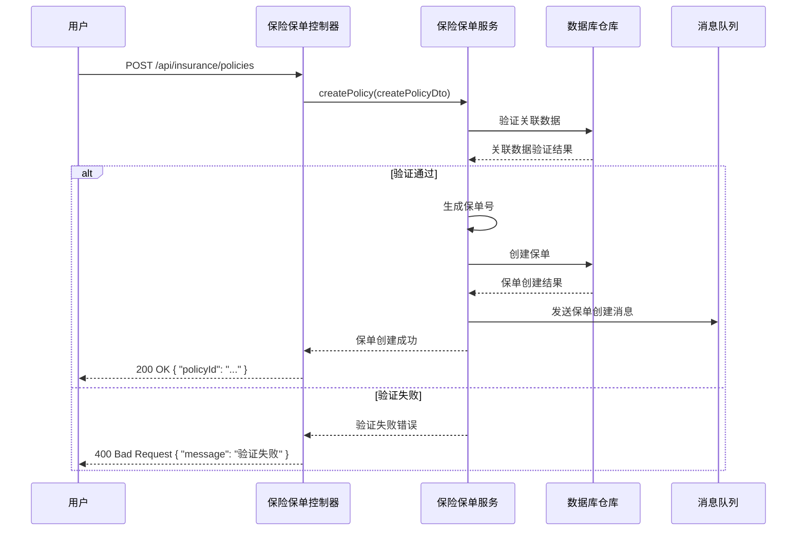
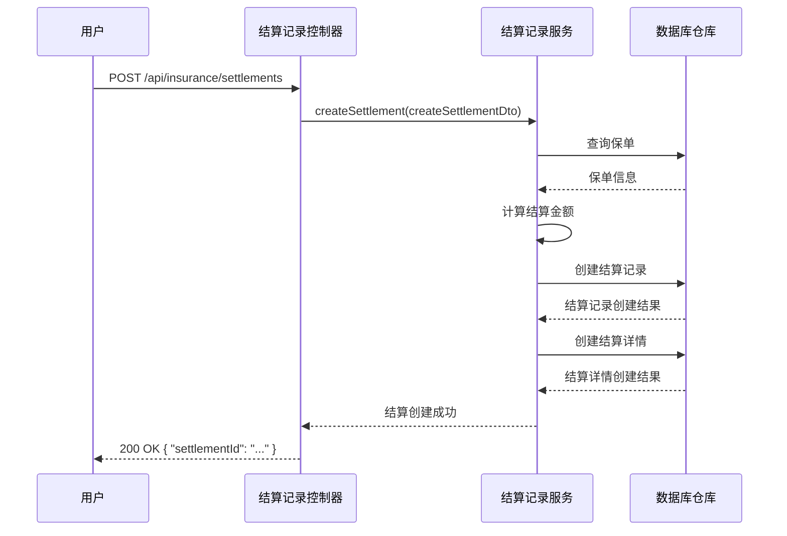

# 保险模块

## 1. 模块概述

保险模块是 MallEcoAPI 系统中的重要模块之一，负责处理保险相关的业务逻辑，包括保险公司管理、保险产品管理、保险保单管理、保险结算管理等。本文档详细描述了保险模块的功能、结构、技术实现等内容。

### 1.1 模块定位

保险模块在 MallEcoAPI 系统中扮演着以下角色：

- **核心业务模块**：保险模块是系统的核心业务模块之一，提供了完整的保险业务处理功能
- **数据管理中心**：保险模块管理着保险公司、保险产品、保险保单等重要数据
- **业务流程集成**：保险模块集成了保险销售、保单管理、结算等多个业务流程
- **外部系统对接**：保险模块可以与外部保险系统进行对接，实现数据同步和业务协同

### 1.2 核心价值

- **业务完整性**：提供完整的保险业务处理功能，满足保险业务的各种需求
- **数据准确性**：确保保险数据的准确性和一致性，避免数据错误
- **业务效率**：提高保险业务的处理效率，减少人工操作
- **风险管理**：通过保险产品和保单的管理，帮助企业进行风险管理
- **系统集成**：实现与其他系统的集成，提高系统的整体效率

## 2. 模块结构

### 2.1 目录结构

```
src/modules/insurance/
├── controllers/          # 控制器
├── dto/                  # 数据传输对象
├── entities/             # 实体
├── enums/                # 枚举
├── interfaces/           # 接口
├── services/             # 服务
└── insurance.module.ts   # 模块定义
```

### 2.2 核心组件

| 组件类型 | 组件名称 | 描述 | 文件路径 |
|----------|----------|------|----------|
| 模块 | InsuranceModule | 保险模块定义 | src/modules/insurance/insurance.module.ts |
| 控制器 | InsuranceCompanyController | 保险公司控制器 | src/modules/insurance/controllers/insurance-company.controller.ts |
| 控制器 | InsuranceProductController | 保险产品控制器 | src/modules/insurance/controllers/insurance-product.controller.ts |
| 控制器 | InsuranceProductTypeController | 保险产品类型控制器 | src/modules/insurance/controllers/insurance-product-type.controller.ts |
| 控制器 | InsurancePolicyController | 保险保单控制器 | src/modules/insurance/controllers/insurance-policy.controller.ts |
| 控制器 | PolicyHolderController | 投保人控制器 | src/modules/insurance/controllers/policy-holder.controller.ts |
| 控制器 | ChannelController | 渠道控制器 | src/modules/insurance/controllers/channel.controller.ts |
| 控制器 | SettlementRecordController | 结算记录控制器 | src/modules/insurance/controllers/settlement-record.controller.ts |
| 控制器 | ClaimRecordController | 理赔记录控制器 | src/modules/insurance/controllers/claim-record.controller.ts |
| 控制器 | RenewalRecordController | 续保记录控制器 | src/modules/insurance/controllers/renewal-record.controller.ts |
| 控制器 | ExternalIntegrationController | 外部系统集成控制器 | src/modules/insurance/controllers/external-integration.controller.ts |
| 控制器 | InsuranceStatisticsController | 保险统计控制器 | src/modules/insurance/controllers/insurance-statistics.controller.ts |
| 控制器 | InsuranceChartController | 保险图表控制器 | src/modules/insurance/controllers/insurance-chart.controller.ts |
| 服务 | InsuranceCompanyService | 保险公司服务 | src/modules/insurance/services/insurance-company.service.ts |
| 服务 | InsuranceProductService | 保险产品服务 | src/modules/insurance/services/insurance-product.service.ts |
| 服务 | InsuranceProductTypeService | 保险产品类型服务 | src/modules/insurance/services/insurance-product-type.service.ts |
| 服务 | InsurancePolicyService | 保险保单服务 | src/modules/insurance/services/insurance-policy.service.ts |
| 服务 | PolicyHolderService | 投保人服务 | src/modules/insurance/services/policy-holder.service.ts |
| 服务 | ChannelService | 渠道服务 | src/modules/insurance/services/channel.service.ts |
| 服务 | SettlementRecordService | 结算记录服务 | src/modules/insurance/services/settlement-record.service.ts |
| 服务 | ClaimRecordService | 理赔记录服务 | src/modules/insurance/services/claim-record.service.ts |
| 服务 | RenewalRecordService | 续保记录服务 | src/modules/insurance/services/renewal-record.service.ts |
| 服务 | ExternalIntegrationService | 外部系统集成服务 | src/modules/insurance/services/external-integration.service.ts |
| 服务 | InsuranceStatisticsService | 保险统计服务 | src/modules/insurance/services/insurance-statistics.service.ts |
| 实体 | InsuranceCompany | 保险公司实体 | src/modules/insurance/entities/insurance-company.entity.ts |
| 实体 | InsuranceProduct | 保险产品实体 | src/modules/insurance/entities/insurance-product.entity.ts |
| 实体 | InsuranceProductType | 保险产品类型实体 | src/modules/insurance/entities/insurance-product-type.entity.ts |
| 实体 | InsurancePolicy | 保险保单实体 | src/modules/insurance/entities/insurance-policy.entity.ts |
| 实体 | PolicyHolder | 投保人实体 | src/modules/insurance/entities/policy-holder.entity.ts |
| 实体 | Channel | 渠道实体 | src/modules/insurance/entities/channel.entity.ts |
| 实体 | SettlementRecord | 结算记录实体 | src/modules/insurance/entities/settlement-record.entity.ts |
| 实体 | SettlementDetail | 结算详情实体 | src/modules/insurance/entities/settlement-detail.entity.ts |
| 实体 | ClaimRecord | 理赔记录实体 | src/modules/insurance/entities/claim-record.entity.ts |
| 实体 | RenewalRecord | 续保记录实体 | src/modules/insurance/entities/renewal-record.entity.ts |

## 3. 核心功能

### 3.1 保险公司管理

**描述**：管理保险公司信息，包括添加、编辑、删除、查询保险公司

**核心功能**：
- 保险公司列表查询
- 保险公司详情查询
- 保险公司添加
- 保险公司编辑
- 保险公司删除
- 保险公司状态管理

**技术实现**：
- **控制器**：`InsuranceCompanyController`
- **服务**：`InsuranceCompanyService`
- **实体**：`InsuranceCompany`

### 3.2 保险产品类型管理

**描述**：管理保险产品类型信息，包括添加、编辑、删除、查询保险产品类型

**核心功能**：
- 保险产品类型列表查询
- 保险产品类型详情查询
- 保险产品类型添加
- 保险产品类型编辑
- 保险产品类型删除

**技术实现**：
- **控制器**：`InsuranceProductTypeController`
- **服务**：`InsuranceProductTypeService`
- **实体**：`InsuranceProductType`

### 3.3 保险产品管理

**描述**：管理保险产品信息，包括添加、编辑、删除、查询保险产品

**核心功能**：
- 保险产品列表查询
- 保险产品详情查询
- 保险产品添加
- 保险产品编辑
- 保险产品删除
- 保险产品状态管理

**技术实现**：
- **控制器**：`InsuranceProductController`
- **服务**：`InsuranceProductService`
- **实体**：`InsuranceProduct`

### 3.4 渠道管理

**描述**：管理保险销售渠道信息，包括添加、编辑、删除、查询渠道

**核心功能**：
- 渠道列表查询
- 渠道详情查询
- 渠道添加
- 渠道编辑
- 渠道删除
- 渠道状态管理

**技术实现**：
- **控制器**：`ChannelController`
- **服务**：`ChannelService`
- **实体**：`Channel`

### 3.5 投保人管理

**描述**：管理投保人信息，包括添加、编辑、删除、查询投保人

**核心功能**：
- 投保人列表查询
- 投保人详情查询
- 投保人添加
- 投保人编辑
- 投保人删除

**技术实现**：
- **控制器**：`PolicyHolderController`
- **服务**：`PolicyHolderService`
- **实体**：`PolicyHolder`

### 3.6 保险保单管理

**描述**：管理保险保单信息，包括添加、编辑、删除、查询保单，以及保单状态管理

**核心功能**：
- 保单列表查询
- 保单详情查询
- 保单添加
- 保单编辑
- 保单删除
- 保单状态管理
- 保单导入

**技术实现**：
- **控制器**：`InsurancePolicyController`
- **服务**：`InsurancePolicyService`
- **实体**：`InsurancePolicy`

### 3.7 保险结算管理

**描述**：管理保险结算信息，包括添加、编辑、删除、查询结算记录

**核心功能**：
- 结算记录列表查询
- 结算记录详情查询
- 结算记录添加
- 结算记录编辑
- 结算记录删除
- 结算状态管理

**技术实现**：
- **控制器**：`SettlementRecordController`
- **服务**：`SettlementRecordService`
- **实体**：`SettlementRecord`、`SettlementDetail`

### 3.8 保险理赔管理

**描述**：管理保险理赔信息，包括添加、编辑、删除、查询理赔记录，以及理赔状态管理

**核心功能**：
- 理赔记录列表查询
- 理赔记录详情查询
- 理赔记录添加
- 理赔记录编辑
- 理赔记录删除
- 理赔状态管理
- 理赔审核

**技术实现**：
- **控制器**：`ClaimRecordController`
- **服务**：`ClaimRecordService`
- **实体**：`ClaimRecord`

### 3.9 保险续保管理

**描述**：管理保险续保信息，包括添加、编辑、删除、查询续保记录，以及续保状态管理

**核心功能**：
- 续保记录列表查询
- 续保记录详情查询
- 续保记录添加
- 续保记录编辑
- 续保记录删除
- 续保状态管理
- 续保审核
- 即将到期保单提醒

**技术实现**：
- **控制器**：`RenewalRecordController`
- **服务**：`RenewalRecordService`
- **实体**：`RenewalRecord`

### 3.10 到期提醒管理

**描述**：管理保险保单的到期提醒，包括获取即将到期的保单、生成到期提醒、发送提醒通知等功能

**核心功能**：
- 获取即将到期的保单
- 生成到期提醒
- 发送单个保单的到期提醒
- 获取到期提醒统计
- 按剩余天数分组统计
- 按保险公司分组统计

**技术实现**：
- **控制器**：`ExpiryReminderController`
- **服务**：`ExpiryReminderService`
- **实体**：`InsurancePolicy`

### 3.11 外部系统集成

**描述**：实现与外部系统的集成，包括数据同步、业务协同等功能

**核心功能**：
- 与保险公司系统集成
- 与支付系统集成
- 与税务系统集成
- 数据同步管理
- 接口调用监控

**技术实现**：
- **控制器**：`ExternalIntegrationController`
- **服务**：`ExternalIntegrationService`
- **模块**：`HttpModule`

### 3.12 保险统计分析

**描述**：提供保险业务的统计分析功能，包括销售统计、保单统计、结算统计、理赔统计、续保统计等

**核心功能**：
- 保险销售统计
- 保单状态统计
- 结算统计
- 理赔统计
- 续保统计
- 保险图表数据

**技术实现**：
- **控制器**：`InsuranceStatisticsController`、`InsuranceChartController`
- **服务**：`InsuranceStatisticsService`

## 4. 技术实现

### 4.1 核心技术栈

| 技术 | 版本 | 用途 |
|------|------|------|
| NestJS | 9.0.0 | 后端框架 |
| TypeScript | 4.9.0 | 开发语言 |
| TypeORM | 0.3.0 | ORM 框架 |
| MySQL | 8.0.0 | 数据库 |
| Redis | 7.0.0 | 缓存 |
| RabbitMQ | 3.10.0 | 消息队列 |

### 4.2 关键代码示例

#### 4.2.1 保险模块定义

```typescript
@Module({
  imports: [
    TypeOrmModule.forFeature([
      InsuranceCompany,
      InsuranceProduct,
      InsuranceProductType,
      InsurancePolicy,
      PolicyHolder,
      Channel,
      SettlementRecord,
      SettlementDetail,
      ClaimRecord,
      RenewalRecord,
    ]),
    RabbitMQModule,
    HttpModule,
  ],
  controllers: [
    InsuranceCompanyController,
    InsuranceProductController,
    InsuranceProductTypeController,
    InsurancePolicyController,
    PolicyHolderController,
    ChannelController,
    SettlementRecordController,
    ClaimRecordController,
    RenewalRecordController,
    ExternalIntegrationController,
    InsuranceStatisticsController,
    InsuranceChartController,
  ],
  providers: [
    InsuranceCompanyService,
    InsuranceProductService,
    InsuranceProductTypeService,
    InsurancePolicyService,
    PolicyHolderService,
    ChannelService,
    SettlementRecordService,
    ClaimRecordService,
    RenewalRecordService,
    ExternalIntegrationService,
    InsuranceStatisticsService,
  ],
  exports: [
    InsuranceCompanyService,
    InsuranceProductService,
    InsuranceProductTypeService,
    InsurancePolicyService,
    PolicyHolderService,
    ChannelService,
    SettlementRecordService,
    ClaimRecordService,
    RenewalRecordService,
    ExternalIntegrationService,
    InsuranceStatisticsService,
  ],
})
export class InsuranceModule {}
```

#### 4.2.2 保险保单实体

```typescript
@Entity('insurance_policy')
export class InsurancePolicy {
  @PrimaryGeneratedColumn()
  id: number;

  @Column()
  policyNumber: string;

  @Column()
  insuranceProductId: number;

  @Column()
  insuranceCompanyId: number;

  @Column()
  policyHolderId: number;

  @Column()
  channelId: number;

  @Column({ type: 'decimal', precision: 10, scale: 2 })
  premium: number;

  @Column({ type: 'decimal', precision: 10, scale: 2 })
  insuredAmount: number;

  @Column()
  startDate: Date;

  @Column()
  endDate: Date;

  @Column()
  status: string;

  @Column({ type: 'text', nullable: true })
  remark: string;

  @CreateDateColumn()
  createdAt: Date;

  @UpdateDateColumn()
  updatedAt: Date;

  // 关联关系
  @ManyToOne(() => InsuranceProduct)
  insuranceProduct: InsuranceProduct;

  @ManyToOne(() => InsuranceCompany)
  insuranceCompany: InsuranceCompany;

  @ManyToOne(() => PolicyHolder)
  policyHolder: PolicyHolder;

  @ManyToOne(() => Channel)
  channel: Channel;

  @OneToMany(() => SettlementDetail, settlementDetail => settlementDetail.insurancePolicy)
  settlementDetails: SettlementDetail[];
}
```

#### 4.2.3 保险保单服务

```typescript
@Injectable()
export class InsurancePolicyService {
  constructor(
    @InjectRepository(InsurancePolicy) private readonly policyRepository: Repository<InsurancePolicy>,
    @InjectRepository(InsuranceProduct) private readonly productRepository: Repository<InsuranceProduct>,
    @InjectRepository(InsuranceCompany) private readonly companyRepository: Repository<InsuranceCompany>,
    @InjectRepository(PolicyHolder) private readonly holderRepository: Repository<PolicyHolder>,
    @InjectRepository(Channel) private readonly channelRepository: Repository<Channel>,
    private readonly messageQueueService: MessageQueueService,
  ) {}

  async createPolicy(createPolicyDto: CreateInsurancePolicyDto): Promise<InsurancePolicy> {
    // 验证关联数据存在
    const product = await this.productRepository.findOne({
      where: { id: createPolicyDto.insuranceProductId },
    });
    if (!product) {
      throw new BadRequestException('保险产品不存在');
    }

    const company = await this.companyRepository.findOne({
      where: { id: createPolicyDto.insuranceCompanyId },
    });
    if (!company) {
      throw new BadRequestException('保险公司不存在');
    }

    const holder = await this.holderRepository.findOne({
      where: { id: createPolicyDto.policyHolderId },
    });
    if (!holder) {
      throw new BadRequestException('投保人不存在');
    }

    const channel = await this.channelRepository.findOne({
      where: { id: createPolicyDto.channelId },
    });
    if (!channel) {
      throw new BadRequestException('渠道不存在');
    }

    // 生成保单号
    const policyNumber = this.generatePolicyNumber();

    // 创建保单
    const policy = this.policyRepository.create({
      ...createPolicyDto,
      policyNumber,
      status: 'active',
    });

    await this.policyRepository.save(policy);

    // 发送保单创建消息
    await this.messageQueueService.sendInsurancePolicyCreatedMessage({
      policyId: policy.id,
      policyNumber: policy.policyNumber,
      policyHolderId: policy.policyHolderId,
    });

    return policy;
  }

  async getPolicyList(query: any): Promise<{ policies: InsurancePolicy[]; total: number }> {
    const { page = 1, pageSize = 10, ...searchParams } = query;

    const queryBuilder = this.policyRepository.createQueryBuilder('policy');

    // 添加搜索条件
    if (searchParams.policyNumber) {
      queryBuilder.andWhere('policy.policyNumber LIKE :policyNumber', {
        policyNumber: `%${searchParams.policyNumber}%`,
      });
    }

    if (searchParams.status) {
      queryBuilder.andWhere('policy.status = :status', {
        status: searchParams.status,
      });
    }

    if (searchParams.insuranceProductId) {
      queryBuilder.andWhere('policy.insuranceProductId = :insuranceProductId', {
        insuranceProductId: searchParams.insuranceProductId,
      });
    }

    // 计算总数
    const total = await queryBuilder.getCount();

    // 分页查询
    const policies = await queryBuilder
      .skip((page - 1) * pageSize)
      .take(pageSize)
      .leftJoinAndSelect('policy.insuranceProduct', 'insuranceProduct')
      .leftJoinAndSelect('policy.insuranceCompany', 'insuranceCompany')
      .leftJoinAndSelect('policy.policyHolder', 'policyHolder')
      .leftJoinAndSelect('policy.channel', 'channel')
      .getMany();

    return { policies, total };
  }

  // 其他方法实现...

  private generatePolicyNumber(): string {
    const timestamp = Date.now().toString().slice(-8);
    const random = Math.floor(Math.random() * 10000).toString().padStart(4, '0');
    return `POL${timestamp}${random}`;
  }
}
```

### 4.3 API 接口

| 接口路径 | 方法 | 描述 | 模块 |
|----------|------|------|------|
| `/api/insurance/companies` | GET | 获取保险公司列表 | InsuranceCompanyController |
| `/api/insurance/companies/{id}` | GET | 获取保险公司详情 | InsuranceCompanyController |
| `/api/insurance/companies` | POST | 创建保险公司 | InsuranceCompanyController |
| `/api/insurance/companies/{id}` | PUT | 更新保险公司 | InsuranceCompanyController |
| `/api/insurance/companies/{id}` | DELETE | 删除保险公司 | InsuranceCompanyController |
| `/api/insurance/product-types` | GET | 获取保险产品类型列表 | InsuranceProductTypeController |
| `/api/insurance/product-types/{id}` | GET | 获取保险产品类型详情 | InsuranceProductTypeController |
| `/api/insurance/product-types` | POST | 创建保险产品类型 | InsuranceProductTypeController |
| `/api/insurance/product-types/{id}` | PUT | 更新保险产品类型 | InsuranceProductTypeController |
| `/api/insurance/product-types/{id}` | DELETE | 删除保险产品类型 | InsuranceProductTypeController |
| `/api/insurance/products` | GET | 获取保险产品列表 | InsuranceProductController |
| `/api/insurance/products/{id}` | GET | 获取保险产品详情 | InsuranceProductController |
| `/api/insurance/products` | POST | 创建保险产品 | InsuranceProductController |
| `/api/insurance/products/{id}` | PUT | 更新保险产品 | InsuranceProductController |
| `/api/insurance/products/{id}` | DELETE | 删除保险产品 | InsuranceProductController |
| `/api/insurance/channels` | GET | 获取渠道列表 | ChannelController |
| `/api/insurance/channels/{id}` | GET | 获取渠道详情 | ChannelController |
| `/api/insurance/channels` | POST | 创建渠道 | ChannelController |
| `/api/insurance/channels/{id}` | PUT | 更新渠道 | ChannelController |
| `/api/insurance/channels/{id}` | DELETE | 删除渠道 | ChannelController |
| `/api/insurance/policy-holders` | GET | 获取投保人列表 | PolicyHolderController |
| `/api/insurance/policy-holders/{id}` | GET | 获取投保人详情 | PolicyHolderController |
| `/api/insurance/policy-holders` | POST | 创建投保人 | PolicyHolderController |
| `/api/insurance/policy-holders/{id}` | PUT | 更新投保人 | PolicyHolderController |
| `/api/insurance/policy-holders/{id}` | DELETE | 删除投保人 | PolicyHolderController |
| `/api/insurance/policies` | GET | 获取保单列表 | InsurancePolicyController |
| `/api/insurance/policies/{id}` | GET | 获取保单详情 | InsurancePolicyController |
| `/api/insurance/policies` | POST | 创建保单 | InsurancePolicyController |
| `/api/insurance/policies/{id}` | PUT | 更新保单 | InsurancePolicyController |
| `/api/insurance/policies/{id}` | DELETE | 删除保单 | InsurancePolicyController |
| `/api/insurance/policies/import` | POST | 导入保单 | InsurancePolicyController |
| `/api/insurance/settlements` | GET | 获取结算记录列表 | SettlementRecordController |
| `/api/insurance/settlements/{id}` | GET | 获取结算记录详情 | SettlementRecordController |
| `/api/insurance/settlements` | POST | 创建结算记录 | SettlementRecordController |
| `/api/insurance/settlements/{id}` | PUT | 更新结算记录 | SettlementRecordController |
| `/api/insurance/settlements/{id}` | DELETE | 删除结算记录 | SettlementRecordController |
| `/api/insurance/claim-records` | GET | 获取理赔记录列表 | ClaimRecordController |
| `/api/insurance/claim-records/{id}` | GET | 获取理赔记录详情 | ClaimRecordController |
| `/api/insurance/claim-records` | POST | 创建理赔记录 | ClaimRecordController |
| `/api/insurance/claim-records/{id}` | PATCH | 更新理赔记录 | ClaimRecordController |
| `/api/insurance/claim-records/{id}` | DELETE | 删除理赔记录 | ClaimRecordController |
| `/api/insurance/claim-records/{id}/process` | PATCH | 处理理赔 | ClaimRecordController |
| `/api/insurance/claim-records/{id}/audit` | PATCH | 审核理赔 | ClaimRecordController |
| `/api/insurance/renewal-records` | GET | 获取续保记录列表 | RenewalRecordController |
| `/api/insurance/renewal-records/{id}` | GET | 获取续保记录详情 | RenewalRecordController |
| `/api/insurance/renewal-records` | POST | 创建续保记录 | RenewalRecordController |
| `/api/insurance/renewal-records/{id}` | PATCH | 更新续保记录 | RenewalRecordController |
| `/api/insurance/renewal-records/{id}` | DELETE | 删除续保记录 | RenewalRecordController |
| `/api/insurance/renewal-records/{id}/process` | PATCH | 处理续保 | RenewalRecordController |
| `/api/insurance/renewal-records/{id}/audit` | PATCH | 审核续保记录 | RenewalRecordController |
| `/api/insurance/renewal-records/statistics/overview` | GET | 获取续保统计信息 | RenewalRecordController |
| `/api/insurance/renewal-records/statistics/expiring-policies` | GET | 获取即将到期的保单 | RenewalRecordController |
| `/api/insurance/external-integration/sync-policy` | POST | 同步保单到外部系统 | ExternalIntegrationController |
| `/api/insurance/external-integration/sync-claim` | POST | 同步理赔到外部系统 | ExternalIntegrationController |
| `/api/insurance/external-integration/sync-renewal` | POST | 同步续保到外部系统 | ExternalIntegrationController |
| `/api/insurance/external-integration/query-claim-status` | GET | 查询外部系统理赔状态 | ExternalIntegrationController |
| `/api/insurance/external-integration/config` | GET | 获取外部系统配置 | ExternalIntegrationController |
| `/api/insurance/external-integration/config` | PUT | 更新外部系统配置 | ExternalIntegrationController |
| `/api/insurance/statistics/business` | GET | 获取保险业务统计 | InsuranceStatisticsController |
| `/api/insurance/statistics/premium-trend` | GET | 获取保费趋势分析 | InsuranceStatisticsController |
| `/api/insurance/statistics/company-distribution` | GET | 获取保险公司分布 | InsuranceStatisticsController |
| `/api/insurance/statistics/channel-distribution` | GET | 获取渠道分布 | InsuranceStatisticsController |
| `/api/insurance/statistics/settlement` | GET | 获取结算统计 | InsuranceStatisticsController |
| `/api/insurance/statistics/claim` | GET | 获取理赔统计 | InsuranceStatisticsController |
| `/api/insurance/statistics/claim-trend` | GET | 获取理赔趋势分析 | InsuranceStatisticsController |
| `/api/insurance/statistics/renewal` | GET | 获取续保统计 | InsuranceStatisticsController |
| `/api/insurance/charts/sales` | GET | 获取销售图表数据 | InsuranceChartController |
| `/api/insurance/charts/policies` | GET | 获取保单图表数据 | InsuranceChartController |
| `/api/insurance/charts/settlements` | GET | 获取结算图表数据 | InsuranceChartController |
| `/api/insurance/charts/claims` | GET | 获取理赔图表数据 | InsuranceChartController |
| `/api/insurance/charts/renewals` | GET | 获取续保图表数据 | InsuranceChartController |
| `/api/insurance/expiry-reminders/expiring-policies` | GET | 获取即将到期的保单 | ExpiryReminderController |
| `/api/insurance/expiry-reminders/generate` | GET | 生成到期提醒 | ExpiryReminderController |
| `/api/insurance/expiry-reminders/send/{policyId}` | GET | 发送单个保单的到期提醒 | ExpiryReminderController |
| `/api/insurance/expiry-reminders/statistics` | GET | 获取到期提醒统计 | ExpiryReminderController |

## 5. 业务流程

### 5.1 保险保单创建流程



### 5.2 保险结算流程



## 6. 技术实现要点

### 6.1 性能优化

1. **缓存策略**：使用 Redis 缓存保险公司、保险产品等频繁访问的数据
2. **批量操作**：对批量导入保单等操作使用批量处理，提高处理效率
3. **索引优化**：为保单号、状态等关键字段添加索引，提高查询速度
4. **异步处理**：使用消息队列处理保单创建、状态更新等操作，提高系统响应速度

### 6.2 可靠性保障

1. **事务管理**：使用事务管理确保数据操作的原子性
2. **异常处理**：完善异常处理机制，确保系统的稳定性
3. **数据验证**：使用 DTO 验证确保数据的合法性
4. **日志记录**：详细记录系统操作日志，便于问题定位

### 6.3 安全性考虑

1. **权限控制**：实现基于角色的权限控制，确保数据安全
2. **数据加密**：对敏感数据进行加密存储
3. **防注入攻击**：使用参数化查询防止 SQL 注入攻击
4. **API 限流**：实现 API 限流，防止恶意请求

## 7. 模块集成

### 7.1 与其他模块的集成

1. **与用户模块集成**：共享用户认证和授权功能
2. **与消息队列模块集成**：使用消息队列处理异步任务
3. **与统计模块集成**：提供保险数据的统计分析功能

### 7.2 与外部系统的集成

1. **与保险公司系统集成**：实现与保险公司系统的数据同步
2. **与支付系统集成**：实现保险保费的支付功能
3. **与税务系统集成**：实现保险业务的税务处理

## 8. 总结与展望

### 8.1 模块优势

- **功能完整**：提供了完整的保险业务处理功能，包括理赔管理、续保管理和外部系统集成
- **结构清晰**：模块结构清晰，代码组织合理，遵循 NestJS 最佳实践
- **技术先进**：使用了 NestJS、TypeScript、TypeORM 等先进技术
- **可扩展性强**：模块化设计，便于扩展和维护
- **性能优异**：采用了 Redis 缓存、RabbitMQ 消息队列等多种性能优化措施
- **API 设计规范**：优化了 API 接口设计，添加了完整的 Swagger 文档

### 8.2 改进空间

- **功能扩展**：继续增加更多的保险业务功能，如保险条款管理、保险经纪人管理等
- **系统集成**：进一步加强与外部系统的集成，支持更多的第三方系统对接
- **用户体验**：持续优化 API 接口设计，提高用户体验
- **数据分析**：增加更多的数据分析功能，为业务决策提供更全面的支持
- **性能优化**：进一步优化系统性能，提高系统的响应速度和并发处理能力

### 8.3 未来规划

- **版本 1.1**：已完成，增加了理赔管理、续保管理等功能
- **版本 1.2**：已完成，加强了与外部系统的集成
- **版本 1.3**：优化系统性能，提高系统的稳定性和可靠性
- **版本 1.4**：已完成，增加了更多的数据分析功能，包括理赔和续保的统计分析
- **版本 1.5**：增加保险条款管理和保险经纪人管理功能
- **版本 1.6**：加强与支付系统和税务系统的集成
- **版本 2.0**：重构系统架构，采用微服务架构，提高系统的可扩展性和可靠性

## 9. 附录

### 9.1 相关文件

| 文件路径 | 描述 |
|----------|------|
| `src/modules/insurance/insurance.module.ts` | 保险模块定义 |
| `src/modules/insurance/controllers/` | 保险模块控制器 |
| `src/modules/insurance/services/` | 保险模块服务 |
| `src/modules/insurance/entities/` | 保险模块实体 |
| `src/modules/insurance/dto/` | 保险模块数据传输对象 |

### 9.2 相关接口

| 接口路径 | 方法 | 描述 |
|----------|------|------|
| `/api/insurance/companies` | GET | 获取保险公司列表 |
| `/api/insurance/products` | GET | 获取保险产品列表 |
| `/api/insurance/policies` | GET | 获取保单列表 |
| `/api/insurance/settlements` | GET | 获取结算记录列表 |
| `/api/insurance/statistics/sales` | GET | 获取销售统计 |

### 9.3 参考资源

- **NestJS 官方文档**：https://docs.nestjs.com/
- **TypeORM 文档**：https://typeorm.io/
- **MySQL 官方文档**：https://dev.mysql.com/doc/
- **Redis 官方文档**：https://redis.io/documentation
- **RabbitMQ 官方文档**：https://www.rabbitmq.com/documentation.html

---

**文档更新时间**：2026-01-19
**文档版本**：v1.0.0
**作者**：MallEco 开发团队
