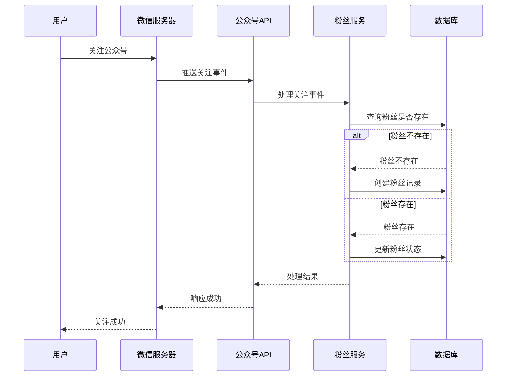
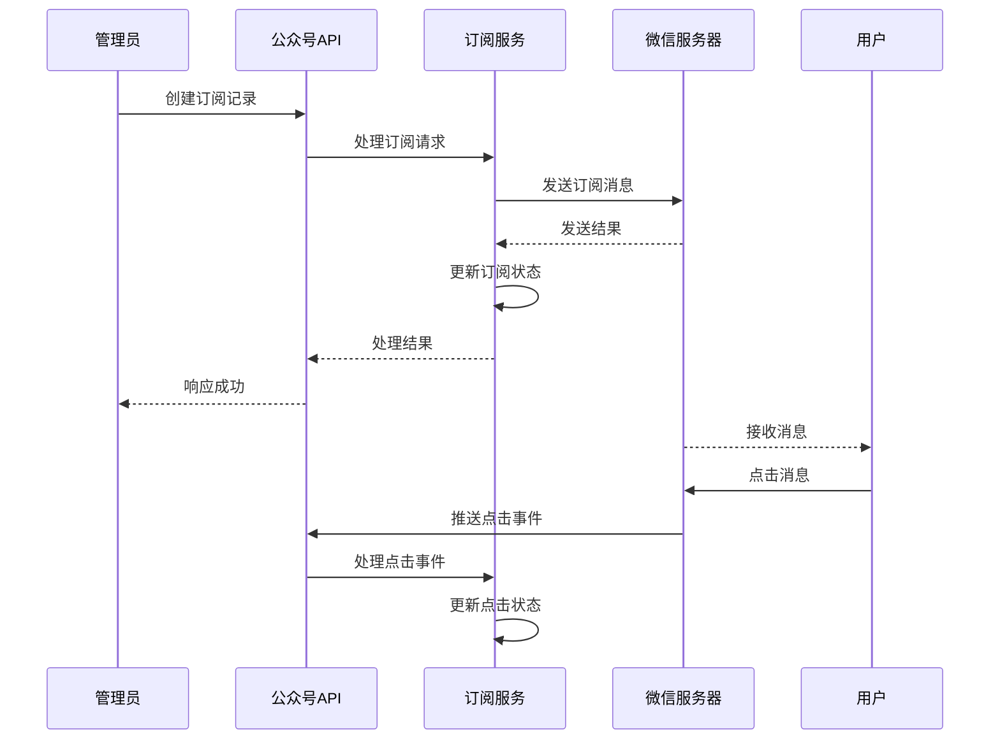

# 公众号模块

## 1. 模块概述

公众号模块是 MallEcoAPI 系统中的重要模块之一，负责处理微信公众号相关的业务逻辑，包括公众号配置管理、粉丝管理、消息管理、素材管理、自定义菜单管理等。本文档详细描述了公众号模块的功能、结构、技术实现等内容。

### 1.1 模块定位

公众号模块在 MallEcoAPI 系统中扮演着以下角色：

- **微信生态集成**：实现与微信公众号平台的完整集成
- **粉丝管理中心**：管理公众号粉丝信息，提供粉丝互动功能
- **消息处理中心**：处理公众号消息，包括订阅消息、模板消息等
- **素材管理中心**：管理公众号素材，包括图文、图片、视频、语音等
- **H5 网页管理**：管理公众号相关的 H5 网页
- **OAuth 授权管理**：管理公众号第三方授权应用

### 1.2 核心价值

- **用户触达**：通过公众号实现与用户的直接触达
- **消息通知**：实现订单、活动等消息的及时通知
- **品牌推广**：通过公众号进行品牌推广和活动宣传
- **用户互动**：增强用户与平台的互动性
- **数据收集**：收集用户行为数据，为运营决策提供支持

## 2. 模块结构

### 2.1 目录结构

```
src/modules/wechat/
├── controllers/          # 控制器
├── services/             # 服务
├── entities/             # 实体
├── dto/                  # 数据传输对象
├── interfaces/           # 接口
├── wechat.module.ts      # 模块定义
└── wechat.controller.ts  # 主控制器
```

### 2.2 核心组件

| 组件类型 | 组件名称 | 描述 | 文件路径 |
|----------|----------|------|----------|
| 模块 | WechatModule | 公众号模块定义 | src/modules/wechat/wechat.module.ts |
| 控制器 | WechatController | 公众号主控制器 | src/modules/wechat/wechat.controller.ts |
| 控制器 | WechatH5Controller | H5网页控制器 | src/modules/wechat/controllers/wechat-h5.controller.ts |
| 控制器 | WechatSubscribeController | 订阅消息控制器 | src/modules/wechat/controllers/wechat-subscribe.controller.ts |
| 控制器 | WechatFansController | 粉丝管理控制器 | src/modules/wechat/controllers/wechat-fans.controller.ts |
| 控制器 | WechatCouponController | 微信卡券控制器 | src/modules/wechat/controllers/wechat-coupon.controller.ts |
| 控制器 | WechatOauthAppController | OAuth应用控制器 | src/modules/wechat/controllers/wechat-oauth-app.controller.ts |
| 服务 | WechatService | 公众号核心服务 | src/modules/wechat/services/wechat.service.ts |
| 服务 | WechatTemplateService | 模板管理服务 | src/modules/wechat/services/wechat-template.service.ts |
| 服务 | WechatH5Service | H5网页服务 | src/modules/wechat/services/wechat-h5.service.ts |
| 服务 | WechatSubscribeService | 订阅消息服务 | src/modules/wechat/services/wechat-subscribe.service.ts |
| 服务 | WechatFansService | 粉丝管理服务 | src/modules/wechat/services/wechat-fans.service.ts |
| 服务 | WechatCouponService | 卡券管理服务 | src/modules/wechat/services/wechat-coupon.service.ts |
| 服务 | WechatOauthService | OAuth授权服务 | src/modules/wechat/services/wechat-oauth.service.ts |
| 实体 | WechatFans | 公众号粉丝实体 | src/modules/wechat/entities/wechat-fans.entity.ts |
| 实体 | WechatSubscribe | 公众号订阅实体 | src/modules/wechat/entities/wechat-subscribe.entity.ts |
| 实体 | WechatMaterialArticle | 公众号图文素材实体 | src/modules/wechat/entities/wechat-material-article.entity.ts |

## 3. 核心功能

### 3.1 公众号基础配置

**描述**：管理公众号的基础配置信息，包括AppID、AppSecret、Token等

**核心功能**：
- 获取公众号配置
- 更新公众号配置
- 公众号概览信息
- 公众号统计数据

**技术实现**：
- **控制器**：`WechatController`
- **服务**：`WechatService`

### 3.2 粉丝管理

**描述**：管理公众号粉丝信息，包括粉丝列表、关注状态、备注等

**核心功能**：
- 粉丝列表查询
- 粉丝详情查询
- 粉丝创建/更新
- 粉丝关注状态管理
- 粉丝黑名单管理
- 粉丝备注管理

**技术实现**：
- **控制器**：`WechatFansController`
- **服务**：`WechatFansService`
- **实体**：`WechatFans`

### 3.3 订阅消息管理

**描述**：管理公众号订阅消息，包括创建订阅记录、发送消息等

**核心功能**：
- 创建订阅记录
- 订阅记录列表查询
- 订阅记录详情查询
- 发送订阅消息
- 订阅状态管理

**技术实现**：
- **控制器**：`WechatSubscribeController`
- **服务**：`WechatSubscribeService`
- **实体**：`WechatSubscribe`

### 3.4 模板管理

**描述**：管理公众号消息模板，包括同步微信模板、管理本地模板等

**核心功能**：
- 同步微信模板
- 模板列表查询
- 模板详情查询
- 模板创建/更新
- 模板删除

**技术实现**：
- **服务**：`WechatTemplateService`

### 3.5 H5 网页管理

**描述**：管理公众号相关的 H5 网页，包括页面创建、编辑、发布等

**核心功能**：
- H5 页面列表查询
- H5 页面详情查询
- H5 页面创建
- H5 页面编辑
- H5 页面删除
- H5 模板管理

**技术实现**：
- **控制器**：`WechatH5Controller`
- **服务**：`WechatH5Service`

### 3.6 素材管理

**描述**：管理公众号素材，包括图文、图片、视频、语音等

**核心功能**：
- 图文素材管理
- 图片素材管理
- 视频素材管理
- 语音素材管理
- 素材上传
- 素材删除

**技术实现**：
- **控制器**：相关素材控制器
- **服务**：相关素材服务
- **实体**：`WechatMaterialArticle`

### 3.7 自定义菜单管理

**描述**：管理公众号自定义菜单，包括菜单配置、关键词设置等

**核心功能**：
- 自定义菜单配置
- 菜单关键词设置
- 菜单发布
- 菜单查询

**技术实现**：
- **控制器**：相关菜单控制器
- **服务**：相关菜单服务

### 3.8 OAuth 授权管理

**描述**：管理公众号第三方授权应用，包括授权应用、授权令牌、授权用户等

**核心功能**：
- 授权应用管理
- 授权令牌管理
- 授权用户管理
- 授权回调处理

**技术实现**：
- **控制器**：`WechatOauthAppController`
- **服务**：`WechatOauthService`

### 3.9 微信卡券管理

**描述**：管理公众号微信卡券，包括卡券创建、发放、核销等

**核心功能**：
- 卡券列表查询
- 卡券详情查询
- 卡券创建
- 卡券发放
- 卡券核销

**技术实现**：
- **控制器**：`WechatCouponController`
- **服务**：`WechatCouponService`

## 4. 技术实现

### 4.1 核心技术栈

| 技术 | 版本 | 用途 |
|------|------|------|
| NestJS | 9.0.0 | 后端框架 |
| TypeScript | 4.9.0 | 开发语言 |
| TypeORM | 0.3.0 | ORM 框架 |
| MySQL | 8.0.0 | 数据库 |
| Redis | 7.0.0 | 缓存 |
| RabbitMQ | 3.10.0 | 消息队列 |
| 微信公众号API | v1.0 | 微信公众号接口 |

### 4.2 关键代码示例

#### 4.2.1 公众号模块定义

```typescript
@Module({
  imports: [
    TypeOrmModule.forFeature([
      WechatFans,
      WechatSubscribe,
      WechatMaterialArticle,
      // 其他公众号相关实体
    ]),
    HttpModule,
  ],
  controllers: [
    WechatController,
    WechatH5Controller,
    WechatSubscribeController,
    WechatFansController,
    WechatCouponController,
    WechatOauthAppController,
  ],
  providers: [
    WechatService,
    WechatTemplateService,
    WechatH5Service,
    WechatSubscribeService,
    WechatFansService,
    WechatCouponService,
    WechatOauthService,
  ],
  exports: [
    WechatService,
    WechatTemplateService,
    WechatH5Service,
    WechatSubscribeService,
    WechatFansService,
    WechatCouponService,
    WechatOauthService,
  ],
})
export class WechatModule {}
```

#### 4.2.2 公众号配置服务

```typescript
@Injectable()
export class WechatService {
  constructor(
    private readonly configService: ConfigService,
  ) {}

  /**
   * 获取公众号配置
   */
  async getConfig() {
    return {
      appId: process.env.WECHAT_APP_ID || '',
      appSecret: process.env.WECHAT_APP_SECRET || '',
      token: process.env.WECHAT_TOKEN || '',
      aesKey: process.env.WECHAT_AES_KEY || '',
      accessToken: '',
      expiresIn: 0,
    };
  }

  /**
   * 更新公众号配置
   */
  async updateConfig(configData: any) {
    // 实现配置更新逻辑
    return { success: true, message: '配置更新成功' };
  }

  /**
   * 获取公众号概览
   */
  async getOverview() {
    // 实现概览数据获取逻辑
    return {
      totalFans: 0,
      newFans: 0,
      activeFans: 0,
      messageCount: 0,
      articleCount: 0,
    };
  }

  /**
   * 获取公众号统计数据
   */
  async getStats() {
    // 实现统计数据获取逻辑
    return {
      fansGrowth: [],
      messageTrend: [],
      articleRead: [],
    };
  }
}
```

## 5. API 接口

| 接口路径 | 方法 | 描述 | 模块 |
|----------|------|------|------|
| `/api/wechat/overview` | GET | 获取公众号概览 | WechatController |
| `/api/wechat/config` | GET | 获取公众号配置 | WechatController |
| `/api/wechat/config` | POST | 更新公众号配置 | WechatController |
| `/api/wechat/stats` | GET | 获取公众号统计数据 | WechatController |
| `/api/wechat/fans` | GET | 获取粉丝列表 | WechatFansController |
| `/api/wechat/fans/{id}` | GET | 获取粉丝详情 | WechatFansController |
| `/api/wechat/fans` | POST | 创建粉丝 | WechatFansController |
| `/api/wechat/fans/{id}` | PATCH | 更新粉丝 | WechatFansController |
| `/api/wechat/fans/{id}` | DELETE | 删除粉丝 | WechatFansController |
| `/api/wechat/subscribe` | POST | 创建订阅记录 | WechatSubscribeController |
| `/api/wechat/subscribe` | GET | 获取订阅记录列表 | WechatSubscribeController |
| `/api/wechat/subscribe/{id}` | GET | 获取订阅记录详情 | WechatSubscribeController |
| `/api/wechat/h5-pages` | GET | 获取H5页面列表 | WechatH5Controller |
| `/api/wechat/h5-pages/{id}` | GET | 获取H5页面详情 | WechatH5Controller |
| `/api/wechat/h5-pages` | POST | 创建H5页面 | WechatH5Controller |
| `/api/wechat/h5-pages/{id}` | PUT | 更新H5页面 | WechatH5Controller |
| `/api/wechat/h5-pages/{id}` | DELETE | 删除H5页面 | WechatH5Controller |
| `/api/wechat/oauth-app` | GET | 获取授权应用列表 | WechatOauthAppController |
| `/api/wechat/coupons` | GET | 获取卡券列表 | WechatCouponController |
| `/api/wechat/coupons/{id}` | GET | 获取卡券详情 | WechatCouponController |

## 6. 业务流程

### 6.1 粉丝关注流程



### 6.2 订阅消息发送流程



## 7. 技术实现要点

### 7.1 性能优化

1. **缓存策略**：使用 Redis 缓存公众号 access_token 等频繁访问的数据
2. **异步处理**：使用消息队列处理消息发送等耗时操作
3. **批量操作**：对批量粉丝处理等操作使用批量处理，提高效率
4. **索引优化**：为粉丝表的 openid、关注状态等字段添加索引

### 7.2 可靠性保障

1. **错误重试**：实现消息发送失败的自动重试机制
2. **异常处理**：完善的异常处理机制，确保系统稳定性
3. **日志记录**：详细记录微信接口调用日志，便于问题定位
4. **数据验证**：严格的数据验证，确保数据合法性

### 7.3 安全性考虑

1. **Token 管理**：安全管理公众号 access_token
2. **数据加密**：对敏感数据进行加密存储
3. **接口签名**：验证微信接口调用的签名
4. **IP 白名单**：配置微信服务器 IP 白名单

## 8. 模块集成

### 8.1 与其他模块的集成

1. **与订单模块集成**：实现订单状态变更的微信通知
2. **与用户模块集成**：实现用户与微信粉丝的关联
3. **与商品模块集成**：实现商品促销的微信通知
4. **与统计模块集成**：提供公众号数据的统计分析

### 8.2 与微信平台的集成

1. **公众号 API**：集成微信公众号接口
2. **消息推送**：实现微信消息推送
3. **素材管理**：集成微信素材管理接口
4. **菜单管理**：集成微信自定义菜单接口

## 9. 前端实现

公众号模块的前端实现位于 `MallEcoUI/manager/views/wechat/` 目录下，包含以下页面：

| 页面文件 | 描述 | 功能 |
|----------|------|------|
| `h5-pages.vue` | H5页面管理 | 管理公众号H5页面 |
| `h5-template.vue` | H5模板管理 | 管理H5页面模板 |
| `material-article.vue` | 素材文章管理 | 管理公众号图文素材 |
| `material-image.vue` | 素材图片管理 | 管理公众号图片素材 |
| `material-video.vue` | 素材视频管理 | 管理公众号视频素材 |
| `material-voice.vue` | 素材语音管理 | 管理公众号语音素材 |
| `menu-config.vue` | 菜单配置 | 配置公众号自定义菜单 |
| `menu-keywords.vue` | 菜单关键词 | 配置菜单关键词回复 |
| `oauth-app.vue` | OAuth应用管理 | 管理第三方授权应用 |
| `oauth-token.vue` | OAuth令牌管理 | 管理授权令牌 |
| `oauth-user.vue` | OAuth用户管理 | 管理授权用户 |
| `subscribe.vue` | 订阅消息管理 | 管理公众号订阅消息 |
| `template.vue` | 模板管理 | 管理消息模板 |

## 10. 总结与展望

### 10.1 模块优势

- **功能完整**：提供了完整的公众号管理功能，包括粉丝、消息、素材、H5等
- **结构清晰**：模块结构清晰，代码组织合理，遵循 NestJS 最佳实践
- **技术先进**：使用了 NestJS、TypeScript、TypeORM 等先进技术
- **可扩展性强**：模块化设计，便于扩展和维护
- **前端完善**：提供了完整的前端管理界面

### 10.2 改进空间

- **功能扩展**：增加更多的公众号功能，如小程序管理、企业微信集成等
- **性能优化**：进一步优化微信接口调用性能
- **数据分析**：增加更丰富的公众号数据分析功能
- **自动化运营**：实现更多的自动化运营功能

### 10.3 未来规划

- **版本 1.1**：增加小程序管理功能
- **版本 1.2**：增加企业微信集成
- **版本 1.3**：优化消息推送机制，增加智能推荐
- **版本 1.4**：增加更多的数据分析和运营工具

## 11. 附录

### 11.1 相关文件

| 文件路径 | 描述 |
|----------|------|
| `src/modules/wechat/wechat.module.ts` | 公众号模块定义 |
| `src/modules/wechat/controllers/` | 公众号控制器 |
| `src/modules/wechat/services/` | 公众号服务 |
| `src/modules/wechat/entities/` | 公众号实体 |
| `MallEcoUI/manager/views/wechat/` | 公众号前端页面 |

### 11.2 参考资源

- **微信公众号开发文档**：https://developers.weixin.qq.com/doc/offiaccount/Getting_Started/Overview.html
- **NestJS 官方文档**：https://docs.nestjs.com/
- **TypeORM 文档**：https://typeorm.io/

---

**文档更新时间**：2026-01-19
**文档版本**：v1.0.0
**作者**：MallEco 开发团队
