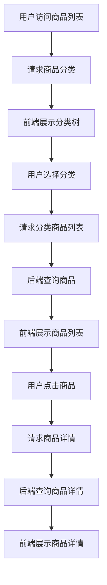
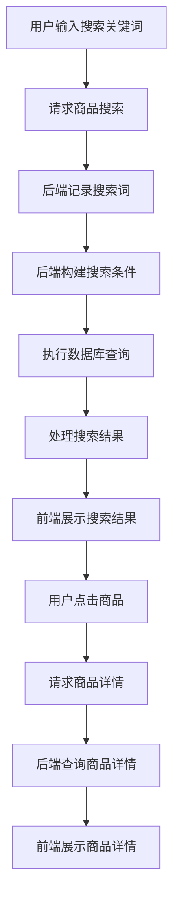
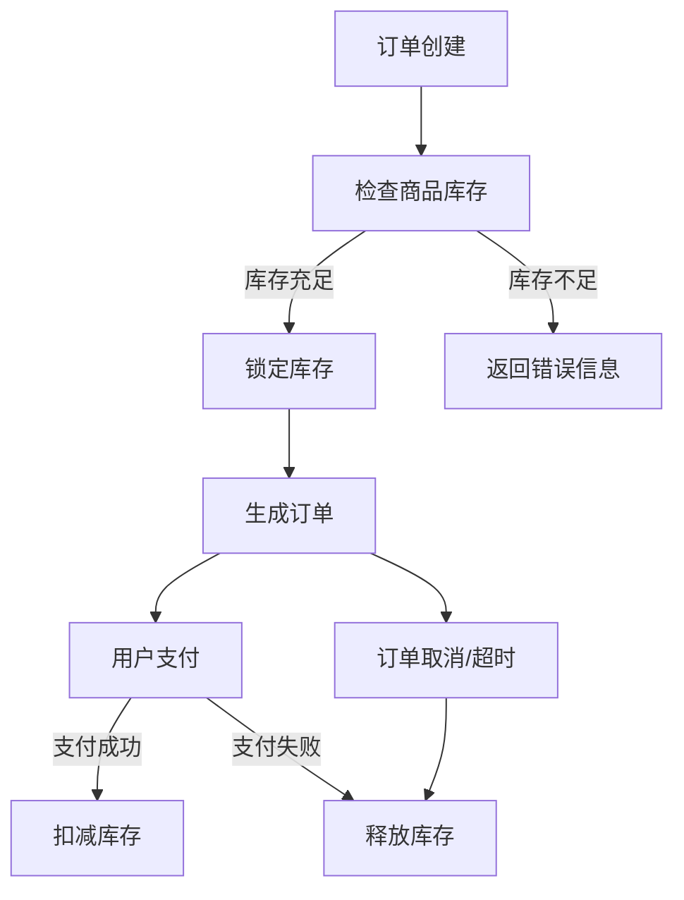

# 商品模块文档

## 1. 模块概述

商品模块是 MallEcoAPI 系统的核心业务模块之一，负责商品信息的管理、库存控制、分类管理等功能。该模块为前端提供商品浏览、搜索、详情查看等能力，是电商系统的基础。

### 1.1 模块定位

商品模块在系统中扮演着以下角色：

- **商品信息管理**：维护商品的基本信息、规格、属性等
- **库存管理**：管理商品库存，确保库存数据的准确性
- **分类管理**：维护商品分类体系，便于商品的组织和查找
- **商品搜索**：提供商品搜索功能，支持关键词、分类、价格等多维度搜索
- **商品推荐**：基于用户行为和商品属性，提供个性化商品推荐

### 1.2 核心价值

- **数据完整性**：确保商品信息的完整和准确
- **库存准确性**：实时更新库存数据，防止超卖
- **搜索效率**：提供快速、准确的商品搜索能力
- **用户体验**：通过合理的商品组织和推荐，提高用户购物体验
- **业务灵活性**：支持多种商品类型和销售模式

## 2. 目录结构

```
src/modules/goods/
├── controllers/         # 控制器
│   ├── goods.controller.ts        # 商品控制器
│   └── goods-full.controller.ts   # 商品综合控制器
├── entities/            # 实体
│   ├── goods.entity.ts            # 商品实体
│   ├── goods-sku.entity.ts        # 商品 SKU 实体
│   └── goods-category.entity.ts   # 商品分类实体
├── services/            # 服务
│   ├── goods.service.ts           # 商品服务
│   ├── goods.service.spec.ts      # 商品服务测试
│   └── goods-full.service.ts      # 商品综合服务
├── goods.module.ts      # 商品模块

src/modules/buyer/goods/
├── controllers/         # 买家端控制器
│   ├── category.controller.ts     # 分类控制器
│   └── goods.controller.ts        # 商品控制器
├── services/            # 买家端服务
│   ├── category.service.ts        # 分类服务
│   ├── goods.service.ts           # 商品服务
│   └── hot-words.service.ts        # 热门搜索词服务
└── goods.module.ts      # 买家端商品模块
```

## 3. 核心组件

### 3.1 GoodsService

**功能**：商品服务的核心，处理商品的 CRUD 操作和库存管理

**主要方法**：

| 方法名 | 功能描述 | 参数 | 返回值 |
|--------|----------|------|--------|
| `createGoods` | 创建商品 | `goodsDto: CreateGoodsDto` | `Promise<Goods>` |
| `updateGoods` | 更新商品 | `id: string; goodsDto: UpdateGoodsDto` | `Promise<Goods>` |
| `deleteGoods` | 删除商品 | `id: string` | `Promise<void>` |
| `getGoodsById` | 根据 ID 获取商品 | `id: string` | `Promise<Goods>` |
| `getGoodsList` | 获取商品列表 | `query: GoodsQueryDto` | `Promise<{ items: Goods[]; total: number }>` |
| `checkGoodsStock` | 检查商品库存 | `goodsId: string; quantity: number` | `Promise<boolean>` |
| `deductGoodsStock` | 扣减商品库存 | `goodsId: string; quantity: number` | `Promise<void>` |
| `restoreGoodsStock` | 恢复商品库存 | `goodsId: string; quantity: number` | `Promise<void>` |

**实现原理**：

1. **商品管理**：使用 TypeORM 操作数据库，实现商品的增删改查
2. **库存管理**：在数据库层面实现库存的检查、扣减和恢复
3. **事务处理**：使用数据库事务确保库存操作的原子性
4. **缓存策略**：使用 Redis 缓存热门商品数据，提高查询性能

### 3.2 GoodsFullService

**功能**：商品综合服务，提供商品详情、搜索等综合功能

**主要方法**：

| 方法名 | 功能描述 | 参数 | 返回值 |
|--------|----------|------|--------|
| `getGoodsDetail` | 获取商品详情 | `id: string` | `Promise<GoodsDetail>` |
| `searchGoods` | 搜索商品 | `query: SearchQueryDto` | `Promise<{ items: Goods[]; total: number }>` |
| `getRelatedGoods` | 获取相关商品 | `goodsId: string; limit: number` | `Promise<Goods[]>` |
| `getRecommendedGoods` | 获取推荐商品 | `userId: string; limit: number` | `Promise<Goods[]>` |

**实现原理**：

1. **商品详情**：聚合商品基本信息、SKU、属性、评价等数据
2. **商品搜索**：使用多条件组合查询，支持关键词、分类、价格等过滤
3. **相关推荐**：基于商品分类、属性等，推荐相关商品
4. **个性化推荐**：基于用户浏览历史和购买行为，推荐个性化商品

### 3.3 CategoryService

**功能**：商品分类服务，管理商品分类体系

**主要方法**：

| 方法名 | 功能描述 | 参数 | 返回值 |
|--------|----------|------|--------|
| `createCategory` | 创建分类 | `categoryDto: CreateCategoryDto` | `Promise<GoodsCategory>` |
| `updateCategory` | 更新分类 | `id: string; categoryDto: UpdateCategoryDto` | `Promise<GoodsCategory>` |
| `deleteCategory` | 删除分类 | `id: string` | `Promise<void>` |
| `getCategoryById` | 根据 ID 获取分类 | `id: string` | `Promise<GoodsCategory>` |
| `getCategoryList` | 获取分类列表 | `query: CategoryQueryDto` | `Promise<GoodsCategory[]>` |
| `getCategoryTree` | 获取分类树 | - | `Promise<GoodsCategory[]>` |

**实现原理**：

1. **分类管理**：使用 TypeORM 操作数据库，实现分类的增删改查
2. **分类树**：递归构建分类树结构，支持多级分类
3. **分类排序**：支持分类的排序和优先级设置

### 3.4 HotWordsService

**功能**：热门搜索词服务，管理和分析热门搜索词

**主要方法**：

| 方法名 | 功能描述 | 参数 | 返回值 |
|--------|----------|------|--------|
| `addHotWord` | 添加热门搜索词 | `word: string` | `Promise<void>` |
| `getHotWords` | 获取热门搜索词 | `limit: number` | `Promise<string[]>` |
| `analyzeSearchTrends` | 分析搜索趋势 | `days: number` | `Promise<{ word: string; count: number }[]>` |

**实现原理**：

1. **搜索词记录**：记录用户的搜索词，统计搜索次数
2. **热门词计算**：定期计算热门搜索词，更新缓存
3. **趋势分析**：分析搜索词的时间分布，识别搜索趋势

## 3. 数据模型

### 3.1 商品实体 (Goods)

| 字段名 | 类型 | 描述 |
|--------|------|------|
| `id` | string | 商品 ID |
| `goodsSn` | string | 商品编号 |
| `name` | string | 商品名称 |
| `categoryId` | string | 分类 ID |
| `brandId` | string | 品牌 ID |
| `shopId` | string | 店铺 ID |
| `price` | number | 商品价格 |
| `originalPrice` | number | 商品原价 |
| `stock` | number | 商品库存 |
| `sales` | number | 商品销量 |
| `weight` | number | 商品重量 |
| `isOnSale` | boolean | 是否上架 |
| `isDelete` | boolean | 是否删除 |
| `sortOrder` | number | 排序顺序 |
| `keywords` | string | 搜索关键词 |
| `brief` | string | 商品简介 |
| `detail` | string | 商品详情（JSON 格式） |
| `images` | string[] | 商品图片 |
| `specType` | number | 规格类型 |
| `createdAt` | Date | 创建时间 |
| `updatedAt` | Date | 更新时间 |

### 3.2 商品 SKU 实体 (GoodsSku)

| 字段名 | 类型 | 描述 |
|--------|------|------|
| `id` | string | SKU ID |
| `goodsId` | string | 商品 ID |
| `specs` | string | 规格属性（JSON 格式） |
| `price` | number | SKU 价格 |
| `originalPrice` | number | SKU 原价 |
| `stock` | number | SKU 库存 |
| `skuCode` | string | SKU 编码 |
| `image` | string | SKU 图片 |
| `createdAt` | Date | 创建时间 |
| `updatedAt` | Date | 更新时间 |

### 3.3 商品分类实体 (GoodsCategory)

| 字段名 | 类型 | 描述 |
|--------|------|------|
| `id` | string | 分类 ID |
| `name` | string | 分类名称 |
| `parentId` | string | 父分类 ID |
| `level` | number | 分类级别 |
| `image` | string | 分类图片 |
| `icon` | string | 分类图标 |
| `sortOrder` | number | 排序顺序 |
| `isShow` | boolean | 是否显示 |
| `createdAt` | Date | 创建时间 |
| `updatedAt` | Date | 更新时间 |

## 4. 核心功能

### 4.1 商品管理

#### 4.1.1 商品创建

**功能描述**：创建新商品，包括基本信息、规格、属性等

**流程**：

1. 接收商品创建请求，验证请求数据
2. 生成商品编号和 SKU 编码
3. 保存商品基本信息
4. 保存商品 SKU 信息
5. 初始化商品库存
6. 清除相关缓存

**代码示例**：

```typescript
async createGoods(goodsDto: CreateGoodsDto): Promise<Goods> {
  // 生成商品编号
  const goodsSn = `GOODS${Date.now()}${Math.floor(Math.random() * 10000)}`;
  
  // 创建商品
  const goods = this.goodsRepository.create({
    ...goodsDto,
    goodsSn,
    sales: 0,
  });
  
  // 保存商品
  await this.goodsRepository.save(goods);
  
  // 处理 SKU
  if (goodsDto.skus && goodsDto.skus.length > 0) {
    for (const sku of goodsDto.skus) {
      const goodsSku = this.goodsSkuRepository.create({
        goodsId: goods.id,
        ...sku,
        skuCode: `SKU${Date.now()}${Math.floor(Math.random() * 10000)}`,
      });
      await this.goodsSkuRepository.save(goodsSku);
    }
  }
  
  // 清除缓存
  await this.cacheService.delete(`goods:${goods.id}`);
  await this.cacheService.delete('goods:list');
  
  return goods;
}
```

#### 4.1.2 商品更新

**功能描述**：更新商品信息，包括基本信息、规格、属性等

**流程**：

1. 接收商品更新请求，验证请求数据
2. 查询商品是否存在
3. 更新商品基本信息
4. 更新商品 SKU 信息（添加、修改、删除）
5. 清除相关缓存

#### 4.1.3 商品删除

**功能描述**：删除商品，支持物理删除和逻辑删除

**流程**：

1. 接收商品删除请求
2. 查询商品是否存在
3. 检查商品是否有未完成的订单
4. 执行删除操作（物理或逻辑）
5. 清除相关缓存

### 4.2 库存管理

#### 4.2.1 库存检查

**功能描述**：检查商品库存是否充足

**流程**：

1. 接收库存检查请求
2. 查询商品或 SKU 的库存
3. 比较库存与请求数量
4. 返回检查结果

**代码示例**：

```typescript
async checkGoodsStock(goodsId: string, quantity: number): Promise<boolean> {
  const goods = await this.goodsRepository.findOne({
    where: { id: goodsId },
  });
  
  if (!goods) {
    throw new NotFoundException('商品不存在');
  }
  
  if (goods.stock < quantity) {
    return false;
  }
  
  return true;
}
```

#### 4.2.2 库存扣减

**功能描述**：扣减商品库存

**流程**：

1. 接收库存扣减请求
2. 检查商品库存是否充足
3. 开始数据库事务
4. 扣减商品库存
5. 扣减对应 SKU 的库存（如果有）
6. 提交事务
7. 清除相关缓存

**代码示例**：

```typescript
async deductGoodsStock(goodsId: string, quantity: number): Promise<void> {
  // 检查库存
  const hasStock = await this.checkGoodsStock(goodsId, quantity);
  if (!hasStock) {
    throw new BadRequestException('商品库存不足');
  }
  
  // 开始事务
  await this.goodsRepository.manager.transaction(async (manager) => {
    // 扣减商品库存
    const goods = await manager.findOne(Goods, {
      where: { id: goodsId },
    });
    
    goods.stock -= quantity;
    goods.sales += quantity;
    
    await manager.save(goods);
    
    // 这里可以添加 SKU 库存扣减逻辑
  });
  
  // 清除缓存
  await this.cacheService.delete(`goods:${goodsId}`);
}
```

#### 4.2.3 库存恢复

**功能描述**：恢复商品库存（如订单取消时）

**流程**：

1. 接收库存恢复请求
2. 开始数据库事务
3. 恢复商品库存
4. 恢复对应 SKU 的库存（如果有）
5. 提交事务
6. 清除相关缓存

### 4.3 分类管理

#### 4.3.1 分类创建

**功能描述**：创建商品分类

**流程**：

1. 接收分类创建请求，验证请求数据
2. 检查父分类是否存在
3. 计算分类级别
4. 保存分类信息
5. 清除分类缓存

#### 4.3.2 分类树构建

**功能描述**：构建商品分类树结构

**流程**：

1. 查询所有分类
2. 递归构建分类树
3. 缓存分类树
4. 返回分类树

**代码示例**：

```typescript
async getCategoryTree(): Promise<GoodsCategory[]> {
  // 尝试从缓存获取
  const cachedTree = await this.cacheService.get('category:tree');
  if (cachedTree) {
    return cachedTree;
  }
  
  // 查询所有分类
  const categories = await this.categoryRepository.find({
    order: { sortOrder: 'ASC' },
  });
  
  // 构建分类树
  const tree = this.buildCategoryTree(categories, null);
  
  // 缓存分类树
  await this.cacheService.set('category:tree', tree, 3600);
  
  return tree;
}

private buildCategoryTree(categories: GoodsCategory[], parentId: string | null): GoodsCategory[] {
  return categories
    .filter(category => category.parentId === parentId)
    .map(category => ({
      ...category,
      children: this.buildCategoryTree(categories, category.id),
    }));
}
```

### 4.4 商品搜索

#### 4.4.1 关键词搜索

**功能描述**：根据关键词搜索商品

**流程**：

1. 接收搜索请求，解析搜索参数
2. 构建搜索条件（关键词、分类、价格等）
3. 执行数据库查询
4. 处理搜索结果
5. 记录搜索词

#### 4.4.2 高级搜索

**功能描述**：支持多维度的商品搜索

**流程**：

1. 接收搜索请求，解析搜索参数
2. 构建复杂搜索条件（关键词、分类、价格区间、属性等）
3. 执行数据库查询
4. 处理搜索结果
5. 排序和分页

### 4.5 商品推荐

#### 4.5.1 相关商品推荐

**功能描述**：根据当前商品推荐相关商品

**流程**：

1. 接收推荐请求，获取当前商品 ID
2. 查询当前商品信息
3. 根据商品分类、品牌等属性，查询相关商品
4. 排序和过滤
5. 返回推荐结果

#### 4.5.2 个性化推荐

**功能描述**：基于用户行为推荐商品

**流程**：

1. 接收推荐请求，获取用户 ID
2. 查询用户浏览历史、购买历史等行为数据
3. 分析用户偏好
4. 查询符合用户偏好的商品
5. 排序和过滤
6. 返回推荐结果

## 5. 业务流程

### 5.1 商品浏览流程



### 5.2 商品搜索流程



### 5.3 库存管理流程



## 6. 接口设计

### 6.1 商品接口

| API 路径 | 方法 | 功能描述 | 认证要求 |
|----------|------|----------|----------|
| `/api/goods` | GET | 获取商品列表 | 否 |
| `/api/goods/:id` | GET | 获取商品详情 | 否 |
| `/api/goods` | POST | 创建商品 | 是（管理员） |
| `/api/goods/:id` | PUT | 更新商品 | 是（管理员） |
| `/api/goods/:id` | DELETE | 删除商品 | 是（管理员） |
| `/api/goods/search` | GET | 搜索商品 | 否 |
| `/api/goods/recommend` | GET | 获取推荐商品 | 否 |

### 6.2 分类接口

| API 路径 | 方法 | 功能描述 | 认证要求 |
|----------|------|----------|----------|
| `/api/categories` | GET | 获取分类列表 | 否 |
| `/api/categories/tree` | GET | 获取分类树 | 否 |
| `/api/categories/:id` | GET | 获取分类详情 | 否 |
| `/api/categories` | POST | 创建分类 | 是（管理员） |
| `/api/categories/:id` | PUT | 更新分类 | 是（管理员） |
| `/api/categories/:id` | DELETE | 删除分类 | 是（管理员） |

### 6.3 库存接口

| API 路径 | 方法 | 功能描述 | 认证要求 |
|----------|------|----------|----------|
| `/api/goods/:id/stock` | GET | 获取商品库存 | 是（管理员） |
| `/api/goods/:id/stock` | PUT | 更新商品库存 | 是（管理员） |
| `/api/goods/stock/check` | POST | 检查商品库存 | 否 |
| `/api/goods/stock/deduct` | POST | 扣减商品库存 | 是 |
| `/api/goods/stock/restore` | POST | 恢复商品库存 | 是 |

## 7. 缓存策略

### 7.1 缓存键设计

| 缓存键 | 描述 | 过期时间 |
|--------|------|----------|
| `goods:{id}` | 商品详情 | 1小时 |
| `goods:list` | 商品列表 | 30分钟 |
| `goods:category:{categoryId}` | 分类商品列表 | 30分钟 |
| `category:tree` | 分类树 | 1小时 |
| `hot:words` | 热门搜索词 | 1小时 |
| `goods:recommend:{userId}` | 个性化推荐 | 30分钟 |

### 7.2 缓存更新策略

- **实时更新**：商品创建、更新、删除时，立即清除相关缓存
- **定时更新**：热门搜索词、推荐商品等，定期更新
- **惰性更新**：缓存过期后，下次访问时重新生成

### 7.3 缓存预热

- **系统启动**：预加载热门商品、分类树等高频访问数据
- **定时任务**：定期预热缓存，确保高峰期系统性能

## 8. 安全措施

### 8.1 数据验证

- **商品信息验证**：使用 class-validator 验证商品信息的合法性
- **库存操作验证**：验证库存操作的合法性，防止恶意操作
- **搜索参数验证**：验证搜索参数，防止 SQL 注入

### 8.2 访问控制

- **管理员权限**：商品管理、库存管理等操作需要管理员权限
- **数据隔离**：确保用户只能访问授权范围内的商品数据

### 8.3 防爬虫

- **请求频率限制**：限制商品搜索、列表等接口的请求频率
- **UA 检测**：检测异常的用户代理，防止爬虫

## 9. 性能优化

### 9.1 数据库优化

- **索引优化**：为商品表、SKU 表的常用查询字段添加索引
- **查询优化**：优化 SQL 查询，减少关联查询和全表扫描
- **分页优化**：使用游标分页，提高大数据量查询性能

### 9.2 缓存优化

- **多级缓存**：使用 Redis 缓存和本地缓存相结合
- **缓存粒度**：合理设计缓存粒度，避免缓存过大
- **缓存命中率**：通过缓存预热和合理的过期策略，提高缓存命中率

### 9.3 代码优化

- **异步处理**：使用 async/await 处理异步操作
- **批量操作**：合并数据库操作，减少数据库交互次数
- **内存管理**：避免内存泄漏，合理使用内存

## 10. 常见问题与解决方案

### 10.1 库存超卖

**问题**：高并发场景下，商品库存被超卖

**原因**：
- 库存检查和扣减不是原子操作
- 并发请求导致库存数据不一致

**解决方案**：
- 使用数据库事务，确保库存操作的原子性
- 使用乐观锁或悲观锁，防止并发冲突
- 实现库存预占机制，设置预占过期时间

### 10.2 搜索性能

**问题**：商品搜索速度慢

**原因**：
- 商品数据量大
- 搜索条件复杂
- 缺少合适的索引

**解决方案**：
- 为搜索字段添加索引
- 优化搜索算法
- 使用全文搜索引擎（如 Elasticsearch）
- 实现搜索结果缓存

### 10.3 商品详情加载慢

**问题**：商品详情页面加载速度慢

**原因**：
- 商品详情数据量大
- 图片加载慢
- 关联数据查询过多

**解决方案**：
- 实现商品详情缓存
- 图片懒加载和压缩
- 优化详情页数据结构，减少不必要的关联查询
- 使用 CDN 加速静态资源

### 10.4 分类树构建性能

**问题**：分类树构建速度慢

**原因**：
- 分类层级深
- 分类数量多
- 递归构建开销大

**解决方案**：
- 缓存分类树
- 优化递归算法
- 预计算分类路径

## 11. 代码示例

### 11.1 商品服务示例

```typescript
import { Injectable, NotFoundException, BadRequestException } from '@nestjs/common';
import { InjectRepository } from '@nestjs/typeorm';
import { Repository } from 'typeorm';
import { Goods } from '../entities/goods.entity';
import { GoodsSku } from '../entities/goods-sku.entity';
import { CreateGoodsDto } from '../dto/create-goods.dto';
import { UpdateGoodsDto } from '../dto/update-goods.dto';
import { CacheService } from '../../../infrastructure/cache/advanced-cache.service';

@Injectable()
export class GoodsService {
  constructor(
    @InjectRepository(Goods) private goodsRepository: Repository<Goods>,
    @InjectRepository(GoodsSku) private goodsSkuRepository: Repository<GoodsSku>,
    private cacheService: CacheService,
  ) {}

  async createGoods(goodsDto: CreateGoodsDto): Promise<Goods> {
    // 生成商品编号
    const goodsSn = `GOODS${Date.now()}${Math.floor(Math.random() * 10000)}`;
    
    // 创建商品
    const goods = this.goodsRepository.create({
      ...goodsDto,
      goodsSn,
      sales: 0,
    });
    
    // 保存商品
    await this.goodsRepository.save(goods);
    
    // 处理 SKU
    if (goodsDto.skus && goodsDto.skus.length > 0) {
      for (const sku of goodsDto.skus) {
        const goodsSku = this.goodsSkuRepository.create({
          goodsId: goods.id,
          ...sku,
          skuCode: `SKU${Date.now()}${Math.floor(Math.random() * 10000)}`,
        });
        await this.goodsSkuRepository.save(goodsSku);
      }
    }
    
    // 清除缓存
    await this.cacheService.delete(`goods:${goods.id}`);
    await this.cacheService.delete('goods:list');
    
    return goods;
  }

  async checkGoodsStock(goodsId: string, quantity: number): Promise<boolean> {
    const goods = await this.goodsRepository.findOne({
      where: { id: goodsId },
    });
    
    if (!goods) {
      throw new NotFoundException('商品不存在');
    }
    
    if (goods.stock < quantity) {
      return false;
    }
    
    return true;
  }

  async deductGoodsStock(goodsId: string, quantity: number): Promise<void> {
    const goods = await this.goodsRepository.findOne({
      where: { id: goodsId },
    });
    
    if (!goods) {
      throw new NotFoundException('商品不存在');
    }
    
    if (goods.stock < quantity) {
      throw new BadRequestException('商品库存不足');
    }
    
    // 开始事务
    await this.goodsRepository.manager.transaction(async (manager) => {
      goods.stock -= quantity;
      goods.sales += quantity;
      await manager.save(goods);
    });
    
    // 清除缓存
    await this.cacheService.delete(`goods:${goodsId}`);
  }
}
```

### 11.2 商品控制器示例

```typescript
import { Controller, Get, Post, Put, Delete, Param, Body, Query, UseGuards } from '@nestjs/common';
import { GoodsService } from '../services/goods.service';
import { CreateGoodsDto } from '../dto/create-goods.dto';
import { UpdateGoodsDto } from '../dto/update-goods.dto';
import { JwtAuthGuard } from '../../../infrastructure/auth/guards/jwt-auth.guard';
import { RolesGuard } from '../../../infrastructure/auth/guards/roles.guard';
import { Roles } from '../../../infrastructure/auth/decorators/roles.decorator';

@Controller('goods')
export class GoodsController {
  constructor(private readonly goodsService: GoodsService) {}

  @Get()
  async getGoodsList(@Query() query) {
    return this.goodsService.getGoodsList(query);
  }

  @Get(':id')
  async getGoodsById(@Param('id') id: string) {
    return this.goodsService.getGoodsById(id);
  }

  @UseGuards(JwtAuthGuard, RolesGuard)
  @Roles('admin')
  @Post()
  async createGoods(@Body() createGoodsDto: CreateGoodsDto) {
    return this.goodsService.createGoods(createGoodsDto);
  }

  @UseGuards(JwtAuthGuard, RolesGuard)
  @Roles('admin')
  @Put(':id')
  async updateGoods(@Param('id') id: string, @Body() updateGoodsDto: UpdateGoodsDto) {
    return this.goodsService.updateGoods(id, updateGoodsDto);
  }

  @UseGuards(JwtAuthGuard, RolesGuard)
  @Roles('admin')
  @Delete(':id')
  async deleteGoods(@Param('id') id: string) {
    return this.goodsService.deleteGoods(id);
  }
}
```

## 12. 总结与展望

### 12.1 模块优势

- **架构清晰**：采用模块化设计，代码结构清晰，易于维护
- **功能完整**：涵盖商品管理、库存管理、分类管理等核心功能
- **性能优异**：通过缓存、索引优化等手段，提高系统性能
- **扩展性强**：支持多种商品类型和销售模式
- **安全性高**：实现了完善的数据验证和访问控制

### 12.2 改进空间

- **商品类型扩展**：支持更多商品类型，如虚拟商品、捆绑销售等
- **库存管理优化**：实现更复杂的库存管理策略，如多仓库、预售等
- **搜索功能增强**：集成全文搜索引擎，提高搜索准确性和性能
- **推荐系统优化**：实现更智能的个性化推荐算法
- **多语言支持**：支持商品信息的多语言版本

### 12.3 未来规划

- **版本 1.1**：增强商品类型支持，添加虚拟商品、捆绑销售等功能
- **版本 1.2**：集成 Elasticsearch，提高搜索性能和准确性
- **版本 1.3**：实现智能推荐系统，提高个性化推荐效果
- **版本 1.4**：优化库存管理，支持多仓库、预售等功能
- **版本 2.0**：重构商品模块，采用更先进的架构和技术，支持更多电商场景

## 13. 附录

### 13.1 核心 API 列表

| API 路径 | 方法 | 功能描述 | 认证要求 |
|----------|------|----------|----------|
| `/api/goods` | GET | 获取商品列表 | 否 |
| `/api/goods/:id` | GET | 获取商品详情 | 否 |
| `/api/goods` | POST | 创建商品 | 是（管理员） |
| `/api/goods/:id` | PUT | 更新商品 | 是（管理员） |
| `/api/goods/:id` | DELETE | 删除商品 | 是（管理员） |
| `/api/goods/search` | GET | 搜索商品 | 否 |
| `/api/goods/recommend` | GET | 获取推荐商品 | 否 |
| `/api/categories` | GET | 获取分类列表 | 否 |
| `/api/categories/tree` | GET | 获取分类树 | 否 |
| `/api/goods/stock/check` | POST | 检查商品库存 | 否 |
| `/api/goods/stock/deduct` | POST | 扣减商品库存 | 是 |

### 13.2 配置项参考

| 配置项 | 类型 | 默认值 | 说明 |
|--------|------|--------|------|
| `GOODS_PAGE_SIZE` | number | 20 | 商品列表每页数量 |
| `GOODS_CACHE_TTL` | number | 3600 | 商品缓存过期时间（秒） |
| `CATEGORY_CACHE_TTL` | number | 3600 | 分类缓存过期时间（秒） |
| `HOT_WORDS_LIMIT` | number | 20 | 热门搜索词数量限制 |
| `RECOMMEND_LIMIT` | number | 10 | 推荐商品数量限制 |

### 13.3 依赖项

| 依赖项 | 版本 | 用途 |
|--------|------|------|
| `typeorm` | ^0.3.28 | 数据库操作 |
| `class-validator` | ^0.14.3 | 数据验证 |
| `class-transformer` | ^0.5.1 | 数据转换 |
| `cache-manager` | ^7.2.7 | 缓存管理 |
| `ioredis` | ^5.8.2 | Redis 客户端 |

---

**文档更新时间**：2026-01-19
**文档版本**：v1.0.0
**作者**：MallEco 开发团队
