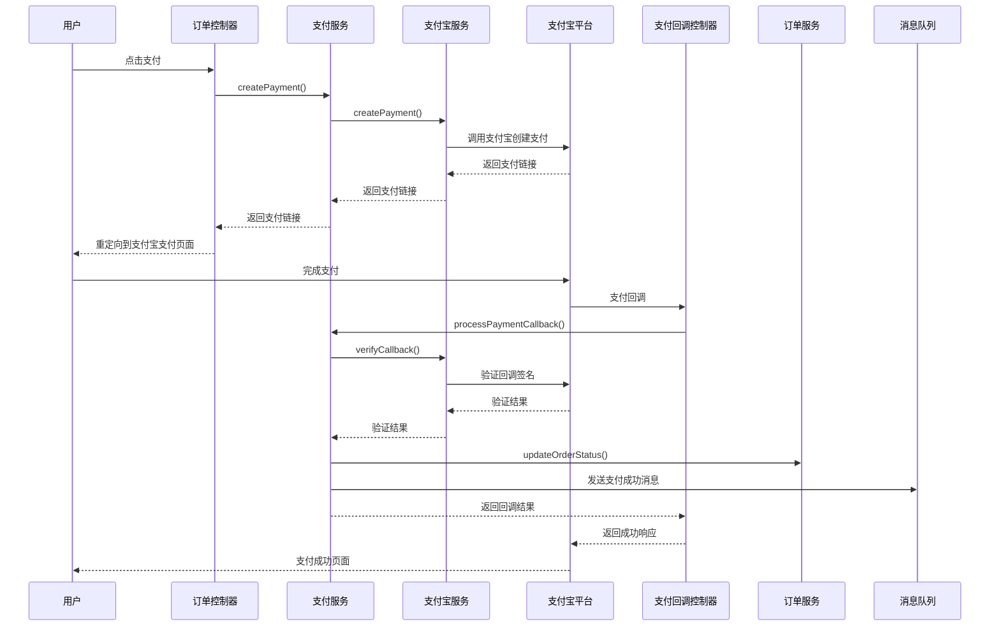
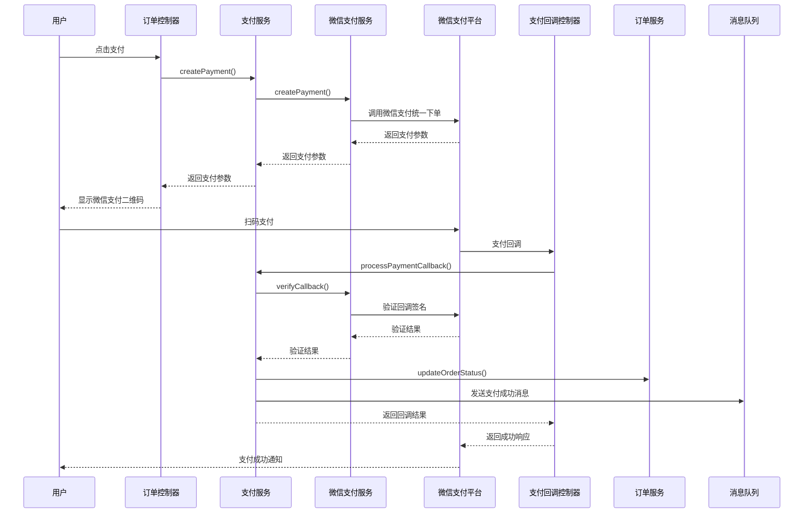
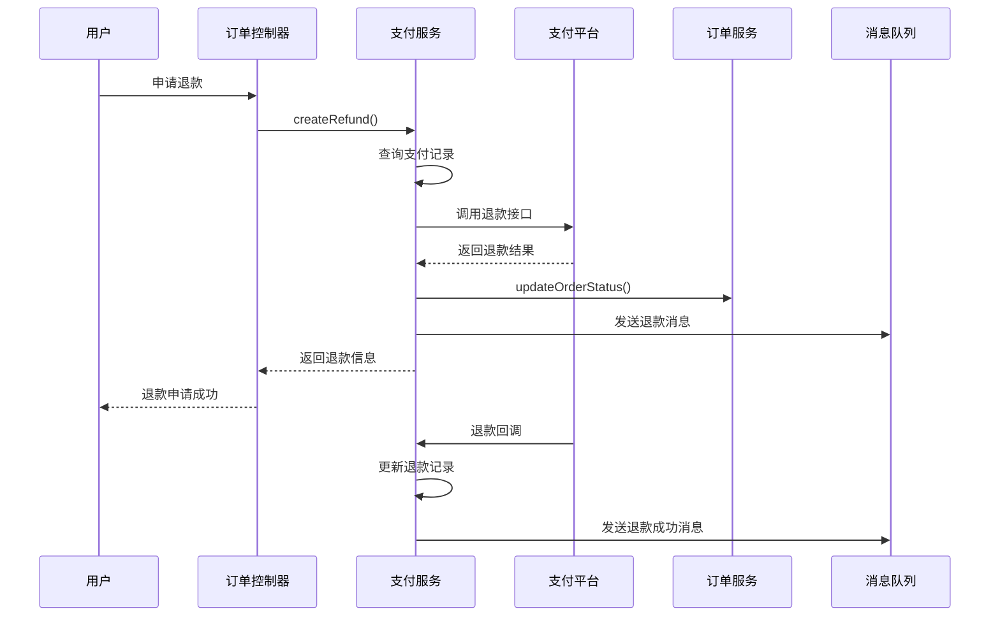

# 支付模块文档

## 1. 模块概述

支付模块是 MallEcoAPI 系统的核心业务模块之一，负责处理订单支付、支付回调、退款等功能。该模块集成了支付宝、微信支付等第三方支付平台，为用户提供安全、便捷的支付体验。

### 1.1 模块定位

支付模块在系统中扮演着以下角色：

- **支付处理**：处理用户的支付请求，生成支付订单
- **支付回调**：接收和处理第三方支付平台的回调通知
- **退款管理**：处理用户的退款请求
- **支付记录**：记录和管理支付交易记录
- **支付统计**：提供支付数据统计和分析功能

### 1.2 核心价值

- **交易闭环**：连接订单和支付平台，形成完整的交易闭环
- **支付安全**：确保支付过程的安全和可靠
- **用户体验**：提供多种支付方式，方便用户选择
- **数据准确性**：保证支付数据的完整和准确
- **业务分析**：通过支付数据，为业务决策提供支持

## 2. 目录结构

```
src/modules/payment/
├── controllers/         # 控制器
│   ├── payment.controller.ts     # 支付控制器
│   └── payment-callback.controller.ts  # 支付回调控制器
├── dto/                 # 数据传输对象
│   ├── create-payment.dto.ts     # 创建支付 DTO
│   ├── refund.dto.ts             # 退款 DTO
│   └── payment-query.dto.ts      # 支付查询 DTO
├── entities/            # 实体
│   ├── payment-record.entity.ts  # 支付记录实体
│   └── refund-record.entity.ts   # 退款记录实体
├── services/            # 服务
│   ├── payment.service.ts        # 支付服务
│   ├── payment.service.spec.ts   # 支付服务测试
│   ├── alipay.service.ts         # 支付宝服务
│   └── wechat-pay.service.ts     # 微信支付服务
└── payment.module.ts    # 支付模块
```

## 3. 核心组件

### 3.1 PaymentService

**功能**：支付服务的核心，处理支付订单的创建、查询等逻辑

**主要方法**：

| 方法名 | 功能描述 | 参数 | 返回值 |
|--------|----------|------|--------|
| `createPayment` | 创建支付订单 | `orderId: string; paymentMethod: string; amount: number` | `Promise<{ paymentUrl: string; paymentId: string }>` |
| `getPaymentByOrderId` | 根据订单 ID 获取支付记录 | `orderId: string` | `Promise<PaymentRecord>` |
| `processPaymentCallback` | 处理支付回调 | `paymentMethod: string; callbackData: any` | `Promise<{ success: boolean; orderId: string }>` |
| `createRefund` | 创建退款订单 | `orderId: string; amount: number; reason: string` | `Promise<RefundRecord>` |
| `getRefundById` | 根据 ID 获取退款记录 | `refundId: string` | `Promise<RefundRecord>` |
| `getPaymentStatistics` | 获取支付统计 | `params: PaymentStatisticsParams` | `Promise<PaymentStatistics>` |

**实现原理**：

1. **支付处理**：根据支付方式，调用对应的支付服务（支付宝、微信支付）
2. **回调处理**：验证回调数据的真实性，更新订单状态
3. **退款处理**：根据支付方式，调用对应的退款接口
4. **事务处理**：使用数据库事务确保支付操作的原子性
5. **消息通知**：通过消息队列，通知相关模块支付状态变化

### 3.2 AlipayService

**功能**：支付宝支付服务，处理支付宝相关的支付和退款操作

**主要方法**：

| 方法名 | 功能描述 | 参数 | 返回值 |
|--------|----------|------|--------|
| `createPayment` | 创建支付宝支付订单 | `orderId: string; amount: number; subject: string` | `Promise<{ paymentUrl: string; paymentId: string }>` |
| `verifyCallback` | 验证支付宝回调 | `callbackData: any` | `Promise<{ success: boolean; orderId: string; transactionId: string }>` |
| `createRefund` | 创建支付宝退款订单 | `paymentId: string; refundAmount: number; reason: string` | `Promise<{ refundId: string; refundStatus: string }>` |
| `queryPayment` | 查询支付宝支付状态 | `paymentId: string` | `Promise<{ status: string; transactionId: string }>` |

**实现原理**：

1. **支付宝集成**：使用 `alipay-sdk` 库集成支付宝 API
2. **签名验证**：验证支付宝回调数据的签名，确保数据的真实性
3. **异步通知**：处理支付宝的异步通知，更新支付状态

### 3.3 WechatPayService

**功能**：微信支付服务，处理微信支付相关的支付和退款操作

**主要方法**：

| 方法名 | 功能描述 | 参数 | 返回值 |
|--------|----------|------|--------|
| `createPayment` | 创建微信支付订单 | `orderId: string; amount: number; description: string` | `Promise<{ paymentParams: any; paymentId: string }>` |
| `verifyCallback` | 验证微信支付回调 | `callbackData: any` | `Promise<{ success: boolean; orderId: string; transactionId: string }>` |
| `createRefund` | 创建微信退款订单 | `paymentId: string; refundAmount: number; reason: string` | `Promise<{ refundId: string; refundStatus: string }>` |
| `queryPayment` | 查询微信支付状态 | `paymentId: string` | `Promise<{ status: string; transactionId: string }>` |

**实现原理**：

1. **微信支付集成**：使用 `wechatpay-node-v3` 库集成微信支付 API
2. **签名验证**：验证微信支付回调数据的签名，确保数据的真实性
3. **异步通知**：处理微信支付的异步通知，更新支付状态

## 4. 数据模型

### 4.1 支付记录实体 (PaymentRecord)

| 字段名 | 类型 | 描述 |
|--------|------|------|
| `id` | string | 支付记录 ID |
| `orderId` | string | 订单 ID |
| `orderSn` | string | 订单编号 |
| `outTradeNo` | string | 商户订单号 |
| `transactionId` | string | 支付平台交易号 |
| `amount` | number | 支付金额 |
| `currency` | string | 货币类型 |
| `paymentMethod` | string | 支付方式（alipay, wechat） |
| `paymentMethodName` | string | 支付方式名称 |
| `status` | number | 支付状态（0-待支付，1-已支付，2-已退款，3-支付失败） |
| `callbackData` | string | 回调数据（JSON 格式） |
| `createdAt` | Date | 创建时间 |
| `updatedAt` | Date | 更新时间 |
| `paidAt` | Date | 支付时间 |

### 4.2 退款记录实体 (RefundRecord)

| 字段名 | 类型 | 描述 |
|--------|------|------|
| `id` | string | 退款记录 ID |
| `paymentId` | string | 支付记录 ID |
| `orderId` | string | 订单 ID |
| `outRefundNo` | string | 商户退款单号 |
| `refundId` | string | 支付平台退款单号 |
| `refundAmount` | number | 退款金额 |
| `totalAmount` | number | 订单总金额 |
| `currency` | string | 货币类型 |
| `refundReason` | string | 退款原因 |
| `status` | number | 退款状态（0-待处理，1-退款中，2-退款成功，3-退款失败） |
| `callbackData` | string | 回调数据（JSON 格式） |
| `createdAt` | Date | 创建时间 |
| `updatedAt` | Date | 更新时间 |
| `refundedAt` | Date | 退款成功时间 |

## 5. 核心功能

### 5.1 支付创建

**功能描述**：根据订单信息创建支付订单

**流程**：

1. 接收支付请求，验证请求数据
2. 查询订单信息，验证订单状态
3. 生成商户订单号
4. 根据支付方式，调用对应的支付服务
5. 创建支付记录
6. 返回支付链接或支付参数

**代码示例**：

```typescript
async createPayment(orderId: string, paymentMethod: string, amount: number): Promise<{ paymentUrl: string; paymentId: string }> {
  // 查询订单
  const order = await this.orderService.getOrderById(orderId);
  
  if (!order) {
    throw new NotFoundException('订单不存在');
  }
  
  if (order.orderStatus !== 0) {
    throw new BadRequestException('订单状态不正确，无法支付');
  }
  
  // 生成商户订单号
  const outTradeNo = `PAY${Date.now()}${Math.floor(Math.random() * 10000)}`;
  
  let paymentResult;
  
  // 根据支付方式调用对应的支付服务
  if (paymentMethod === 'alipay') {
    paymentResult = await this.alipayService.createPayment(
      orderId,
      amount,
      order.items[0]?.goodsName || '商品购买'
    );
  } else if (paymentMethod === 'wechat') {
    paymentResult = await this.wechatPayService.createPayment(
      orderId,
      amount,
      order.items[0]?.goodsName || '商品购买'
    );
  } else {
    throw new BadRequestException('不支持的支付方式');
  }
  
  // 创建支付记录
  const paymentRecord = this.paymentRecordRepository.create({
    orderId,
    orderSn: order.orderSn,
    outTradeNo,
    amount,
    currency: 'CNY',
    paymentMethod,
    paymentMethodName: paymentMethod === 'alipay' ? '支付宝' : '微信支付',
    status: 0, // 待支付
  });
  
  await this.paymentRecordRepository.save(paymentRecord);
  
  return {
    paymentUrl: paymentResult.paymentUrl,
    paymentId: paymentRecord.id,
  };
}
```

### 5.2 支付回调处理

**功能描述**：处理第三方支付平台的回调通知

**流程**：

1. 接收支付回调请求
2. 验证回调数据的签名
3. 查询支付记录
4. 验证支付金额
5. 开始数据库事务
6. 更新支付记录状态
7. 更新订单状态
8. 提交事务
9. 发送支付成功消息
10. 返回回调结果

**代码示例**：

```typescript
async processPaymentCallback(paymentMethod: string, callbackData: any): Promise<{ success: boolean; orderId: string }> {
  let verificationResult;
  
  // 根据支付方式验证回调数据
  if (paymentMethod === 'alipay') {
    verificationResult = await this.alipayService.verifyCallback(callbackData);
  } else if (paymentMethod === 'wechat') {
    verificationResult = await this.wechatPayService.verifyCallback(callbackData);
  } else {
    throw new BadRequestException('不支持的支付方式');
  }
  
  if (!verificationResult.success) {
    return { success: false, orderId: '' };
  }
  
  const { orderId, transactionId } = verificationResult;
  
  // 查询支付记录
  const paymentRecord = await this.paymentRecordRepository.findOne({
    where: { orderId },
  });
  
  if (!paymentRecord) {
    return { success: false, orderId };
  }
  
  // 开始事务
  await this.paymentRecordRepository.manager.transaction(async (manager) => {
    // 更新支付记录
    paymentRecord.status = 1; // 已支付
    paymentRecord.transactionId = transactionId;
    paymentRecord.callbackData = JSON.stringify(callbackData);
    paymentRecord.paidAt = new Date();
    await manager.save(paymentRecord);
    
    // 更新订单状态
    await this.orderService.updateOrderStatus(orderId, 1); // 待发货
  });
  
  // 发送支付成功消息
  await this.rabbitMqService.send('payment.success', { orderId, paymentId: paymentRecord.id });
  
  return { success: true, orderId };
}
```

### 5.3 退款处理

**功能描述**：处理用户的退款请求

**流程**：

1. 接收退款请求，验证请求数据
2. 查询支付记录，验证支付状态
3. 生成商户退款单号
4. 根据支付方式，调用对应的退款接口
5. 创建退款记录
6. 更新支付记录状态
7. 更新订单状态
8. 发送退款消息
9. 返回退款信息

### 5.4 支付查询

**功能描述**：查询支付订单的状态

**流程**：

1. 接收支付查询请求
2. 查询支付记录
3. 根据支付方式，调用对应的查询接口
4. 更新支付记录状态（如果需要）
5. 返回支付状态

### 5.5 退款查询

**功能描述**：查询退款订单的状态

**流程**：

1. 接收退款查询请求
2. 查询退款记录
3. 根据支付方式，调用对应的查询接口
4. 更新退款记录状态（如果需要）
5. 返回退款状态

## 6. 业务流程

### 6.1 支付宝支付流程



### 6.2 微信支付流程



### 6.3 退款流程



## 7. 接口设计

### 7.1 支付接口

| API 路径 | 方法 | 功能描述 | 认证要求 |
|----------|------|----------|----------|
| `/api/payments` | POST | 创建支付订单 | 是 |
| `/api/payments/:id` | GET | 获取支付详情 | 是 |
| `/api/payments/order/:orderId` | GET | 根据订单 ID 获取支付记录 | 是 |
| `/api/payments/:id/refund` | POST | 申请退款 | 是 |
| `/api/payments/refunds/:id` | GET | 获取退款详情 | 是 |
| `/api/payments/statistics` | GET | 获取支付统计 | 是（管理员） |

### 7.2 支付回调接口

| API 路径 | 方法 | 功能描述 | 认证要求 |
|----------|------|----------|----------|
| `/api/payments/callback/alipay` | POST | 支付宝支付回调 | 否 |
| `/api/payments/callback/wechat` | POST | 微信支付回调 | 否 |
| `/api/payments/callback/refund/alipay` | POST | 支付宝退款回调 | 否 |
| `/api/payments/callback/refund/wechat` | POST | 微信退款回调 | 否 |

## 8. 安全措施

### 8.1 签名验证

- **支付宝签名验证**：使用支付宝公钥验证回调数据的签名
- **微信支付签名验证**：使用微信支付平台证书验证回调数据的签名
- **防止伪造**：确保回调数据来自真实的支付平台

### 8.2 数据加密

- **敏感信息加密**：支付相关的敏感信息进行加密存储
- **传输加密**：使用 HTTPS 协议传输所有支付相关的请求

### 8.3 防重复支付

- **幂等性设计**：支付接口使用幂等性设计，防止重复支付
- **支付状态检查**：创建支付前检查订单状态，防止重复支付

### 8.4 金额验证

- **金额一致性**：验证支付回调中的金额与订单金额是否一致
- **防止篡改**：确保支付金额不被篡改

### 8.5 日志记录

- **详细日志**：记录所有支付相关的操作和回调
- **审计追踪**：便于问题排查和审计

## 9. 性能优化

### 9.1 异步处理

- **消息队列**：使用 RabbitMQ 处理支付相关的异步任务
- **异步回调**：支付回调采用异步处理，提高响应速度

### 9.2 缓存策略

- **支付记录缓存**：缓存热门支付记录，提高查询性能
- **配置缓存**：缓存支付平台配置，减少配置加载时间

### 9.3 数据库优化

- **索引优化**：为支付记录表的常用查询字段添加索引
- **查询优化**：优化 SQL 查询，减少关联查询和全表扫描

### 9.4 代码优化

- **并行处理**：使用 Promise.all 处理并行任务
- **错误处理**：合理处理错误，提高系统稳定性

## 10. 常见问题与解决方案

### 10.1 支付失败

**问题**：用户支付失败，返回错误信息

**可能原因**：
- 支付平台返回错误
- 网络连接问题
- 支付参数错误
- 订单状态不正确

**解决方案**：
- 检查支付平台返回的错误信息
- 检查网络连接
- 验证支付参数
- 检查订单状态

### 10.2 支付回调处理失败

**问题**：支付平台回调通知处理失败

**可能原因**：
- 签名验证失败
- 支付记录不存在
- 数据库操作失败
- 网络连接问题

**解决方案**：
- 检查签名验证逻辑
- 确保支付记录存在
- 检查数据库连接和操作
- 实现回调重试机制

### 10.3 退款失败

**问题**：用户退款申请失败

**可能原因**：
- 支付平台返回错误
- 退款金额超过支付金额
- 支付记录不存在
- 订单状态不正确

**解决方案**：
- 检查支付平台返回的错误信息
- 验证退款金额
- 确保支付记录存在
- 检查订单状态

### 10.4 支付记录查询缓慢

**问题**：支付记录查询速度慢

**可能原因**：
- 数据量过大
- 索引缺失
- 缓存失效

**解决方案**：
- 优化数据库索引
- 增加缓存策略
- 实现数据分片或分表

## 11. 代码示例

### 11.1 支付服务示例

```typescript
import { Injectable, NotFoundException, BadRequestException } from '@nestjs/common';
import { InjectRepository } from '@nestjs/typeorm';
import { Repository } from 'typeorm';
import { PaymentRecord } from '../entities/payment-record.entity';
import { RefundRecord } from '../entities/refund-record.entity';
import { AlipayService } from './alipay.service';
import { WechatPayService } from './wechat-pay.service';
import { OrderService } from '../../order/services/order.service';
import { RabbitMqService } from '../../../infrastructure/rabbitmq/rabbitmq.service';

@Injectable()
export class PaymentService {
  constructor(
    @InjectRepository(PaymentRecord) private paymentRecordRepository: Repository<PaymentRecord>,
    @InjectRepository(RefundRecord) private refundRecordRepository: Repository<RefundRecord>,
    private alipayService: AlipayService,
    private wechatPayService: WechatPayService,
    private orderService: OrderService,
    private rabbitMqService: RabbitMqService,
  ) {}

  async createPayment(orderId: string, paymentMethod: string, amount: number): Promise<{ paymentUrl: string; paymentId: string }> {
    // 查询订单
    const order = await this.orderService.getOrderById(orderId);
    
    if (!order) {
      throw new NotFoundException('订单不存在');
    }
    
    if (order.orderStatus !== 0) {
      throw new BadRequestException('订单状态不正确，无法支付');
    }
    
    // 生成商户订单号
    const outTradeNo = `PAY${Date.now()}${Math.floor(Math.random() * 10000)}`;
    
    let paymentResult;
    
    // 根据支付方式调用对应的支付服务
    if (paymentMethod === 'alipay') {
      paymentResult = await this.alipayService.createPayment(
        orderId,
        amount,
        order.items[0]?.goodsName || '商品购买'
      );
    } else if (paymentMethod === 'wechat') {
      paymentResult = await this.wechatPayService.createPayment(
        orderId,
        amount,
        order.items[0]?.goodsName || '商品购买'
      );
    } else {
      throw new BadRequestException('不支持的支付方式');
    }
    
    // 创建支付记录
    const paymentRecord = this.paymentRecordRepository.create({
      orderId,
      orderSn: order.orderSn,
      outTradeNo,
      amount,
      currency: 'CNY',
      paymentMethod,
      paymentMethodName: paymentMethod === 'alipay' ? '支付宝' : '微信支付',
      status: 0, // 待支付
    });
    
    await this.paymentRecordRepository.save(paymentRecord);
    
    return {
      paymentUrl: paymentResult.paymentUrl,
      paymentId: paymentRecord.id,
    };
  }

  async processPaymentCallback(paymentMethod: string, callbackData: any): Promise<{ success: boolean; orderId: string }> {
    let verificationResult;
    
    // 根据支付方式验证回调数据
    if (paymentMethod === 'alipay') {
      verificationResult = await this.alipayService.verifyCallback(callbackData);
    } else if (paymentMethod === 'wechat') {
      verificationResult = await this.wechatPayService.verifyCallback(callbackData);
    } else {
      throw new BadRequestException('不支持的支付方式');
    }
    
    if (!verificationResult.success) {
      return { success: false, orderId: '' };
    }
    
    const { orderId, transactionId } = verificationResult;
    
    // 查询支付记录
    const paymentRecord = await this.paymentRecordRepository.findOne({
      where: { orderId },
    });
    
    if (!paymentRecord) {
      return { success: false, orderId };
    }
    
    // 开始事务
    await this.paymentRecordRepository.manager.transaction(async (manager) => {
      // 更新支付记录
      paymentRecord.status = 1; // 已支付
      paymentRecord.transactionId = transactionId;
      paymentRecord.callbackData = JSON.stringify(callbackData);
      paymentRecord.paidAt = new Date();
      await manager.save(paymentRecord);
      
      // 更新订单状态
      await this.orderService.updateOrderStatus(orderId, 1); // 待发货
    });
    
    // 发送支付成功消息
    await this.rabbitMqService.send('payment.success', { orderId, paymentId: paymentRecord.id });
    
    return { success: true, orderId };
  }
}
```

### 11.2 支付控制器示例

```typescript
import { Controller, Get, Post, Param, Body, UseGuards, Req } from '@nestjs/common';
import { PaymentService } from '../services/payment.service';
import { CreatePaymentDto } from '../dto/create-payment.dto';
import { RefundDto } from '../dto/refund.dto';
import { JwtAuthGuard } from '../../../infrastructure/auth/guards/jwt-auth.guard';
import { RolesGuard } from '../../../infrastructure/auth/guards/roles.guard';
import { Roles } from '../../../infrastructure/auth/decorators/roles.decorator';

@Controller('payments')
@UseGuards(JwtAuthGuard)
export class PaymentController {
  constructor(private readonly paymentService: PaymentService) {}

  @Post()
  async createPayment(@Body() createPaymentDto: CreatePaymentDto) {
    return this.paymentService.createPayment(
      createPaymentDto.orderId,
      createPaymentDto.paymentMethod,
      createPaymentDto.amount
    );
  }

  @Get(':id')
  async getPaymentById(@Param('id') id: string) {
    return this.paymentService.getPaymentById(id);
  }

  @Get('order/:orderId')
  async getPaymentByOrderId(@Param('orderId') orderId: string) {
    return this.paymentService.getPaymentByOrderId(orderId);
  }

  @Post(':id/refund')
  async createRefund(@Param('id') id: string, @Body() refundDto: RefundDto) {
    return this.paymentService.createRefund(
      id,
      refundDto.amount,
      refundDto.reason
    );
  }

  @Get('refunds/:id')
  async getRefundById(@Param('id') id: string) {
    return this.paymentService.getRefundById(id);
  }

  @UseGuards(RolesGuard)
  @Roles('admin')
  @Get('statistics')
  async getPaymentStatistics(@Req() req) {
    return this.paymentService.getPaymentStatistics(req.query);
  }
}
```

## 12. 总结与展望

### 12.1 模块优势

- **架构清晰**：采用模块化设计，代码结构清晰，易于维护
- **功能完整**：涵盖支付、退款、回调处理等核心功能
- **安全性高**：实现了完善的签名验证和数据加密
- **扩展性强**：支持多种支付方式，易于集成新的支付平台
- **性能优异**：通过缓存、异步处理等手段，提高系统性能

### 12.2 改进空间

- **支付方式扩展**：支持更多支付方式，如银联、PayPal 等
- **国际化支持**：支持多币种支付和国际化支付平台
- **支付风控**：集成支付风控系统，防止恶意支付
- **智能对账**：实现自动对账功能，减少人工操作
- **多商户支持**：支持多商户场景，每个商户有独立的支付配置

### 12.3 未来规划

- **版本 1.1**：增强支付方式支持，添加银联、PayPal 等支付方式
- **版本 1.2**：集成支付风控系统，提高支付安全性
- **版本 1.3**：实现智能对账功能，减少人工操作
- **版本 1.4**：支持多商户场景，每个商户有独立的支付配置
- **版本 2.0**：重构支付模块，采用更先进的架构和技术，支持更多支付场景

## 13. 附录

### 13.1 核心 API 列表

| API 路径 | 方法 | 功能描述 | 认证要求 |
|----------|------|----------|----------|
| `/api/payments` | POST | 创建支付订单 | 是 |
| `/api/payments/:id` | GET | 获取支付详情 | 是 |
| `/api/payments/order/:orderId` | GET | 根据订单 ID 获取支付记录 | 是 |
| `/api/payments/:id/refund` | POST | 申请退款 | 是 |
| `/api/payments/refunds/:id` | GET | 获取退款详情 | 是 |
| `/api/payments/statistics` | GET | 获取支付统计 | 是（管理员） |
| `/api/payments/callback/alipay` | POST | 支付宝支付回调 | 否 |
| `/api/payments/callback/wechat` | POST | 微信支付回调 | 否 |

### 13.2 配置项参考

| 配置项 | 类型 | 默认值 | 说明 |
|--------|------|--------|------|
| `ALIPAY_APP_ID` | string | - | 支付宝应用 ID |
| `ALIPAY_PRIVATE_KEY` | string | - | 支付宝私钥 |
| `ALIPAY_PUBLIC_KEY` | string | - | 支付宝公钥 |
| `ALIPAY_SANDBOX` | boolean | false | 是否使用支付宝沙箱环境 |
| `WECHAT_APP_ID` | string | - | 微信支付应用 ID |
| `WECHAT_MCH_ID` | string | - | 微信支付商户号 |
| `WECHAT_API_V3_KEY` | string | - | 微信支付 API v3 密钥 |
| `WECHAT_CERT_PATH` | string | - | 微信支付证书路径 |
| `WECHAT_SANDBOX` | boolean | false | 是否使用微信支付沙箱环境 |
| `PAYMENT_CACHE_TTL` | number | 3600 | 支付记录缓存过期时间（秒） |

### 13.3 依赖项

| 依赖项 | 版本 | 用途 |
|--------|------|------|
| `alipay-sdk` | ^4.17.9 | 支付宝 SDK |
| `wechatpay-node-v3` | ^1.1.10 | 微信支付 SDK |
| `crypto` | ^1.0.1 | 加密模块 |
| `xml2js` | ^0.6.2 | XML 解析（微信支付） |
| `@nestjs/axios` | ^3.0.2 | HTTP 客户端 |

---

**文档更新时间**：2026-01-19
**文档版本**：v1.0.0
**作者**：MallEco 开发团队
