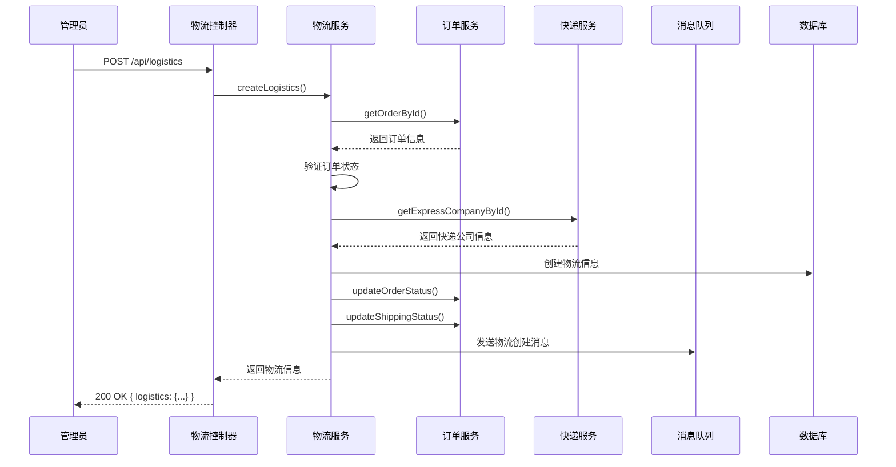
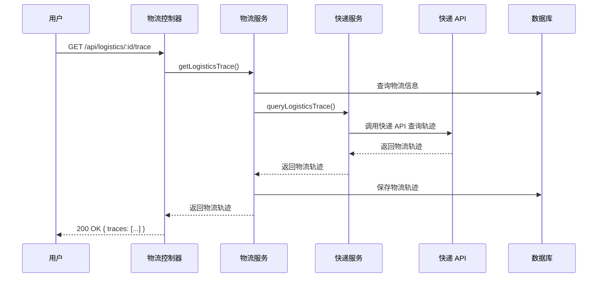
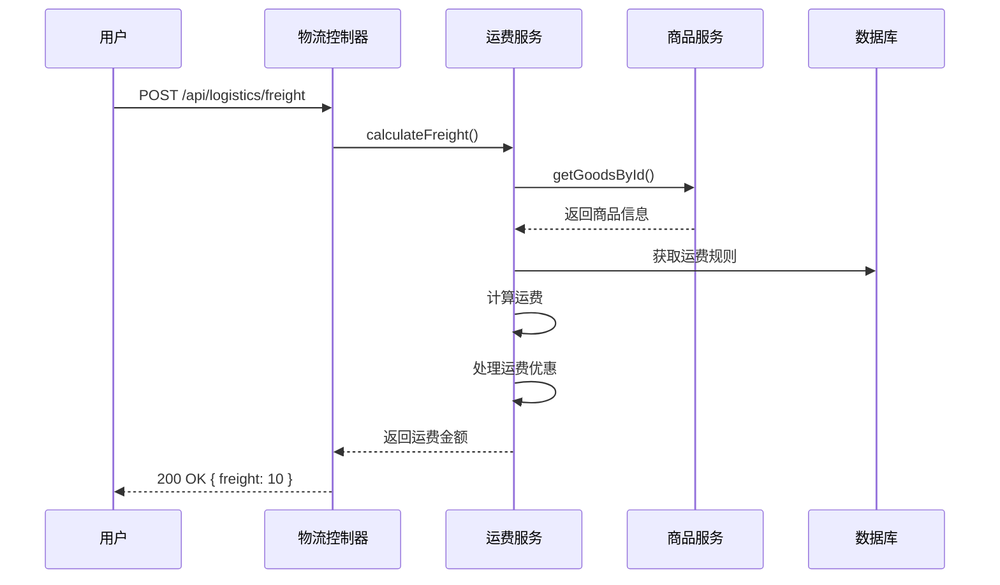
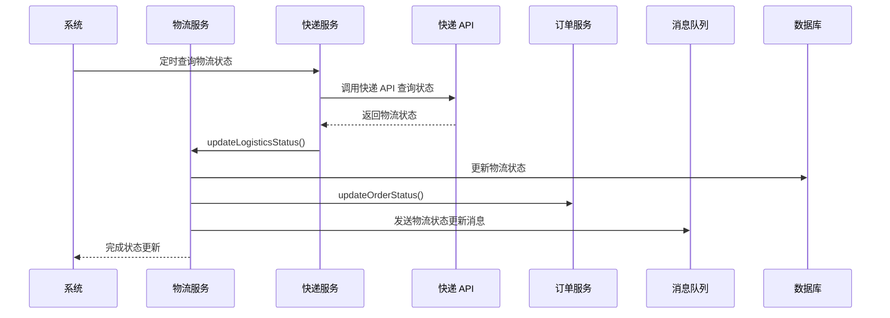

# 物流模块文档

## 1. 模块概述

物流模块是 MallEcoAPI 系统的核心业务模块之一，负责订单的物流信息管理、配送跟踪、运费计算等功能。该模块连接了订单和第三方物流服务，为用户提供实时的物流状态查询和配送管理。

### 1.1 模块定位

物流模块在系统中扮演着以下角色：

- **物流信息管理**：维护订单的物流信息，包括物流公司、运单号、物流状态等
- **配送跟踪**：提供物流轨迹查询和实时配送状态更新
- **运费计算**：根据商品重量、体积、配送地址等计算运费
- **物流公司管理**：维护物流公司信息和接口配置
- **物流统计**：提供物流数据统计和分析功能

### 1.2 核心价值

- **配送可视化**：通过物流轨迹查询，让用户实时了解包裹状态
- **运费准确性**：确保运费计算的准确和合理
- **物流效率**：优化物流流程，提高配送效率
- **用户体验**：提供便捷的物流查询和管理功能
- **业务分析**：通过物流数据，为业务决策提供支持

## 2. 目录结构

```
src/modules/logistics/
├── controllers/         # 控制器
│   ├── logistics.controller.ts     # 物流控制器
│   └── express.controller.ts       # 快递控制器
├── dto/                 # 数据传输对象
│   ├── create-logistics.dto.ts     # 创建物流 DTO
│   ├── logistics-query.dto.ts      # 物流查询 DTO
│   └── freight-calculate.dto.ts    # 运费计算 DTO
├── entities/            # 实体
│   ├── logistics-info.entity.ts    # 物流信息实体
│   ├── express-company.entity.ts   # 快递公司实体
│   └── logistics-trace.entity.ts   # 物流轨迹实体
├── services/            # 服务
│   ├── logistics.service.ts        # 物流服务
│   ├── logistics.service.spec.ts   # 物流服务测试
│   ├── express.service.ts          # 快递服务
│   └── freight.service.ts          # 运费服务
└── logistics.module.ts  # 物流模块
```

## 3. 核心组件

### 3.1 LogisticsService

**功能**：物流服务的核心，处理物流信息的创建、查询等逻辑

**主要方法**：

| 方法名 | 功能描述 | 参数 | 返回值 |
|--------|----------|------|--------|
| `createLogistics` | 创建物流信息 | `orderId: string; expressCompanyId: string; trackingNumber: string` | `Promise<LogisticsInfo>` |
| `getLogisticsByOrderId` | 根据订单 ID 获取物流信息 | `orderId: string` | `Promise<LogisticsInfo>` |
| `getLogisticsTrace` | 获取物流轨迹 | `logisticsId: string` | `Promise<LogisticsTrace[]>` |
| `updateLogisticsStatus` | 更新物流状态 | `logisticsId: string; status: number` | `Promise<LogisticsInfo>` |
| `syncLogisticsTrace` | 同步物流轨迹 | `logisticsId: string` | `Promise<LogisticsTrace[]>` |

**实现原理**：

1. **物流信息管理**：使用 TypeORM 操作数据库，实现物流信息的增删改查
2. **物流轨迹同步**：调用第三方物流接口，同步物流轨迹信息
3. **状态管理**：确保物流状态的正确流转
4. **消息通知**：通过消息队列，通知相关模块物流状态变化

### 3.2 ExpressService

**功能**：快递服务，处理快递公司管理和物流轨迹查询

**主要方法**：

| 方法名 | 功能描述 | 参数 | 返回值 |
|--------|----------|------|--------|
| `getExpressCompanies` | 获取快递公司列表 | - | `Promise<ExpressCompany[]>` |
| `getExpressCompanyById` | 根据 ID 获取快递公司 | `id: string` | `Promise<ExpressCompany>` |
| `queryLogisticsTrace` | 查询物流轨迹 | `expressCompanyCode: string; trackingNumber: string` | `Promise<any[]>` |
| `syncLogisticsTrace` | 同步物流轨迹 | `logisticsId: string; expressCompanyCode: string; trackingNumber: string` | `Promise<LogisticsTrace[]>` |

**实现原理**：

1. **快递公司管理**：维护快递公司信息和接口配置
2. **物流轨迹查询**：调用第三方物流接口，查询物流轨迹
3. **数据转换**：将第三方物流接口返回的数据转换为系统内部格式

### 3.3 FreightService

**功能**：运费服务，处理运费计算逻辑

**主要方法**：

| 方法名 | 功能描述 | 参数 | 返回值 |
|--------|----------|------|--------|
| `calculateFreight` | 计算运费 | `goodsList: any[]; address: string; regionId: string` | `Promise<number>` |
| `getFreightRule` | 获取运费规则 | `regionId: string` | `Promise<any>` |
| `updateFreightRule` | 更新运费规则 | `regionId: string; rule: any` | `Promise<void>` |

**实现原理**：

1. **运费规则管理**：维护不同地区、不同重量的运费规则
2. **运费计算**：根据商品重量、体积、配送地址等计算运费
3. **优惠处理**：处理运费优惠和免运费规则

## 4. 数据模型

### 4.1 物流信息实体 (LogisticsInfo)

| 字段名 | 类型 | 描述 |
|--------|------|------|
| `id` | string | 物流信息 ID |
| `orderId` | string | 订单 ID |
| `expressCompanyId` | string | 快递公司 ID |
| `expressCompanyName` | string | 快递公司名称 |
| `expressCompanyCode` | string | 快递公司代码 |
| `trackingNumber` | string | 运单号 |
| `status` | number | 物流状态（0-待发货，1-已发货，2-运输中，3-已签收，4-异常） |
| `freight` | number | 运费 |
| `estimatedDays` | number | 预计送达天数 |
| `senderName` | string | 发件人姓名 |
| `senderMobile` | string | 发件人电话 |
| `senderAddress` | string | 发件人地址 |
| `receiverName` | string | 收件人姓名 |
| `receiverMobile` | string | 收件人电话 |
| `receiverAddress` | string | 收件人地址 |
| `createdAt` | Date | 创建时间 |
| `updatedAt` | Date | 更新时间 |
| `shippedAt` | Date | 发货时间 |
| `deliveredAt` | Date | 送达时间 |

### 4.2 快递公司实体 (ExpressCompany)

| 字段名 | 类型 | 描述 |
|--------|------|------|
| `id` | string | 快递公司 ID |
| `name` | string | 快递公司名称 |
| `code` | string | 快递公司代码 |
| `logo` | string | 快递公司 logo |
| `contact` | string | 联系方式 |
| `url` | string | 官网地址 |
| `apiUrl` | string | API 地址 |
| `apiKey` | string | API 密钥 |
| `isEnabled` | boolean | 是否启用 |
| `sortOrder` | number | 排序顺序 |
| `createdAt` | Date | 创建时间 |
| `updatedAt` | Date | 更新时间 |

### 4.3 物流轨迹实体 (LogisticsTrace)

| 字段名 | 类型 | 描述 |
|--------|------|------|
| `id` | string | 轨迹 ID |
| `logisticsId` | string | 物流信息 ID |
| `orderId` | string | 订单 ID |
| `time` | Date | 轨迹时间 |
| `description` | string | 轨迹描述 |
| `location` | string | 轨迹地点 |
| `createdAt` | Date | 创建时间 |

## 5. 核心功能

### 5.1 物流信息创建

**功能描述**：为订单创建物流信息

**流程**：

1. 接收物流创建请求，验证请求数据
2. 查询订单信息，验证订单状态
3. 查询快递公司信息
4. 创建物流信息记录
5. 更新订单物流状态
6. 发送物流创建消息
7. 返回物流信息

**代码示例**：

```typescript
async createLogistics(orderId: string, expressCompanyId: string, trackingNumber: string): Promise<LogisticsInfo> {
  // 查询订单
  const order = await this.orderService.getOrderById(orderId);
  
  if (!order) {
    throw new NotFoundException('订单不存在');
  }
  
  if (order.orderStatus !== 1) {
    throw new BadRequestException('订单状态不正确，无法创建物流信息');
  }
  
  // 查询快递公司
  const expressCompany = await this.expressService.getExpressCompanyById(expressCompanyId);
  
  if (!expressCompany) {
    throw new NotFoundException('快递公司不存在');
  }
  
  // 创建物流信息
  const logisticsInfo = this.logisticsInfoRepository.create({
    orderId,
    expressCompanyId,
    expressCompanyName: expressCompany.name,
    expressCompanyCode: expressCompany.code,
    trackingNumber,
    status: 1, // 已发货
    freight: order.shippingAmount,
    estimatedDays: 3, // 预计送达天数
    senderName: 'MallEco',
    senderMobile: '400-123-4567',
    senderAddress: '北京市朝阳区某某大厦',
    receiverName: order.consignee,
    receiverMobile: order.mobile,
    receiverAddress: order.address,
    shippedAt: new Date(),
  });
  
  await this.logisticsInfoRepository.save(logisticsInfo);
  
  // 更新订单状态
  await this.orderService.updateOrderStatus(orderId, 2); // 待收货
  await this.orderService.updateShippingStatus(orderId, 1); // 已发货
  
  // 发送物流创建消息
  await this.rabbitMqService.send('logistics.created', { orderId, logisticsId: logisticsInfo.id });
  
  return logisticsInfo;
}
```

### 5.2 物流轨迹查询

**功能描述**：查询物流轨迹信息

**流程**：

1. 接收物流轨迹查询请求
2. 查询物流信息
3. 调用快递服务查询轨迹
4. 保存或更新物流轨迹
5. 返回物流轨迹信息

**代码示例**：

```typescript
async getLogisticsTrace(logisticsId: string): Promise<LogisticsTrace[]> {
  // 查询物流信息
  const logisticsInfo = await this.logisticsInfoRepository.findOne({
    where: { id: logisticsId },
  });
  
  if (!logisticsInfo) {
    throw new NotFoundException('物流信息不存在');
  }
  
  // 调用快递服务查询轨迹
  const traceList = await this.expressService.queryLogisticsTrace(
    logisticsInfo.expressCompanyCode,
    logisticsInfo.trackingNumber
  );
  
  // 保存或更新物流轨迹
  const traces = await this.expressService.syncLogisticsTrace(
    logisticsId,
    logisticsInfo.expressCompanyCode,
    logisticsInfo.trackingNumber
  );
  
  return traces;
}
```

### 5.3 运费计算

**功能描述**：根据商品信息和收货地址计算运费

**流程**：

1. 接收运费计算请求，验证请求数据
2. 计算商品总重量和体积
3. 根据收货地址获取运费规则
4. 根据运费规则计算运费
5. 处理运费优惠和免运费规则
6. 返回运费金额

### 5.4 物流状态更新

**功能描述**：更新物流状态

**流程**：

1. 接收物流状态更新请求
2. 查询物流信息
3. 更新物流状态
4. 更新订单物流状态
5. 发送物流状态更新消息
6. 返回更新后的物流信息

### 5.5 快递公司管理

**功能描述**：管理快递公司信息

**流程**：

1. 接收快递公司管理请求（创建、更新、删除）
2. 验证请求数据
3. 执行相应操作
4. 保存快递公司信息
5. 返回操作结果

## 6. 业务流程

### 6.1 物流创建流程



### 6.2 物流轨迹查询流程



### 6.3 运费计算流程



### 6.4 物流状态更新流程



## 7. 接口设计

### 7.1 物流管理接口

| API 路径 | 方法 | 功能描述 | 认证要求 |
|----------|------|----------|----------|
| `/api/logistics` | POST | 创建物流信息 | 是（管理员） |
| `/api/logistics/:id` | GET | 获取物流详情 | 是 |
| `/api/logistics/order/:orderId` | GET | 根据订单 ID 获取物流信息 | 是 |
| `/api/logistics/:id/trace` | GET | 获取物流轨迹 | 是 |
| `/api/logistics/:id/status` | PUT | 更新物流状态 | 是（管理员） |
| `/api/logistics/freight` | POST | 计算运费 | 否 |
| `/api/logistics/companies` | GET | 获取快递公司列表 | 否 |
| `/api/logistics/companies` | POST | 创建快递公司 | 是（管理员） |
| `/api/logistics/companies/:id` | PUT | 更新快递公司 | 是（管理员） |
| `/api/logistics/companies/:id` | DELETE | 删除快递公司 | 是（管理员） |

### 7.2 买家物流接口

| API 路径 | 方法 | 功能描述 | 认证要求 |
|----------|------|----------|----------|
| `/api/buyer/logistics/order/:orderId` | GET | 获取订单物流信息 | 是 |
| `/api/buyer/logistics/:id/trace` | GET | 获取物流轨迹 | 是 |
| `/api/buyer/logistics/freight` | POST | 计算运费 | 否 |

## 8. 缓存策略

### 8.1 缓存键设计

| 缓存键 | 描述 | 过期时间 |
|--------|------|----------|
| `logistics:{id}` | 物流信息 | 1小时 |
| `logistics:order:{orderId}` | 订单物流信息 | 1小时 |
| `logistics:trace:{logisticsId}` | 物流轨迹 | 30分钟 |
| `express:companies` | 快递公司列表 | 1小时 |
| `freight:rule:{regionId}` | 运费规则 | 1小时 |

### 8.2 缓存更新策略

- **实时更新**：物流信息变更时，立即清除相关缓存
- **定时更新**：物流轨迹定期更新，减少 API 调用
- **惰性更新**：缓存过期后，下次访问时重新生成

## 9. 安全措施

### 9.1 数据验证

- **物流数据验证**：使用 class-validator 验证物流数据的合法性
- **权限验证**：验证用户对物流信息的操作权限

### 9.2 访问控制

- **管理员权限**：物流管理、快递公司管理等操作需要管理员权限
- **数据隔离**：确保用户只能访问自己订单的物流信息

### 9.3 防爬虫

- **请求频率限制**：限制物流查询接口的请求频率
- **API 密钥保护**：保护快递公司 API 密钥，防止泄露

## 10. 性能优化

### 10.1 数据库优化

- **索引优化**：为物流表的常用查询字段添加索引
- **查询优化**：优化 SQL 查询，减少关联查询和全表扫描

### 10.2 缓存优化

- **物流轨迹缓存**：缓存物流轨迹，减少 API 调用
- **快递公司缓存**：缓存快递公司列表，减少数据库查询

### 10.3 异步处理

- **消息队列**：使用 RabbitMQ 处理物流相关的异步任务
- **定时任务**：使用定时任务处理物流状态同步

### 10.4 代码优化

- **批量操作**：合并数据库操作，减少数据库交互次数
- **并行处理**：使用 Promise.all 处理并行任务

## 11. 常见问题与解决方案

### 11.1 物流信息创建失败

**问题**：物流信息创建失败，返回错误信息

**可能原因**：
- 订单状态不正确
- 快递公司不存在
- 数据验证失败
- 数据库操作失败

**解决方案**：
- 检查订单状态
- 确保快递公司存在
- 验证物流数据
- 检查数据库连接和操作

### 11.2 物流轨迹查询失败

**问题**：物流轨迹查询失败，返回错误信息

**可能原因**：
- 快递 API 调用失败
- 运单号错误
- 快递公司代码错误
- 网络连接问题

**解决方案**：
- 检查快递 API 状态
- 验证运单号
- 检查快递公司代码
- 检查网络连接

### 11.3 运费计算不准确

**问题**：运费计算结果与预期不符

**可能原因**：
- 商品重量数据错误
- 运费规则配置错误
- 地址解析错误
- 优惠规则应用错误

**解决方案**：
- 检查商品重量数据
- 验证运费规则配置
- 检查地址解析结果
- 验证优惠规则应用逻辑

### 11.4 物流状态更新不及时

**问题**：物流状态更新滞后于实际配送状态

**可能原因**：
- 快递 API 数据更新滞后
- 定时任务执行间隔过长
- 网络连接问题
- 缓存未及时更新

**解决方案**：
- 调整定时任务执行间隔
- 优化缓存更新策略
- 检查网络连接
- 联系快递公司确认数据更新频率

## 12. 代码示例

### 12.1 物流服务示例

```typescript
import { Injectable, NotFoundException, BadRequestException } from '@nestjs/common';
import { InjectRepository } from '@nestjs/typeorm';
import { Repository } from 'typeorm';
import { LogisticsInfo } from '../entities/logistics-info.entity';
import { OrderService } from '../../order/services/order.service';
import { ExpressService } from './express.service';
import { RabbitMqService } from '../../../infrastructure/rabbitmq/rabbitmq.service';

@Injectable()
export class LogisticsService {
  constructor(
    @InjectRepository(LogisticsInfo) private logisticsInfoRepository: Repository<LogisticsInfo>,
    private orderService: OrderService,
    private expressService: ExpressService,
    private rabbitMqService: RabbitMqService,
  ) {}

  async createLogistics(orderId: string, expressCompanyId: string, trackingNumber: string): Promise<LogisticsInfo> {
    // 查询订单
    const order = await this.orderService.getOrderById(orderId);
    
    if (!order) {
      throw new NotFoundException('订单不存在');
    }
    
    if (order.orderStatus !== 1) {
      throw new BadRequestException('订单状态不正确，无法创建物流信息');
    }
    
    // 查询快递公司
    const expressCompany = await this.expressService.getExpressCompanyById(expressCompanyId);
    
    if (!expressCompany) {
      throw new NotFoundException('快递公司不存在');
    }
    
    // 创建物流信息
    const logisticsInfo = this.logisticsInfoRepository.create({
      orderId,
      expressCompanyId,
      expressCompanyName: expressCompany.name,
      expressCompanyCode: expressCompany.code,
      trackingNumber,
      status: 1, // 已发货
      freight: order.shippingAmount,
      estimatedDays: 3, // 预计送达天数
      senderName: 'MallEco',
      senderMobile: '400-123-4567',
      senderAddress: '北京市朝阳区某某大厦',
      receiverName: order.consignee,
      receiverMobile: order.mobile,
      receiverAddress: order.address,
      shippedAt: new Date(),
    });
    
    await this.logisticsInfoRepository.save(logisticsInfo);
    
    // 更新订单状态
    await this.orderService.updateOrderStatus(orderId, 2); // 待收货
    await this.orderService.updateShippingStatus(orderId, 1); // 已发货
    
    // 发送物流创建消息
    await this.rabbitMqService.send('logistics.created', { orderId, logisticsId: logisticsInfo.id });
    
    return logisticsInfo;
  }

  async getLogisticsByOrderId(orderId: string): Promise<LogisticsInfo> {
    const logisticsInfo = await this.logisticsInfoRepository.findOne({
      where: { orderId },
    });
    
    if (!logisticsInfo) {
      throw new NotFoundException('物流信息不存在');
    }
    
    return logisticsInfo;
  }
}
```

### 12.2 物流控制器示例

```typescript
import { Controller, Get, Post, Put, Param, Body, UseGuards, Req } from '@nestjs/common';
import { LogisticsService } from '../services/logistics.service';
import { CreateLogisticsDto } from '../dto/create-logistics.dto';
import { JwtAuthGuard } from '../../../infrastructure/auth/guards/jwt-auth.guard';
import { RolesGuard } from '../../../infrastructure/auth/guards/roles.guard';
import { Roles } from '../../../infrastructure/auth/decorators/roles.decorator';

@Controller('logistics')
@UseGuards(JwtAuthGuard)
export class LogisticsController {
  constructor(private readonly logisticsService: LogisticsService) {}

  @UseGuards(RolesGuard)
  @Roles('admin')
  @Post()
  async createLogistics(@Body() createLogisticsDto: CreateLogisticsDto) {
    return this.logisticsService.createLogistics(
      createLogisticsDto.orderId,
      createLogisticsDto.expressCompanyId,
      createLogisticsDto.trackingNumber
    );
  }

  @Get(':id')
  async getLogisticsById(@Param('id') id: string) {
    return this.logisticsService.getLogisticsById(id);
  }

  @Get('order/:orderId')
  async getLogisticsByOrderId(@Param('orderId') orderId: string, @Req() req) {
    const logistics = await this.logisticsService.getLogisticsByOrderId(orderId);
    // 验证用户权限（确保用户只能查看自己订单的物流信息）
    const order = await this.orderService.getOrderById(orderId, req.user.id);
    if (!order) {
      throw new NotFoundException('订单不存在');
    }
    return logistics;
  }

  @Get(':id/trace')
  async getLogisticsTrace(@Param('id') id: string) {
    return this.logisticsService.getLogisticsTrace(id);
  }

  @UseGuards(RolesGuard)
  @Roles('admin')
  @Put(':id/status')
  async updateLogisticsStatus(@Param('id') id: string, @Body('status') status: number) {
    return this.logisticsService.updateLogisticsStatus(id, status);
  }
}
```

## 13. 总结与展望

### 13.1 模块优势

- **架构清晰**：采用模块化设计，代码结构清晰，易于维护
- **功能完整**：涵盖物流信息管理、轨迹查询、运费计算等核心功能
- **扩展性强**：支持多种快递公司，易于集成新的快递服务
- **性能优异**：通过缓存、异步处理等手段，提高系统性能
- **用户体验**：提供便捷的物流查询和管理功能

### 13.2 改进空间

- **物流方式扩展**：支持更多物流方式，如自提、同城配送等
- **智能路径规划**：实现智能路径规划，优化配送路线
- **实时定位**：提供包裹实时定位功能，提高配送透明度
- **多语言支持**：支持物流信息的多语言版本
- **环保物流**：推广环保包装和绿色物流

### 13.3 未来规划

- **版本 1.1**：增强物流方式支持，添加自提、同城配送等功能
- **版本 1.2**：实现智能路径规划，优化配送路线
- **版本 1.3**：提供包裹实时定位功能，提高配送透明度
- **版本 1.4**：集成更多快递公司 API，支持全球物流
- **版本 2.0**：重构物流模块，采用更先进的架构和技术，支持更多物流场景

## 14. 附录

### 14.1 核心 API 列表

| API 路径 | 方法 | 功能描述 | 认证要求 |
|----------|------|----------|----------|
| `/api/logistics` | POST | 创建物流信息 | 是（管理员） |
| `/api/logistics/:id` | GET | 获取物流详情 | 是 |
| `/api/logistics/order/:orderId` | GET | 根据订单 ID 获取物流信息 | 是 |
| `/api/logistics/:id/trace` | GET | 获取物流轨迹 | 是 |
| `/api/logistics/freight` | POST | 计算运费 | 否 |
| `/api/logistics/companies` | GET | 获取快递公司列表 | 否 |
| `/api/logistics/companies` | POST | 创建快递公司 | 是（管理员） |

### 14.2 配置项参考

| 配置项 | 类型 | 默认值 | 说明 |
|--------|------|--------|------|
| `LOGISTICS_CACHE_TTL` | number | 3600 | 物流信息缓存过期时间（秒） |
| `LOGISTICS_TRACE_CACHE_TTL` | number | 1800 | 物流轨迹缓存过期时间（秒） |
| `LOGISTICS_SYNC_INTERVAL` | number | 300 | 物流状态同步间隔（秒） |
| `EXPRESS_API_TIMEOUT` | number | 10000 | 快递 API 超时时间（毫秒） |
| `DEFAULT_ESTIMATED_DAYS` | number | 3 | 默认预计送达天数 |

### 14.3 依赖项

| 依赖项 | 版本 | 用途 |
|--------|------|------|
| `express-api` | ^1.0.0 | 快递 API 客户端 |
| `@nestjs/schedule` | ^4.0.1 | 定时任务 |
| `axios` | ^1.7.7 | HTTP 客户端 |
| `class-validator` | ^0.14.3 | 数据验证 |
| `class-transformer` | ^0.5.1 | 数据转换 |

---

**文档更新时间**：2026-01-19
**文档版本**：v1.0.0
**作者**：MallEco 开发团队
