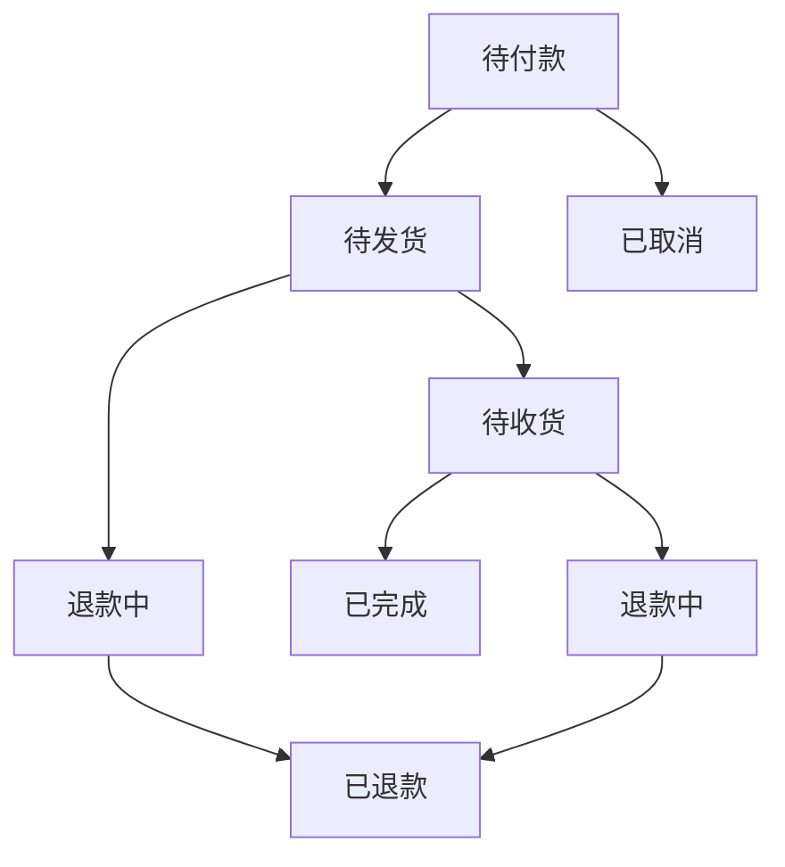
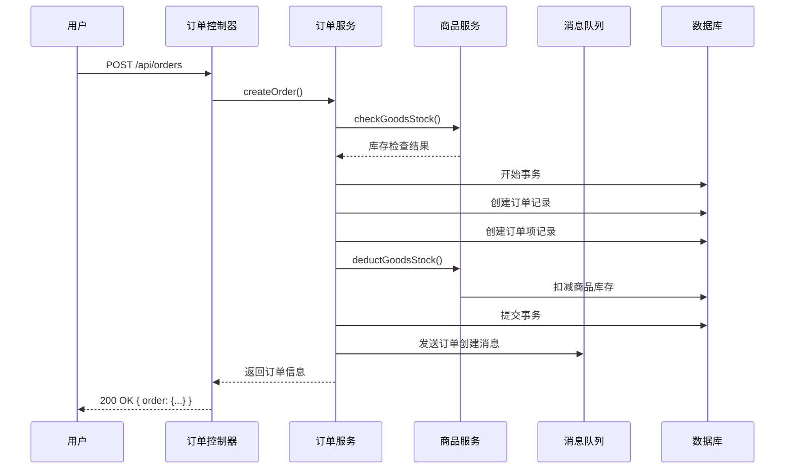
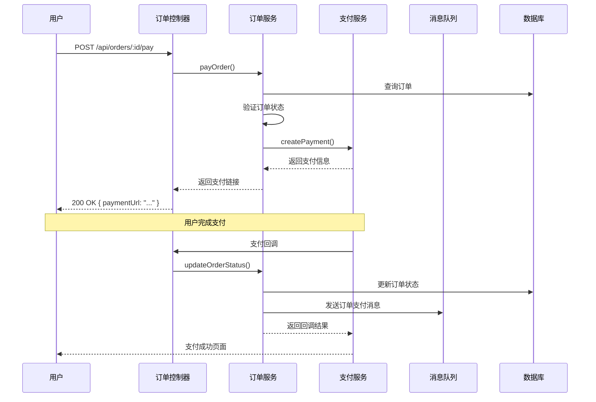
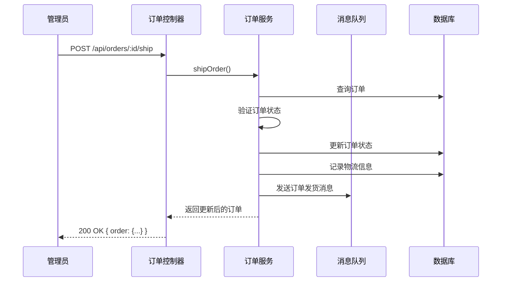
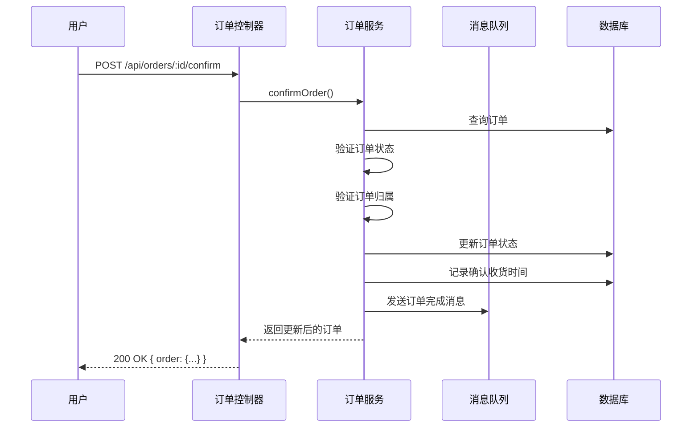
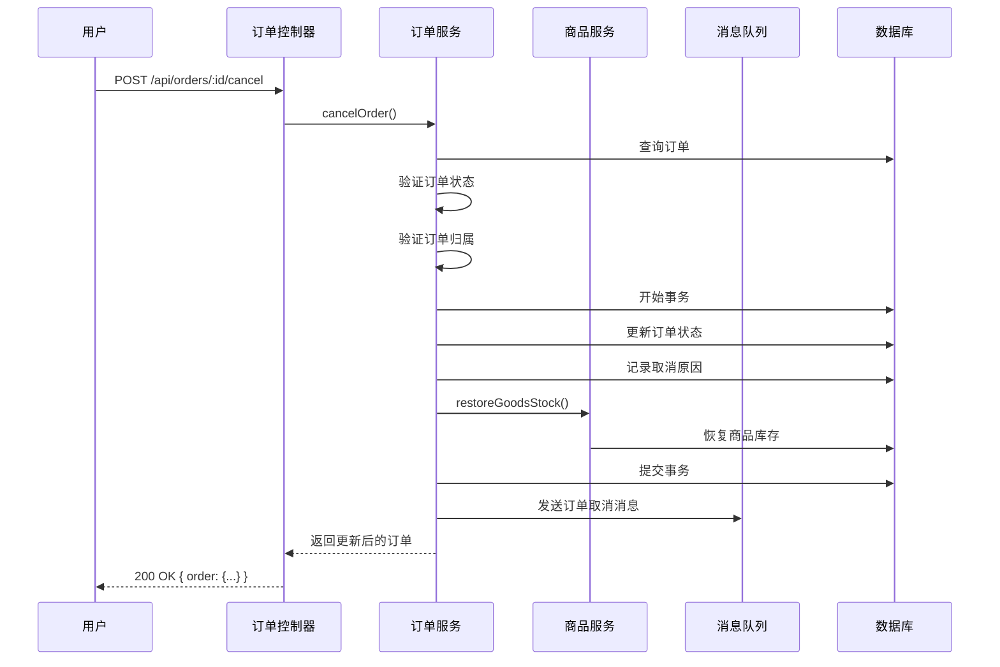

# 订单模块文档

## 1. 模块概述

订单模块是 MallEcoAPI 系统的核心业务模块之一，负责订单的创建、管理、状态流转等功能。该模块连接了商品、用户、支付等多个模块，是电商系统的关键环节。

### 1.1 模块定位

订单模块在系统中扮演着以下角色：

- **订单创建**：根据用户购物车或直接购买生成订单
- **订单管理**：维护订单的全生命周期，包括待付款、待发货、待收货、已完成、已取消等状态
- **订单查询**：提供订单列表查询、详情查询等功能
- **订单操作**：支持订单支付、发货、确认收货、取消等操作
- **订单统计**：提供订单数据统计和分析功能

### 1.2 核心价值

- **业务闭环**：连接商品、支付、物流等模块，形成完整的交易闭环
- **状态管理**：确保订单状态的正确流转，防止状态混乱
- **数据准确性**：保证订单数据的完整和准确
- **用户体验**：提供便捷的订单管理和查询功能
- **业务分析**：通过订单数据，为业务决策提供支持

## 2. 目录结构

```
src/modules/order/
├── controllers/         # 控制器
│   ├── order.controller.ts       # 订单控制器
│   └── order-full.controller.ts  # 订单综合控制器
├── dto/                 # 数据传输对象
│   ├── create-order.dto.ts       # 创建订单 DTO
│   ├── order-query.dto.ts        # 订单查询 DTO
│   └── order-item.dto.ts         # 订单项 DTO
├── entities/            # 实体
│   ├── order.entity.ts           # 订单实体
│   ├── order-item.entity.ts      # 订单项实体
│   └── order-address.entity.ts   # 订单地址实体
├── services/            # 服务
│   ├── order.service.ts          # 订单服务
│   ├── order.service.spec.ts     # 订单服务测试
│   └── order-full.service.ts     # 订单综合服务
└── order.module.ts      # 订单模块

src/modules/buyer/order/
├── controllers/         # 买家端控制器
│   └── order.controller.ts       # 买家订单控制器
├── services/            # 买家端服务
│   └── order.service.ts          # 买家订单服务
└── order.module.ts      # 买家订单模块
```

## 3. 核心组件

### 3.1 OrderService

**功能**：订单服务的核心，处理订单的创建、状态更新等逻辑

**主要方法**：

| 方法名 | 功能描述 | 参数 | 返回值 |
|--------|----------|------|--------|
| `createOrder` | 创建订单 | `createOrderDto: CreateOrderDto; userId: string` | `Promise<Order>` |
| `getOrderById` | 根据 ID 获取订单 | `orderId: string; userId?: string` | `Promise<Order>` |
| `getOrderList` | 获取订单列表 | `query: OrderQueryDto; userId?: string` | `Promise<{ items: Order[]; total: number }>` |
| `updateOrderStatus` | 更新订单状态 | `orderId: string; status: OrderStatus` | `Promise<Order>` |
| `cancelOrder` | 取消订单 | `orderId: string; userId: string; reason?: string` | `Promise<Order>` |
| `payOrder` | 支付订单 | `orderId: string; paymentMethod: string; transactionId: string` | `Promise<Order>` |
| `shipOrder` | 发货 | `orderId: string; shippingInfo: ShippingInfoDto` | `Promise<Order>` |
| `confirmOrder` | 确认收货 | `orderId: string; userId: string` | `Promise<Order>` |
| `refundOrder` | 申请退款 | `orderId: string; userId: string; refundReason: string` | `Promise<Order>` |

**实现原理**：

1. **订单创建**：验证商品库存，计算价格，生成订单号，创建订单记录
2. **状态管理**：根据业务规则，控制订单状态的流转
3. **事务处理**：使用数据库事务确保订单操作的原子性
4. **消息通知**：通过消息队列，通知相关模块订单状态变化
5. **缓存策略**：使用 Redis 缓存订单数据，提高查询性能

### 3.2 OrderFullService

**功能**：订单综合服务，提供订单详情、统计等综合功能

**主要方法**：

| 方法名 | 功能描述 | 参数 | 返回值 |
|--------|----------|------|--------|
| `getOrderDetail` | 获取订单详情 | `orderId: string; userId?: string` | `Promise<OrderDetail>` |
| `getOrderStatistics` | 获取订单统计 | `userId: string; params: OrderStatisticsParams` | `Promise<OrderStatistics>` |
| `getOrderItems` | 获取订单项 | `orderId: string` | `Promise<OrderItem[]>` |
| `getOrderAddress` | 获取订单地址 | `orderId: string` | `Promise<OrderAddress>` |

**实现原理**：

1. **订单详情**：聚合订单基本信息、订单项、地址、物流等数据
2. **订单统计**：根据时间范围、状态等维度，统计订单数据
3. **数据关联**：处理订单与其他模块的数据关联，提供完整的订单视图

### 3.3 买家订单服务

**功能**：为买家提供订单管理功能

**主要方法**：

| 方法名 | 功能描述 | 参数 | 返回值 |
|--------|----------|------|--------|
| `getMyOrders` | 获取我的订单 | `userId: string; query: OrderQueryDto` | `Promise<{ items: Order[]; total: number }>` |
| `getMyOrderDetail` | 获取我的订单详情 | `orderId: string; userId: string` | `Promise<OrderDetail>` |
| `cancelMyOrder` | 取消我的订单 | `orderId: string; userId: string; reason?: string` | `Promise<Order>` |
| `payMyOrder` | 支付我的订单 | `orderId: string; userId: string; paymentMethod: string` | `Promise<{ order: Order; paymentUrl: string }>` |
| `confirmMyOrder` | 确认我的订单收货 | `orderId: string; userId: string` | `Promise<Order>` |
| `refundMyOrder` | 申请我的订单退款 | `orderId: string; userId: string; refundReason: string` | `Promise<Order>` |

**实现原理**：

1. **数据隔离**：确保用户只能访问自己的订单
2. **权限控制**：验证用户对订单的操作权限
3. **用户体验**：提供便捷的订单操作接口

## 4. 数据模型

### 4.1 订单实体 (Order)

| 字段名 | 类型 | 描述 |
|--------|------|------|
| `id` | string | 订单 ID |
| `orderSn` | string | 订单编号 |
| `userId` | string | 用户 ID |
| `shopId` | string | 店铺 ID |
| `orderStatus` | number | 订单状态（0-待付款，1-待发货，2-待收货，3-已完成，4-已取消，5-退款中，6-已退款） |
| `shippingStatus` | number | 物流状态（0-未发货，1-已发货，2-已签收） |
| `payStatus` | number | 支付状态（0-未支付，1-已支付，2-部分支付，3-已退款） |
| `consignee` | string | 收货人 |
| `mobile` | string | 联系电话 |
| `address` | string | 收货地址 |
| `regionId` | string | 地区 ID |
| `postalCode` | string | 邮政编码 |
| `totalAmount` | number | 订单总金额 |
| `actualAmount` | number | 实际支付金额 |
| `goodsAmount` | number | 商品总金额 |
| `shippingAmount` | number | 运费 |
| `couponAmount` | number | 优惠券金额 |
| `paymentMethod` | string | 支付方式（alipay, wechat） |
| `paymentTime` | Date | 支付时间 |
| `shippingTime` | Date | 发货时间 |
| `confirmTime` | Date | 确认收货时间 |
| `cancelTime` | Date | 取消时间 |
| `cancelReason` | string | 取消原因 |
| `remark` | string | 订单备注 |
| `deleted` | boolean | 是否已删除 |
| `createdAt` | Date | 创建时间 |
| `updatedAt` | Date | 更新时间 |

### 4.2 订单项实体 (OrderItem)

| 字段名 | 类型 | 描述 |
|--------|------|------|
| `id` | string | 订单项 ID |
| `orderId` | string | 订单 ID |
| `goodsId` | string | 商品 ID |
| `goodsSkuId` | string | 商品 SKU ID |
| `goodsName` | string | 商品名称 |
| `skuSpecs` | string | SKU 规格（JSON 格式） |
| `price` | number | 商品单价 |
| `quantity` | number | 商品数量 |
| `totalPrice` | number | 商品总价 |
| `goodsImage` | string | 商品图片 |
| `refundStatus` | number | 退款状态（0-无退款，1-退款中，2-已退款） |
| `createdAt` | Date | 创建时间 |
| `updatedAt` | Date | 更新时间 |

### 4.3 订单地址实体 (OrderAddress)

| 字段名 | 类型 | 描述 |
|--------|------|------|
| `id` | string | 地址 ID |
| `orderId` | string | 订单 ID |
| `userId` | string | 用户 ID |
| `consignee` | string | 收货人 |
| `mobile` | string | 联系电话 |
| `province` | string | 省份 |
| `city` | string | 城市 |
| `district` | string | 区县 |
| `detailAddress` | string | 详细地址 |
| `postalCode` | string | 邮政编码 |
| `isDefault` | boolean | 是否默认地址 |
| `createdAt` | Date | 创建时间 |
| `updatedAt` | Date | 更新时间 |

## 5. 核心功能

### 5.1 订单创建

**功能描述**：根据用户购物车或直接购买生成订单

**流程**：

1. 接收订单创建请求，验证请求数据
2. 验证商品库存
3. 计算订单金额（商品金额、运费、优惠等）
4. 生成订单编号
5. 开始数据库事务
6. 创建订单记录
7. 创建订单项记录
8. 扣减商品库存
9. 清空购物车（如果是从购物车创建）
10. 提交事务
11. 发送订单创建消息
12. 返回订单信息

**代码示例**：

```typescript
async createOrder(createOrderDto: CreateOrderDto, userId: string): Promise<Order> {
  // 验证商品库存
  for (const item of createOrderDto.items) {
    const hasStock = await this.goodsService.checkGoodsStock(item.goodsId, item.quantity);
    if (!hasStock) {
      throw new BadRequestException(`商品 ${item.goodsId} 库存不足`);
    }
  }
  
  // 计算订单金额
  let goodsAmount = 0;
  for (const item of createOrderDto.items) {
    const goods = await this.goodsService.getGoodsById(item.goodsId);
    goodsAmount += goods.price * item.quantity;
  }
  
  const shippingAmount = createOrderDto.shippingAmount || 0;
  const couponAmount = createOrderDto.couponAmount || 0;
  const totalAmount = goodsAmount + shippingAmount - couponAmount;
  
  // 生成订单编号
  const orderSn = `ORDER${Date.now()}${Math.floor(Math.random() * 10000)}`;
  
  // 开始事务
  const order = await this.orderRepository.manager.transaction(async (manager) => {
    // 创建订单
    const newOrder = manager.create(Order, {
      orderSn,
      userId,
      shopId: createOrderDto.shopId,
      orderStatus: 0, // 待付款
      shippingStatus: 0, // 未发货
      payStatus: 0, // 未支付
      consignee: createOrderDto.consignee,
      mobile: createOrderDto.mobile,
      address: createOrderDto.address,
      totalAmount,
      actualAmount: totalAmount,
      goodsAmount,
      shippingAmount,
      couponAmount,
      remark: createOrderDto.remark,
    });
    
    await manager.save(newOrder);
    
    // 创建订单项
    for (const item of createOrderDto.items) {
      const goods = await this.goodsService.getGoodsById(item.goodsId);
      const orderItem = manager.create(OrderItem, {
        orderId: newOrder.id,
        goodsId: item.goodsId,
        goodsSkuId: item.goodsSkuId,
        goodsName: goods.name,
        skuSpecs: item.skuSpecs,
        price: goods.price,
        quantity: item.quantity,
        totalPrice: goods.price * item.quantity,
        goodsImage: goods.images[0],
        refundStatus: 0, // 无退款
      });
      await manager.save(orderItem);
      
      // 扣减商品库存
      await this.goodsService.deductGoodsStock(item.goodsId, item.quantity);
    }
    
    return newOrder;
  });
  
  // 发送订单创建消息
  await this.rabbitMqService.send('order.created', { orderId: order.id });
  
  return order;
}
```

### 5.2 订单支付

**功能描述**：处理订单支付，连接支付模块

**流程**：

1. 接收订单支付请求
2. 验证订单状态（必须是待付款状态）
3. 验证订单归属
4. 调用支付模块，生成支付链接或支付参数
5. 返回支付信息
6. 支付成功后，更新订单状态

**代码示例**：

```typescript
async payOrder(orderId: string, paymentMethod: string, transactionId: string): Promise<Order> {
  const order = await this.orderRepository.findOne({
    where: { id: orderId },
  });
  
  if (!order) {
    throw new NotFoundException('订单不存在');
  }
  
  if (order.orderStatus !== 0) {
    throw new BadRequestException('订单状态不正确，无法支付');
  }
  
  // 开始事务
  await this.orderRepository.manager.transaction(async (manager) => {
    // 更新订单状态
    order.orderStatus = 1; // 待发货
    order.payStatus = 1; // 已支付
    order.paymentMethod = paymentMethod;
    order.paymentTime = new Date();
    await manager.save(order);
  });
  
  // 发送订单支付消息
  await this.rabbitMqService.send('order.paid', { orderId: order.id });
  
  return order;
}
```

### 5.3 订单发货

**功能描述**：处理订单发货

**流程**：

1. 接收订单发货请求
2. 验证订单状态（必须是待发货状态）
3. 验证操作权限
4. 更新订单状态为已发货
5. 记录物流信息
6. 发送订单发货消息
7. 返回更新后的订单信息

### 5.4 确认收货

**功能描述**：处理用户确认收货

**流程**：

1. 接收确认收货请求
2. 验证订单状态（必须是待收货状态）
3. 验证订单归属
4. 更新订单状态为已完成
5. 记录确认收货时间
6. 发送订单完成消息
7. 返回更新后的订单信息

### 5.5 订单取消

**功能描述**：处理订单取消

**流程**：

1. 接收订单取消请求
2. 验证订单状态（必须是待付款或待发货状态）
3. 验证订单归属
4. 开始数据库事务
5. 更新订单状态为已取消
6. 记录取消时间和原因
7. 恢复商品库存（如果是已扣减库存的情况）
8. 提交事务
9. 发送订单取消消息
10. 返回更新后的订单信息

### 5.6 订单查询

**功能描述**：提供订单列表和详情查询

**流程**：

1. 接收订单查询请求
2. 验证查询参数
3. 构建查询条件
4. 执行数据库查询
5. 处理查询结果
6. 返回订单列表或详情

## 6. 订单状态流转

### 6.1 状态定义

| 状态值 | 状态名称 | 描述 |
|--------|----------|------|
| 0 | 待付款 | 订单已创建，等待用户支付 |
| 1 | 待发货 | 订单已支付，等待商家发货 |
| 2 | 待收货 | 订单已发货，等待用户确认收货 |
| 3 | 已完成 | 用户已确认收货，订单完成 |
| 4 | 已取消 | 订单已取消 |
| 5 | 退款中 | 订单申请退款，等待处理 |
| 6 | 已退款 | 订单已退款 |

### 6.2 状态流转图



### 6.3 状态流转规则

1. **待付款 → 待发货**：用户支付成功后
2. **待付款 → 已取消**：用户主动取消或超时未支付
3. **待发货 → 待收货**：商家发货后
4. **待发货 → 退款中**：用户申请退款
5. **待收货 → 已完成**：用户确认收货
6. **待收货 → 退款中**：用户申请退款
7. **退款中 → 已退款**：退款处理成功

## 7. 业务流程

### 7.1 订单创建流程



### 7.2 订单支付流程



### 7.3 订单发货流程



### 7.4 确认收货流程



### 7.5 订单取消流程



## 8. 接口设计

### 8.1 订单管理接口

| API 路径 | 方法 | 功能描述 | 认证要求 |
|----------|------|----------|----------|
| `/api/orders` | GET | 获取订单列表 | 是 |
| `/api/orders/:id` | GET | 获取订单详情 | 是 |
| `/api/orders` | POST | 创建订单 | 是 |
| `/api/orders/:id` | PUT | 更新订单 | 是（管理员） |
| `/api/orders/:id` | DELETE | 删除订单 | 是（管理员） |
| `/api/orders/:id/pay` | POST | 支付订单 | 是 |
| `/api/orders/:id/ship` | POST | 发货 | 是（管理员） |
| `/api/orders/:id/confirm` | POST | 确认收货 | 是 |
| `/api/orders/:id/cancel` | POST | 取消订单 | 是 |
| `/api/orders/:id/refund` | POST | 申请退款 | 是 |

### 8.2 买家订单接口

| API 路径 | 方法 | 功能描述 | 认证要求 |
|----------|------|----------|----------|
| `/api/buyer/orders` | GET | 获取我的订单 | 是 |
| `/api/buyer/orders/:id` | GET | 获取我的订单详情 | 是 |
| `/api/buyer/orders` | POST | 创建订单 | 是 |
| `/api/buyer/orders/:id/pay` | POST | 支付我的订单 | 是 |
| `/api/buyer/orders/:id/confirm` | POST | 确认我的订单收货 | 是 |
| `/api/buyer/orders/:id/cancel` | POST | 取消我的订单 | 是 |
| `/api/buyer/orders/:id/refund` | POST | 申请我的订单退款 | 是 |

### 8.3 订单统计接口

| API 路径 | 方法 | 功能描述 | 认证要求 |
|----------|------|----------|----------|
| `/api/orders/statistics` | GET | 获取订单统计 | 是（管理员） |
| `/api/orders/statistics/day` | GET | 获取每日订单统计 | 是（管理员） |
| `/api/orders/statistics/month` | GET | 获取每月订单统计 | 是（管理员） |
| `/api/buyer/orders/statistics` | GET | 获取我的订单统计 | 是 |

## 9. 缓存策略

### 9.1 缓存键设计

| 缓存键 | 描述 | 过期时间 |
|--------|------|----------|
| `order:{id}` | 订单详情 | 1小时 |
| `orders:user:{userId}` | 用户订单列表 | 30分钟 |
| `orders:statistics:{type}` | 订单统计数据 | 1小时 |
| `orders:status:{status}` | 特定状态订单列表 | 30分钟 |

### 9.2 缓存更新策略

- **实时更新**：订单状态变更时，立即清除相关缓存
- **定时更新**：订单统计数据定期更新
- **惰性更新**：缓存过期后，下次访问时重新生成

## 10. 安全措施

### 10.1 数据验证

- **订单数据验证**：使用 class-validator 验证订单数据的合法性
- **状态验证**：验证订单状态变更的合法性
- **权限验证**：验证用户对订单的操作权限

### 10.2 访问控制

- **用户权限**：用户只能访问和操作自己的订单
- **管理员权限**：管理员可以访问和操作所有订单
- **数据隔离**：确保订单数据的隔离性

### 10.3 防重复提交

- **订单创建**：使用幂等性设计，防止重复创建订单
- **支付操作**：使用支付凭证，防止重复支付

### 10.4 数据安全

- **敏感信息**：订单中的敏感信息（如地址、电话）进行适当处理
- **数据加密**：支付相关信息进行加密存储

## 11. 性能优化

### 11.1 数据库优化

- **索引优化**：为订单表的常用查询字段添加索引
- **查询优化**：优化 SQL 查询，减少关联查询和全表扫描
- **分页优化**：使用游标分页，提高大数据量查询性能

### 11.2 缓存优化

- **订单缓存**：缓存热门订单和用户订单列表
- **统计数据缓存**：缓存订单统计数据，减少计算开销

### 11.3 异步处理

- **消息队列**：使用 RabbitMQ 处理订单相关的异步任务
- **定时任务**：使用定时任务处理订单超时取消、自动确认收货等

### 11.4 代码优化

- **批量操作**：合并数据库操作，减少数据库交互次数
- **并行处理**：使用 Promise.all 处理并行任务

## 12. 常见问题与解决方案

### 12.1 订单创建失败

**问题**：订单创建失败，返回错误信息

**可能原因**：
- 商品库存不足
- 数据验证失败
- 数据库事务回滚

**解决方案**：
- 检查商品库存
- 验证请求数据
- 查看系统日志，定位具体错误

### 12.2 订单状态异常

**问题**：订单状态与实际情况不符

**可能原因**：
- 状态更新失败
- 消息队列处理异常
- 并发操作导致状态混乱

**解决方案**：
- 检查状态更新逻辑
- 监控消息队列状态
- 使用乐观锁或悲观锁，防止并发冲突

### 12.3 订单支付超时

**问题**：订单支付超时，自动取消

**可能原因**：
- 用户未及时支付
- 支付系统异常

**解决方案**：
- 实现订单超时自动取消机制
- 提供支付提醒功能
- 记录支付失败原因，便于排查

### 12.4 订单数据查询缓慢

**问题**：订单列表或详情查询缓慢

**可能原因**：
- 数据量过大
- 索引缺失
- 缓存失效

**解决方案**：
- 优化数据库索引
- 增加缓存策略
- 实现数据分片或分表

## 13. 代码示例

### 13.1 订单服务示例

```typescript
import { Injectable, NotFoundException, BadRequestException } from '@nestjs/common';
import { InjectRepository } from '@nestjs/typeorm';
import { Repository } from 'typeorm';
import { Order } from '../entities/order.entity';
import { OrderItem } from '../entities/order-item.entity';
import { CreateOrderDto } from '../dto/create-order.dto';
import { GoodsService } from '../../goods/services/goods.service';
import { RabbitMqService } from '../../../infrastructure/rabbitmq/rabbitmq.service';

@Injectable()
export class OrderService {
  constructor(
    @InjectRepository(Order) private orderRepository: Repository<Order>,
    @InjectRepository(OrderItem) private orderItemRepository: Repository<OrderItem>,
    private goodsService: GoodsService,
    private rabbitMqService: RabbitMqService,
  ) {}

  async createOrder(createOrderDto: CreateOrderDto, userId: string): Promise<Order> {
    // 验证商品库存
    for (const item of createOrderDto.items) {
      const hasStock = await this.goodsService.checkGoodsStock(item.goodsId, item.quantity);
      if (!hasStock) {
        throw new BadRequestException(`商品 ${item.goodsId} 库存不足`);
      }
    }
    
    // 计算订单金额
    let goodsAmount = 0;
    for (const item of createOrderDto.items) {
      const goods = await this.goodsService.getGoodsById(item.goodsId);
      goodsAmount += goods.price * item.quantity;
    }
    
    const shippingAmount = createOrderDto.shippingAmount || 0;
    const couponAmount = createOrderDto.couponAmount || 0;
    const totalAmount = goodsAmount + shippingAmount - couponAmount;
    
    // 生成订单编号
    const orderSn = `ORDER${Date.now()}${Math.floor(Math.random() * 10000)}`;
    
    // 开始事务
    const order = await this.orderRepository.manager.transaction(async (manager) => {
      // 创建订单
      const newOrder = manager.create(Order, {
        orderSn,
        userId,
        shopId: createOrderDto.shopId,
        orderStatus: 0, // 待付款
        shippingStatus: 0, // 未发货
        payStatus: 0, // 未支付
        consignee: createOrderDto.consignee,
        mobile: createOrderDto.mobile,
        address: createOrderDto.address,
        totalAmount,
        actualAmount: totalAmount,
        goodsAmount,
        shippingAmount,
        couponAmount,
        remark: createOrderDto.remark,
      });
      
      await manager.save(newOrder);
      
      // 创建订单项
      for (const item of createOrderDto.items) {
        const goods = await this.goodsService.getGoodsById(item.goodsId);
        const orderItem = manager.create(OrderItem, {
          orderId: newOrder.id,
          goodsId: item.goodsId,
          goodsSkuId: item.goodsSkuId,
          goodsName: goods.name,
          skuSpecs: item.skuSpecs,
          price: goods.price,
          quantity: item.quantity,
          totalPrice: goods.price * item.quantity,
          goodsImage: goods.images[0],
          refundStatus: 0, // 无退款
        });
        await manager.save(orderItem);
        
        // 扣减商品库存
        await this.goodsService.deductGoodsStock(item.goodsId, item.quantity);
      }
      
      return newOrder;
    });
    
    // 发送订单创建消息
    await this.rabbitMqService.send('order.created', { orderId: order.id });
    
    return order;
  }

  async getOrderById(orderId: string, userId?: string): Promise<Order> {
    const query = this.orderRepository.createQueryBuilder('order')
      .leftJoinAndSelect('order.items', 'items')
      .where('order.id = :orderId', { orderId });
    
    if (userId) {
      query.andWhere('order.userId = :userId', { userId });
    }
    
    const order = await query.getOne();
    
    if (!order) {
      throw new NotFoundException('订单不存在');
    }
    
    return order;
  }
}
```

### 13.2 订单控制器示例

```typescript
import { Controller, Get, Post, Put, Delete, Param, Body, Query, UseGuards, Req } from '@nestjs/common';
import { OrderService } from '../services/order.service';
import { CreateOrderDto } from '../dto/create-order.dto';
import { JwtAuthGuard } from '../../../infrastructure/auth/guards/jwt-auth.guard';
import { RolesGuard } from '../../../infrastructure/auth/guards/roles.guard';
import { Roles } from '../../../infrastructure/auth/decorators/roles.decorator';

@Controller('orders')
@UseGuards(JwtAuthGuard)
export class OrderController {
  constructor(private readonly orderService: OrderService) {}

  @Get()
  async getOrderList(@Query() query, @Req() req) {
    return this.orderService.getOrderList(query, req.user.id);
  }

  @Get(':id')
  async getOrderById(@Param('id') id: string, @Req() req) {
    return this.orderService.getOrderById(id, req.user.id);
  }

  @Post()
  async createOrder(@Body() createOrderDto: CreateOrderDto, @Req() req) {
    return this.orderService.createOrder(createOrderDto, req.user.id);
  }

  @Post(':id/pay')
  async payOrder(@Param('id') id: string, @Body('paymentMethod') paymentMethod: string, @Req() req) {
    return this.orderService.payOrder(id, paymentMethod, req.user.id);
  }

  @Post(':id/confirm')
  async confirmOrder(@Param('id') id: string, @Req() req) {
    return this.orderService.confirmOrder(id, req.user.id);
  }

  @Post(':id/cancel')
  async cancelOrder(@Param('id') id: string, @Body('reason') reason: string, @Req() req) {
    return this.orderService.cancelOrder(id, req.user.id, reason);
  }

  @UseGuards(RolesGuard)
  @Roles('admin')
  @Post(':id/ship')
  async shipOrder(@Param('id') id: string, @Body('shippingInfo') shippingInfo: any) {
    return this.orderService.shipOrder(id, shippingInfo);
  }
}
```

## 14. 总结与展望

### 14.1 模块优势

- **架构清晰**：采用模块化设计，代码结构清晰，易于维护
- **功能完整**：涵盖订单的全生命周期管理
- **状态管理**：实现了完整的订单状态流转机制
- **事务处理**：使用数据库事务确保订单操作的原子性
- **异步处理**：使用消息队列处理异步任务，提高系统性能
- **安全性高**：实现了完善的数据验证和访问控制

### 14.2 改进空间

- **订单类型扩展**：支持更多订单类型，如预售订单、拼团订单等
- **物流集成**：集成更多物流服务商，提供实时物流查询
- **退换货流程**：完善退换货流程，提高用户体验
- **数据分析**：增强订单数据分析能力，为业务决策提供更有力的支持
- **多语言支持**：支持订单信息的多语言版本

### 14.3 未来规划

- **版本 1.1**：增强订单类型支持，添加预售订单、拼团订单等功能
- **版本 1.2**：集成更多物流服务商，提供实时物流查询和轨迹追踪
- **版本 1.3**：完善退换货流程，支持自动退款和换货
- **版本 1.4**：增强订单数据分析，提供更丰富的统计报表
- **版本 2.0**：重构订单模块，采用更先进的架构和技术，支持更多电商场景

## 15. 附录

### 15.1 核心 API 列表

| API 路径 | 方法 | 功能描述 | 认证要求 |
|----------|------|----------|----------|
| `/api/orders` | GET | 获取订单列表 | 是 |
| `/api/orders/:id` | GET | 获取订单详情 | 是 |
| `/api/orders` | POST | 创建订单 | 是 |
| `/api/orders/:id/pay` | POST | 支付订单 | 是 |
| `/api/orders/:id/ship` | POST | 发货 | 是（管理员） |
| `/api/orders/:id/confirm` | POST | 确认收货 | 是 |
| `/api/orders/:id/cancel` | POST | 取消订单 | 是 |
| `/api/orders/:id/refund` | POST | 申请退款 | 是 |
| `/api/orders/statistics` | GET | 获取订单统计 | 是（管理员） |

### 15.2 配置项参考

| 配置项 | 类型 | 默认值 | 说明 |
|--------|------|--------|------|
| `ORDER_PAGE_SIZE` | number | 20 | 订单列表每页数量 |
| `ORDER_CACHE_TTL` | number | 3600 | 订单缓存过期时间（秒） |
| `ORDER_PAY_TIMEOUT` | number | 3600 | 订单支付超时时间（秒） |
| `ORDER_AUTO_CONFIRM_DAYS` | number | 7 | 自动确认收货天数 |
| `ORDER_CANCEL_TIMEOUT` | number | 86400 | 订单取消超时时间（秒） |

### 15.3 依赖项

| 依赖项 | 版本 | 用途 |
|--------|------|------|
| `typeorm` | ^0.3.28 | 数据库操作 |
| `class-validator` | ^0.14.3 | 数据验证 |
| `class-transformer` | ^0.5.1 | 数据转换 |
| `amqp-connection-manager` | ^4.1.14 | RabbitMQ 连接管理 |
| `@nestjs/microservices` | ^11.0.1 | 微服务集成 |

---

**文档更新时间**：2026-01-19
**文档版本**：v1.0.0
**作者**：MallEco 开发团队
