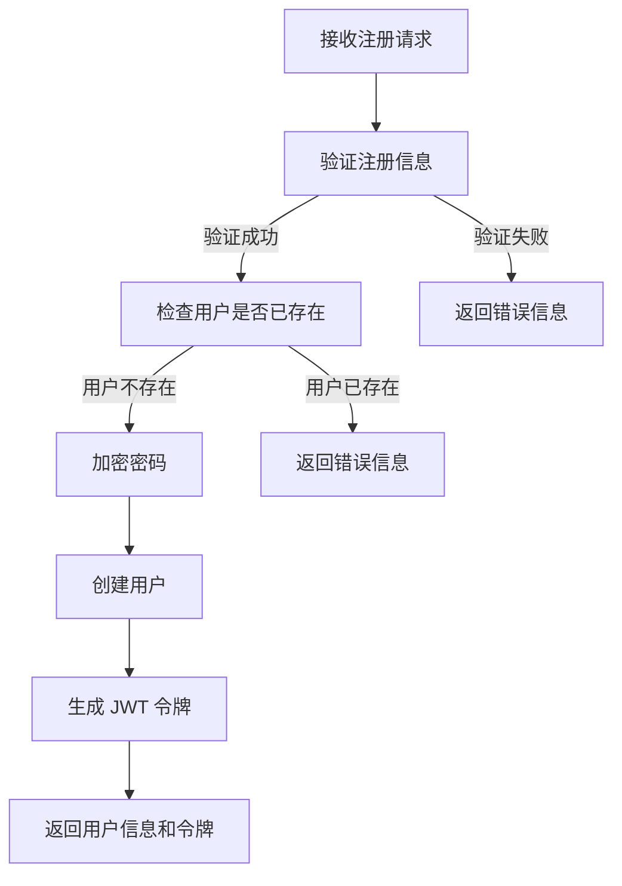
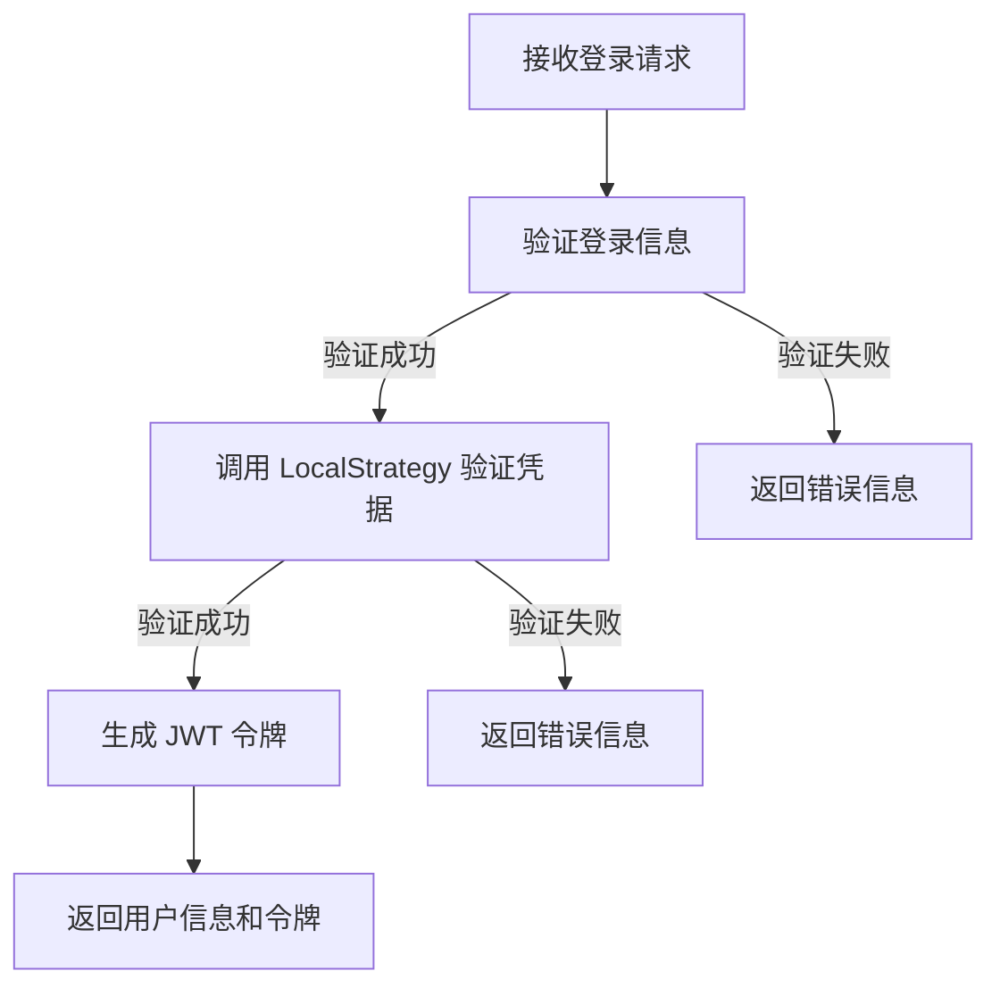
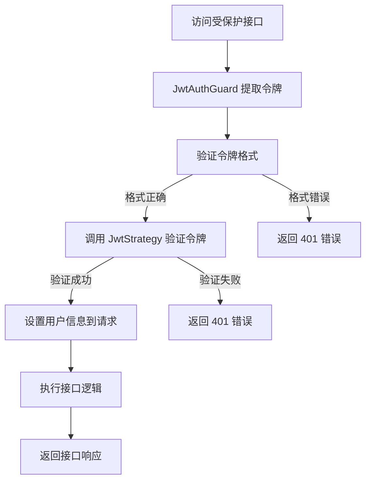
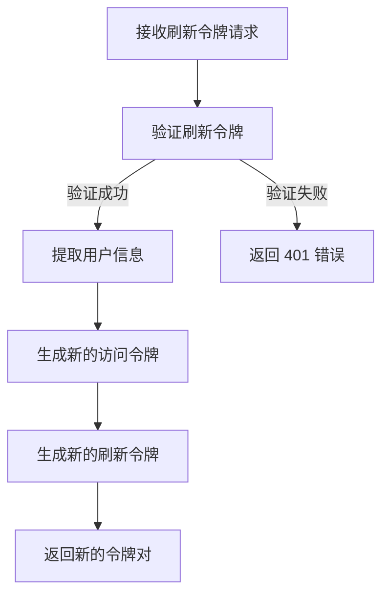

# 认证模块文档

## 1. 模块概述

认证模块是 MallEcoAPI 系统的核心模块之一，负责用户身份认证、授权管理和会话管理。该模块基于 JWT (JSON Web Token) 实现，提供了安全、高效的用户认证机制。

### 1.1 模块定位

认证模块在系统中扮演着以下角色：

- **用户身份验证**：验证用户提供的凭据（用户名/密码）是否有效
- **会话管理**：生成和管理用户会话，使用 JWT 令牌作为会话标识
- **权限控制**：基于角色的访问控制（RBAC），确保用户只能访问其有权限的资源
- **安全保障**：防止未授权访问，保护系统资源的安全

### 1.2 核心价值

- **安全性**：使用 JWT 令牌和密码加密存储，确保用户身份信息的安全
- **无状态**：JWT 令牌是无状态的，减少了服务器存储会话的负担
- **可扩展性**：支持多种认证方式，易于集成第三方认证服务
- **性能优异**：令牌验证快速，减少了认证过程的性能开销

## 2. 目录结构

```
src/modules/auth/
├── controllers/         # 控制器
│   ├── auth.controller.ts      # 认证控制器
│   └── passport.controller.ts  # Passport 控制器
├── dto/                 # 数据传输对象
│   ├── login.dto.ts     # 登录请求 DTO
│   └── register.dto.ts  # 注册请求 DTO
├── services/            # 服务
│   ├── auth.service.spec.ts    # 认证服务测试
│   ├── auth.service.ts         # 认证服务
│   └── passport.service.ts     # Passport 服务
└── auth.module.ts       # 认证模块

src/infrastructure/auth/
├── decorators/          # 装饰器
│   └── roles.decorator.ts      # 角色装饰器
├── guards/              # 守卫
│   ├── jwt-auth.guard.ts       # JWT 认证守卫
│   └── roles.guard.ts          # 角色守卫
└── strategies/          # 策略
    ├── jwt.strategy.ts         # JWT 策略
    └── local.strategy.ts       # 本地策略
```

## 3. 核心组件

### 3.1 AuthService

**功能**：认证服务的核心，处理用户登录、注册、令牌生成等逻辑

**主要方法**：

| 方法名 | 功能描述 | 参数 | 返回值 |
|--------|----------|------|--------|
| `register` | 用户注册 | `registerDto: RegisterDto` | `Promise<{ user: User; token: string; refreshToken: string }>` |
| `login` | 用户登录 | `loginDto: LoginDto` | `Promise<{ user: User; token: string; refreshToken: string }>` |
| `validateUser` | 验证用户凭据 | `username: string; password: string` | `Promise<User | null>` |
| `generateToken` | 生成 JWT 令牌 | `user: User` | `string` |
| `generateRefreshToken` | 生成刷新令牌 | `user: User` | `string` |
| `validateToken` | 验证令牌 | `token: string` | `Promise<{ user: User; payload: any }>` |
| `refreshToken` | 刷新令牌 | `refreshToken: string` | `Promise<{ token: string; refreshToken: string }>` |

**实现原理**：

1. **密码加密**：使用 bcrypt 对用户密码进行加密存储
2. **令牌生成**：使用 jsonwebtoken 库生成 JWT 令牌，包含用户 ID、角色等信息
3. **令牌验证**：验证 JWT 令牌的签名和有效性
4. **刷新机制**：实现令牌过期后的刷新机制，提高用户体验

### 3.2 JwtStrategy

**功能**：实现 JWT 令牌验证策略

**主要方法**：

| 方法名 | 功能描述 | 参数 | 返回值 |
|--------|----------|------|--------|
| `validate` | 验证 JWT 令牌并返回用户信息 | `payload: any` | `Promise<User>` |

**实现原理**：

1. 从 JWT 令牌中提取用户信息（如用户 ID）
2. 根据用户 ID 查询用户数据
3. 返回用户信息，用于后续的权限验证

### 3.3 JwtAuthGuard

**功能**：JWT 认证守卫，用于保护需要认证的接口

**使用方式**：

```typescript
@UseGuards(JwtAuthGuard)
@Controller('protected')
export class ProtectedController {
  // 受保护的接口
}
```

**实现原理**：

1. 从请求中提取 JWT 令牌（通常从 Authorization 头中）
2. 调用 JwtStrategy 验证令牌的有效性
3. 如果验证通过，允许访问接口；否则，返回 401 Unauthorized 错误

### 3.4 RolesGuard

**功能**：角色守卫，用于基于角色的访问控制

**使用方式**：

```typescript
@UseGuards(JwtAuthGuard, RolesGuard)
@Roles('admin', 'user')
@Controller('admin')
export class AdminController {
  // 需要特定角色才能访问的接口
}
```

**实现原理**：

1. 确保用户已通过 JWT 认证
2. 从请求中获取用户信息和角色
3. 检查用户角色是否在允许的角色列表中
4. 如果用户具有所需角色，允许访问接口；否则，返回 403 Forbidden 错误

### 3.5 LocalStrategy

**功能**：本地认证策略，处理用户名密码登录

**主要方法**：

| 方法名 | 功能描述 | 参数 | 返回值 |
|--------|----------|------|--------|
| `validate` | 验证用户名和密码 | `username: string; password: string` | `Promise<User>` |

**实现原理**：

1. 根据用户名查询用户
2. 验证用户密码是否正确
3. 如果验证通过，返回用户信息；否则，抛出错误

## 4. 认证流程

### 4.1 用户注册流程



### 4.2 用户登录流程



### 4.3 令牌验证流程



### 4.4 令牌刷新流程



## 5. 安全措施

### 5.1 密码安全

- **密码加密**：使用 bcrypt 算法对用户密码进行加密存储，加密强度为 10 轮
- **密码策略**：建议实现密码强度验证，要求密码包含字母、数字和特殊字符
- **密码重置**：实现安全的密码重置流程，使用邮箱验证或手机验证码

### 5.2 令牌安全

- **令牌签名**：使用强密钥对 JWT 令牌进行签名，防止令牌被篡改
- **令牌过期**：设置合理的令牌过期时间，减少令牌被盗用的风险
- **令牌刷新**：实现令牌刷新机制，避免用户频繁登录
- **令牌撤销**：实现令牌撤销机制，当用户登出或密码修改时，使旧令牌失效

### 5.3 传输安全

- **HTTPS**：使用 HTTPS 协议传输所有 API 请求，防止中间人攻击
- **CORS**：合理配置 CORS 策略，只允许受信任的域名访问 API
- **CSRF**：对状态改变的请求实施 CSRF 保护

### 5.4 防护措施

- **暴力破解防护**：实现登录尝试限制，防止暴力破解攻击
- **SQL 注入防护**：使用参数化查询，防止 SQL 注入攻击
- **XSS 防护**：对用户输入进行过滤和转义，防止 XSS 攻击
- **敏感信息保护**：不在响应中返回敏感信息，如密码哈希

## 6. 配置选项

### 6.1 JWT 配置

| 配置项 | 类型 | 默认值 | 说明 |
|--------|------|--------|------|
| `JWT_SECRET` | string | - | JWT 签名密钥，必须在环境变量中设置 |
| `JWT_EXPIRES_IN` | string | 1h | JWT 令牌过期时间 |
| `JWT_REFRESH_SECRET` | string | - | 刷新令牌签名密钥，必须在环境变量中设置 |
| `JWT_REFRESH_EXPIRES_IN` | string | 7d | 刷新令牌过期时间 |

### 6.2 认证配置

| 配置项 | 类型 | 默认值 | 说明 |
|--------|------|--------|------|
| `PASSWORD_SALT_ROUNDS` | number | 10 | 密码加密的盐轮数 |
| `LOGIN_ATTEMPTS_LIMIT` | number | 5 | 登录尝试限制次数 |
| `LOGIN_ATTEMPTS_WINDOW` | number | 300 | 登录尝试限制时间窗口（秒） |

## 7. 集成第三方认证

认证模块支持集成第三方认证服务，如微信登录、支付宝登录、Google 登录等。集成方式如下：

### 7.1 微信登录集成

1. **配置微信开放平台**：在微信开放平台注册应用，获取 AppID 和 AppSecret
2. **安装依赖**：安装微信 SDK
3. **实现微信认证策略**：创建微信认证策略，处理微信回调
4. **添加微信登录接口**：在认证控制器中添加微信登录接口

### 7.2 支付宝登录集成

1. **配置支付宝开放平台**：在支付宝开放平台注册应用，获取 AppID 和私钥
2. **安装依赖**：安装支付宝 SDK
3. **实现支付宝认证策略**：创建支付宝认证策略，处理支付宝回调
4. **添加支付宝登录接口**：在认证控制器中添加支付宝登录接口

### 7.3 通用集成步骤

1. **创建认证策略**：继承 `PassportStrategy`，实现第三方认证策略
2. **配置回调 URL**：在第三方平台配置回调 URL，指向系统的回调接口
3. **实现登录接口**：创建重定向到第三方登录页面的接口
4. **实现回调接口**：处理第三方平台的回调，验证用户身份并生成令牌

## 8. 常见问题与解决方案

### 8.1 令牌验证失败

**问题**：JWT 令牌验证失败，返回 401 错误

**可能原因**：
- 令牌已过期
- 令牌签名不正确
- 令牌格式错误
- 用户已被删除或禁用

**解决方案**：
- 检查令牌是否在有效期内
- 确保使用正确的 JWT 密钥
- 验证令牌格式是否正确
- 检查用户状态是否正常

### 8.2 密码重置问题

**问题**：用户忘记密码，无法重置

**解决方案**：
- 实现邮箱验证的密码重置流程
- 实现手机验证码的密码重置流程
- 确保密码重置链接有过期时间
- 密码重置后，使旧令牌失效

### 8.3 权限不足

**问题**：用户访问接口时返回 403 Forbidden 错误

**可能原因**：
- 用户角色不匹配
- 权限配置错误
- 令牌中没有包含角色信息

**解决方案**：
- 检查用户角色是否正确
- 验证 `@Roles` 装饰器的配置
- 确保令牌生成时包含了角色信息

### 8.4 性能问题

**问题**：认证过程性能开销较大

**可能原因**：
- 令牌验证逻辑复杂
- 数据库查询次数过多
- 密码加密强度过高

**解决方案**：
- 优化令牌验证逻辑
- 使用缓存减少数据库查询
- 调整密码加密强度，平衡安全性和性能

## 9. 代码示例

### 9.1 认证控制器示例

```typescript
import { Controller, Post, Body, UseGuards, Get, Req } from '@nestjs/common';
import { AuthService } from '../services/auth.service';
import { LoginDto } from '../dto/login.dto';
import { RegisterDto } from '../dto/register.dto';
import { JwtAuthGuard } from '../../../infrastructure/auth/guards/jwt-auth.guard';

@Controller('auth')
export class AuthController {
  constructor(private readonly authService: AuthService) {}

  @Post('register')
  async register(@Body() registerDto: RegisterDto) {
    return this.authService.register(registerDto);
  }

  @Post('login')
  async login(@Body() loginDto: LoginDto) {
    return this.authService.login(loginDto);
  }

  @UseGuards(JwtAuthGuard)
  @Get('me')
  async getCurrentUser(@Req() req) {
    return req.user;
  }

  @Post('refresh')
  async refreshToken(@Body('refreshToken') refreshToken: string) {
    return this.authService.refreshToken(refreshToken);
  }
}
```

### 9.2 JWT 策略示例

```typescript
import { Injectable, UnauthorizedException } from '@nestjs/common';
import { PassportStrategy } from '@nestjs/passport';
import { ExtractJwt, Strategy } from 'passport-jwt';
import { AuthService } from '../../modules/auth/services/auth.service';
import { ConfigService } from '@nestjs/config';

@Injectable()
export class JwtStrategy extends PassportStrategy(Strategy) {
  constructor(
    private readonly authService: AuthService,
    private readonly configService: ConfigService,
  ) {
    super({
      jwtFromRequest: ExtractJwt.fromAuthHeaderAsBearerToken(),
      ignoreExpiration: false,
      secretOrKey: configService.get<string>('JWT_SECRET'),
    });
  }

  async validate(payload: any) {
    const user = await this.authService.validateUserById(payload.sub);
    if (!user) {
      throw new UnauthorizedException('Invalid token');
    }
    return user;
  }
}
```

### 9.3 角色装饰器示例

```typescript
import { SetMetadata } from '@nestjs/common';

export const ROLES_KEY = 'roles';
export const Roles = (...roles: string[]) => SetMetadata(ROLES_KEY, roles);
```

### 9.4 角色守卫示例

```typescript
import { Injectable, CanActivate, ExecutionContext, ForbiddenException } from '@nestjs/common';
import { Reflector } from '@nestjs/core';
import { ROLES_KEY } from '../decorators/roles.decorator';

@Injectable()
export class RolesGuard implements CanActivate {
  constructor(private reflector: Reflector) {}

  canActivate(context: ExecutionContext): boolean {
    const requiredRoles = this.reflector.getAllAndOverride<string[]>(ROLES_KEY, [
      context.getHandler(),
      context.getClass(),
    ]);
    if (!requiredRoles) {
      return true;
    }

    const { user } = context.switchToHttp().getRequest();
    const hasRole = requiredRoles.some((role) => user.roles?.includes(role));
    
    if (!hasRole) {
      throw new ForbiddenException('Insufficient permissions');
    }
    
    return true;
  }
}
```

## 10. 总结与展望

### 10.1 模块优势

- **架构清晰**：采用模块化设计，代码结构清晰，易于维护
- **安全性高**：实现了多种安全措施，确保用户身份信息的安全
- **灵活性强**：支持多种认证方式，易于集成第三方认证服务
- **性能优异**：令牌验证快速，减少了认证过程的性能开销
- **可扩展性**：基于 Passport 框架，易于添加新的认证策略

### 10.2 改进空间

- **多因素认证**：实现多因素认证（MFA），提高账户安全性
- **单点登录**：集成单点登录（SSO），提高用户体验
- **设备管理**：实现设备管理，支持多设备登录和设备授权
- **审计日志**：添加详细的认证审计日志，便于安全分析和问题排查
- **令牌管理**：提供令牌管理接口，允许用户查看和撤销已颁发的令牌

### 10.3 未来规划

- **版本 1.1**：集成多因素认证和单点登录
- **版本 1.2**：实现设备管理和令牌管理功能
- **版本 1.3**：添加详细的认证审计日志
- **版本 1.4**：优化性能，提高认证过程的响应速度
- **版本 2.0**：重构认证模块，采用更先进的认证技术和架构

## 11. 附录

### 11.1 核心 API 列表

| API 路径 | 方法 | 功能描述 | 认证要求 |
|----------|------|----------|----------|
| `/api/auth/register` | POST | 用户注册 | 否 |
| `/api/auth/login` | POST | 用户登录 | 否 |
| `/api/auth/me` | GET | 获取当前用户信息 | 是 |
| `/api/auth/refresh` | POST | 刷新令牌 | 否（需要刷新令牌） |
| `/api/auth/logout` | POST | 用户登出 | 是 |

### 11.2 配置项参考

| 配置项 | 类型 | 默认值 | 说明 |
|--------|------|--------|------|
| `JWT_SECRET` | string | - | JWT 签名密钥，生产环境必须设置 |
| `JWT_EXPIRES_IN` | string | 1h | JWT 令牌过期时间 |
| `JWT_REFRESH_SECRET` | string | - | 刷新令牌签名密钥，生产环境必须设置 |
| `JWT_REFRESH_EXPIRES_IN` | string | 7d | 刷新令牌过期时间 |
| `PASSWORD_SALT_ROUNDS` | number | 10 | 密码加密的盐轮数 |
| `LOGIN_ATTEMPTS_LIMIT` | number | 5 | 登录尝试限制次数 |
| `LOGIN_ATTEMPTS_WINDOW` | number | 300 | 登录尝试限制时间窗口（秒） |

### 11.3 依赖项

| 依赖项 | 版本 | 用途 |
|--------|------|------|
| `@nestjs/passport` | ^11.0.5 | Passport 集成 |
| `passport` | ^0.7.0 | 认证中间件 |
| `passport-jwt` | ^4.0.1 | JWT 认证策略 |
| `passport-local` | ^1.0.0 | 本地认证策略 |
| `bcrypt` | ^6.0.0 | 密码加密 |
| `jsonwebtoken` | ^9.0.0 | JWT 令牌生成和验证 |
| `@nestjs/jwt` | ^11.0.2 | NestJS JWT 模块 |

---

**文档更新时间**：2026-01-19
**文档版本**：v1.0.0
**作者**：MallEco 开发团队
