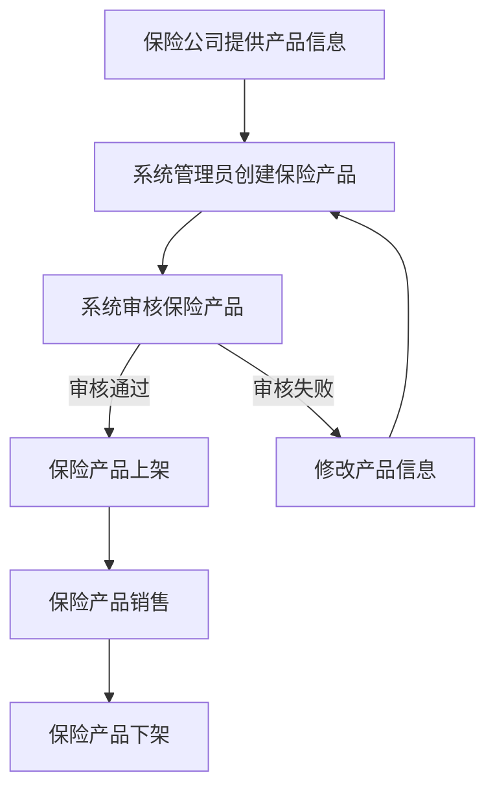
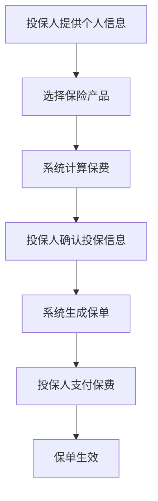
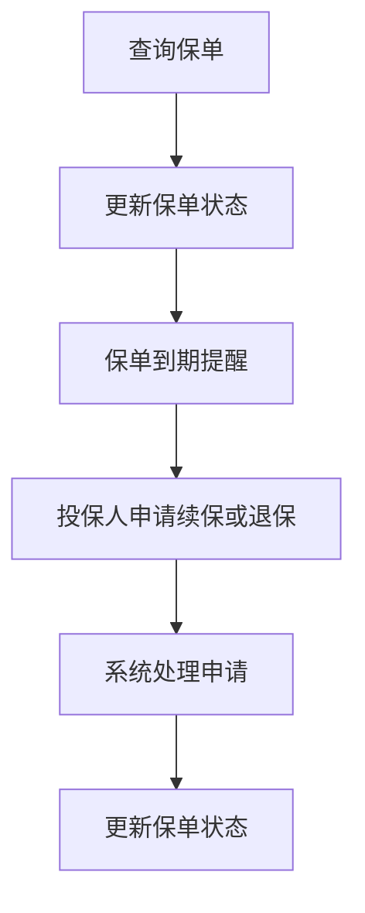
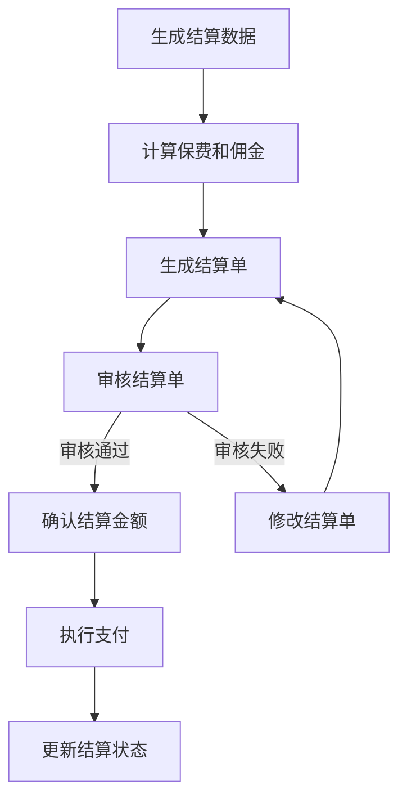
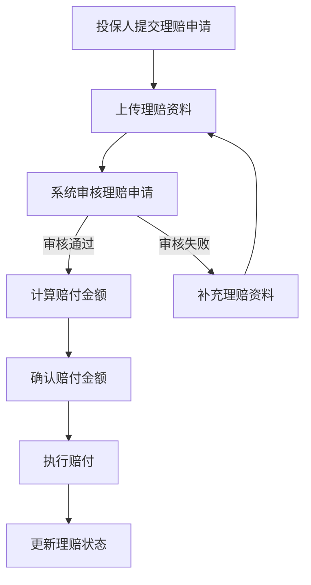

# 保险流程

## 1. 保险流程概述

保险流程是 MallEcoAPI 系统中的重要业务流程之一，涵盖了从保险产品销售到保单管理、结算的整个过程。保险流程的设计直接影响到系统的业务处理能力、用户体验和数据一致性。本文档详细描述了 MallEcoAPI 系统中的保险流程，包括流程定位、核心价值、流程步骤等内容。

### 1.1 保险流程定位

保险流程在 MallEcoAPI 系统中扮演着以下角色：

- **核心业务流程**：保险流程是系统的核心业务流程之一，连接了保险产品、投保人、保单、结算等多个系统模块
- **业务逻辑集成**：保险流程集成了多个业务逻辑，如保险产品销售、保单管理、结算等
- **数据流转中心**：保险流程是系统中数据流转的中心，涉及保险产品、投保人、保单、结算等多个数据实体
- **用户体验关键**：保险流程的顺畅与否直接影响用户的业务处理体验

### 1.2 核心价值

- **业务完整性**：确保保险业务处理的完整性，从产品销售到保单管理、结算的全流程覆盖
- **数据一致性**：确保保险相关数据的一致性，如保单状态、结算状态等
- **业务效率**：提高保险业务的处理效率，减少人工操作
- **风险管理**：通过保险流程的规范化，帮助企业进行风险管理
- **系统集成**：实现与外部保险系统的集成，提高系统的整体效率

## 2. 保险核心流程

### 2.1 保险产品管理流程

**描述**：管理保险产品的流程，包括产品创建、审核、上架、下架等环节

**流程步骤**：
1. 保险公司提供产品信息
2. 系统管理员创建保险产品
3. 系统审核保险产品
4. 审核通过后，保险产品上架
5. 保险产品在系统中销售
6. 保险产品下架（到期或其他原因）

**流程图**：

### 2.2 保险保单创建流程

**描述**：创建保险保单的流程，包括投保人信息录入、产品选择、保费计算、保单生成等环节

**流程步骤**：
1. 投保人提供个人信息
2. 选择保险产品
3. 系统计算保费
4. 投保人确认投保信息
5. 系统生成保单
6. 投保人支付保费
7. 保单生效

**流程图**：

### 2.3 保险保单管理流程

**描述**：管理保险保单的流程，包括保单查询、状态更新、续保、退保等环节

**流程步骤**：
1. 系统管理员或投保人查询保单
2. 根据需要更新保单状态
3. 保单到期前提醒续保
4. 投保人申请续保或退保
5. 系统处理续保或退保申请
6. 更新保单状态

**流程图**：

### 2.4 保险结算流程

**描述**：保险结算的流程，包括保费收取、佣金计算、结算单生成、支付等环节

**流程步骤**：
1. 系统定期生成结算数据
2. 计算保费收入和佣金
3. 生成结算单
4. 审核结算单
5. 确认结算金额
6. 系统执行支付
7. 更新结算状态

**流程图**：

### 2.5 保险理赔流程

**描述**：保险理赔的流程，包括理赔申请、资料提交、审核、赔付等环节

**流程步骤**：
1. 投保人提交理赔申请
2. 上传理赔资料
3. 系统审核理赔申请
4. 审核通过后，计算赔付金额
5. 确认赔付金额
6. 系统执行赔付
7. 更新理赔状态

**流程图**：

## 3. 保险流程详细说明

### 3.1 保险产品管理流程

#### 3.1.1 流程说明

1. **保险公司提供产品信息**：保险公司向系统提供保险产品的详细信息，包括产品名称、保障范围、保费计算方式等
2. **系统管理员创建保险产品**：系统管理员在系统中创建保险产品，录入产品信息
3. **系统审核保险产品**：系统对保险产品进行审核，确保产品信息的准确性和合法性
4. **保险产品上架**：审核通过后，保险产品在系统中上架，开始销售
5. **保险产品销售**：保险产品在系统中销售，投保人可以选择购买
6. **保险产品下架**：保险产品到期或因其他原因下架，不再销售

#### 3.1.2 技术实现

- **前端**：React 组件，处理管理员交互，发送 API 请求
- **后端**：`InsuranceProductController` 和 `InsuranceProductService`，处理产品创建、审核、上架、下架等操作
- **数据库**：`insurance_product` 表，存储保险产品信息

### 3.2 保险保单创建流程

#### 3.2.1 流程说明

1. **投保人提供个人信息**：投保人在系统中提供个人信息，如姓名、身份证号、联系方式等
2. **选择保险产品**：投保人选择要购买的保险产品
3. **系统计算保费**：系统根据保险产品的保费计算方式和投保人的信息，计算保费
4. **投保人确认投保信息**：投保人确认投保信息，包括保险产品、保费、保障范围等
5. **系统生成保单**：系统生成保险保单，分配保单号
6. **投保人支付保费**：投保人通过系统支付保费
7. **保单生效**：保费支付成功后，保单生效，开始提供保障

#### 3.2.2 技术实现

- **前端**：React 组件，处理投保人交互，发送 API 请求
- **后端**：`InsurancePolicyController` 和 `InsurancePolicyService`，处理保单创建、保费计算等操作
- **数据库**：`insurance_policy` 表，存储保险保单信息
- **支付集成**：与支付系统集成，处理保费支付

### 3.3 保险保单管理流程

#### 3.3.1 流程说明

1. **查询保单**：系统管理员或投保人在系统中查询保单信息
2. **更新保单状态**：根据保单的实际情况，更新保单状态，如激活、暂停、终止等
3. **保单到期提醒**：保单到期前，系统提醒投保人续保
4. **投保人申请续保或退保**：投保人根据需要申请续保或退保
5. **系统处理申请**：系统处理投保人的续保或退保申请
6. **更新保单状态**：根据申请处理结果，更新保单状态

#### 3.3.2 技术实现

- **前端**：React 组件，处理用户交互，发送 API 请求
- **后端**：`InsurancePolicyController` 和 `InsurancePolicyService`，处理保单查询、状态更新等操作
- **数据库**：`insurance_policy` 表，存储保险保单信息
- **消息队列**：使用消息队列发送保单到期提醒

### 3.4 保险结算流程

#### 3.4.1 流程说明

1. **生成结算数据**：系统定期（如每月）生成结算数据，包括保费收入、佣金等
2. **计算保费和佣金**：系统根据保单信息计算保费收入和佣金
3. **生成结算单**：系统根据结算数据生成结算单
4. **审核结算单**：系统管理员审核结算单，确保数据的准确性
5. **确认结算金额**：审核通过后，确认结算金额
6. **执行支付**：系统执行支付操作，将佣金支付给相关渠道
7. **更新结算状态**：支付完成后，更新结算状态为已支付

#### 3.4.2 技术实现

- **前端**：React 组件，处理管理员交互，发送 API 请求
- **后端**：`SettlementRecordController` 和 `SettlementRecordService`，处理结算单生成、审核、支付等操作
- **数据库**：`settlement_record` 和 `settlement_detail` 表，存储结算信息
- **支付集成**：与支付系统集成，处理佣金支付
- **定时任务**：使用定时任务定期生成结算数据

### 3.5 保险理赔流程

#### 3.5.1 流程说明

1. **投保人提交理赔申请**：投保人在系统中提交理赔申请，说明理赔原因
2. **上传理赔资料**：投保人上传理赔所需的资料，如医疗证明、事故证明等
3. **系统审核理赔申请**：系统对理赔申请进行审核，确保申请的合法性和资料的完整性
4. **计算赔付金额**：审核通过后，系统根据保险合同计算赔付金额
5. **确认赔付金额**：系统管理员确认赔付金额
6. **执行赔付**：系统执行赔付操作，将赔付金额支付给投保人
7. **更新理赔状态**：赔付完成后，更新理赔状态为已赔付

#### 3.5.2 技术实现

- **前端**：React 组件，处理投保人交互，发送 API 请求
- **后端**：理赔相关的控制器和服务，处理理赔申请、审核、赔付等操作
- **数据库**：理赔相关的表，存储理赔信息
- **支付集成**：与支付系统集成，处理赔付支付

## 4. 保险流程优化

### 4.1 优化方向

1. **流程简化**：简化保险流程，减少不必要的环节，提高业务处理效率
2. **自动化处理**：增加自动化处理环节，减少人工操作，提高处理效率
3. **数据集成**：加强与外部系统的数据集成，减少数据录入，提高数据准确性
4. **用户体验**：优化用户界面，提高用户体验
5. **风险管理**：加强风险管理，减少保险欺诈

### 4.2 优化建议

1. **产品管理优化**：
   - 实现保险产品的批量导入功能
   - 增加产品模板，提高产品创建效率
   - 实现产品自动审核，减少人工审核环节

2. **保单管理优化**：
   - 实现保单的批量创建功能
   - 增加保单自动续保功能
   - 实现保单状态的自动更新

3. **结算管理优化**：
   - 实现结算单的自动生成
   - 增加结算数据的自动核对功能
   - 实现佣金的自动支付

4. **理赔管理优化**：
   - 实现理赔申请的在线提交和处理
   - 增加理赔资料的自动审核功能
   - 实现赔付的自动计算和支付

## 5. 保险流程与其他流程的集成

### 5.1 与用户流程的集成

保险流程与用户流程的集成主要体现在以下几个方面：

1. **用户认证**：保险流程使用用户流程的认证功能，确保用户身份的合法性
2. **用户信息共享**：保险流程共享用户流程的用户信息，减少数据录入
3. **用户权限控制**：保险流程使用用户流程的权限控制功能，确保数据安全

### 5.2 与支付流程的集成

保险流程与支付流程的集成主要体现在以下几个方面：

1. **保费支付**：保险流程使用支付流程的支付功能，处理保费支付
2. **佣金支付**：保险流程使用支付流程的支付功能，处理佣金支付
3. **赔付支付**：保险流程使用支付流程的支付功能，处理赔付支付

### 5.3 与统计流程的集成

保险流程与统计流程的集成主要体现在以下几个方面：

1. **数据提供**：保险流程向统计流程提供保险业务数据
2. **统计分析**：统计流程对保险业务数据进行分析，提供统计报告
3. **决策支持**：统计分析结果为保险业务决策提供支持

## 6. 总结与展望

### 6.1 保险流程优势

- **流程完整**：保险流程涵盖了从产品管理到保单管理、结算的全流程
- **逻辑清晰**：保险流程的逻辑清晰，步骤明确
- **技术先进**：保险流程使用了先进的技术，如自动化处理、数据集成等
- **可扩展性强**：保险流程的设计具有良好的可扩展性，便于添加新的功能

### 6.2 改进空间

- **流程简化**：部分流程环节可以进一步简化，减少人工操作
- **自动化程度**：部分环节的自动化程度可以进一步提高
- **系统集成**：与外部系统的集成可以进一步加强
- **用户体验**：用户界面可以进一步优化，提高用户体验

### 6.3 未来规划

- **版本 1.1**：优化保险流程，减少人工操作，提高自动化程度
- **版本 1.2**：加强与外部系统的集成，提高系统的整体效率
- **版本 1.3**：增加新的保险业务功能，如理赔管理、续保管理等
- **版本 1.4**：优化用户界面，提高用户体验
- **版本 2.0**：重构保险流程，采用更先进的技术架构，支持更多的保险业务场景

## 7. 附录

### 7.1 保险流程相关组件

| 组件名称 | 描述 | 模块 |
|----------|------|------|
| `InsuranceProductController` | 处理保险产品相关的 HTTP 请求 | 保险模块 |
| `InsuranceProductService` | 实现保险产品相关的业务逻辑 | 保险模块 |
| `InsurancePolicyController` | 处理保险保单相关的 HTTP 请求 | 保险模块 |
| `InsurancePolicyService` | 实现保险保单相关的业务逻辑 | 保险模块 |
| `SettlementRecordController` | 处理保险结算相关的 HTTP 请求 | 保险模块 |
| `SettlementRecordService` | 实现保险结算相关的业务逻辑 | 保险模块 |

### 7.2 保险流程相关接口

| 接口路径 | 方法 | 描述 |
|----------|------|------|
| `/api/insurance/products` | POST | 创建保险产品 |
| `/api/insurance/products` | GET | 获取保险产品列表 |
| `/api/insurance/policies` | POST | 创建保险保单 |
| `/api/insurance/policies` | GET | 获取保险保单列表 |
| `/api/insurance/settlements` | POST | 创建结算记录 |
| `/api/insurance/settlements` | GET | 获取结算记录列表 |

### 7.3 参考资源

- **工具**：
  - Mermaid：用于绘制保险流程图
  - Postman：用于测试保险相关接口

- **文档**：
  - [NestJS 官方文档](https://docs.nestjs.com/)
  - [TypeORM 文档](https://typeorm.io/)
  - [MySQL 官方文档](https://dev.mysql.com/doc/)

- **书籍**：
  - 《保险学原理》
  - 《保险公司经营管理》
  - 《保险法》

---

**文档更新时间**：2026-01-19
**文档版本**：v1.0.0
**作者**：MallEco 开发团队
