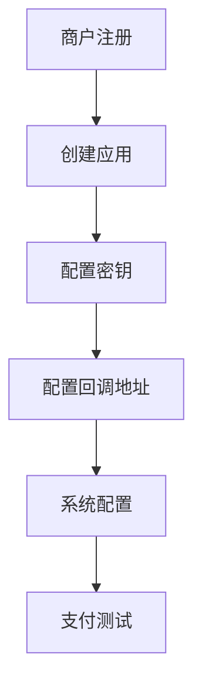
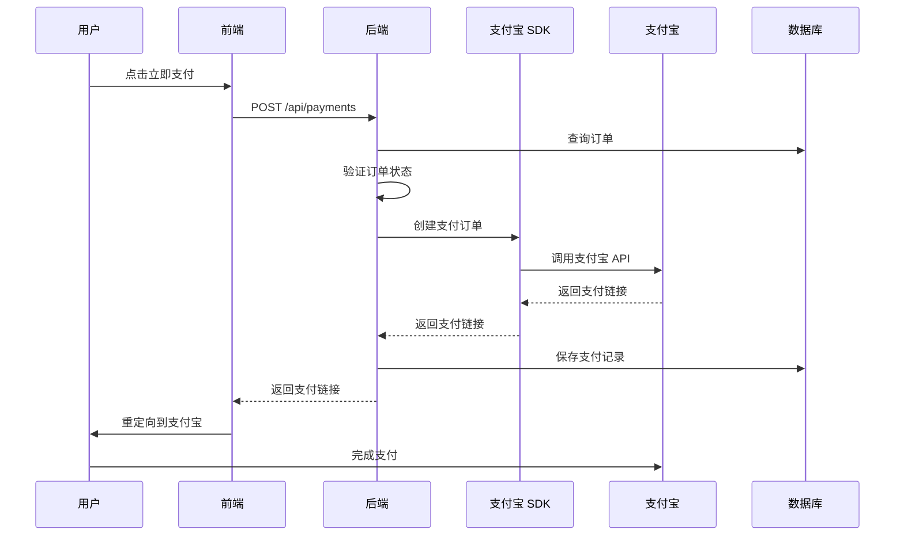
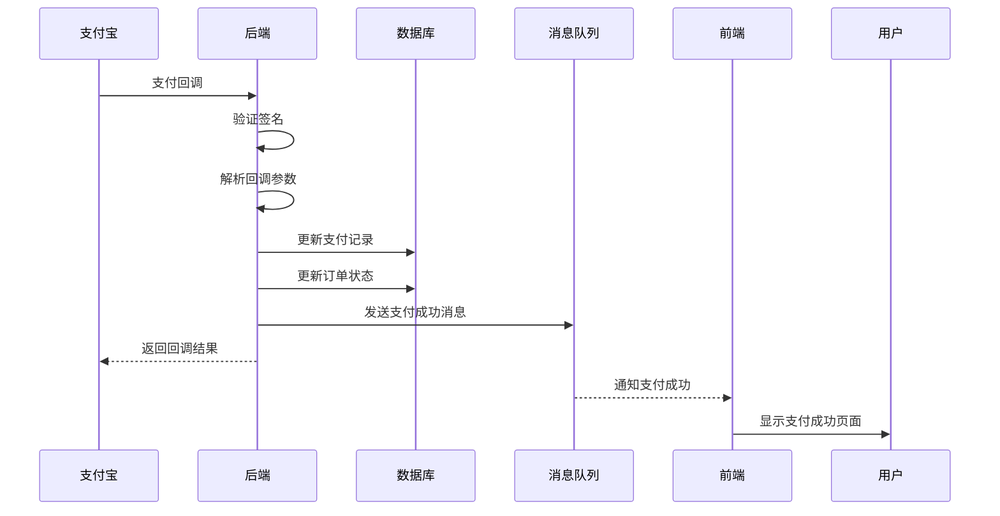
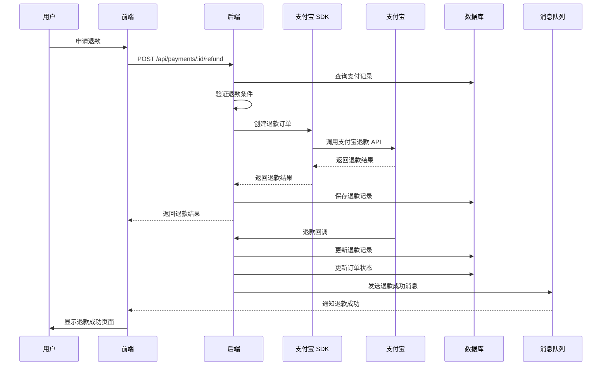
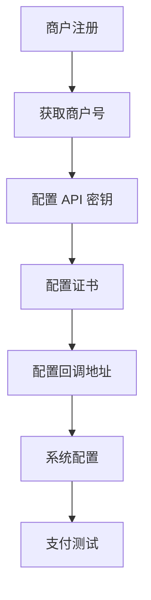
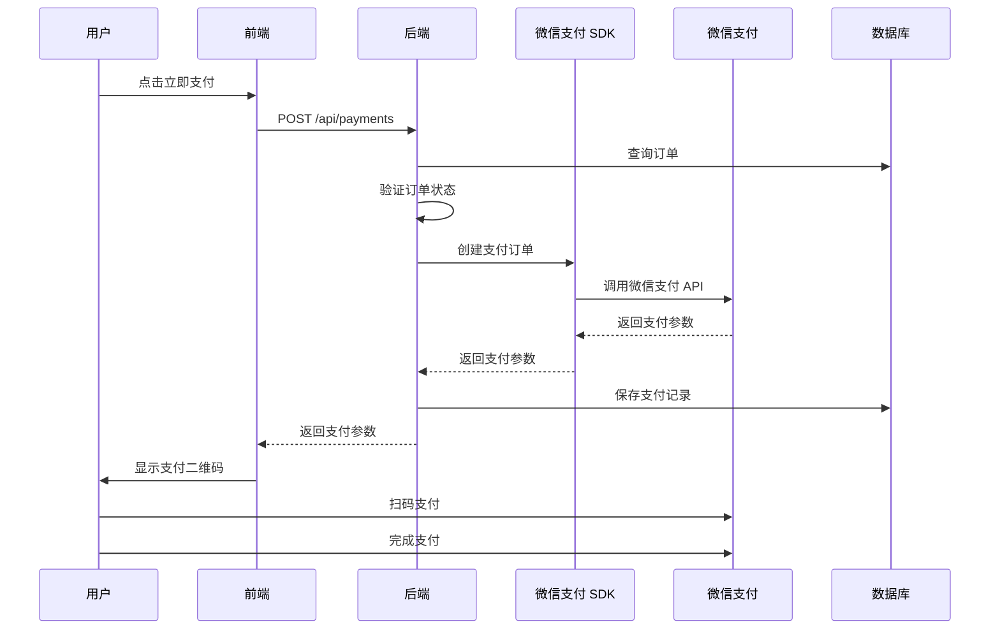
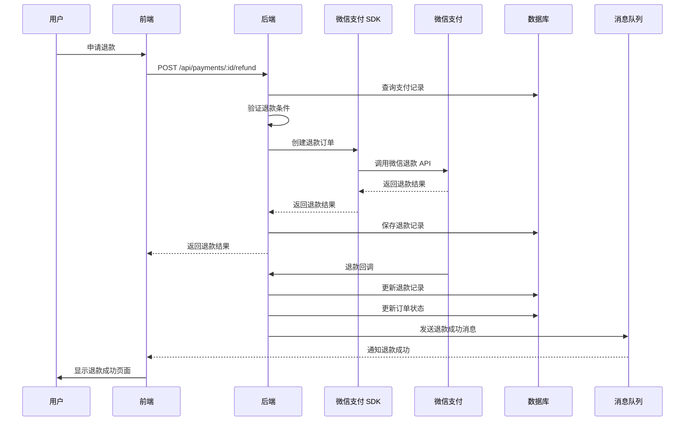
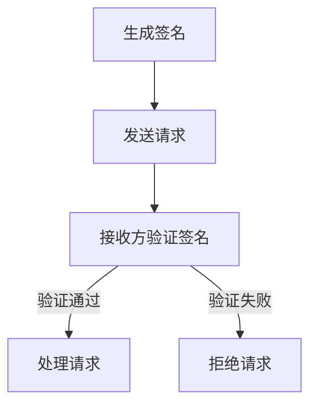
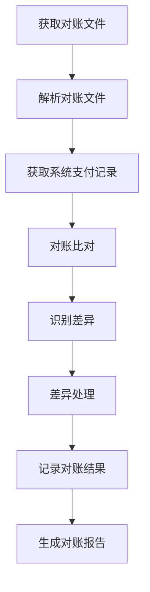

# 支付流程文档

## 1. 支付流程概述

支付流程是电商系统中的关键环节，连接了订单和资金交易。MallEcoAPI 系统支持多种支付方式，包括支付宝、微信支付等，为用户提供便捷、安全的支付体验。

### 1.1 支付流程定位

支付流程在系统中扮演着以下角色：

- **交易闭环**：完成从订单创建到支付成功的交易闭环
- **资金安全**：确保资金交易的安全和可靠
- **用户体验**：提供多种支付方式，方便用户选择
- **数据准确性**：保证支付数据的完整和准确
- **合规性**：符合支付行业的法规和规范

### 1.2 核心价值

- **支付安全**：通过加密、签名等技术，确保支付过程的安全
- **支付便捷**：提供多种支付方式，满足不同用户的需求
- **支付可靠**：高可用性的支付服务，确保支付过程的稳定
- **数据完整**：完整记录支付过程的每一个环节，便于对账和审计
- **业务支持**：为业务决策提供支付数据支持

## 2. 支付宝支付流程

### 2.1 支付准备

**目标**：为支付宝支付做好准备工作

**步骤**：

1. **商户配置**
   - 在支付宝开放平台注册账号
   - 创建应用并获取 AppID
   - 配置应用密钥（RSA2）
   - 配置回调地址

2. **系统配置**
   - 在 `.env` 文件中配置支付宝相关参数：
     - `ALIPAY_APP_ID`：支付宝应用 ID
     - `ALIPAY_PRIVATE_KEY`：商户私钥
     - `ALIPAY_PUBLIC_KEY`：支付宝公钥
     - `ALIPAY_SANDBOX`：是否使用沙箱环境

**流程图**：

### 2.2 支付发起

**目标**：用户发起支付宝支付

**步骤**：

1. **订单确认**
   - 用户在前端确认订单信息
   - 选择支付宝作为支付方式
   - 点击“立即支付”按钮

2. **创建支付订单**
   - 前端调用后端支付接口：`POST /api/payments`
   - 后端接收支付请求，验证订单信息
   - 后端调用支付宝 SDK 创建支付订单
   - 支付宝返回支付链接
   - 后端保存支付记录
   - 后端返回支付链接给前端

3. **跳转支付**
   - 前端重定向到支付宝支付页面
   - 用户在支付宝页面完成支付

**流程图**：

### 2.3 支付回调

**目标**：支付宝通知系统支付结果

**步骤**：

1. **支付宝回调**
   - 支付宝支付成功后，向系统配置的回调地址发送通知
   - 回调地址：`POST /api/payments/callback/alipay`
   - 回调参数包含支付结果、交易号等信息

2. **回调处理**
   - 后端接收回调通知
   - 验证回调签名，确保通知来自支付宝
   - 解析回调参数，获取支付结果
   - 更新支付记录状态
   - 更新订单状态为已支付
   - 发送支付成功消息
   - 返回回调结果给支付宝

3. **结果通知**
   - 系统通过消息队列通知相关模块支付成功
   - 前端通过轮询或WebSocket获取支付结果
   - 用户看到支付成功页面

**流程图**：

### 2.4 退款流程

**目标**：处理用户的退款请求

**步骤**：

1. **退款申请**
   - 用户在前端申请退款
   - 前端调用后端退款接口：`POST /api/payments/:id/refund`
   - 后端接收退款请求，验证订单和支付状态

2. **创建退款订单**
   - 后端调用支付宝 SDK 创建退款订单
   - 支付宝处理退款请求
   - 后端保存退款记录
   - 后端返回退款结果给前端

3. **退款回调**
   - 支付宝处理退款后，向系统发送退款回调通知
   - 后端接收回调通知，更新退款记录状态
   - 后端更新订单状态为已退款
   - 后端发送退款成功消息

**流程图**：

## 3. 微信支付流程

### 3.1 支付准备

**目标**：为微信支付做好准备工作

**步骤**：

1. **商户配置**
   - 在微信支付商户平台注册账号
   - 获取商户号（MCHID）
   - 配置 API v3 密钥
   - 配置证书（API 证书）
   - 配置回调地址

2. **系统配置**
   - 在 `.env` 文件中配置微信支付相关参数：
     - `WECHAT_APP_ID`：微信应用 ID
     - `WECHAT_MCH_ID`：微信商户号
     - `WECHAT_API_V3_KEY`：API v3 密钥
     - `WECHAT_CERT_PATH`：证书路径
     - `WECHAT_SANDBOX`：是否使用沙箱环境

**流程图**：

### 3.2 支付发起

**目标**：用户发起微信支付

**步骤**：

1. **订单确认**
   - 用户在前端确认订单信息
   - 选择微信支付作为支付方式
   - 点击“立即支付”按钮

2. **创建支付订单**
   - 前端调用后端支付接口：`POST /api/payments`
   - 后端接收支付请求，验证订单信息
   - 后端调用微信支付 SDK 创建支付订单
   - 微信支付返回支付参数
   - 后端保存支付记录
   - 后端返回支付参数给前端

3. **扫码支付**
   - 前端根据支付参数生成二维码
   - 用户使用微信扫描二维码
   - 用户在微信中完成支付

**流程图**：

### 3.3 支付回调

**目标**：微信支付通知系统支付结果

**步骤**：

1. **微信支付回调**
   - 微信支付成功后，向系统配置的回调地址发送通知
   - 回调地址：`POST /api/payments/callback/wechat`
   - 回调参数包含支付结果、交易号等信息

2. **回调处理**
   - 后端接收回调通知
   - 验证回调签名，确保通知来自微信支付
   - 解析回调参数，获取支付结果
   - 更新支付记录状态
   - 更新订单状态为已支付
   - 发送支付成功消息
   - 返回回调结果给微信支付

3. **结果通知**
   - 系统通过消息队列通知相关模块支付成功
   - 前端通过轮询或WebSocket获取支付结果
   - 用户看到支付成功页面

**流程图**：

### 3.4 退款流程

**目标**：处理用户的退款请求

**步骤**：

1. **退款申请**
   - 用户在前端申请退款
   - 前端调用后端退款接口：`POST /api/payments/:id/refund`
   - 后端接收退款请求，验证订单和支付状态

2. **创建退款订单**
   - 后端调用微信支付 SDK 创建退款订单
   - 微信支付处理退款请求
   - 后端保存退款记录
   - 后端返回退款结果给前端

3. **退款回调**
   - 微信支付处理退款后，向系统发送退款回调通知
   - 后端接收回调通知，更新退款记录状态
   - 后端更新订单状态为已退款
   - 后端发送退款成功消息

**流程图**：

## 4. 支付安全

### 4.1 签名验证

**目标**：确保支付请求和回调的真实性

**实现**：

1. **支付宝签名验证**
   - 使用 RSA2 算法对请求进行签名
   - 支付宝使用商户公钥验证签名
   - 系统使用支付宝公钥验证回调签名

2. **微信支付签名验证**
   - 使用 API v3 密钥对请求进行签名
   - 微信支付验证签名
   - 系统使用微信支付证书验证回调签名

**流程图**：

### 4.2 数据加密

**目标**：保护支付过程中的敏感数据

**实现**：

1. **传输加密**
   - 使用 HTTPS 协议传输所有支付相关的请求
   - 防止数据在传输过程中被窃取或篡改

2. **存储加密**
   - 对支付相关的敏感信息进行加密存储
   - 如支付凭证、银行账号等

3. **密钥管理**
   - 安全存储商户私钥、API 密钥等敏感信息
   - 定期更换密钥
   - 限制密钥的访问权限

### 4.3 防重复支付

**目标**：防止用户重复支付同一订单

**实现**：

1. **幂等性设计**
   - 支付接口使用订单 ID 作为幂等性标识
   - 防止重复创建支付订单

2. **状态验证**
   - 在创建支付订单前，验证订单状态
   - 确保只有待支付状态的订单可以发起支付

3. **支付记录检查**
   - 检查订单是否已经有成功的支付记录
   - 防止重复支付

### 4.4 异常处理

**目标**：处理支付过程中的异常情况

**实现**：

1. **网络异常**
   - 实现请求超时和重试机制
   - 确保支付请求能够可靠地发送

2. **支付失败**
   - 详细记录支付失败的原因
   - 提供友好的错误提示
   - 支持用户重新发起支付

3. **回调异常**
   - 实现回调重试机制
   - 确保支付结果能够被正确处理
   - 提供主动查询支付状态的接口

## 5. 支付对账

### 5.1 对账准备

**目标**：为支付对账做好准备工作

**步骤**：

1. **对账配置**
   - 配置对账周期（每日）
   - 配置对账文件存储路径
   - 配置对账通知方式

2. **数据准备**
   - 系统记录每一笔支付交易的详细信息
   - 第三方支付平台提供对账文件

### 5.2 对账流程

**目标**：核对系统支付记录与第三方支付平台的交易记录

**步骤**：

1. **获取对账文件**
   - 从第三方支付平台下载对账文件
   - 或接收第三方支付平台推送的对账文件

2. **解析对账文件**
   - 解析对账文件，提取交易记录
   - 格式化交易记录，便于比对

3. **对账比对**
   - 将系统支付记录与第三方支付平台的交易记录进行比对
   - 识别差异记录

4. **差异处理**
   - 分析差异原因
   - 处理差异记录（如补单、退款等）
   - 记录对账结果

**流程图**：

### 5.3 对账报告

**目标**：生成对账报告，便于分析和审计

**内容**：

1. **对账概览**
   - 对账日期
   - 交易总笔数
   - 交易总金额
   - 差异笔数
   - 差异金额

2. **差异明细**
   - 差异类型（如长款、短款、金额不符等）
   - 交易号
   - 系统金额
   - 平台金额
   - 差异原因
   - 处理状态

3. **对账趋势**
   - 近期对账差异趋势
   - 重点关注的差异类型

## 6. 支付统计

### 6.1 统计指标

**目标**：定义支付统计的关键指标

**指标**：

1. **交易指标**
   - 交易总笔数
   - 交易总金额
   - 平均交易金额
   - 成功率
   - 失败率

2. **渠道指标**
   - 各支付渠道的交易笔数
   - 各支付渠道的交易金额
   - 各支付渠道的成功率

3. **时间指标**
   - 日交易笔数和金额
   - 周交易笔数和金额
   - 月交易笔数和金额
   - 交易高峰期分析

4. **用户指标**
   - 活跃支付用户数
   - 人均交易笔数
   - 人均交易金额
   - 用户支付偏好

### 6.2 统计分析

**目标**：分析支付数据，为业务决策提供支持

**分析维度**：

1. **支付渠道分析**
   - 分析各支付渠道的使用情况
   - 优化支付渠道的配置

2. **支付时间分析**
   - 分析交易的时间分布
   - 合理安排系统资源

3. **用户行为分析**
   - 分析用户的支付偏好
   - 个性化推荐支付方式

4. **异常分析**
   - 分析支付失败的原因
   - 优化支付流程

### 6.3 统计报告

**目标**：生成支付统计报告，便于管理层了解支付情况

**内容**：

1. **日报**
   - 当日交易概览
   - 各支付渠道交易情况
   - 支付异常情况

2. **周报**
   - 本周交易概览
   - 与上周的对比分析
   - 重点关注的问题

3. **月报**
   - 本月交易概览
   - 与上月的对比分析
   - 月度趋势分析
   - 建议和改进措施

## 7. 支付流程优化

### 7.1 性能优化

**目标**：提高支付流程的性能和响应速度

**优化措施**：

1. **缓存优化**
   - 缓存支付配置和证书
   - 减少重复的配置加载

2. **异步处理**
   - 使用消息队列处理支付回调
   - 减少同步处理的时间

3. **数据库优化**
   - 为支付相关的表添加索引
   - 优化支付记录的查询性能

4. **并发处理**
   - 优化支付请求的并发处理能力
   - 提高系统的吞吐量

### 7.2 用户体验优化

**目标**：提高用户支付的体验

**优化措施**：

1. **支付方式推荐**
   - 根据用户的历史支付行为，推荐合适的支付方式
   - 提高支付成功率

2. **支付流程简化**
   - 减少支付流程中的步骤
   - 提供一键支付功能

3. **支付状态反馈**
   - 实时反馈支付状态
   - 提供清晰的支付进度指示

4. **错误处理优化**
   - 提供友好的错误提示
   - 指导用户如何解决支付问题

### 7.3 安全优化

**目标**：提高支付流程的安全性

**优化措施**：

1. **安全加固**
   - 定期进行安全扫描和漏洞修复
   - 加强系统的安全防护

2. **风险控制**
   - 实现支付风险控制机制
   - 识别和防范异常支付行为

3. **合规性**
   - 确保支付流程符合行业法规和规范
   - 定期进行合规性检查

## 8. 常见问题与解决方案

### 8.1 支付失败

**问题**：用户支付失败，返回错误信息

**可能原因**：
- 网络连接问题
- 支付平台返回错误
- 订单状态不正确
- 支付参数错误

**解决方案**：
- 检查网络连接
- 查看支付平台返回的错误信息
- 验证订单状态
- 检查支付参数

### 8.2 支付回调处理失败

**问题**：支付平台回调通知处理失败

**可能原因**：
- 签名验证失败
- 网络连接问题
- 数据库操作失败
- 回调参数错误

**解决方案**：
- 检查签名验证逻辑
- 实现回调重试机制
- 检查数据库连接和操作
- 验证回调参数

### 8.3 退款失败

**问题**：用户退款申请失败

**可能原因**：
- 支付平台返回错误
- 退款金额超过支付金额
- 订单状态不正确
- 退款时间超过平台限制

**解决方案**：
- 查看支付平台返回的错误信息
- 验证退款金额
- 检查订单状态
- 了解平台的退款规则

### 8.4 对账差异

**问题**：系统支付记录与第三方支付平台的交易记录存在差异

**可能原因**：
- 系统记录丢失
- 第三方平台记录丢失
- 金额计算错误
- 交易状态不同步

**解决方案**：
- 分析差异原因
- 补充缺失的记录
- 修正错误的记录
- 优化对账流程

## 9. 总结与展望

### 9.1 支付流程优势

- **安全性高**：通过加密、签名等技术，确保支付过程的安全
- **可靠性强**：高可用性的支付服务，确保支付过程的稳定
- **用户体验好**：提供多种支付方式，满足不同用户的需求
- **数据完整性**：完整记录支付过程的每一个环节，便于对账和审计
- **可扩展性强**：易于集成新的支付方式

### 9.2 改进空间

- **支付方式扩展**：支持更多支付方式，如银联、PayPal 等
- **国际化支持**：支持多币种支付和国际化支付平台
- **智能风控**：集成智能风控系统，提高支付安全性
- **自动化对账**：实现更智能的自动对账功能，减少人工操作
- **支付体验优化**：进一步简化支付流程，提高支付成功率

### 9.3 未来规划

- **版本 1.1**：增强支付方式支持，添加银联、PayPal 等支付方式
- **版本 1.2**：集成智能风控系统，提高支付安全性
- **版本 1.3**：实现更智能的自动对账功能，减少人工操作
- **版本 1.4**：支持多币种支付和国际化支付平台
- **版本 2.0**：重构支付模块，采用更先进的架构和技术，支持更多支付场景

## 10. 附录

### 10.1 核心 API 列表

| API 路径 | 方法 | 功能描述 | 认证要求 |
|----------|------|----------|----------|
| `/api/payments` | POST | 创建支付订单 | 是 |
| `/api/payments/:id` | GET | 获取支付详情 | 是 |
| `/api/payments/order/:orderId` | GET | 根据订单 ID 获取支付记录 | 是 |
| `/api/payments/:id/refund` | POST | 申请退款 | 是 |
| `/api/payments/refunds/:id` | GET | 获取退款详情 | 是 |
| `/api/payments/callback/alipay` | POST | 支付宝支付回调 | 否 |
| `/api/payments/callback/wechat` | POST | 微信支付回调 | 否 |
| `/api/payments/statistics` | GET | 获取支付统计 | 是（管理员） |

### 10.2 配置项参考

| 配置项 | 类型 | 默认值 | 说明 |
|--------|------|--------|------|
| `ALIPAY_APP_ID` | string | - | 支付宝应用 ID |
| `ALIPAY_PRIVATE_KEY` | string | - | 商户私钥 |
| `ALIPAY_PUBLIC_KEY` | string | - | 支付宝公钥 |
| `ALIPAY_SANDBOX` | boolean | false | 是否使用沙箱环境 |
| `WECHAT_APP_ID` | string | - | 微信应用 ID |
| `WECHAT_MCH_ID` | string | - | 微信商户号 |
| `WECHAT_API_V3_KEY` | string | - | 微信 API v3 密钥 |
| `WECHAT_CERT_PATH` | string | - | 微信证书路径 |
| `WECHAT_SANDBOX` | boolean | false | 是否使用沙箱环境 |
| `PAYMENT_TIMEOUT` | number | 3600 | 支付超时时间（秒） |
| `REFUND_TIMEOUT` | number | 86400 | 退款超时时间（秒） |

### 10.3 依赖项

| 依赖项 | 版本 | 用途 |
|--------|------|------|
| `alipay-sdk` | ^4.17.9 | 支付宝 SDK |
| `wechatpay-node-v3` | ^1.1.10 | 微信支付 SDK |
| `crypto` | ^1.0.1 | 加密模块 |
| `xml2js` | ^0.6.2 | XML 解析（微信支付） |
| `@nestjs/axios` | ^3.0.2 | HTTP 客户端 |

---

**文档更新时间**：2026-01-19
**文档版本**：v1.0.0
**作者**：MallEco 开发团队
