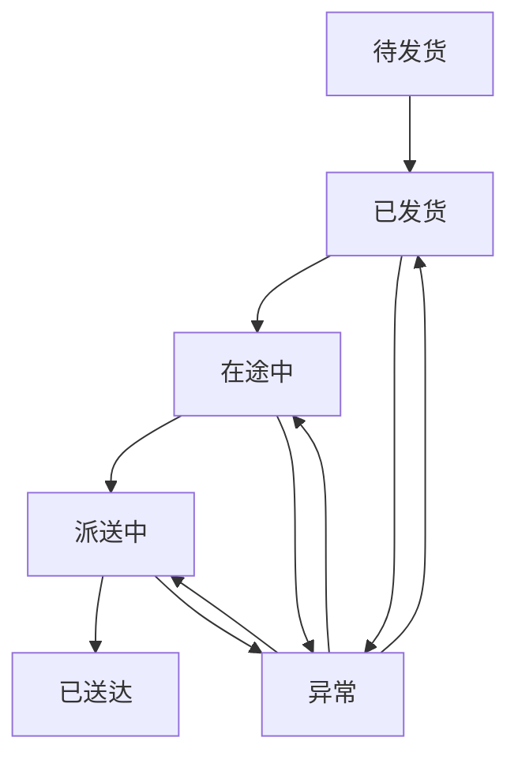
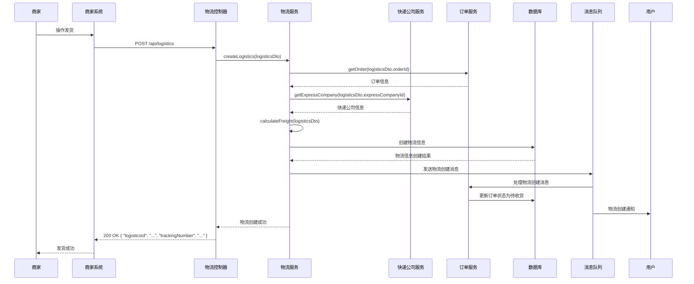
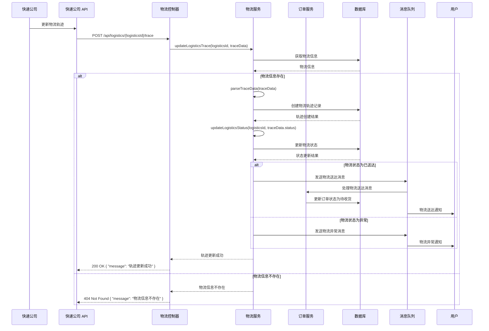
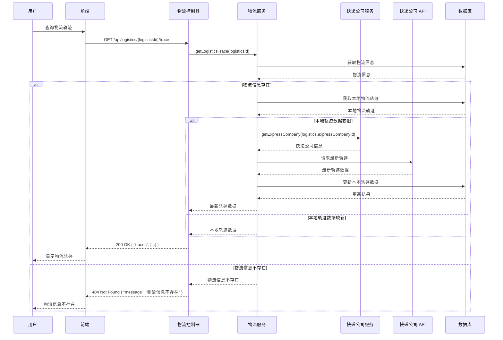
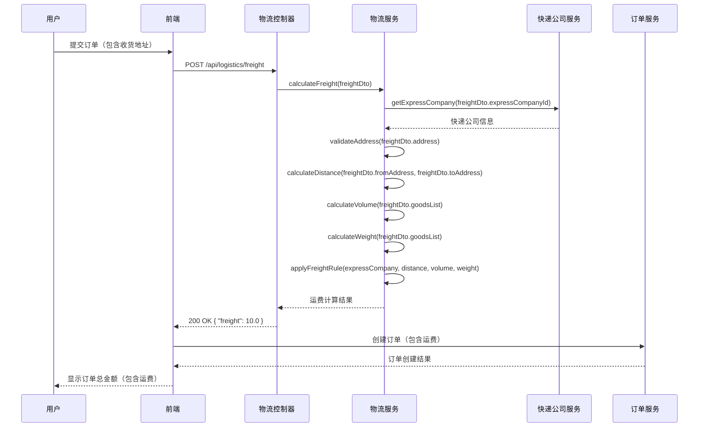
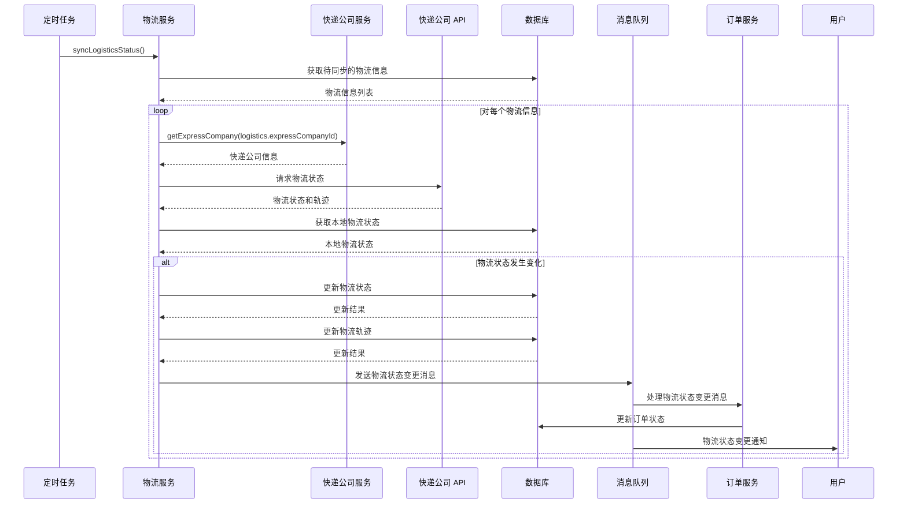

# 物流流程

## 1. 物流流程概述

物流流程是电商系统中的重要业务流程之一，涵盖了从订单发货到物流送达的整个过程。物流流程的设计直接影响到用户体验、系统性能和业务逻辑的正确性。本文档详细描述了 MallEcoAPI 系统中的物流流程，包括物流创建、轨迹更新、状态变更等环节。

### 1.1 物流流程定位

物流流程在电商系统中扮演着以下角色：

- **核心业务流程**：物流流程是电商系统的核心业务流程之一，连接了订单、用户、快递公司等多个系统模块
- **用户体验关键**：物流流程的顺畅与否直接影响用户的购物体验，用户期望能够实时跟踪物流状态
- **业务逻辑集成**：物流流程集成了多个业务逻辑，如运费计算、物流轨迹跟踪、状态更新等
- **数据流转中心**：物流流程是系统中数据流转的重要环节，涉及订单、物流信息、快递公司等多个数据实体

### 1.2 核心价值

- **业务完整性**：确保物流处理的完整性，从发货到送达的全流程覆盖
- **用户体验优化**：提供实时的物流跟踪信息，优化用户体验
- **系统集成**：实现与快递公司等外部系统的集成
- **数据一致性**：确保物流相关数据的一致性，如物流状态、订单状态等
- **业务规则执行**：确保物流处理过程中业务规则的正确执行，如运费计算、物流状态更新等

## 2. 物流状态

### 2.1 物流状态定义

| 状态值 | 状态名称 | 描述 |
|--------|----------|------|
| 0 | 待发货 | 订单已支付，等待商家发货 |
| 1 | 已发货 | 商家已发货，物流信息已创建 |
| 2 | 在途中 | 快递已揽收，正在运输中 |
| 3 | 派送中 | 快递已到达目的地，正在派送中 |
| 4 | 已送达 | 快递已送达，用户已签收 |
| 5 | 异常 | 物流过程中出现异常 |

### 2.2 物流状态流转

### 2.3 状态流转说明

1. **待发货** → **已发货**：商家发货后，物流状态变更为已发货
2. **已发货** → **在途中**：快递公司揽收后，物流状态变更为在途中
3. **在途中** → **派送中**：快递到达目的地后，物流状态变更为派送中
4. **派送中** → **已送达**：用户签收后，物流状态变更为已送达
5. **已发货/在途中/派送中** → **异常**：物流过程中出现异常，物流状态变更为异常
6. **异常** → **已发货/在途中/派送中**：异常处理后，物流状态恢复到相应的正常状态

## 3. 物流流程详解

### 3.1 物流创建流程

#### 3.1.1 流程步骤

#### 3.1.2 流程说明

1. **商家操作发货**：商家在商家系统中操作订单发货
2. **商家系统请求创建物流**：商家系统调用 `/api/logistics` 接口创建物流信息
3. **物流控制器处理请求**：物流控制器接收请求并调用物流服务的 `createLogistics` 方法
4. **获取订单信息**：物流服务调用订单服务的 `getOrder` 方法获取订单信息
5. **获取快递公司信息**：物流服务调用快递公司服务的 `getExpressCompany` 方法获取快递公司信息
6. **计算运费**：物流服务调用 `calculateFreight` 方法计算运费
7. **创建物流信息**：物流服务在数据库中创建物流信息记录
8. **发送物流创建消息**：物流服务向消息队列发送物流创建消息
9. **处理物流创建消息**：订单服务消费物流创建消息，更新订单状态为待收货
10. **通知用户**：系统通知用户订单已发货
11. **返回物流信息**：物流创建成功后，返回物流 ID 和运单号
12. **商家系统提示**：商家系统提示商家发货成功

#### 3.1.3 关键技术点

- **订单状态验证**：确保只有待发货状态的订单可以创建物流信息
- **快递公司信息验证**：确保使用有效的快递公司
- **运费计算**：根据订单信息和快递公司的运费规则计算运费
- **运单号生成**：生成唯一的运单号
- **消息队列**：使用消息队列处理物流创建后的订单状态更新，提高系统的可靠性和性能

### 3.2 物流轨迹更新流程

#### 3.2.1 流程步骤

#### 3.2.2 流程说明

1. **快递公司更新物流轨迹**：快递公司通过其 API 更新物流轨迹信息
2. **快递公司 API 调用**：快递公司 API 调用 `/api/logistics/{logisticsId}/trace` 接口更新物流轨迹
3. **物流控制器处理请求**：物流控制器接收请求并调用物流服务的 `updateLogisticsTrace` 方法
4. **获取物流信息**：物流服务从数据库中获取物流信息
5. **解析轨迹数据**：物流服务解析快递公司 API 提供的轨迹数据
6. **创建物流轨迹记录**：物流服务在数据库中创建物流轨迹记录
7. **更新物流状态**：物流服务根据轨迹数据更新物流状态
8. **处理物流状态变更**：
   - 物流状态为已送达：发送物流送达消息，订单服务更新订单状态为待收货，通知用户
   - 物流状态为异常：发送物流异常消息，通知用户
9. **返回轨迹更新结果**：返回轨迹更新结果给快递公司 API

#### 3.2.3 关键技术点

- **轨迹数据解析**：解析快递公司 API 提供的轨迹数据，提取关键信息
- **物流状态更新**：根据轨迹数据自动更新物流状态
- **消息队列**：使用消息队列处理物流状态变更后的订单状态更新和用户通知，提高系统的可靠性和性能
- **幂等性处理**：确保轨迹更新的幂等性，防止重复处理

### 3.3 物流轨迹查询流程

#### 3.3.1 流程步骤

#### 3.3.2 流程说明

1. **用户查询物流轨迹**：用户在前端查询物流轨迹
2. **前端请求物流轨迹**：前端调用 `/api/logistics/{logisticsId}/trace` 接口查询物流轨迹
3. **物流控制器处理请求**：物流控制器接收请求并调用物流服务的 `getLogisticsTrace` 方法
4. **获取物流信息**：物流服务从数据库中获取物流信息
5. **获取本地物流轨迹**：物流服务从数据库中获取本地存储的物流轨迹
6. **判断轨迹数据新鲜度**：物流服务判断本地轨迹数据是否较旧
7. **获取最新轨迹**：如果本地轨迹数据较旧，物流服务调用快递公司 API 获取最新轨迹数据
8. **更新本地轨迹数据**：物流服务更新本地存储的轨迹数据
9. **返回轨迹数据**：物流服务返回物流轨迹数据给前端
10. **前端显示轨迹**：前端显示物流轨迹给用户

#### 3.3.3 关键技术点

- **轨迹数据缓存**：本地存储物流轨迹数据，减少对快递公司 API 的调用
- **轨迹数据新鲜度判断**：根据时间或其他因素判断轨迹数据是否需要更新
- **快递公司 API 集成**：集成多个快递公司的 API，统一轨迹查询接口
- **数据格式化**：将不同快递公司的轨迹数据格式化为统一的格式，便于前端显示

### 3.4 运费计算流程

#### 3.4.1 流程步骤

#### 3.4.2 流程说明

1. **用户提交订单**：用户在前端提交订单，包含收货地址
2. **前端请求计算运费**：前端调用 `/api/logistics/freight` 接口计算运费
3. **物流控制器处理请求**：物流控制器接收请求并调用物流服务的 `calculateFreight` 方法
4. **获取快递公司信息**：物流服务调用快递公司服务的 `getExpressCompany` 方法获取快递公司信息
5. **验证地址**：物流服务验证收货地址的有效性
6. **计算距离**：物流服务计算发货地址和收货地址之间的距离
7. **计算体积**：物流服务根据商品列表计算总体积
8. **计算重量**：物流服务根据商品列表计算总重量
9. **应用运费规则**：物流服务根据快递公司的运费规则计算运费
10. **返回运费结果**：物流服务返回运费计算结果给前端
11. **创建订单**：前端使用计算的运费创建订单
12. **显示订单总金额**：前端显示订单总金额（包含运费）给用户

#### 3.4.3 关键技术点

- **地址验证**：验证收货地址的有效性，确保地址可以送达
- **距离计算**：根据发货地址和收货地址计算距离，作为运费计算的依据
- **体积和重量计算**：根据商品列表计算总体积和总重量，作为运费计算的依据
- **运费规则应用**：根据快递公司的运费规则计算运费，支持首重+续重、体积重量等多种计费方式
- **运费缓存**：缓存常用路线的运费计算结果，提高计算效率

### 3.5 物流状态同步流程

#### 3.5.1 流程步骤

#### 3.5.2 流程说明

1. **定时任务触发**：定时任务触发物流状态同步
2. **物流服务执行同步**：物流服务执行 `syncLogisticsStatus` 方法
3. **获取待同步的物流信息**：物流服务从数据库中获取待同步的物流信息
4. **遍历物流信息**：物流服务遍历每个待同步的物流信息
5. **获取快递公司信息**：物流服务获取快递公司信息
6. **请求物流状态**：物流服务调用快递公司 API 请求最新的物流状态和轨迹
7. **获取本地物流状态**：物流服务从数据库中获取本地存储的物流状态
8. **判断状态是否变化**：物流服务判断物流状态是否发生变化
9. **更新物流状态和轨迹**：如果物流状态发生变化，物流服务更新本地存储的物流状态和轨迹
10. **发送状态变更消息**：物流服务向消息队列发送物流状态变更消息
11. **处理状态变更消息**：订单服务消费物流状态变更消息，更新订单状态
12. **通知用户**：系统通知用户物流状态变更

#### 3.5.3 关键技术点

- **定时任务**：使用定时任务定期同步物流状态，确保物流信息的实时性
- **批量处理**：批量处理多个物流信息的同步，提高处理效率
- **状态变化检测**：检测物流状态是否发生变化，避免不必要的更新
- **消息队列**：使用消息队列处理状态变更后的订单状态更新和用户通知，提高系统的可靠性和性能
- **错误处理**：处理同步过程中可能出现的错误，如网络异常、API 调用失败等

## 4. 物流流程优化

### 4.1 优化方向

物流流程的优化可以从以下几个方面进行：

1. **用户体验优化**：提供更实时、更详细的物流跟踪信息，优化用户体验
2. **系统性能优化**：优化物流处理速度，减少响应时间，提高系统性能
3. **业务逻辑优化**：优化业务逻辑，减少错误率，提高物流处理的准确性
4. **可靠性优化**：提高物流流程的可靠性，确保物流信息的实时性和准确性
5. **扩展性优化**：提高物流流程的扩展性，适应业务的发展和变化

### 4.2 优化建议

1. **异步处理**：使用消息队列处理物流状态更新、轨迹同步等操作，提高系统性能
2. **缓存优化**：使用缓存存储物流轨迹数据，减少对快递公司 API 的调用
3. **批量处理**：批量处理物流状态同步，提高处理效率
4. **并发控制**：使用并发处理多个物流信息的同步，提高处理速度
5. **异常处理**：完善异常处理机制，确保物流流程在异常情况下的正确性
6. **监控与日志**：增加物流流程的监控和日志记录，便于问题定位和分析
7. **API 集成优化**：优化与快递公司 API 的集成，提高调用效率和可靠性
8. **数据压缩**：对物流轨迹等数据进行压缩存储，减少存储空间

### 4.3 注意事项

1. **数据一致性**：确保物流相关数据的一致性，如物流状态、订单状态等
2. **实时性**：确保物流信息的实时性，及时更新物流状态和轨迹
3. **异常处理**：完善异常处理机制，确保物流流程在异常情况下的正确性
4. **性能优化**：注意物流流程的性能优化，避免系统瓶颈
5. **安全性**：确保物流数据的安全性，防止数据泄露和篡改
6. **可扩展性**：考虑物流流程的可扩展性，适应业务的发展和变化

## 5. 物流流程与其他流程的集成

### 5.1 与订单流程的集成

物流流程与订单流程的集成主要体现在以下几个方面：

1. **订单发货**：订单流程调用物流流程创建物流信息
2. **物流状态更新**：物流流程更新物流状态后，订单流程同步更新订单状态
3. **物流信息查询**：订单流程提供物流信息查询功能
4. **运费计算**：订单流程调用物流流程计算运费

### 5.2 与用户流程的集成

物流流程与用户流程的集成主要体现在以下几个方面：

1. **用户通知**：物流状态变更时通知用户
2. **用户查询**：用户可以查询物流轨迹和状态
3. **用户地址管理**：物流流程使用用户的收货地址
4. **用户反馈**：用户可以反馈物流异常情况

### 5.3 与快递公司流程的集成

物流流程与快递公司流程的集成主要体现在以下几个方面：

1. **API 集成**：集成快递公司的 API，获取物流轨迹和状态
2. **运单号生成**：使用快递公司的运单号生成规则
3. **运费规则**：使用快递公司的运费规则计算运费
4. **异常处理**：处理快递公司 API 返回的异常情况

## 6. 总结与展望

### 6.1 物流流程优势

- **流程完整**：涵盖了从发货到送达的整个流程，包括物流创建、轨迹更新、状态变更等环节
- **逻辑清晰**：业务逻辑清晰，状态流转合理
- **集成性强**：与订单、用户、快递公司等多个系统模块集成
- **可靠性高**：使用事务管理和消息队列，提高了物流流程的可靠性
- **可扩展性强**：模块化设计，便于扩展和维护

### 6.2 改进空间

- **用户体验优化**：进一步优化物流跟踪的用户体验，提供更实时、更详细的物流信息
- **系统性能优化**：进一步优化物流处理速度，减少响应时间
- **业务逻辑优化**：进一步优化业务逻辑，减少错误率
- **监控与分析**：增加物流流程的监控和分析，便于问题定位和优化
- **国际化支持**：增加国际化支持，适应不同地区的物流需求

### 6.3 未来规划

- **版本 1.1**：优化物流跟踪的用户体验，提供更实时、更详细的物流信息
- **版本 1.2**：优化物流处理速度，减少响应时间
- **版本 1.3**：增加物流流程的监控和分析功能
- **版本 1.4**：增加国际化支持，适应不同地区的物流需求
- **版本 2.0**：重构物流流程，采用更先进的架构设计，支持更多业务场景

## 7. 附录

### 7.1 物流相关接口

| 接口路径 | 方法 | 描述 | 模块 |
|----------|------|------|------|
| `/api/logistics` | POST | 创建物流信息 | 物流模块 |
| `/api/logistics` | GET | 获取物流信息列表 | 物流模块 |
| `/api/logistics/{logisticsId}` | GET | 获取物流信息详情 | 物流模块 |
| `/api/logistics/{logisticsId}/trace` | GET | 获取物流轨迹 | 物流模块 |
| `/api/logistics/{logisticsId}/trace` | POST | 更新物流轨迹 | 物流模块 |
| `/api/logistics/freight` | POST | 计算运费 | 物流模块 |
| `/api/logistics/{logisticsId}/status` | PUT | 更新物流状态 | 物流模块 |

### 7.2 物流状态枚举

| 枚举值 | 枚举名称 | 描述 |
|--------|----------|------|
| 0 | PENDING_SHIPMENT | 待发货 |
| 1 | SHIPPED | 已发货 |
| 2 | IN_TRANSIT | 在途中 |
| 3 | OUT_FOR_DELIVERY | 派送中 |
| 4 | DELIVERED | 已送达 |
| 5 | EXCEPTION | 异常 |

### 7.3 物流流程相关组件

| 组件名称 | 描述 | 模块 |
|----------|------|------|
| `LogisticsController` | 处理物流相关的 HTTP 请求 | 物流模块 |
| `LogisticsService` | 实现物流相关的业务逻辑 | 物流模块 |
| `ExpressCompanyService` | 处理快递公司相关的业务逻辑 | 物流模块 |
| `OrderService` | 处理订单相关的业务逻辑 | 订单模块 |
| `MessageQueueService` | 提供消息队列服务 | 消息队列模块 |

### 7.4 参考资源

- **工具**：
  - Mermaid：用于绘制物流流程图
  - Postman：用于测试物流相关接口

- **文档**：
  - [NestJS 官方文档](https://docs.nestjs.com/)
  - [TypeORM 文档](https://typeorm.io/)
  - [MySQL 官方文档](https://dev.mysql.com/doc/)
  - [快递公司 API 文档](https://www.example.com/api-docs)

- **书籍**：
  - 《电商系统架构设计与实践》
  - 《分布式系统设计原理与实践》
  - 《高并发系统设计与实践》

---

**文档更新时间**：2026-01-19
**文档版本**：v1.0.0
**作者**：MallEco 开发团队
