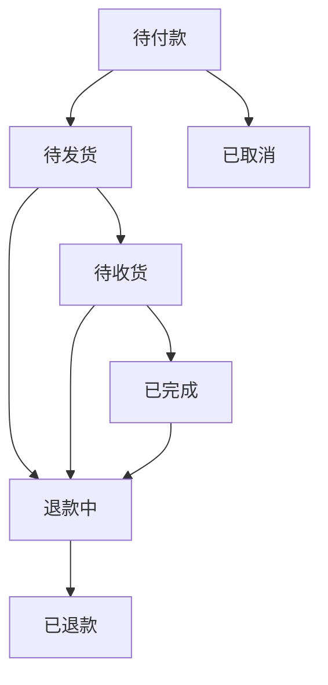
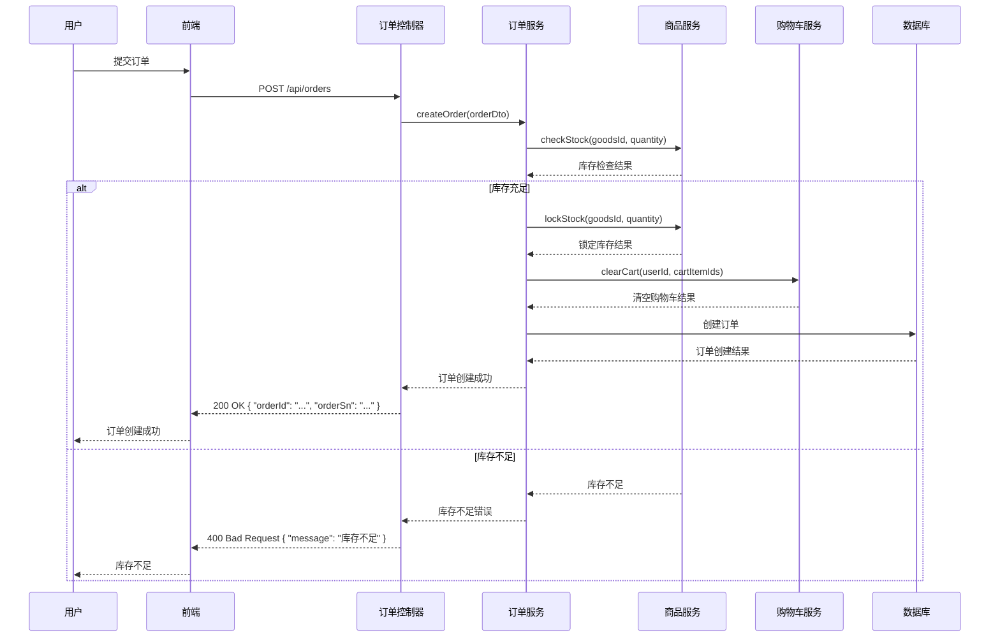
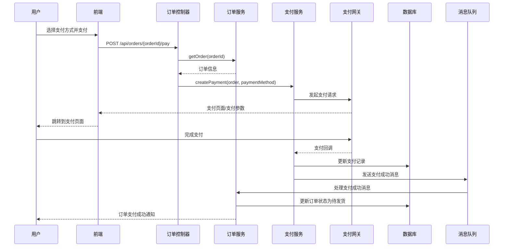
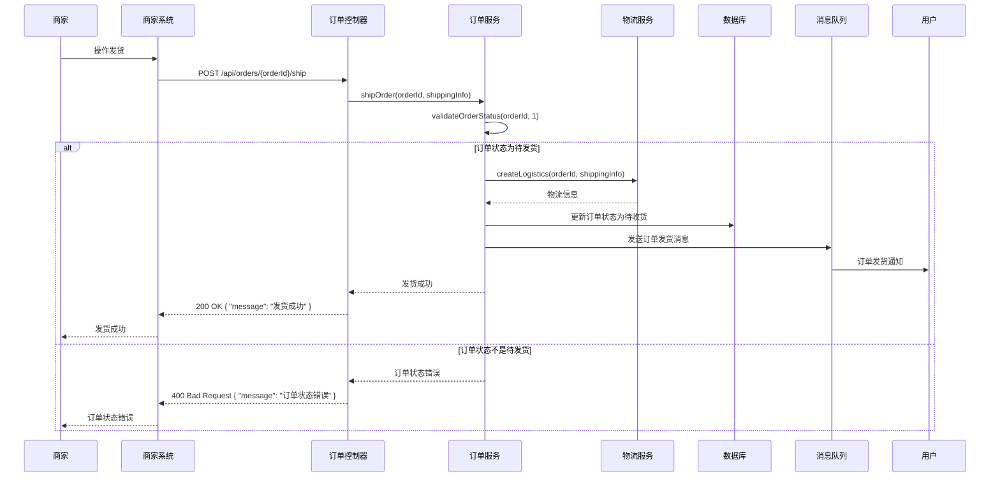
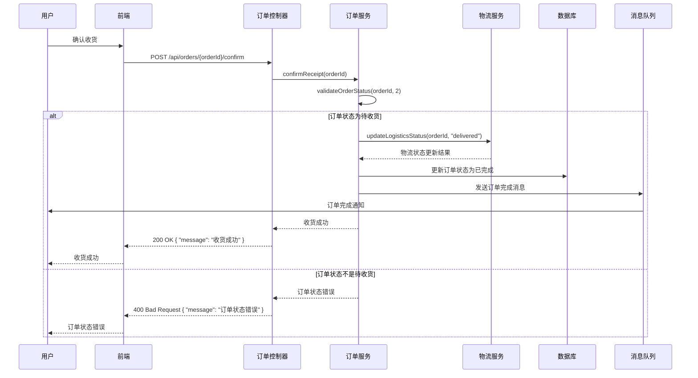
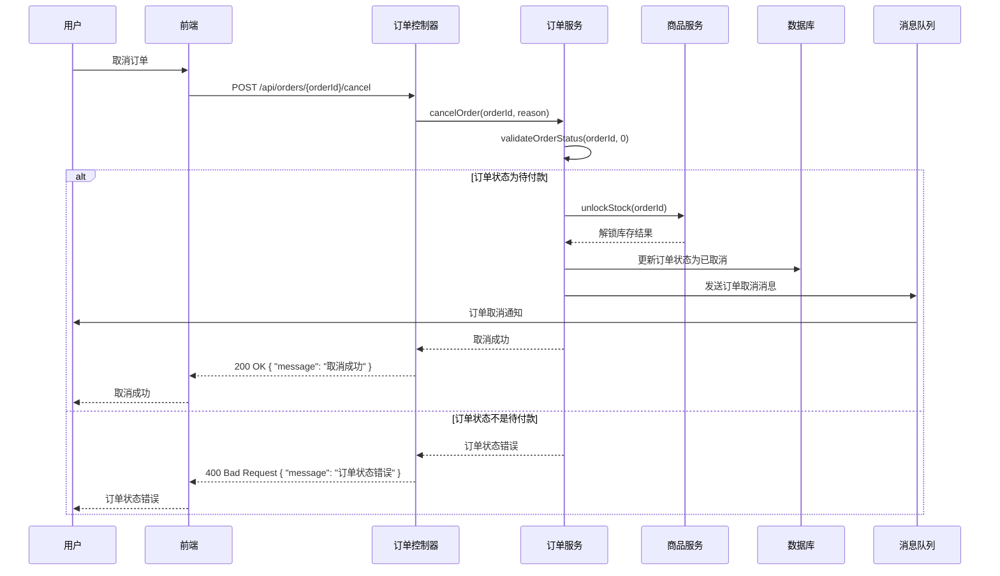
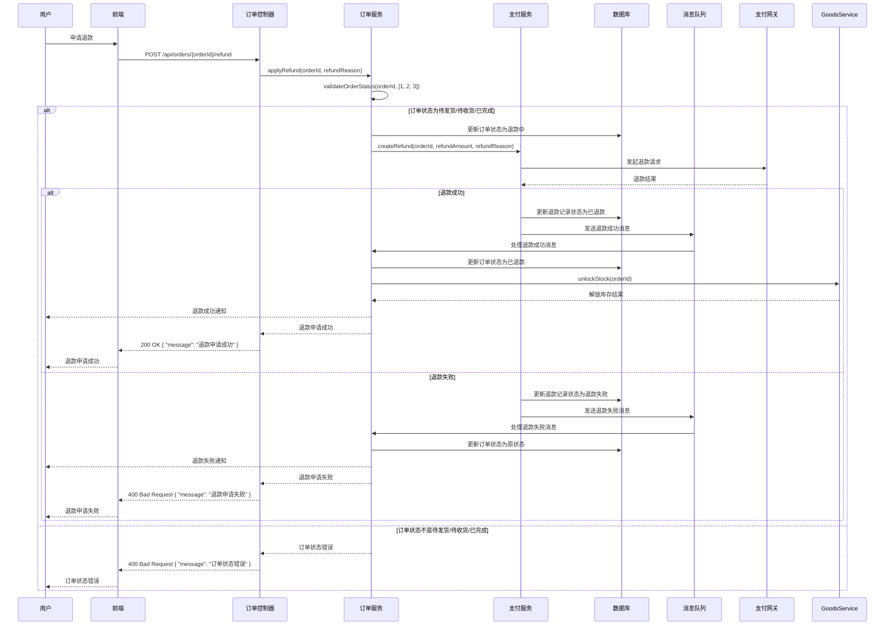

# 订单流程

## 1. 订单流程概述

订单流程是电商系统中的核心业务流程之一，涵盖了从用户下单到订单完成的整个过程。订单流程的设计直接影响到用户体验、系统性能和业务逻辑的正确性。本文档详细描述了 MallEcoAPI 系统中的订单流程，包括订单创建、支付、发货、收货、评价等环节。

### 1.1 订单流程定位

订单流程在电商系统中扮演着以下角色：

- **核心业务流程**：订单流程是电商系统的核心业务流程，连接了用户、商品、支付、物流等多个系统模块
- **用户体验关键**：订单流程的顺畅与否直接影响用户的购物体验
- **业务逻辑集成**：订单流程集成了多个业务逻辑，如库存管理、支付处理、物流跟踪等
- **数据流转中心**：订单流程是系统中数据流转的中心，涉及用户、商品、支付、物流等多个数据实体

### 1.2 核心价值

- **业务完整性**：确保订单处理的完整性，从下单到完成的全流程覆盖
- **用户体验优化**：提供顺畅的订单处理流程，优化用户体验
- **系统集成**：实现与支付、物流等外部系统的集成
- **数据一致性**：确保订单相关数据的一致性，如订单状态、库存、支付状态等
- **业务规则执行**：确保订单处理过程中业务规则的正确执行，如库存检查、价格计算等

## 2. 订单状态

### 2.1 订单状态定义

| 状态值 | 状态名称 | 描述 |
|--------|----------|------|
| 0 | 待付款 | 用户已创建订单，但尚未支付 |
| 1 | 待发货 | 用户已支付订单，商家尚未发货 |
| 2 | 待收货 | 商家已发货，用户尚未确认收货 |
| 3 | 已完成 | 用户已确认收货，订单完成 |
| 4 | 已取消 | 订单已取消 |
| 5 | 退款中 | 用户申请退款，退款处理中 |
| 6 | 已退款 | 退款处理完成 |

### 2.2 订单状态流转

### 2.3 状态流转说明

1. **待付款** → **待发货**：用户支付订单成功后，订单状态变更为待发货
2. **待发货** → **待收货**：商家发货后，订单状态变更为待收货
3. **待收货** → **已完成**：用户确认收货后，订单状态变更为已完成
4. **待付款** → **已取消**：用户取消订单或订单超时未支付，订单状态变更为已取消
5. **待发货** → **退款中**：用户申请退款，订单状态变更为退款中
6. **待收货** → **退款中**：用户申请退款，订单状态变更为退款中
7. **已完成** → **退款中**：用户申请退款，订单状态变更为退款中
8. **退款中** → **已退款**：退款处理完成后，订单状态变更为已退款

## 3. 订单流程详解

### 3.1 订单创建流程

#### 3.1.1 流程步骤

#### 3.1.2 流程说明

1. **用户提交订单**：用户在前端选择商品并提交订单
2. **前端请求创建订单**：前端调用 `/api/orders` 接口创建订单
3. **订单控制器处理请求**：订单控制器接收请求并调用订单服务的 `createOrder` 方法
4. **库存检查**：订单服务调用商品服务的 `checkStock` 方法检查商品库存
5. **锁定库存**：库存充足时，订单服务调用商品服务的 `lockStock` 方法锁定库存
6. **清空购物车**：订单服务调用购物车服务的 `clearCart` 方法清空已下单的购物车商品
7. **创建订单**：订单服务在数据库中创建订单记录
8. **返回订单信息**：订单创建成功后，返回订单 ID 和订单编号
9. **前端提示用户**：前端提示用户订单创建成功

#### 3.1.3 关键技术点

- **库存检查与锁定**：确保订单创建时商品库存充足，并锁定库存防止超卖
- **事务管理**：订单创建过程使用事务管理，确保库存锁定和订单创建的原子性
- **订单编号生成**：使用唯一的订单编号生成算法，确保订单编号的唯一性
- **价格计算**：根据商品价格、数量、优惠等计算订单总金额

### 3.2 订单支付流程

#### 3.2.1 流程步骤

#### 3.2.2 流程说明

1. **用户选择支付方式**：用户在前端选择支付方式并点击支付
2. **前端请求支付**：前端调用 `/api/orders/{orderId}/pay` 接口发起支付
3. **订单控制器处理请求**：订单控制器接收请求并获取订单信息
4. **创建支付**：订单控制器调用支付服务的 `createPayment` 方法创建支付
5. **发起支付请求**：支付服务向支付网关发起支付请求
6. **跳转到支付页面**：支付网关返回支付页面或支付参数，前端跳转到支付页面
7. **用户完成支付**：用户在支付页面完成支付操作
8. **支付回调**：支付网关向支付服务发送支付回调
9. **更新支付记录**：支付服务更新支付记录的状态
10. **发送支付成功消息**：支付服务向消息队列发送支付成功消息
11. **处理支付成功消息**：订单服务消费支付成功消息，更新订单状态为待发货
12. **通知用户**：系统通知用户订单支付成功

#### 3.2.3 关键技术点

- **支付方式集成**：集成多种支付方式，如支付宝、微信支付等
- **支付回调处理**：处理支付网关的异步回调，确保支付状态的正确更新
- **消息队列**：使用消息队列处理支付成功后的订单状态更新，提高系统的可靠性和性能
- **幂等性处理**：确保支付回调的幂等性，防止重复处理

### 3.3 订单发货流程

#### 3.3.1 流程步骤

#### 3.3.2 流程说明

1. **商家操作发货**：商家在商家系统中操作订单发货
2. **商家系统请求发货**：商家系统调用 `/api/orders/{orderId}/ship` 接口发起发货请求
3. **订单控制器处理请求**：订单控制器接收请求并调用订单服务的 `shipOrder` 方法
4. **订单状态验证**：订单服务验证订单状态是否为待发货
5. **创建物流信息**：订单状态验证通过后，订单服务调用物流服务的 `createLogistics` 方法创建物流信息
6. **更新订单状态**：订单服务更新订单状态为待收货
7. **发送发货消息**：订单服务向消息队列发送订单发货消息
8. **通知用户**：系统通知用户订单已发货
9. **返回发货结果**：返回发货成功的消息给商家系统

#### 3.3.3 关键技术点

- **订单状态验证**：确保只有待发货状态的订单可以进行发货操作
- **物流信息创建**：与物流服务集成，创建物流信息并获取运单号
- **消息队列**：使用消息队列发送订单发货消息，提高系统的可靠性和性能
- **事务管理**：发货过程使用事务管理，确保物流信息创建和订单状态更新的原子性

### 3.4 订单收货流程

#### 3.4.1 流程步骤

#### 3.4.2 流程说明

1. **用户确认收货**：用户在前端确认收到商品
2. **前端请求确认收货**：前端调用 `/api/orders/{orderId}/confirm` 接口确认收货
3. **订单控制器处理请求**：订单控制器接收请求并调用订单服务的 `confirmReceipt` 方法
4. **订单状态验证**：订单服务验证订单状态是否为待收货
5. **更新物流状态**：订单状态验证通过后，订单服务调用物流服务的 `updateLogisticsStatus` 方法更新物流状态为已送达
6. **更新订单状态**：订单服务更新订单状态为已完成
7. **发送订单完成消息**：订单服务向消息队列发送订单完成消息
8. **通知用户**：系统通知用户订单已完成
9. **返回收货结果**：返回收货成功的消息给前端

#### 3.4.3 关键技术点

- **订单状态验证**：确保只有待收货状态的订单可以进行确认收货操作
- **物流状态更新**：与物流服务集成，更新物流状态为已送达
- **消息队列**：使用消息队列发送订单完成消息，提高系统的可靠性和性能
- **事务管理**：收货过程使用事务管理，确保物流状态更新和订单状态更新的原子性

### 3.5 订单取消流程

#### 3.5.1 流程步骤

#### 3.5.2 流程说明

1. **用户取消订单**：用户在前端取消待付款的订单
2. **前端请求取消订单**：前端调用 `/api/orders/{orderId}/cancel` 接口取消订单
3. **订单控制器处理请求**：订单控制器接收请求并调用订单服务的 `cancelOrder` 方法
4. **订单状态验证**：订单服务验证订单状态是否为待付款
5. **解锁库存**：订单状态验证通过后，订单服务调用商品服务的 `unlockStock` 方法解锁已锁定的库存
6. **更新订单状态**：订单服务更新订单状态为已取消
7. **发送订单取消消息**：订单服务向消息队列发送订单取消消息
8. **通知用户**：系统通知用户订单已取消
9. **返回取消结果**：返回取消成功的消息给前端

#### 3.5.3 关键技术点

- **订单状态验证**：确保只有待付款状态的订单可以进行取消操作
- **库存解锁**：取消订单后解锁已锁定的库存，确保库存的正确管理
- **消息队列**：使用消息队列发送订单取消消息，提高系统的可靠性和性能
- **事务管理**：取消订单过程使用事务管理，确保库存解锁和订单状态更新的原子性

### 3.6 订单退款流程

#### 3.6.1 流程步骤

#### 3.6.2 流程说明

1. **用户申请退款**：用户在前端申请退款
2. **前端请求退款**：前端调用 `/api/orders/{orderId}/refund` 接口申请退款
3. **订单控制器处理请求**：订单控制器接收请求并调用订单服务的 `applyRefund` 方法
4. **订单状态验证**：订单服务验证订单状态是否为待发货、待收货或已完成
5. **更新订单状态为退款中**：订单状态验证通过后，订单服务更新订单状态为退款中
6. **创建退款**：订单服务调用支付服务的 `createRefund` 方法创建退款
7. **发起退款请求**：支付服务向支付网关发起退款请求
8. **处理退款结果**：
   - 退款成功：更新退款记录状态为已退款，更新订单状态为已退款，解锁库存，通知用户
   - 退款失败：更新退款记录状态为退款失败，恢复订单原状态，通知用户
9. **返回退款申请结果**：返回退款申请结果给前端

#### 3.6.3 关键技术点

- **订单状态验证**：确保只有待发货、待收货或已完成状态的订单可以申请退款
- **退款处理**：与支付服务集成，处理退款申请和结果
- **库存解锁**：退款成功后解锁已锁定的库存，确保库存的正确管理
- **消息队列**：使用消息队列发送退款消息，提高系统的可靠性和性能
- **事务管理**：退款过程使用事务管理，确保退款处理和订单状态更新的原子性

## 4. 订单流程优化

### 4.1 优化方向

订单流程的优化可以从以下几个方面进行：

1. **用户体验优化**：简化订单流程，减少用户操作步骤，提高用户体验
2. **系统性能优化**：优化订单处理速度，减少响应时间，提高系统性能
3. **业务逻辑优化**：优化业务逻辑，减少错误率，提高订单处理的准确性
4. **可靠性优化**：提高订单流程的可靠性，确保订单处理的完整性
5. **扩展性优化**：提高订单流程的扩展性，适应业务的发展和变化

### 4.2 优化建议

1. **异步处理**：使用消息队列处理订单状态更新、库存解锁等操作，提高系统性能
2. **缓存优化**：使用缓存存储订单相关数据，减少数据库查询，提高系统性能
3. **数据库优化**：优化数据库查询，使用索引，提高订单查询速度
4. **并发控制**：使用乐观锁或悲观锁处理并发订单操作，防止数据冲突
5. **异常处理**：完善异常处理机制，确保订单流程在异常情况下的正确性
6. **监控与日志**：增加订单流程的监控和日志记录，便于问题定位和分析
7. **超时处理**：实现订单超时处理机制，自动取消超时未支付的订单
8. **批量处理**：对于批量订单操作，使用批量处理机制，提高处理效率

### 4.3 注意事项

1. **数据一致性**：确保订单相关数据的一致性，如订单状态、库存、支付状态等
2. **并发控制**：处理并发订单操作，防止数据冲突和超卖
3. **异常处理**：完善异常处理机制，确保订单流程在异常情况下的正确性
4. **性能优化**：注意订单流程的性能优化，避免系统瓶颈
5. **安全性**：确保订单数据的安全性，防止数据泄露和篡改
6. **可扩展性**：考虑订单流程的可扩展性，适应业务的发展和变化

## 5. 订单流程与其他流程的集成

### 5.1 与支付流程的集成

订单流程与支付流程的集成主要体现在以下几个方面：

1. **订单支付**：订单流程调用支付流程完成订单支付
2. **支付状态更新**：支付流程完成后更新订单的支付状态
3. **退款处理**：订单流程调用支付流程处理退款申请
4. **支付记录关联**：订单与支付记录的关联，便于查询和管理

### 5.2 与物流流程的集成

订单流程与物流流程的集成主要体现在以下几个方面：

1. **订单发货**：订单流程调用物流流程创建物流信息
2. **物流状态更新**：物流流程更新物流状态后，订单流程同步更新订单状态
3. **物流信息查询**：订单流程提供物流信息查询功能
4. **运费计算**：订单流程调用物流流程计算运费

### 5.3 与商品流程的集成

订单流程与商品流程的集成主要体现在以下几个方面：

1. **库存检查**：订单创建时检查商品库存
2. **库存锁定**：订单创建时锁定商品库存
3. **库存解锁**：订单取消或退款时解锁商品库存
4. **商品信息关联**：订单与商品信息的关联，便于查询和管理

### 5.4 与用户流程的集成

订单流程与用户流程的集成主要体现在以下几个方面：

1. **用户认证**：订单操作需要用户认证
2. **用户信息关联**：订单与用户信息的关联，便于查询和管理
3. **用户通知**：订单状态变更时通知用户
4. **用户地址管理**：订单使用用户的收货地址

## 6. 总结与展望

### 6.1 订单流程优势

- **流程完整**：涵盖了从订单创建到完成的整个流程，包括支付、发货、收货、退款等环节
- **逻辑清晰**：业务逻辑清晰，状态流转合理
- **集成性强**：与支付、物流、商品、用户等多个系统模块集成
- **可靠性高**：使用事务管理和消息队列，提高了订单流程的可靠性
- **可扩展性强**：模块化设计，便于扩展和维护

### 6.2 改进空间

- **用户体验优化**：进一步简化订单流程，减少用户操作步骤
- **系统性能优化**：进一步优化订单处理速度，减少响应时间
- **业务逻辑优化**：进一步优化业务逻辑，减少错误率
- **监控与分析**：增加订单流程的监控和分析，便于问题定位和优化
- **国际化支持**：增加国际化支持，适应不同地区的业务需求

### 6.3 未来规划

- **版本 1.1**：优化订单流程的用户体验，减少操作步骤
- **版本 1.2**：优化订单流程的系统性能，提高处理速度
- **版本 1.3**：增加订单流程的监控和分析功能
- **版本 1.4**：增加国际化支持，适应不同地区的业务需求
- **版本 2.0**：重构订单流程，采用更先进的架构设计，支持更多业务场景

## 7. 附录

### 7.1 订单相关接口

| 接口路径 | 方法 | 描述 | 模块 |
|----------|------|------|------|
| `/api/orders` | POST | 创建订单 | 订单模块 |
| `/api/orders` | GET | 获取订单列表 | 订单模块 |
| `/api/orders/{orderId}` | GET | 获取订单详情 | 订单模块 |
| `/api/orders/{orderId}/pay` | POST | 支付订单 | 订单模块 |
| `/api/orders/{orderId}/cancel` | POST | 取消订单 | 订单模块 |
| `/api/orders/{orderId}/ship` | POST | 发货 | 订单模块 |
| `/api/orders/{orderId}/confirm` | POST | 确认收货 | 订单模块 |
| `/api/orders/{orderId}/refund` | POST | 申请退款 | 订单模块 |

### 7.2 订单状态枚举

| 枚举值 | 枚举名称 | 描述 |
|--------|----------|------|
| 0 | PENDING_PAYMENT | 待付款 |
| 1 | PENDING_SHIPMENT | 待发货 |
| 2 | PENDING_RECEIPT | 待收货 |
| 3 | COMPLETED | 已完成 |
| 4 | CANCELLED | 已取消 |
| 5 | REFUNDING | 退款中 |
| 6 | REFUNDED | 已退款 |

### 7.3 订单流程相关组件

| 组件名称 | 描述 | 模块 |
|----------|------|------|
| `OrderController` | 处理订单相关的 HTTP 请求 | 订单模块 |
| `OrderService` | 实现订单相关的业务逻辑 | 订单模块 |
| `OrderItemService` | 处理订单项相关的业务逻辑 | 订单模块 |
| `PaymentService` | 处理支付相关的业务逻辑 | 支付模块 |
| `LogisticsService` | 处理物流相关的业务逻辑 | 物流模块 |
| `GoodsService` | 处理商品相关的业务逻辑 | 商品模块 |
| `CartService` | 处理购物车相关的业务逻辑 | 购物车模块 |

### 7.4 参考资源

- **工具**：
  - Mermaid：用于绘制订单流程图
  - Postman：用于测试订单相关接口

- **文档**：
  - [NestJS 官方文档](https://docs.nestjs.com/)
  - [TypeORM 文档](https://typeorm.io/)
  - [MySQL 官方文档](https://dev.mysql.com/doc/)

- **书籍**：
  - 《电商系统架构设计与实践》
  - 《分布式系统设计原理与实践》
  - 《高并发系统设计与实践》

---

**文档更新时间**：2026-01-19
**文档版本**：v1.0.0
**作者**：MallEco 开发团队
