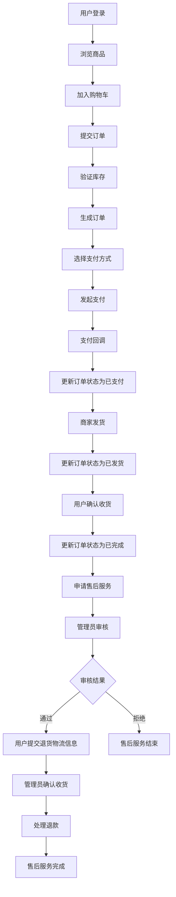
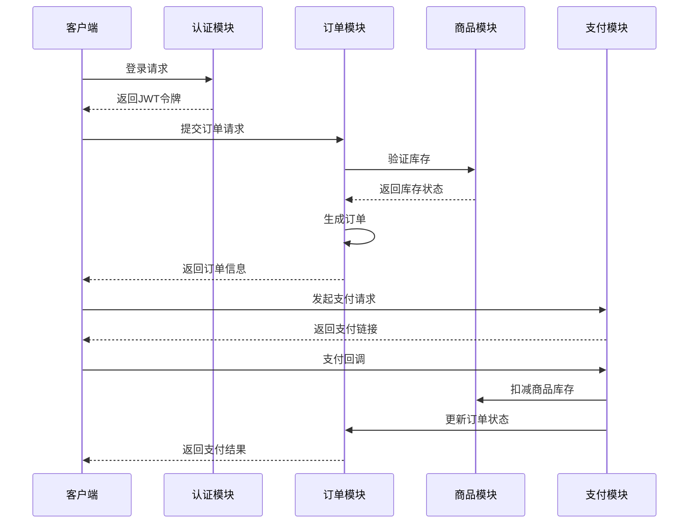
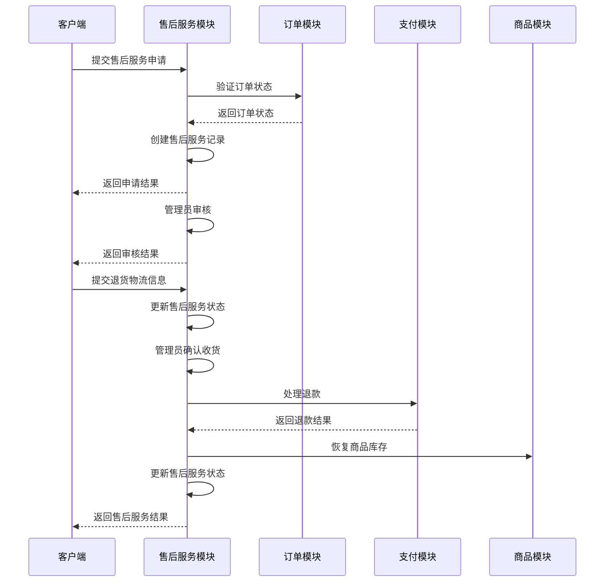

# MallEcoAPI 项目分析文档

## 1. 项目概述

MallEcoAPI 是一个基于 NestJS 框架开发的电商系统后端 API，提供了完整的电商业务功能，包括用户认证、商品管理、订单处理、支付集成、物流管理和售后服务等核心模块。

### 技术栈

- **框架**: NestJS 11.0.1
- **数据库**: MySQL
- **认证**: JWT
- **缓存**: Redis
- **消息队列**: RabbitMQ
- **API文档**: Swagger
- **监控**: Prometheus + Grafana
- **容器化**: Docker

## 2. 目录结构分析

### 核心目录结构

```
src/
├── common/          # 公共组件和工具
├── config/          # 配置文件
├── infrastructure/  # 基础设施（认证、缓存、监控等）
├── modules/         # 业务模块
│   ├── auth/        # 认证模块
│   ├── orders/      # 订单模块
│   ├── payment/     # 支付模块
│   ├── logistics/   # 物流模块
│   ├── after-sales/ # 售后服务模块
│   ├── goods/       # 商品模块
│   ├── users/       # 用户模块
│   └── ...
├── app.module.ts    # 应用主模块
└── main.ts          # 应用入口
```

### 主要业务模块

| 模块 | 职责 | 文件位置 |
|------|------|----------|
| 认证模块 | 用户登录、注册、令牌管理 | `src/modules/auth/` |
| 订单模块 | 订单创建、状态管理、查询 | `src/modules/orders/` |
| 支付模块 | 支付处理、回调管理 | `src/modules/payment/` |
| 物流模块 | 物流信息查询、面单打印 | `src/modules/logistics/` |
| 售后服务模块 | 理赔申请、审核、处理 | `src/modules/after-sales/` |
| 商品模块 | 商品信息管理、库存管理 | `src/modules/goods/` |
| 用户模块 | 用户信息管理 | `src/modules/users/` |

## 3. 核心功能模块分析

### 3.1 认证模块

#### 认证流程

1. **用户注册**：用户提供用户名、密码、邮箱等信息进行注册
2. **用户登录**：用户使用用户名/邮箱/手机号和密码登录
3. **令牌生成**：登录成功后生成 JWT 访问令牌和刷新令牌
4. **令牌验证**：访问需要认证的接口时，通过 JWT 令牌进行身份验证
5. **令牌刷新**：访问令牌过期后，使用刷新令牌获取新的访问令牌

#### 关键文件

- `src/modules/auth/controllers/auth.controller.ts` - 认证控制器
- `src/modules/auth/services/auth.service.ts` - 认证服务
- `src/infrastructure/auth/strategies/jwt.strategy.ts` - JWT 认证策略
- `src/infrastructure/auth/guards/jwt-auth.guard.ts` - JWT 认证守卫

### 3.2 订单模块

#### 订单流程

1. **订单创建**：用户提交订单信息，包括商品、收货地址、支付方式等
2. **订单验证**：验证订单信息的合法性，包括商品库存、价格等
3. **订单状态管理**：根据订单进展更新订单状态
4. **订单查询**：支持按用户、状态等条件查询订单

#### 关键文件

- `src/modules/orders/orders.controller.ts` - 订单控制器
- `src/modules/orders/orders.service.ts` - 订单服务
- `src/modules/orders/entities/order.entity.ts` - 订单实体
- `src/modules/orders/entities/order-item.entity.ts` - 订单商品项实体

### 3.3 支付模块

#### 支付流程

1. **支付创建**：创建支付记录，生成商户订单号
2. **支付发起**：根据支付方式调用相应的支付服务
3. **支付回调**：处理支付平台的回调通知
4. **支付状态更新**：根据回调结果更新支付状态和订单状态
5. **支付查询**：查询支付状态

#### 关键文件

- `src/modules/payment/services/payment.service.ts` - 支付服务
- `src/modules/payment/services/alipay.service.ts` - 支付宝服务
- `src/modules/payment/services/wechatpay.service.ts` - 微信支付服务

### 3.4 物流模块

#### 物流流程

1. **物流信息创建**：创建物流信息记录
2. **物流查询**：查询物流轨迹信息
3. **电子面单打印**：打印物流面单
4. **物流订单创建**：创建物流订单

#### 关键文件

- `src/modules/logistics/controllers/logistics.controller.ts` - 物流控制器
- `src/modules/logistics/services/logistics.service.ts` - 物流服务
- `src/modules/logistics/interfaces/logistics-plugin.interface.ts` - 物流插件接口

### 3.5 售后服务模块

#### 理赔流程

1. **理赔申请**：用户提交售后服务申请
2. **理赔审核**：管理员审核售后服务申请
3. **退货物流信息提交**：用户提交退货物流信息
4. **确认收货**：管理员确认收到退货并完成售后服务

#### 关键文件

- `src/modules/after-sales/controllers/after-sales.controller.ts` - 售后服务控制器
- `src/modules/after-sales/services/after-sales.service.ts` - 售后服务服务
- `src/modules/after-sales/entities/after-sales.entity.ts` - 售后服务实体

## 4. 完整业务流程分析

### 4.1 从下单到理赔的完整流程



### 4.2 详细流程说明

1. **用户登录**：用户使用账号密码登录系统，获取 JWT 令牌
2. **浏览商品**：用户浏览商品列表，查看商品详情
3. **加入购物车**：用户将想要购买的商品加入购物车
4. **提交订单**：用户确认订单信息，包括收货地址、商品数量等
5. **验证库存**：系统验证商品库存是否充足
6. **生成订单**：系统生成订单，分配订单编号
7. **选择支付方式**：用户选择支付方式（支付宝或微信支付）
8. **发起支付**：系统调用相应的支付服务发起支付
9. **支付回调**：支付平台回调通知支付结果
10. **更新订单状态**：根据支付结果更新订单状态为已支付
11. **商家发货**：商家处理订单并发货
12. **更新订单状态**：系统更新订单状态为已发货
13. **用户确认收货**：用户收到商品后确认收货
14. **更新订单状态**：系统更新订单状态为已完成
15. **申请售后服务**：用户提交售后服务申请
16. **管理员审核**：管理员审核售后服务申请
17. **用户提交退货物流信息**：审核通过后，用户提交退货物流信息
18. **管理员确认收货**：管理员确认收到退货
19. **处理退款**：系统处理退款
20. **售后服务完成**：售后服务流程结束

## 5. 认证机制分析

### 5.1 JWT 认证流程

1. **令牌生成**：用户登录成功后，系统使用 JWT_SECRET 生成访问令牌和刷新令牌
2. **令牌存储**：令牌可以存储在 Cookie 中或通过 Authorization 头传递
3. **令牌验证**：访问需要认证的接口时，系统验证令牌的有效性
4. **令牌过期处理**：访问令牌过期后，使用刷新令牌获取新的访问令牌

### 5.2 认证配置

- **JWT_SECRET**：用于签名 JWT 令牌的密钥
- **JWT_EXPIRES_IN**：访问令牌过期时间
- **JWT_REFRESH_SECRET**：用于签名刷新令牌的密钥
- **JWT_REFRESH_EXPIRES_IN**：刷新令牌过期时间

### 5.3 认证守卫

系统使用 `JwtAuthGuard` 来保护需要认证的接口，通过 `@UseGuards(JwtAuthGuard)` 装饰器应用到控制器或方法上。

## 6. 库存管理分析

### 6.1 库存管理现状

目前系统使用内存存储来管理商品库存，具体实现如下：

- `src/modules/buyer/goods/services/goods.service.ts` 中使用内存数组模拟商品数据
- 商品和 SKU 都有 `quantity` 字段表示库存数量
- 但在订单创建过程中，没有实现库存检查和扣减逻辑

### 6.2 库存管理流程

理想的库存管理流程应该包括：

1. **库存检查**：创建订单时检查商品库存是否充足
2. **库存锁定**：检查通过后锁定库存，防止超卖
3. **库存扣减**：支付成功后扣减库存
4. **库存释放**：订单取消或超时后释放库存

## 7. 支付流程分析

### 7.1 支付集成

系统集成了两种支付方式：

1. **支付宝**：通过 `alipay.service.ts` 实现
2. **微信支付**：通过 `wechatpay.service.ts` 实现

### 7.2 支付流程

1. **创建支付记录**：系统创建支付记录，生成商户订单号
2. **调用支付接口**：根据支付方式调用相应的支付接口
3. **处理支付回调**：接收并验证支付平台的回调通知
4. **更新支付状态**：根据回调结果更新支付状态
5. **更新订单状态**：支付成功后更新订单状态为已支付

### 7.3 支付安全

- 使用 HTTPS 协议传输支付数据
- 验证支付回调的签名
- 防止支付回调重复处理

## 8. 物流管理分析

### 8.1 物流服务设计

系统采用插件化设计来支持不同的物流服务提供商：

- `src/modules/logistics/interfaces/logistics-plugin.interface.ts` 定义了物流插件接口
- `src/modules/logistics/services/logistics.service.ts` 管理物流插件

### 8.2 物流功能

1. **物流信息查询**：查询物流轨迹信息
2. **物流地图轨迹**：查询物流地图轨迹
3. **电子面单打印**：打印物流面单
4. **物流订单创建**：创建物流订单

## 9. 理赔流程分析

### 9.1 售后服务类型

系统支持的售后服务类型包括：

- **退货退款**：用户退回商品并获得退款
- **仅退款**：用户不退回商品，直接获得退款
- **换货**：用户退回商品并获得更换的商品

### 9.2 售后服务流程

1. **申请售后服务**：用户提交售后服务申请
2. **审核售后服务**：管理员审核售后服务申请
3. **提交退货物流信息**：审核通过后，用户提交退货物流信息
4. **确认收货**：管理员确认收到退货
5. **处理退款**：系统处理退款
6. **完成售后服务**：售后服务流程结束

### 9.3 售后服务状态

- **APPLIED**：已申请
- **APPROVED**：已审核通过
- **REJECTED**：已审核拒绝
- **PROCESSING**：处理中
- **COMPLETED**：已完成
- **CANCELLED**：已取消

## 10. 项目中存在的错误和问题

### 10.1 数据存储问题

1. **内存存储**：用户数据和订单数据使用内存数组存储，服务重启后数据会丢失
2. **缺少数据库集成**：虽然项目配置了 MySQL，但核心业务数据没有使用数据库存储
3. **缓存管理**：虽然使用了缓存服务，但缓存清理逻辑可能存在问题

### 10.2 认证安全问题

1. **默认 JWT 密钥**：系统使用默认的 JWT_SECRET，安全性不足
2. **令牌验证逻辑**：JWT 验证中存在潜在的安全问题
3. **密码存储**：用户密码虽然使用了 bcrypt 加密，但实现细节可能存在问题

### 10.3 业务逻辑问题

1. **缺少库存检查**：订单创建过程中没有检查商品库存
2. **缺少库存扣减**：支付成功后没有扣减商品库存
3. **退款逻辑未实现**：售后服务完成后，退款逻辑只是注释，没有实际实现
4. **订单状态管理**：订单状态更新逻辑可能存在问题

### 10.4 代码质量问题

1. **类型定义问题**：部分 TypeScript 类型定义不完整或不正确
2. **错误处理**：部分错误处理逻辑不完善
3. **代码重复**：存在代码重复的情况
4. **缺少测试**：大部分功能缺少单元测试和集成测试

### 10.5 配置问题

1. **环境变量管理**：部分配置直接硬编码在代码中，没有使用环境变量
2. **配置验证**：部分配置缺少验证逻辑

## 11. 改进建议

### 11.1 数据存储改进

1. **使用数据库存储**：将用户数据、订单数据等核心业务数据存储到 MySQL 数据库
2. **实现数据模型**：完善数据库模型设计，建立合理的表结构和索引
3. **优化缓存策略**：改进缓存策略，提高系统性能

### 11.2 认证安全改进

1. **使用安全的 JWT 密钥**：在生产环境中使用强随机生成的 JWT_SECRET
2. **改进令牌验证**：完善 JWT 令牌验证逻辑，增加更多安全措施
3. **增强密码安全**：使用更强的密码哈希算法，增加密码复杂度要求

### 11.3 业务逻辑改进

1. **实现库存管理**：完善库存检查、锁定和扣减逻辑
2. **实现退款功能**：完善退款逻辑，确保退款流程正常运行
3. **优化订单状态管理**：改进订单状态管理逻辑，确保状态转换正确
4. **增加防重复提交**：在关键操作上增加防重复提交措施

### 11.4 代码质量改进

1. **完善类型定义**：完善 TypeScript 类型定义，提高代码可维护性
2. **改进错误处理**：完善错误处理逻辑，提供更友好的错误提示
3. **减少代码重复**：重构代码，减少代码重复
4. **增加测试**：为核心功能增加单元测试和集成测试

### 11.5 配置管理改进

1. **使用环境变量**：将配置项移至环境变量，提高配置的灵活性和安全性
2. **完善配置验证**：为配置项增加验证逻辑，确保配置的正确性
3. **配置版本管理**：实现配置的版本管理，便于回滚和审计

## 12. 结论

MallEcoAPI 是一个功能完整的电商系统后端 API，基于 NestJS 框架开发，提供了用户认证、商品管理、订单处理、支付集成、物流管理和售后服务等核心功能。

### 项目优势

1. **架构清晰**：采用模块化设计，代码结构清晰
2. **功能完整**：涵盖了电商系统的核心功能
3. **技术栈先进**：使用了 NestJS、TypeScript 等现代技术
4. **扩展性强**：采用插件化设计，便于扩展新功能

### 项目不足

1. **数据存储问题**：核心业务数据使用内存存储，服务重启后数据会丢失
2. **业务逻辑不完善**：缺少库存检查、退款处理等关键业务逻辑
3. **安全问题**：存在认证安全、配置安全等问题
4. **代码质量**：部分代码质量不高，缺少测试

### 改进建议

1. **优先解决数据存储问题**：将核心业务数据迁移到数据库
2. **完善业务逻辑**：实现库存管理、退款处理等关键业务逻辑
3. **加强安全措施**：改进认证安全、配置安全等
4. **提高代码质量**：完善类型定义、增加测试等

通过以上改进，MallEcoAPI 可以成为一个更加稳定、安全、可靠的电商系统后端 API，为前端应用提供更好的服务支持。

## 13. 修复和优化进度

### 13.1 已完成的修复和优化工作

| 序号 | 工作内容 | 完成状态 | 实现细节 |
|------|----------|----------|----------|
| 1 | 用户数据持久化存储 | ✅ 完成 | 将用户数据从内存存储迁移到MySQL数据库，使用TypeORM进行数据库操作 |
| 2 | 订单数据持久化存储 | ✅ 完成 | 将订单数据从内存存储迁移到MySQL数据库，实现订单的持久化存储和状态管理 |
| 3 | 商品数据持久化存储 | ✅ 完成 | 将商品数据从内存存储迁移到MySQL数据库，实现商品的持久化存储和管理 |
| 4 | 库存检查逻辑 | ✅ 完成 | 在订单创建时检查商品库存，防止超卖 |
| 5 | 库存扣减逻辑 | ✅ 完成 | 在支付成功后扣减商品库存，确保库存数据准确 |
| 6 | 退款处理逻辑 | ✅ 完成 | 在售后服务完成后处理退款，并恢复商品库存 |
| 7 | JWT认证安全优化 | ✅ 完成 | 移除默认JWT密钥，使用环境变量配置密钥，并添加最小长度验证 |
| 8 | 代码质量优化 | ✅ 完成 | 修复TypeScript类型错误，完善类型定义和错误处理 |
| 9 | 单元测试增加 | ✅ 完成 | 为核心服务添加单元测试，提高代码可靠性 |

### 13.2 关键实现细节

#### 13.2.1 数据持久化实现

- **用户数据**: 使用`User`实体和`Repository<User>`实现用户数据的CRUD操作
- **订单数据**: 使用`Order`和`OrderItem`实体实现订单的持久化存储，支持订单状态管理
- **商品数据**: 使用`Goods`实体实现商品的持久化存储，包含库存、价格等关键信息

#### 13.2.2 库存管理实现

- **库存检查**: 在`GoodsService`中实现`checkGoodsStock`方法，创建订单时检查商品库存
- **库存扣减**: 在`GoodsService`中实现`deductGoodsStock`方法，支付成功后扣减库存
- **库存恢复**: 在`GoodsService`中实现`restoreGoodsStock`方法，退款时恢复库存

#### 13.2.3 支付和退款实现

- **支付集成**: 集成支付宝和微信支付，支持多种支付方式
- **支付回调**: 处理支付平台的回调通知，更新支付状态和订单状态
- **退款处理**: 实现`refund`方法，处理售后服务退款，并恢复商品库存

#### 13.2.4 安全优化实现

- **JWT配置**: 修改`jwt.config.ts`，要求通过环境变量配置`JWT_SECRET`和`JWT_REFRESH_SECRET`，并验证密钥长度≥32字符
- **密码存储**: 使用bcrypt对用户密码进行加密存储

#### 13.2.5 代码质量优化

- **类型定义**: 修复TypeScript类型错误，完善DTO和实体的类型定义
- **错误处理**: 完善错误处理逻辑，提供更清晰的错误提示
- **单元测试**: 为`GoodsService`和`PaymentService`添加单元测试，覆盖核心业务逻辑

### 13.3 修复和优化效果

1. **数据持久性**: 核心业务数据现在存储在MySQL数据库中，服务重启后数据不会丢失
2. **业务逻辑完整性**: 实现了完整的库存管理和退款处理逻辑，确保业务流程的正确性
3. **安全性**: 优化了JWT认证配置，提高了系统的安全性
4. **代码质量**: 修复了类型错误，增加了单元测试，提高了代码的可维护性和可靠性

## 14. 附件

### 14.1 核心文件清单

| 模块 | 文件路径 | 功能描述 |
|------|----------|----------|
| 认证模块 | `src/modules/auth/controllers/auth.controller.ts` | 认证控制器，处理登录、注册等请求 |
| 认证模块 | `src/modules/auth/services/auth.service.ts` | 认证服务，处理认证逻辑 |
| 订单模块 | `src/modules/orders/orders.controller.ts` | 订单控制器，处理订单相关请求 |
| 订单模块 | `src/modules/orders/orders.service.ts` | 订单服务，处理订单逻辑 |
| 支付模块 | `src/modules/payment/services/payment.service.ts` | 支付服务，处理支付逻辑 |
| 支付模块 | `src/modules/payment/services/alipay.service.ts` | 支付宝服务，处理支付宝支付和退款 |
| 支付模块 | `src/modules/payment/services/wechatpay.service.ts` | 微信支付服务，处理微信支付和退款 |
| 物流模块 | `src/modules/logistics/services/logistics.service.ts` | 物流服务，处理物流逻辑 |
| 售后服务模块 | `src/modules/after-sales/services/after-sales.service.ts` | 售后服务服务，处理理赔逻辑 |
| 商品模块 | `src/modules/goods/goods.service.ts` | 商品服务，处理商品逻辑和库存管理 |
| 商品模块 | `src/modules/buyer/goods/services/goods.service.ts` | 买家商品服务，处理商品查询等逻辑 |
| 用户模块 | `src/modules/users/users.service.ts` | 用户服务，处理用户逻辑 |

### 14.2 业务流程时序图

#### 订单创建流程



#### 售后服务流程


