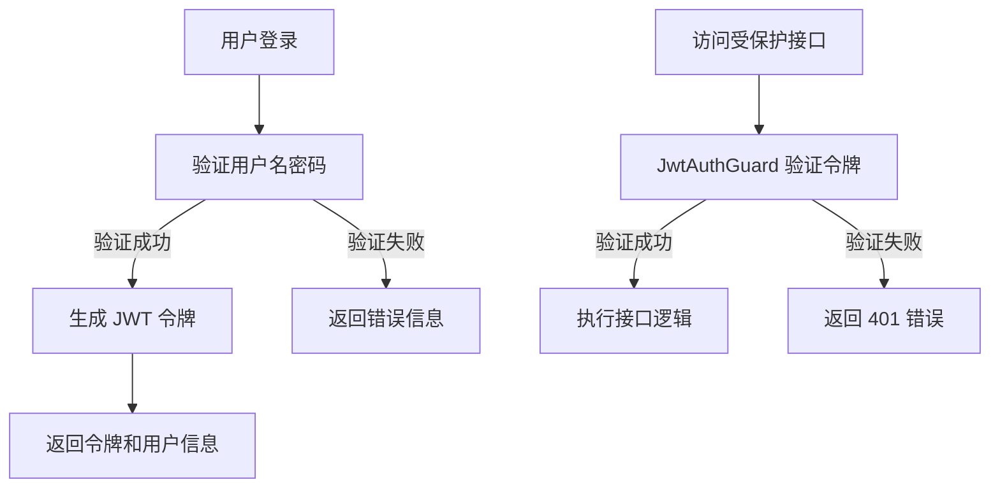
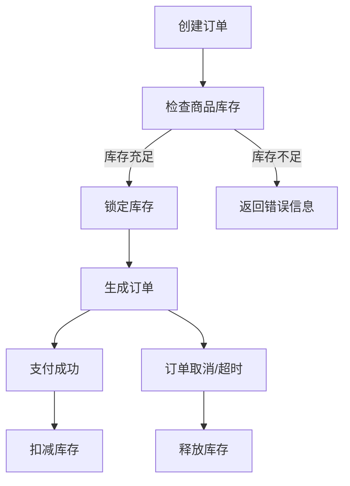
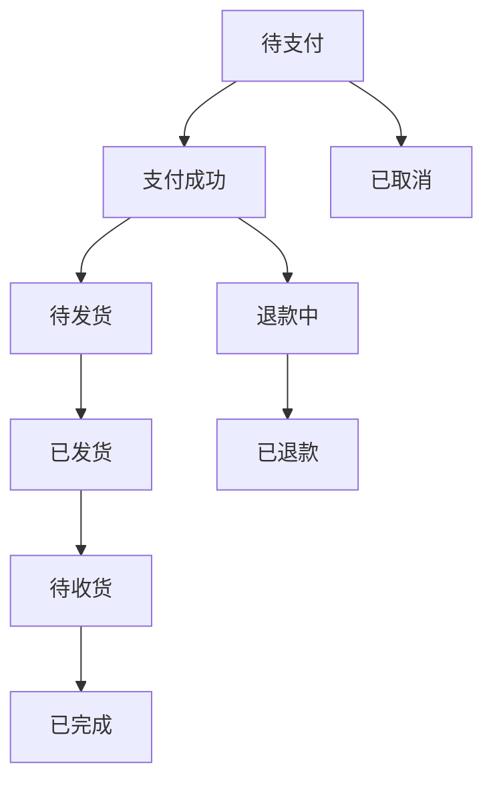
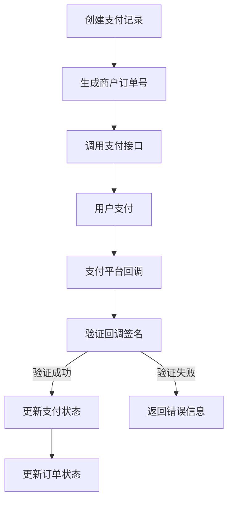
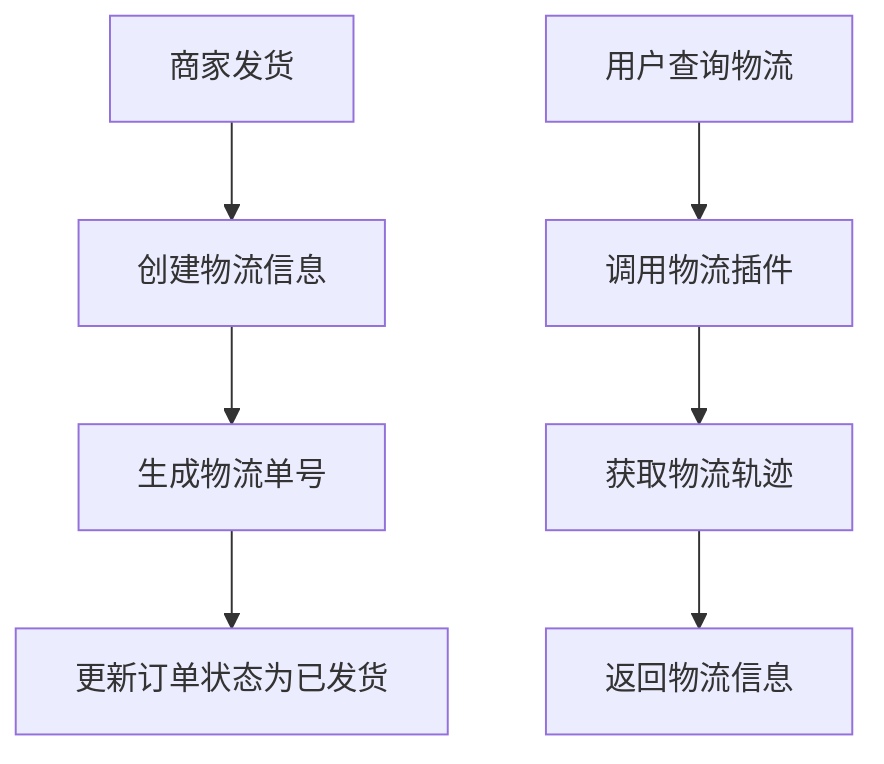
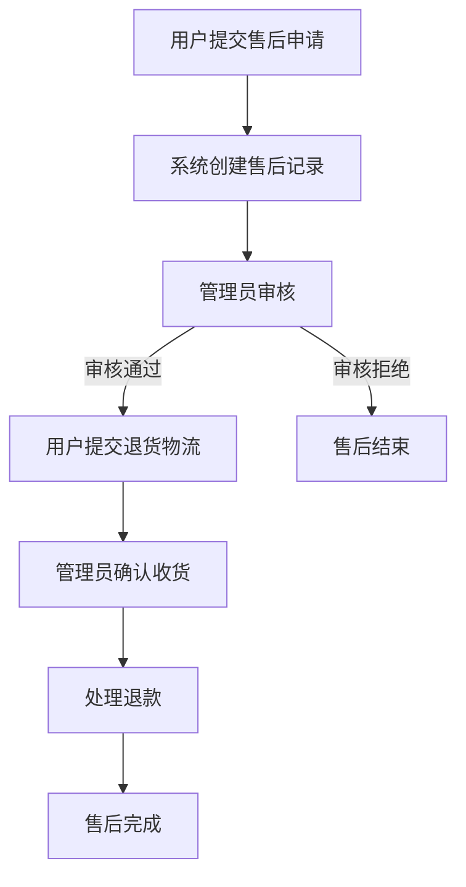
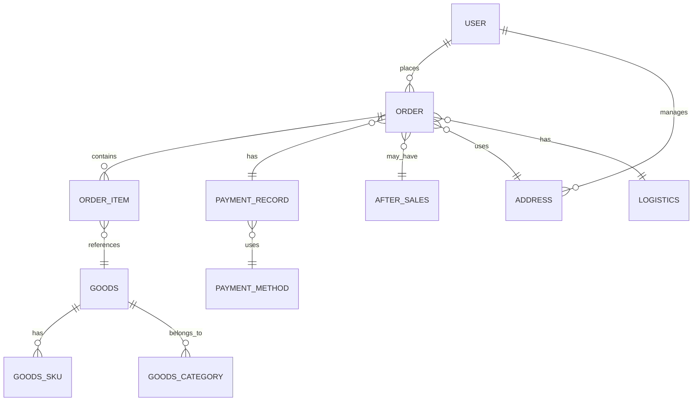
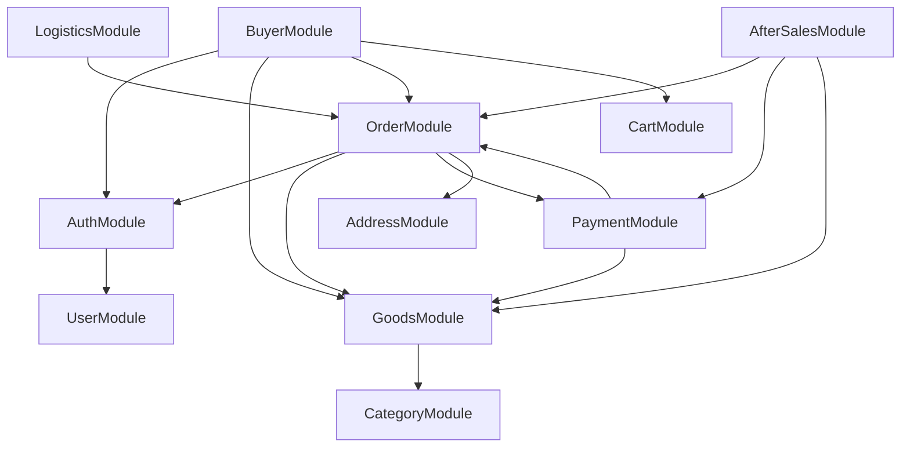

# MallEcoAPI 项目完整文档

## 1. 项目概述

MallEcoAPI 是一个基于 NestJS 框架开发的电商系统后端 API，提供了完整的电商业务功能，包括用户认证、商品管理、订单处理、支付集成、物流管理和售后服务等核心模块。

### 1.1 项目定位

MallEcoAPI 旨在为中小型电商平台提供一个功能完整、架构清晰、易于扩展的后端解决方案。通过模块化设计和插件化架构，实现了业务逻辑的解耦和功能的灵活组合。

### 1.2 核心价值

- **架构先进**：采用 NestJS + TypeScript 技术栈，代码结构清晰，类型安全
- **功能完整**：涵盖电商核心业务流程，从商品浏览到售后服务
- **扩展性强**：插件化设计，易于添加新功能和集成第三方服务
- **性能优异**：集成缓存、消息队列等技术，提高系统性能
- **安全可靠**：完善的认证授权机制，数据加密存储

## 2. 项目结构

### 2.1 目录结构

```
d:\MallEco\MallEcoAPI\
├── src/                # 源代码目录
│   ├── common/         # 公共组件和工具
│   ├── config/         # 配置文件
│   ├── infrastructure/ # 基础设施（认证、缓存、监控等）
│   ├── modules/        # 业务模块
│   ├── app.module.ts   # 应用主模块
│   └── main.ts         # 应用入口
├── docs/               # 项目文档
├── DB/                 # 数据库初始化和管理
├── scripts/            # 脚本文件
├── monitoring/         # 监控配置
├── nginx/              # Nginx 配置
├── performance-tests/  # 性能测试
├── public/             # 静态资源
├── resources/          # 资源文件
├── config/             # 配置文件
└── backup/             # 备份配置和脚本
```

### 2.2 核心模块结构

| 模块 | 职责 | 文件位置 |
|------|------|----------|
| 认证模块 | 用户登录、注册、令牌管理 | `src/modules/auth/` |
| 订单模块 | 订单创建、状态管理、查询 | `src/modules/orders/` |
| 支付模块 | 支付处理、回调管理 | `src/modules/payment/` |
| 物流模块 | 物流信息查询、面单打印 | `src/modules/logistics/` |
| 售后服务模块 | 理赔申请、审核、处理 | `src/modules/after-sales/` |
| 商品模块 | 商品信息管理、库存管理 | `src/modules/goods/` |
| 用户模块 | 用户信息管理 | `src/modules/users/` |
| 地址模块 | 收货地址管理 | `src/modules/address/` |
| 购物车模块 | 购物车管理 | `src/modules/cart/` |
| 内容模块 | 文章、分类管理 | `src/modules/content/` |
| 分销模块 | 分销管理 | `src/modules/distribution/` |
| 即时通讯模块 | 消息管理 | `src/modules/im/` |

### 2.3 基础设施模块

| 模块 | 职责 | 文件位置 |
|------|------|----------|
| 认证 | JWT 认证、权限管理 | `src/infrastructure/auth/` |
| 缓存 | Redis 缓存管理 | `src/infrastructure/cache/` |
| 监控 | 系统监控、性能分析 | `src/infrastructure/monitoring/` |
| RabbitMQ | 消息队列管理 | `src/infrastructure/rabbitmq/` |
| Redis | Redis 服务 | `src/infrastructure/redis/` |
| 搜索 | 商品搜索 | `src/infrastructure/search/` |
| 健康检查 | 系统健康状态 | `src/infrastructure/health/` |

## 3. 技术栈

### 3.1 核心技术

| 类别 | 技术 | 版本 | 用途 |
|------|------|------|------|
| 框架 | NestJS | 11.0.1 | 应用框架 |
| 语言 | TypeScript | 5.7.3 | 开发语言 |
| 数据库 | MySQL | 8.0+ | 数据存储 |
| 缓存 | Redis | 7.0+ | 缓存管理 |
| 消息队列 | RabbitMQ | 3.10+ | 异步消息处理 |
| 认证 | JWT | - | 用户认证 |
| ORM | TypeORM | 0.3.28 | 数据库操作 |
| API文档 | Swagger | 11.2.3 | API 文档生成 |
| 监控 | Prometheus + Grafana | - | 系统监控 |
| 容器化 | Docker | - | 应用部署 |

### 3.2 第三方服务集成

| 服务 | 技术 | 用途 |
|------|------|------|
| 支付宝 | alipay-sdk | 支付宝支付集成 |
| 微信支付 | wechatpay-node-v3 | 微信支付集成 |
| 物流查询 | 物流插件接口 | 物流信息查询 |
| 邮件服务 | nodemailer | 邮件发送 |
| 服务发现 | Consul | 服务注册与发现 |

## 4. 核心模块工作原理

### 4.1 认证模块

#### 4.1.1 工作原理

认证模块基于 JWT (JSON Web Token) 实现，主要包含以下组件：

1. **AuthService**：处理用户登录、注册、令牌生成等核心认证逻辑
2. **JwtStrategy**：实现 JWT 令牌验证策略
3. **JwtAuthGuard**：认证守卫，用于保护需要认证的接口
4. **LocalStrategy**：本地认证策略，处理用户名密码登录

#### 4.1.2 认证流程



#### 4.1.3 关键文件

- `src/modules/auth/services/auth.service.ts`：认证服务核心逻辑
- `src/infrastructure/auth/strategies/jwt.strategy.ts`：JWT 验证策略
- `src/infrastructure/auth/guards/jwt-auth.guard.ts`：JWT 认证守卫

### 4.2 商品模块

#### 4.2.1 工作原理

商品模块负责商品信息的管理和库存控制，主要包含以下组件：

1. **GoodsService**：处理商品的 CRUD 操作和库存管理
2. **CategoryService**：处理商品分类管理
3. **GoodsFullService**：提供商品详情、搜索等综合服务

#### 4.2.2 库存管理流程



#### 4.2.3 关键文件

- `src/modules/goods/goods.service.ts`：商品服务核心逻辑
- `src/modules/buyer/goods/services/goods.service.ts`：买家端商品服务
- `src/modules/goods/entities/goods.entity.ts`：商品实体
- `src/modules/goods/entities/goods-sku.entity.ts`：商品 SKU 实体

### 4.3 订单模块

#### 4.3.1 工作原理

订单模块负责订单的创建、管理和状态更新，主要包含以下组件：

1. **OrdersService**：处理订单的 CRUD 操作和状态管理
2. **OrderItem**：订单商品项管理

#### 4.3.2 订单状态流转



#### 4.3.3 关键文件

- `src/modules/orders/orders.service.ts`：订单服务核心逻辑
- `src/modules/orders/entities/order.entity.ts`：订单实体
- `src/modules/orders/entities/order-item.entity.ts`：订单商品项实体

### 4.4 支付模块

#### 4.4.1 工作原理

支付模块负责支付的处理和回调管理，集成了支付宝和微信支付，主要包含以下组件：

1. **PaymentService**：处理支付的核心逻辑
2. **AlipayService**：支付宝支付集成
3. **WechatPayService**：微信支付集成

#### 4.4.2 支付流程



#### 4.4.3 关键文件

- `src/modules/payment/services/payment.service.ts`：支付服务核心逻辑
- `src/modules/payment/services/alipay.service.ts`：支付宝支付服务
- `src/modules/payment/services/wechatpay.service.ts`：微信支付服务

### 4.5 物流模块

#### 4.5.1 工作原理

物流模块负责物流信息的查询和管理，采用插件化设计，支持集成多种物流服务商，主要包含以下组件：

1. **LogisticsService**：物流服务核心逻辑
2. **LogisticsPluginInterface**：物流插件接口

#### 4.5.2 物流流程



#### 4.5.3 关键文件

- `src/modules/logistics/services/logistics.service.ts`：物流服务核心逻辑
- `src/modules/logistics/interfaces/logistics-plugin.interface.ts`：物流插件接口

### 4.6 售后服务模块

#### 4.6.1 工作原理

售后服务模块负责处理用户的售后服务申请，主要包含以下组件：

1. **AfterSalesService**：售后服务核心逻辑
2. **AfterSalesEntity**：售后服务实体

#### 4.6.2 售后服务流程



#### 4.6.3 关键文件

- `src/modules/after-sales/services/after-sales.service.ts`：售后服务核心逻辑
- `src/modules/after-sales/entities/after-sales.entity.ts`：售后服务实体

## 5. 操作流程

### 5.1 系统部署流程

#### 5.1.1 环境准备

1. **硬件要求**
   - CPU：至少 2 核
   - 内存：至少 4GB
   - 存储空间：至少 50GB

2. **软件要求**
   - Node.js：16.0+ 
   - MySQL：8.0+ 
   - Redis：7.0+ 
   - RabbitMQ：3.10+ 
   - Docker（可选）：20.0+ 

#### 5.1.2 部署步骤

1. **克隆代码**
   ```bash
   git clone <repository-url>
   cd MallEcoAPI
   ```

2. **安装依赖**
   ```bash
   npm install
   ```

3. **配置环境变量**
   ```bash
   cp .env.example .env
   # 编辑 .env 文件，配置数据库、Redis、支付等信息
   ```

4. **初始化数据库**
   ```bash
   npm run db:init
   ```

5. **构建项目**
   ```bash
   npm run build
   ```

6. **启动服务**
   ```bash
   npm run start:prod
   ```

7. **使用 Docker 部署**
   ```bash
   docker-compose up -d
   ```

### 5.2 系统配置流程

#### 5.2.1 基础配置

1. **数据库配置**：在 `.env` 文件中配置数据库连接信息
2. **Redis 配置**：在 `.env` 文件中配置 Redis 连接信息
3. **JWT 配置**：在 `src/config/jwt.config.ts` 中配置 JWT 密钥和过期时间
4. **支付配置**：在 `config/` 目录下配置支付宝和微信支付的相关参数

#### 5.2.2 高级配置

1. **缓存配置**：在 `src/infrastructure/cache/` 目录下配置缓存策略
2. **监控配置**：在 `monitoring/` 目录下配置 Prometheus 和 Grafana
3. **Nginx 配置**：在 `nginx/` 目录下配置 Nginx 反向代理

## 6. 支付流程

### 6.1 支付宝支付流程

#### 6.1.1 支付发起流程

1. **前端**：用户在结算页面选择支付宝支付，点击「立即支付」
2. **后端**：
   - 接收支付请求，验证订单信息
   - 创建支付记录，生成商户订单号
   - 调用 `AlipayService.createPayment()` 方法
   - 构建支付宝支付参数，生成支付链接
3. **前端**：跳转到支付宝支付页面，用户完成支付
4. **支付宝**：用户支付成功后，支付宝会回调商户设置的回调地址

#### 6.1.2 支付回调流程

1. **支付宝**：向商户回调地址发送支付结果通知
2. **后端**：
   - 接收回调通知，验证签名
   - 解析回调数据，获取支付结果
   - 调用 `AlipayService.handleCallback()` 方法
   - 更新支付记录状态为「支付成功」
   - 更新订单状态为「已支付」
   - 扣减商品库存
3. **前端**：通过轮询或 WebSocket 接收支付结果，跳转到支付成功页面

### 6.2 微信支付流程

#### 6.2.1 支付发起流程

1. **前端**：用户在结算页面选择微信支付，点击「立即支付」
2. **后端**：
   - 接收支付请求，验证订单信息
   - 创建支付记录，生成商户订单号
   - 调用 `WechatPayService.createPayment()` 方法
   - 构建微信支付参数，生成支付二维码或支付参数
3. **前端**：显示微信支付二维码或调用微信支付 SDK，用户完成支付
4. **微信支付**：用户支付成功后，微信会回调商户设置的回调地址

#### 6.2.2 支付回调流程

1. **微信支付**：向商户回调地址发送支付结果通知
2. **后端**：
   - 接收回调通知，验证签名
   - 解析回调数据，获取支付结果
   - 调用 `WechatPayService.handleCallback()` 方法
   - 更新支付记录状态为「支付成功」
   - 更新订单状态为「已支付」
   - 扣减商品库存
3. **前端**：通过轮询或 WebSocket 接收支付结果，跳转到支付成功页面

### 6.3 支付安全

#### 6.3.1 安全措施

1. **签名验证**：严格验证支付平台回调的签名，防止伪造回调
2. **订单验证**：验证回调中的订单号、金额等信息，确保与系统中的订单一致
3. **防重复处理**：使用 Redis 或数据库锁，防止回调重复处理
4. **数据加密**：敏感支付信息加密存储，传输使用 HTTPS
5. **日志记录**：详细记录支付过程中的关键操作，便于排查问题

#### 6.3.2 异常处理

1. **支付超时**：设置支付超时时间，超时后自动取消订单
2. **支付失败**：记录失败原因，提供重试机制
3. **回调异常**：实现回调重试机制，确保支付结果能够正确处理

## 7. 关系图

### 7.1 核心实体关系图



### 7.2 模块依赖关系图



## 8. 项目流程详解

### 8.1 商品浏览与购买流程

#### 8.1.1 流程说明

1. **商品浏览**：用户访问商品列表页面，浏览商品分类和商品详情
2. **加入购物车**：用户选择商品规格和数量，加入购物车
3. **结算**：用户进入购物车，确认商品信息，选择收货地址和支付方式
4. **提交订单**：用户点击「提交订单」，系统生成订单
5. **支付**：用户选择支付方式，完成支付
6. **发货**：商家确认订单，安排发货
7. **收货**：用户确认收到商品
8. **评价**：用户对商品和服务进行评价

#### 8.1.2 技术实现

1. **商品浏览**：
   - 前端：调用 `/api/goods` 接口获取商品列表
   - 后端：`GoodsController` 处理请求，`GoodsService` 查询商品数据
   - 缓存：使用 Redis 缓存热门商品数据

2. **加入购物车**：
   - 前端：调用 `/api/cart/add` 接口添加商品到购物车
   - 后端：`CartController` 处理请求，`CartService` 管理购物车数据

3. **提交订单**：
   - 前端：调用 `/api/order/create` 接口提交订单
   - 后端：`OrderController` 处理请求，`OrderService` 创建订单
   - 库存检查：`GoodsService.checkGoodsStock()` 检查商品库存

4. **支付**：
   - 前端：调用 `/api/payment/create` 接口发起支付
   - 后端：`PaymentController` 处理请求，`PaymentService` 创建支付记录
   - 支付集成：调用 `AlipayService` 或 `WechatPayService` 生成支付链接

5. **支付回调**：
   - 支付平台：向 `/api/payment/callback` 发送回调通知
   - 后端：`PaymentController` 处理回调，验证签名，更新支付状态
   - 库存扣减：`GoodsService.deductGoodsStock()` 扣减商品库存
   - 订单状态更新：`OrderService.updateOrderStatus()` 更新订单状态为「已支付」

6. **发货**：
   - 后端：管理员调用 `/api/order/ship` 接口发货
   - 订单状态更新：`OrderService.updateOrderStatus()` 更新订单状态为「已发货」

7. **收货**：
   - 前端：用户调用 `/api/order/confirm` 接口确认收货
   - 后端：`OrderService.updateOrderStatus()` 更新订单状态为「已完成」

### 8.2 售后服务流程

#### 8.2.1 流程说明

1. **提交售后申请**：用户在订单详情页提交售后服务申请，选择售后类型和原因
2. **管理员审核**：管理员审核售后服务申请，决定是否通过
3. **用户退货**：审核通过后，用户按照要求退货并填写物流信息
4. **管理员确认收货**：管理员确认收到退货
5. **处理退款**：系统处理退款，将款项退回用户账户
6. **售后完成**：售后服务流程完成，系统更新售后记录状态

#### 8.2.2 技术实现

1. **提交售后申请**：
   - 前端：调用 `/api/after-sales/create` 接口提交申请
   - 后端：`AfterSalesController` 处理请求，`AfterSalesService` 创建售后记录

2. **管理员审核**：
   - 后端：管理员调用 `/api/after-sales/audit` 接口审核申请
   - 审核逻辑：`AfterSalesService.auditAfterSales()` 处理审核逻辑

3. **用户退货**：
   - 前端：用户调用 `/api/after-sales/ship` 接口填写退货物流信息
   - 后端：`AfterSalesService.updateAfterSales()` 更新售后记录

4. **管理员确认收货**：
   - 后端：管理员调用 `/api/after-sales/confirm` 接口确认收货
   - 收货逻辑：`AfterSalesService.confirmReceipt()` 处理确认收货逻辑

5. **处理退款**：
   - 后端：系统调用 `PaymentService.refund()` 处理退款
   - 库存恢复：`GoodsService.restoreGoodsStock()` 恢复商品库存

6. **售后完成**：
   - 后端：`AfterSalesService.completeAfterSales()` 更新售后记录状态为「已完成」

## 9. 各模块工作原理

### 9.1 缓存模块

#### 9.1.1 工作原理

缓存模块基于 Redis 实现，主要提供以下功能：

1. **缓存管理**：通过 `AdvancedCacheService` 管理缓存的增删改查
2. **缓存预热**：通过 `CacheWarmupService` 实现系统启动时的缓存预热
3. **缓存保护**：通过 `CacheProtectionService` 防止缓存击穿、雪崩等问题
4. **缓存失效**：通过 `CacheInvalidationService` 管理缓存的失效策略

#### 9.1.2 核心功能

- **商品缓存**：缓存热门商品数据，提高商品列表和详情页的访问速度
- **订单缓存**：缓存用户最近的订单数据，提高订单查询速度
- **用户缓存**：缓存用户会话信息，提高认证速度
- **配置缓存**：缓存系统配置信息，减少数据库查询

### 9.2 监控模块

#### 9.2.1 工作原理

监控模块基于 Prometheus 和 Grafana 实现，主要提供以下功能：

1. **指标收集**：通过 `PrometheusService` 收集系统运行指标
2. **性能监控**：监控 API 响应时间、数据库查询时间等性能指标
3. **健康检查**：通过 `HealthController` 提供系统健康状态检查
4. **告警配置**：通过 `AlertRules` 配置系统告警规则

#### 9.2.2 核心指标

- **API 指标**：请求量、响应时间、错误率
- **数据库指标**：查询次数、查询时间、连接数
- **Redis 指标**：缓存命中率、内存使用情况
- **系统指标**：CPU 使用率、内存使用率、磁盘使用率

### 9.3 消息队列模块

#### 9.3.1 工作原理

消息队列模块基于 RabbitMQ 实现，主要提供以下功能：

1. **消息发送**：通过 `RabbitMQService` 发送异步消息
2. **消息消费**：通过各种消息处理器消费消息
3. **消息路由**：根据消息类型路由到不同的队列
4. **消息重试**：实现消息消费失败后的重试机制

#### 9.3.2 核心消息处理器

- **OrderMessageHandler**：处理订单相关消息，如订单创建、支付结果通知等
- **ProductMessageHandler**：处理商品相关消息，如库存更新、商品上下架等
- **InsuranceMessageHandler**：处理保险相关消息
- **MessageMessageHandler**：处理通用消息

### 9.4 搜索模块

#### 9.4.1 工作原理

搜索模块基于 Elasticsearch 实现（预留接口），主要提供以下功能：

1. **商品搜索**：支持按关键词、分类、价格等条件搜索商品
2. **搜索建议**：提供搜索关键词建议功能
3. **搜索排序**：支持按销量、价格、评分等条件排序
4. **搜索过滤**：支持按品牌、属性等条件过滤

#### 9.4.2 核心功能

- **全文搜索**：基于 Elasticsearch 实现商品全文搜索
- **搜索缓存**：缓存热门搜索结果，提高搜索速度
- **搜索统计**：统计搜索关键词，为运营提供参考

## 10. 图文模式说明

### 10.1 商品详情页图文模式

#### 10.1.1 实现原理

商品详情页采用图文混合模式，通过富文本编辑器上传商品详情内容，包括图片、视频、文字等。

1. **数据存储**：商品详情内容存储在 `goods` 表的 `detail` 字段中，使用 JSON 格式存储
2. **图片处理**：上传的图片经过压缩和水印处理后存储在 `public` 目录
3. **前端渲染**：前端使用富文本编辑器渲染商品详情内容

#### 10.1.2 使用流程

1. **后台管理**：
   - 管理员登录后台，进入商品管理页面
   - 点击「添加商品」或「编辑商品」
   - 在商品详情字段中使用富文本编辑器编辑图文内容
   - 点击「保存」按钮保存商品信息

2. **前端展示**：
   - 用户访问商品详情页
   - 前端请求 `/api/goods/detail/{id}` 接口获取商品详情
   - 前端使用富文本编辑器渲染商品详情内容
   - 用户可以看到图文并茂的商品信息

### 10.2 活动页面图文模式

#### 10.2.1 实现原理

活动页面采用模板+内容的模式，通过后台配置活动内容，前端根据模板渲染页面。

1. **模板管理**：系统内置多种活动页面模板，如首页轮播、专题活动等
2. **内容管理**：管理员通过后台配置活动内容，包括图片、文字、链接等
3. **前端渲染**：前端根据模板类型和内容渲染活动页面

#### 10.2.2 使用流程

1. **后台管理**：
   - 管理员登录后台，进入活动管理页面
   - 点击「添加活动」，选择活动模板
   - 上传活动图片，填写活动标题、描述、链接等信息
   - 点击「保存」按钮保存活动信息

2. **前端展示**：
   - 用户访问首页或活动列表页
   - 前端请求 `/api/activity/list` 接口获取活动列表
   - 前端根据活动模板渲染活动页面
   - 用户可以点击活动进入详情页或跳转到指定链接

## 11. 项目维护与优化

### 11.1 日常维护

#### 11.1.1 数据库维护

1. **定期备份**：配置数据库定时备份，确保数据安全
2. **索引优化**：定期分析数据库查询性能，优化索引
3. **数据清理**：定期清理过期数据，如日志、临时数据等

#### 11.1.2 系统维护

1. **日志管理**：配置日志轮转，定期清理日志文件
2. **监控告警**：设置系统监控告警，及时发现和处理异常
3. **安全检查**：定期进行安全扫描，修复安全漏洞

### 11.2 性能优化

#### 11.2.1 前端优化

1. **资源压缩**：压缩 CSS、JavaScript、图片等静态资源
2. **缓存策略**：合理设置静态资源缓存策略
3. **懒加载**：实现图片、组件的懒加载
4. **CDN 加速**：使用 CDN 加速静态资源访问

#### 11.2.2 后端优化

1. **数据库优化**：
   - 合理设计数据库表结构
   - 添加适当的索引
   - 使用数据库连接池
   - 优化 SQL 查询

2. **缓存优化**：
   - 合理使用 Redis 缓存
   - 设置合适的缓存过期时间
   - 实现缓存预热
   - 防止缓存击穿、雪崩等问题

3. **代码优化**：
   - 减少代码冗余
   - 优化算法和数据结构
   - 使用异步编程
   - 减少不必要的计算和 IO 操作

4. **架构优化**：
   - 服务拆分：将大型服务拆分为小型微服务
   - 负载均衡：使用负载均衡器分散请求压力
   - 水平扩展：根据业务需求水平扩展服务实例

### 11.3 故障排查

#### 11.3.1 常见故障及解决方案

1. **数据库连接失败**
   - 检查数据库服务是否运行
   - 检查数据库连接配置是否正确
   - 检查数据库连接池配置是否合理

2. **Redis 连接失败**
   - 检查 Redis 服务是否运行
   - 检查 Redis 连接配置是否正确
   - 检查 Redis 内存使用情况

3. **支付回调失败**
   - 检查支付平台配置是否正确
   - 检查回调地址是否可访问
   - 检查回调签名验证是否正确

4. **API 响应缓慢**
   - 检查数据库查询是否优化
   - 检查缓存是否正常工作
   - 检查服务器资源使用情况
   - 检查是否存在死锁或长时间运行的进程

5. **系统崩溃**
   - 检查系统日志，查找崩溃原因
   - 检查内存使用情况，是否存在内存泄漏
   - 检查代码中是否存在未捕获的异常

## 12. 总结与展望

### 12.1 项目总结

MallEcoAPI 是一个功能完整、架构清晰、易于扩展的电商系统后端 API。通过采用 NestJS + TypeScript 技术栈，实现了代码的模块化和类型安全。系统集成了支付宝、微信支付等第三方服务，提供了完整的电商业务流程支持。

### 12.2 项目优势

1. **架构先进**：采用 NestJS 框架，代码结构清晰，易于维护
2. **功能完整**：涵盖电商核心业务流程，从商品浏览到售后服务
3. **扩展性强**：插件化设计，易于添加新功能和集成第三方服务
4. **性能优异**：集成缓存、消息队列等技术，提高系统性能
5. **安全可靠**：完善的认证授权机制，数据加密存储

### 12.3 未来展望

1. **微服务化**：将大型服务拆分为小型微服务，提高系统的可扩展性和可靠性
2. **容器化部署**：完善 Docker 部署方案，支持 Kubernetes 集群部署
3. **AI 集成**：集成人工智能技术，如智能推荐、智能客服等
4. **多语言支持**：添加多语言支持，实现国际化
5. **多端适配**：优化 API 设计，支持 PC、移动端、小程序等多端访问
6. **区块链集成**：探索区块链技术在电商领域的应用，如商品溯源、智能合约等

### 12.4 技术 roadmap

| 阶段 | 目标 | 时间 |
|------|------|------|
| 阶段一 | 完善核心功能，优化系统性能 | 3个月 |
| 阶段二 | 实现微服务化改造，支持容器化部署 | 6个月 |
| 阶段三 | 集成 AI 技术，实现智能推荐、智能客服 | 9个月 |
| 阶段四 | 添加多语言支持，实现国际化 | 12个月 |
| 阶段五 | 探索区块链技术在电商领域的应用 | 18个月 |

## 13. 附录

### 13.1 核心 API 列表

#### 13.1.1 认证相关 API

| API 路径 | 方法 | 功能描述 | 认证要求 |
|----------|------|----------|----------|
| `/api/auth/register` | POST | 用户注册 | 否 |
| `/api/auth/login` | POST | 用户登录 | 否 |
| `/api/auth/refresh` | POST | 刷新令牌 | 是 |
| `/api/auth/logout` | POST | 用户登出 | 是 |
| `/api/auth/me` | GET | 获取当前用户信息 | 是 |

#### 13.1.2 商品相关 API

| API 路径 | 方法 | 功能描述 | 认证要求 |
|----------|------|----------|----------|
| `/api/goods` | GET | 获取商品列表 | 否 |
| `/api/goods/:id` | GET | 获取商品详情 | 否 |
| `/api/goods/categories` | GET | 获取商品分类 | 否 |
| `/api/goods/search` | GET | 搜索商品 | 否 |

#### 13.1.3 订单相关 API

| API 路径 | 方法 | 功能描述 | 认证要求 |
|----------|------|----------|----------|
| `/api/order/create` | POST | 创建订单 | 是 |
| `/api/order/list` | GET | 获取订单列表 | 是 |
| `/api/order/:id` | GET | 获取订单详情 | 是 |
| `/api/order/cancel` | POST | 取消订单 | 是 |
| `/api/order/confirm` | POST | 确认收货 | 是 |

#### 13.1.4 支付相关 API

| API 路径 | 方法 | 功能描述 | 认证要求 |
|----------|------|----------|----------|
| `/api/payment/create` | POST | 创建支付 | 是 |
| `/api/payment/callback` | POST | 支付回调 | 否 |
| `/api/payment/query` | GET | 查询支付状态 | 是 |
| `/api/payment/refund` | POST | 申请退款 | 是 |

#### 13.1.5 售后服务相关 API

| API 路径 | 方法 | 功能描述 | 认证要求 |
|----------|------|----------|----------|
| `/api/after-sales/create` | POST | 创建售后服务申请 | 是 |
| `/api/after-sales/list` | GET | 获取售后服务列表 | 是 |
| `/api/after-sales/:id` | GET | 获取售后服务详情 | 是 |
| `/api/after-sales/audit` | POST | 审核售后服务申请 | 是（管理员） |
| `/api/after-sales/ship` | POST | 提交退货物流信息 | 是 |

### 13.2 配置项说明

#### 13.2.1 数据库配置

| 配置项 | 类型 | 默认值 | 说明 |
|--------|------|--------|------|
| `DATABASE_HOST` | string | localhost | 数据库主机地址 |
| `DATABASE_PORT` | number | 3306 | 数据库端口 |
| `DATABASE_USERNAME` | string | root | 数据库用户名 |
| `DATABASE_PASSWORD` | string | - | 数据库密码 |
| `DATABASE_NAME` | string | mall_eco | 数据库名称 |

#### 13.2.2 Redis 配置

| 配置项 | 类型 | 默认值 | 说明 |
|--------|------|--------|------|
| `REDIS_HOST` | string | localhost | Redis 主机地址 |
| `REDIS_PORT` | number | 6379 | Redis 端口 |
| `REDIS_PASSWORD` | string | - | Redis 密码 |
| `REDIS_DB` | number | 0 | Redis 数据库编号 |

#### 13.2.3 JWT 配置

| 配置项 | 类型 | 默认值 | 说明 |
|--------|------|--------|------|
| `JWT_SECRET` | string | - | JWT 签名密钥 |
| `JWT_EXPIRES_IN` | string | 1h | JWT 过期时间 |
| `JWT_REFRESH_SECRET` | string | - | 刷新令牌签名密钥 |
| `JWT_REFRESH_EXPIRES_IN` | string | 7d | 刷新令牌过期时间 |

#### 13.2.4 支付配置

| 配置项 | 类型 | 默认值 | 说明 |
|--------|------|--------|------|
| `ALIPAY_APPID` | string | - | 支付宝应用 ID |
| `ALIPAY_PRIVATE_KEY` | string | - | 支付宝私钥 |
| `ALIPAY_PUBLIC_KEY` | string | - | 支付宝公钥 |
| `WECHAT_APPID` | string | - | 微信支付应用 ID |
| `WECHAT_MCHID` | string | - | 微信支付商户号 |
| `WECHAT_PRIVATE_KEY` | string | - | 微信支付私钥 |
| `WECHAT_CERT_PATH` | string | - | 微信支付证书路径 |

### 13.3 常见问题与解决方案

#### 13.3.1 技术问题

| 问题 | 原因 | 解决方案 |
|------|------|----------|
| 数据库连接失败 | 数据库服务未运行或配置错误 | 检查数据库服务状态和连接配置 |
| Redis 连接失败 | Redis 服务未运行或配置错误 | 检查 Redis 服务状态和连接配置 |
| 支付回调失败 | 回调地址不可访问或签名验证失败 | 检查回调地址配置和签名验证逻辑 |
| API 响应缓慢 | 数据库查询未优化或缓存未生效 | 优化数据库查询，检查缓存配置 |

#### 13.3.2 业务问题

| 问题 | 原因 | 解决方案 |
|------|------|----------|
| 库存超卖 | 并发下单时库存检查和扣减不同步 | 使用数据库事务或分布式锁确保库存操作的原子性 |
| 支付重复回调 | 支付平台多次发送回调通知 | 实现幂等性处理，防止重复更新支付状态 |
| 订单状态不一致 | 异步操作失败导致状态更新不及时 | 实现消息重试机制，确保状态更新能够正确处理 |
| 退款失败 | 支付平台退款接口调用失败 | 实现退款重试机制，确保退款能够正确处理 |

### 13.4 开发规范

#### 13.4.1 代码规范

1. **命名规范**
   - 变量名：使用小驼峰命名法（camelCase）
   - 函数名：使用小驼峰命名法（camelCase）
   - 类名：使用大驼峰命名法（PascalCase）
   - 常量名：使用全大写命名法（UPPER_SNAKE_CASE）
   - 文件和目录名：使用小驼峰命名法（camelCase）

2. **代码风格**
   - 使用 2 个空格进行缩进
   - 每行代码长度不超过 120 个字符
   - 使用单引号或反引号，避免使用双引号
   - 大括号使用 Egyptian 风格，即左大括号与语句在同一行
   - 运算符两侧添加空格
   - 逗号后面添加空格

3. **注释规范**
   - 类和函数使用 JSDoc 注释
   - 复杂逻辑添加行内注释
   - 注释使用中文
   - 注释要清晰、准确，避免冗余

#### 13.4.2 提交规范

1. **提交信息格式**
   ```
   <type>(<scope>): <subject>
   
   <body>
   
   <footer>
   ```

2. **提交类型**
   - `feat`：新功能
   - `fix`：修复 bug
   - `docs`：文档更新
   - `style`：代码风格修改
   - `refactor`：代码重构
   - `test`：测试用例更新
   - `chore`：构建、依赖等更新

3. **提交示例**
   ```
   feat(auth): 添加微信登录功能
   
   - 集成微信开放平台登录接口
   - 添加微信登录回调处理
   - 更新认证服务逻辑
   
   Closes #123
   ```

### 13.5 版本历史

| 版本 | 发布日期 | 主要变更 |
|------|----------|----------|
| v1.0.0 | 2024-01-01 | 初始版本，实现核心电商功能 |
| v1.1.0 | 2024-03-15 | 添加物流管理和售后服务功能 |
| v1.2.0 | 2024-06-30 | 优化支付流程，添加缓存和监控 |
| v1.3.0 | 2024-09-30 | 实现微服务化改造，支持容器化部署 |
| v1.4.0 | 2024-12-31 | 集成 AI 技术，实现智能推荐和智能客服 |

---

**文档更新时间**：2026-01-19
**文档版本**：v1.0.0
**作者**：MallEco 开发团队
